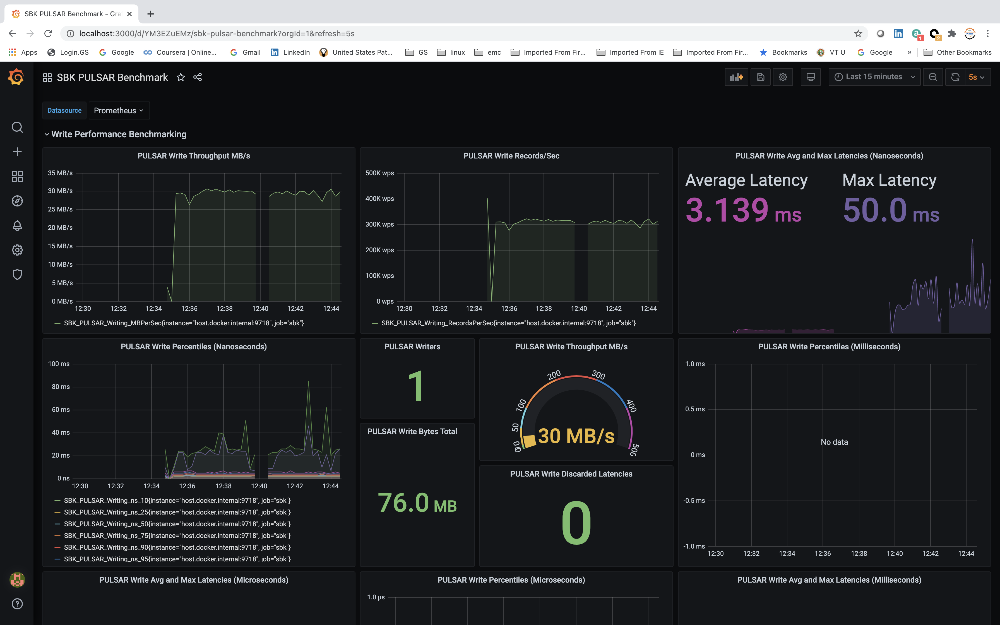

<!--
Copyright (c) KMG. All Rights Reserved.

Licensed under the Apache License, Version 2.0 (the "License");
you may not use this file except in compliance with the License.
You may obtain a copy of the License at

    http://www.apache.org/licenses/LICENSE-2.0
-->
# Storage Benchmark Kit  

[](https://travis-ci.org/kmgowda/SBK) [](https://www.apache.org/licenses/LICENSE-2.0)  [](https://kmgowda.github.io/SBK/javadoc/index.html) [](https://github.com/kmgowda/SBK/releases/tag/0.85) [](https://jitpack.io/#kmgowda/SBK)

>  **_Any Storage System_  ...  _Any Payload_  ...  _Any Time Stamp_  ...**

The SBK (Storage Benchmark Kit) is an open source software frame-work for the performance benchmarking of any storage system.
If you are curious to measure the  maximum throughput performance of your storage device/system, then SBK is the right software for you.
The SBK itself a very high-performance benchmark  tool/framework.
It massively writes the data to storage system and reads the data from storage system.
The SBK supports multi writers and readers and also the End to End latency benchmarking.
The percentiles are calculated for complete data written/read without any sampling; hence the percentiles are 100% accurate.

___

<p align="center">
   Supported By
</p>

<p align="center">
    <a href="https://www.jetbrains.com/?from=SBK">
        
    </a>
</p>

___

The design principle of SBK is the **Performance Benchmarking of _'Any Storage System'_ with _'Any Type of data payload'_ and _'Any Time Stamp'_**,
because, the SBK is not specific to particular type of storage system,
it can be used for performance benchmarking of any storage system, let it be file system, databases , any distributed storage systems or message queues by adding SBK driver which specifies the IO operations of storage system.
you can find the list of supported drivers below.
The SBK supports variety of payloads too, such as byte array, byte buffer, string, and you can add your own payload type.
The Latency values can be measured either in milliseconds, microseconds or nanoseconds using SBK.


### SBK supports performance benchmarking of following storage systems.
1. [Local mounted File Systems](https://github.com/kmgowda/SBK/tree/master/driver-file)
1. [Java Concurrent Queue [Message Queue]](https://docs.oracle.com/javase/7/docs/api/java/util/concurrent/ConcurrentLinkedQueue.html)   
1. [Apache Kafka](https://kafka.apache.org)
1. [Apache Pulsar](https://pulsar.apache.org)
1. [Pravega](http://pravega.io)
1. [HDFS](https://hadoop.apache.org/docs/current/hadoop-project-dist/hadoop-hdfs/HdfsDesign.html)
1. [Apache Bookkeeper](https://bookkeeper.apache.org)
1. [RabbitMQ](https://www.rabbitmq.com)
1. [RocketMQ](https://rocketmq.apache.org)
1. [ActiveMQ Artemis](https://activemq.apache.org/components/artemis)
1. [NATS Distributed Messaging](https://nats.io)
1. [NATS Streaming Storage](https://nats.io/blog/introducing-nats-streaming)
1. [NSQ](https://nsq.io)
1. [JDBC](https://github.com/kmgowda/SBK/tree/master/driver-jdbc)   
1. [Apache Derby](https://github.com/kmgowda/SBK/tree/master/driver-jdbc#jdbc-with-apache-derby)
1. [MySQL](https://github.com/kmgowda/SBK/tree/master/driver-jdbc#jdbc-with-mysql)
1. [PostgreSQL](https://github.com/kmgowda/SBK/tree/master/driver-jdbc#jdbc-with-postgresql)
1. [Microsoft SQL](https://github.com/kmgowda/SBK/tree/master/driver-jdbc#jdbc-with-microsoft-sql-server)
1. [SQLite](https://github.com/kmgowda/SBK/tree/master/driver-jdbc#jdbc-with-sqlite)
1. [MinIO](https://min.io)
1. [FoundationDB](https://www.foundationdb.org)
1. [FoundationDB Record Layer](https://foundationdb.github.io/fdb-record-layer)
1. [FoundationDB Document Layer](https://github.com/kmgowda/SBK/tree/master/driver-mongodb#foundationdb-document-layer-performance-benchmarking)
1. [MongoDB](https://www.mongodb.com)
1. [CockroachDB](https://github.com/kmgowda/SBK/tree/master/driver-jdbc#jdbc-postgresql-for-cockroachdb-performance-benchmarking)
1. [RocksDB](https://rocksdb.org)
1. [Apache Ignite](https://ignite.apache.org)
1. [Apache CouchDB](https://couchdb.apache.org)
1. [Apache Hive](https://hive.apache.org)
1. [MariaDB](https://github.com/kmgowda/SBK/tree/master/driver-mariadb)
1. [Redpanda](https://github.com/kmgowda/SBK/tree/master/driver-redpanda)


In the future, many more storage systems drivers will be plugged in. 

we welcome open source developers to contribute to this project by adding a driver your storage device and any features to SBK. Refer to : 
* [[Contributing to SBK](https://github.com/kmgowda/sbk/blob/master/README.md#contributing-to-sbk)] for the Contributing guidlines.
* [[Add your storage driver to SBK](https://github.com/kmgowda/sbk/blob/master/README.md#add-your-driver-to-sbk)] to know how to add your driver (storage device driver or client) for performance benchmarking.  

## Build SBK

### Prerequisites

- Java 11+
- Gradle 6+

### Building

Checkout the source code:

```
git clone https://github.com/kmgowda/SBK.git
cd SBK
```

Build the SBK:

```
./gradlew build
```

untar the SBK  to local folder

```
tar -xvf ./build/distributions/sbk.tar -C ./build/distributions/.
```

Running SBK locally:

```
<SBK directory>/./build/distributions/sbk/bin/sbk -help
...
usage: sbk
 -class <arg>        Storage Driver Class,
                     Available Drivers [Artemis, AsyncFile, BookKeeper,
                     CSV, ConcurrentQ, CouchDB, Derby, FdbRecord, File,
                     FileStream, FoundationDB, HDFS, Hive, Ignite, Jdbc,
                     Kafka, MariaDB, MinIO, MongoDB, MsSql, MySQL, Nats,
                     NatsStream, Nsq, Null, PostgreSQL, Pravega, Pulsar,
                     RabbitMQ, RedPanda, RocketMQ, RocksDB, SQLite]
 -context <arg>      Prometheus Metric context; default context:
                     9718/metrics; 'no' disables the metrics
 -help               Help message
 -readers <arg>      Number of readers
 -records <arg>      Number of records(events) if 'seconds' not specified;
                     otherwise, Maximum records per second by writer(s)
                     and/or Number of records per reader
 -seconds <arg>      Number of seconds to run; if not specified, runs
                     forever
 -size <arg>         Size of each message (event or record)
 -sync <arg>         Each Writer calls flush/sync after writing <arg>
                     number of of events(records) ; <arg> number of
                     events(records) per Write or Read Transaction
 -throughput <arg>   if > 0 , throughput in MB/s
                     if 0 , writes/reads 'records'
                     if -1, get the maximum throughput (default: -1)
 -time <arg>         Latency Time Unit [ms:MILLISECONDS, mcs:MICROSECONDS,
                     ns:NANOSECONDS]; default: ms
 -writers <arg>      Number of writers


```


Just to check the SBK build issue the command

```
./gradlew check
```

Build only the SBK install binary

```
./gradlew installDist
```
executable binary will be available at :  [SBK directory]/./build/install/sbk/bin/sbk


## Running Performance benchmarking
The SBK  can be executed to
 - write/read a specific amount of events/records to/from the storage driver (device/cluster)
 - write/read the events/records for the specified amount of time
 
SBK outputs the data written/read , average throughput and latency , maximum latency  and the latency percentiles 10th, 25th, 50th, 75th, 95th, 99th , 99.9th and 99.99th for every 5 seconds time interval as show below.

```
Pulsar Writing    1500124 records,  299964.8 records/sec,    28.61 MB/sec,      3.2 ms avg latency,      42 ms max latency;        0 invalid latencies; Discarded Latencies:       0 lower,        0 higher;      2 ms 10th,       3 ms 25th,       3 ms 50th,       3 ms 75th,       5 ms 90th,       5 ms 95th,       6 ms 99th,       9 ms 99.9th,      21 ms 99.99th.
Pulsar Writing    1539995 records,  307937.4 records/sec,    29.37 MB/sec,      3.2 ms avg latency,      14 ms max latency;        0 invalid latencies; Discarded Latencies:       0 lower,        0 higher;      2 ms 10th,       3 ms 25th,       3 ms 50th,       3 ms 75th,       4 ms 90th,       5 ms 95th,       6 ms 99th,       9 ms 99.9th,      11 ms 99.99th.
Pulsar Writing    1534073 records,  306691.9 records/sec,    29.25 MB/sec,      3.2 ms avg latency,      76 ms max latency;        0 invalid latencies; Discarded Latencies:       0 lower,        0 higher;      2 ms 10th,       3 ms 25th,       3 ms 50th,       3 ms 75th,       4 ms 90th,       5 ms 95th,       6 ms 99th,      36 ms 99.9th,      74 ms 99.99th.
Pulsar Writing    1546930 records,  309200.5 records/sec,    29.49 MB/sec,      3.2 ms avg latency,      24 ms max latency;        0 invalid latencies; Discarded Latencies:       0 lower,        0 higher;      2 ms 10th,       3 ms 25th,       3 ms 50th,       3 ms 75th,       4 ms 90th,       5 ms 95th,       6 ms 99th,       9 ms 99.9th,      23 ms 99.99th.
Pulsar Writing    1619653 records,  323801.1 records/sec,    30.88 MB/sec,      3.0 ms avg latency,      12 ms max latency;        0 invalid latencies; Discarded Latencies:       0 lower,        0 higher;      2 ms 10th,       3 ms 25th,       3 ms 50th,       3 ms 75th,       4 ms 90th,       5 ms 95th,       5 ms 99th,       8 ms 99.9th,      10 ms 99.99th.
Pulsar Writing    1573613 records,  314596.8 records/sec,    30.00 MB/sec,      3.1 ms avg latency,      23 ms max latency;        0 invalid latencies; Discarded Latencies:       0 lower,        0 higher;      2 ms 10th,       3 ms 25th,       3 ms 50th,       3 ms 75th,       4 ms 90th,       5 ms 95th,       5 ms 99th,      10 ms 99.9th,      21 ms 99.99th.
Pulsar Writing    1565730 records,  312958.2 records/sec,    29.85 MB/sec,      3.1 ms avg latency,      25 ms max latency;        0 invalid latencies; Discarded Latencies:       0 lower,        0 higher;      2 ms 10th,       3 ms 25th,       3 ms 50th,       3 ms 75th,       4 ms 90th,       5 ms 95th,       6 ms 99th,      20 ms 99.9th,      23 ms 99.99th.
Pulsar Writing    1580433 records,  316023.4 records/sec,    30.14 MB/sec,      3.1 ms avg latency,      25 ms max latency;        0 invalid latencies; Discarded Latencies:       0 lower,        0 higher;      2 ms 10th,       3 ms 25th,       3 ms 50th,       3 ms 75th,       4 ms 90th,       5 ms 95th,       5 ms 99th,      22 ms 99.9th,      22 ms 99.99th.

```

At the end of the benchmarking session, SBK outputs the total data written/read , average throughput and latency , maximum latency  and the latency percentiles 10th, 25th, 50th, 75th, 95th, 99th , 99.9th and 99.99th for the complete data records written/read.
An example  final output is show as below:

```
Total : Pulsar Writing   92396507 records,  307987.3 records/sec,    29.37 MB/sec,      3.2 ms avg latency,     142 ms max latency;        0 invalid latencies; Discarded Latencies:       0 lower,        0 higher;      2 ms 10th,       3 ms 25th,       3 ms 50th,       3 ms 75th,       4 ms 90th,       5 ms 95th,       6 ms 99th,      21 ms 99.9th,      49 ms 99.99th.
```

### Grafana Dashboards of SBK
When you run the SBK, by default it starts the http server and all the output benchmark data are directed to the default port number: **9718** and **metrics** context.
if you want to change the port number and context, you can use the command line argument **-context** to change the same.
you have to run the prometheus monitoring system (server [default port number is 9090] cum client) which pulls/fetches the benchmark data from the local/remote http server.
If you want to include additional SBK nodes/instances to fetch the performance data or from port number other than 9718, you need to extend or update [targets.json](https://github.com/kmgowda/SBK/blob/master/grafana/prometheus/targets.json)   
In case, if you are fetching metrics/benchmark data from remote http server ,  or from the context other than **metrics** then you need to change the [default prometheus server configuration](https://github.com/kmgowda/SBK/blob/master/grafana/prometheus/prometheus.yml) too.
Run the grafana server (cum client) to fetch the benchmark data from  prometheus.
For example, if you are running local grafana server then by default it  fetches the data from prometheus server at the local port 9090.
You can access the local grafana server at localhost:3000 in your browser using **admin/admin** as default user name / password.
you can import the grafana dashboards to fetch the SBK benchmark data of the existing supported storage drivers from [grafana dashboards](https://github.com/kmgowda/SBK/tree/master/grafana/dashboards).

The sample output of Standalone Pulsar benchmark data with grafana is below

[](https://github.com/kmgowda/SBK/blob/master/images/pulsar-grafana.png)

#### Port conflicts between storage servers and grafana/prometheus
* If you are running Pravega server in standalone/local mode or if you are running SBK in the same system in which Pravega controller is also running, then Prometheus port 9090 conflicts with the Pravega controller. So, either you change the Pravega controller port number or change the Prometheus port number in the [Prometheus targets file](https://github.com/kmgowda/SBK/blob/master/grafana/prometheus/prometheus.yml) before deploying the prometheus. 
* If you find that using the local port 9718 conflicts with a storage server or any other application. Then, you change the SBK's http port usig **-metrics** option and you need change the [Prometheus targets.json](https://github.com/kmgowda/SBK/blob/master/grafana/prometheus/targets.json) too


## SBK Docker Containers
The SBK Docker images are available at [SBK Docker](https://hub.docker.com/r/kmgowda/sbk)

The SBK docker image pull command is 
```
docker pull kmgowda/sbk
```

you can straightaway run the docker image too, For example
```
docker run  -p 127.0.0.1:9718:9718/tcp  kmgowda/sbk:latest -class  rabbitmq  -broker 192.168.0.192 -topic kmg-topic-11  -writers 5  -readers 1 -size 100 -seconds 60
```
* Note that the option **-p 127.0.0.1:9718:9718/tcp** redirects the 9718 port to local port for fetch the performance metric data for Prometheus.  
* Avoid using the **--network host** option , because this option overrides the port redirection.

### SBK Docker Compose

The SBK docker compose consists of SBK docker image, Grafana and prometheus docker images. 
The [grafana image](https://github.com/kmgowda/SBK/blob/master/grafana/Dockerfile) contains the [dashboards](https://github.com/kmgowda/SBK/tree/master/grafana/dashboards) which can be directly deployed for the performance analytics.

As an example, just follow the below steps to see the performance graphs

1. In the SBK directory run the 'SBK' service of the [docker compose](https://github.com/kmgowda/SBK/blob/master/docker-compose.yml) file as follows.

   ```
   <SBK dir>% ./docker-compose run sbk  -class concurrentq -writers 1  -readers 5 -size 1000 -seconds 120 

   ```

1. login to [grafana local host port 3000](http://localhost:3000) with username **admin** and password **sbk**
1. go to dashboard menu and pick the dashboard of the storage device on which you are running the performance benchmarking.
   in the above example, you can choose the [Concurrent Queue dashboard](https://github.com/kmgowda/SBK/blob/master/grafana/dashboards/sbk-concurrentq.json).
1. The SBK docker compose runs the SBK image as docker container. 
   In case, if you are running SBK as an application, and you want to see the SBK performance graphs using Grafana,
   then use [Grafana Docker compose](https://github.com/kmgowda/SBK/tree/master/grafana)

   
## SBK Kubernetes

check these [SBK Kubernetes Deployments samples](https://github.com/kmgowda/SBK/tree/master/kubernetes) 


## SBK Execution Modes

The SBK can be executed in the following modes:
```
1. Burst Mode (Max rate mode)
2. Throughput Mode
3. Rate limiter Mode
4. End to End Latency Mode
```

### 1 - Burst Mode / Max Rate Mode
In this mode, the SBK pushes/pulls the messages to/from the storage client(device/driver) as much as possible.
This mode is used to find the maximum and throughput that can be obtained from the storage device or storage cluster (server).
This mode can be used for both writers and readers.
By default, the SBK runs in Burst mode.

```
For example: The Burst mode for pulsar single writer as follows

<SBK directory>./build/distributions/sbk/bin/sbk -class Pulsar -admin http://localhost:8080 -broker tcp://localhost:6650 -topic topic-k-223  -partitions 1  -writers 1 -size 1000  -seconds 60 -throughput -1


The -throughput -1  indicates the burst mode. Note that, you dont supply the parameter -throughput then also its burst mode.
This test will executed for 60 seconds because option -seconds 60 is used.
This test tries to write and read events of size 1000 bytes to/from the topic 'topic-k-223'.
The option '-broker tcp://localhost:6650' specifies the Pulsar broker IP address and port number for write operations.
The option '-admin http://localhost:8080' specifies the Pulsar admin IP and port number for topic creation and deletion.
Note that -producers 1 indicates 1 producer/writers.

in the case you want to write/read the certain number of records.events use the -records option without -seconds option as follows

<SBK directory>/build/distributions/sbk/bin/sbk -class Pulsar -admin http://localhost:8080 -broker tcp://localhost:6650 -topic topic-k-223  -partitions 1  -writers 1 -size 1000  -records 100000 -throughput -1

-records <number> indicates that total <number> of records to write/read
```

### 2 - Throughput Mode
In this mode, the SBK  pushes/pull/from the messages to the storage client(device/driver) with specified approximate maximum throughput in terms of Mega Bytes/second (MB/s).
This mode is used to find the least latency that can be obtained from the storage device or storage cluster (server) for given throughput.


```
For example:  The througput mode for pulsar 5 writers as follows
<SBK directory> ./build/distributions/sbk/bin/sbk -class Pulsar -admin http://localhost:8080 -broker tcp://localhost:6650 -topic topic-k-223  -partitions 1  -writers 5 -size 1000  -seconds 120  -throughput 10

The -throughput <positive number>  indicates the Throughput mode.

This test will be executed with approximate max throughput of 10MB/sec.
This test will executed for 120 seconds (2 minutes) because option -seconds 120 is used.
This test tries to write and read events of size 1000 bytes to/from the topic 'topic-k-223' of 1 partition.
If the toic 'topic-k-223' is not existing , then it will be created with  1 segment.
if the steam is already existing then it will be deleted and recreated with 1 segment.
Note that -writers 5 indicates 5 producers/writers .

in the case you want to write/read the certain number of events use the -records option without -seconds option as follows

<SBK directory>./build/distributions/sbk/bin/sbk -class Pulsar -admin http://localhost:8080 -broker tcp://localhost:6650 -topic topic-k-223  -partitions 1  -writers 5 -size 1000  -records 1000000  -throughput 10

-records 1000000 indicates that total 1000000 (1 million) of events will be written at the throughput speed of 10MB/sec
```

### 3 - Rate limiter Mode
This mode is another form of controlling writers/readers throughput by limiting the number of records per second.
In this mode, the SBK  pushes/pull the messages to/from the storage client (device/driver) with specified approximate maximum records per sec.
This mode is used to find the least latency  that can be obtained from the storage device or storage cluster (server) for events rate.

```
For example:  The Rate limiter Mode for pulsar 5 writers as follows

<SBK directory>./build/distributions/sbk/bin/sbk -class Pulsar -admin http://localhost:8080 -broke
r tcp://localhost:6650 -topic topic-k-225  -partitions 10  -writers 5 -size 100  -seconds 60  -records 1000

The -records <records numbes>  (1000) specifies the records per second to write.
Note that the option "-throughput"  SHOULD NOT supplied for this  Rate limiter Mode.

This test will be executed with approximate 1000 events per second by 5 writers.
The topic "topic-k-225" with 10 partitions are created to run this test.
This test will executed for 60seconds (1 minutes) because option -seconds 60 is used.
Note that in this mode, there is 'NO total number of events' to specify hence user must supply the time to run using -seconds option.
```

### 4 - End to End Latency Mode
In this mode, the SBK  writes and read the messages to the storage client (device/driver) and records the end to end latency.
End to end latency means the time duration between the beginning of the writing event/record to stream, and the time after reading the event/record.
in this mode user must specify both the number of writers and readers.
The -throughput option (Throughput mode) or -records (late limiter) can used to limit the writers throughput or records rate.

```
For example: The End to End latency of between single writer and single reader of pulsar is as follows:

<SBK directory>./build/distributions/sbk/bin/sbk -class Pulsar -admin http://localhost:8080 -broker tcp://localhost:6650 -topic topic-km-1  -partitions 1  -writers 1 -readers 1 -size 1000 -throughput -1 -seconds 60 

The user should specify both writers and readers count for write to read or End to End latency mode.
The -throughput -1 specifies the writes tries to write the events at the maximum possible speed.
```

## Contributing to SBK
All submissions to the master are done through pull requests. If you'd like to make a change:

1. Create a new Git hub issue ([SBK issues](https://github.com/kmgowda/sbk/issues)) describing the problem / feature.
2. Fork a branch.
3. Make your changes. 
    * you can refer ([Oracle Java Coding Style](https://www.oracle.com/technetwork/java/codeconvtoc-136057.html)) for coding style; however, Running the Gradle build helps you to fix the Coding syte issues too. 
4. Verify all changes are working and Gradle build checkstyle is good.
5. Submit a pull request with Issue numer, Description and your Sign-off.

Make sure that you update the issue with all details of testing you have done; it will helpful for me to review and merge.

Another important point to consider is how to keep up with changes against the base the branch (the one your pull request is comparing against). Let's assume that the base branch is master. To make sure that your changes reflect the recent commits, I recommend that you rebase frequently. The command I suggest you use is:

```
git pull --rebase upstream master
git push --force origin <pr-branch-name>
```
in the above, I'm assuming that:

* upstream is kmgowda/SBK.git
* origin is youraccount/SBK.git

The rebase might introduce conflicts, so you better do it frequently to avoid outrageous sessions of conflict resolving.

### Lombok
SBK uses [[Lombok](https://projectlombok.org)] for code optimizations; I suggest the same for all the contributors too.
If you use an IDE you'll need to install a plugin to make the IDE understand it. Using IntelliJ is recommended.

To import the source into IntelliJ:

1. Import the project directory into IntelliJ IDE. It will automatically detect the gradle project and import things correctly.
2. Enable `Annotation Processing` by going to `Build, Execution, Deployment` -> `Compiler` > `Annotation Processors` and checking 'Enable annotation processing'.
3. Install the `Lombok Plugin`. This can be found in `Preferences` -> `Plugins`. Restart your IDE.
4. SBK should now compile properly.

For eclipse, you can generate eclipse project files by running `./gradlew eclipse`.


## Add your driver to SBK
1. Create the gradle sub project preferable with the name **driver-<your driver(storage device) name>**.

    * See the Example:[[Pulsar driver](https://github.com/kmgowda/sbk/tree/master/driver-pulsar)]   


2. Create the package **io.sbk.< your driver name>** 

    * See the Example: [[Pulsar driver package](https://github.com/kmgowda/sbk/tree/master/driver-pulsar/src/main/java/io/sbk/Pulsar)]   
    

3. In your driver package you have to implement the Interface: [[Storage](https://kmgowda.github.io/SBK/javadoc/io/sbk/api/Storage.html)]

    * See the Example:  [[Pulsar class](https://github.com/kmgowda/sbk/blob/master/driver-pulsar/src/main/java/io/sbk/Pulsar/Pulsar.java)]
    
    * you have to implement the following methods of Benchmark Interface:
        
      a). Add the Additional parameters (Command line Parameters) for your driver :[[addArgs](https://kmgowda.github.io/SBK/javadoc/io/sbk/api/Storage.html#addArgs-io.sbk.api.Parameters-)]
      * The default command line parameters are listed in the help output here : [[Building SBK](https://github.com/kmgowda/sbk#building)]
        
      b). Parse your driver specific paramters: [[parseArgs](https://kmgowda.github.io/SBK/javadoc/io/sbk/api/Storage.html#parseArgs-io.sbk.api.Parameters-)]
        
      c). Open the storage: [[openStorage](https://kmgowda.github.io/SBK/javadoc/io/sbk/api/Storage.html#openStorage-io.sbk.api.Parameters-)]
        
      d). Close the storage:[[closeStorage](https://kmgowda.github.io/SBK/javadoc/io/sbk/api/Storage.html#closeStorage-io.sbk.api.Parameters-)]
        
      e). Create a single writer instance:[[createWriter](https://kmgowda.github.io/SBK/javadoc/io/sbk/api/Storage.html#createWriter-int-io.sbk.api.Parameters-)]
        * Create Writer will be called multiple times by SBK incase of Multi writers are specified in the command line.   
        
      f). Create a single Reader instance:[[createReader](https://kmgowda.github.io/SBK/javadoc/io/sbk/api/Storage.html#createReader-int-io.sbk.api.Parameters-)]
        * Create Reader will be called multiple times by SBK incase of Multi readers are specified in the command line. 
        
      g). Get the Data Type :[[getDataType](https://kmgowda.github.io/SBK/javadoc/io/sbk/api/Storage.html#getDataType--)]
        * In case if your data type is byte[] (Byte Array), No need to override this method. see the example:   [[Pulsar class](https://github.com/kmgowda/sbk/blob/master/driver-pulsar/src/main/java/io/sbk/Pulsar/Pulsar.java)]
        * If your Benchmark,  Reader and Writer classes operates on different data type such as String or custom data type, then you have to override this default implemenation.

    
4. Implement the Writer Interface: [[Writer](https://kmgowda.github.io/SBK/javadoc/io/sbk/api/Writer.html)]

    * See the Example: [[Pulsar Writer](https://github.com/kmgowda/sbk/blob/master/driver-pulsar/src/main/java/io/sbk/Pulsar/PulsarWriter.java)]
    
    * you have to implement the following methods of Writer class:
        
      a). Writer Data [Async or Sync]: [[writeAsync](https://kmgowda.github.io/SBK/javadoc/io/sbk/api/Writer.html#writeAsync-byte:A-)]
        
      b). Flush the data: [[sync](https://kmgowda.github.io/SBK/javadoc/io/sbk/api/Writer.html#sync--)]
        
      c). Close the Writer: [[close](https://kmgowda.github.io/SBK/javadoc/io/sbk/api/Writer.html#close--)]
        
      d). In case , if you want to have your own recordWrite implemenation to write data and record the start and end time, then you can override: [[recordWrite](https://kmgowda.github.io/SBK/javadoc/io/sbk/api/Writer.html#recordWrite-byte:A-io.sbk.api.SendChannel-)]


5. Implement the Reader Interface: [[Reader](https://kmgowda.github.io/SBK/javadoc/io/sbk/api/Reader.html)]

    * See the Example: [[Pulsar Reader](https://github.com/kmgowda/sbk/blob/master/driver-pulsar/src/main/java/io/sbk/Pulsar/PulsarReader.java)]

    * you have to implement the following methods of Reader class:
        
      a). Read Data (synchronous reades): [[read](https://kmgowda.github.io/SBK/javadoc/io/sbk/api/Reader.html#read--)]
        
      b). Close the Reader:[[close](https://kmgowda.github.io/SBK/javadoc/io/sbk/api/Reader.html#close--)] 


6.  Add the Gradle dependecy [ compile project(":sbk-api")]   to your sub-project (driver)

    * see the Example:[[Pulsar Gradle Build](https://github.com/kmgowda/sbk/blob/master/driver-pulsar/build.gradle)]


7. Add your sub project to main gradle as dependency.

    * see the Example: [[SBK Gradle](https://github.com/kmgowda/sbk/blob/master/build.gradle#L66)]
    
    * make sure that gradle settings file: [[SBK Gradle Settings](https://github.com/kmgowda/sbk/blob/master/settings.gradle#L13)] has your Storage driver sub project name


8. That's all ; Now, Build the SBK included your driver with the command:

```
./gradlew build
```

untar the SBK  to local folder

```
tar -xvf ./build/distributions/sbk.tar -C ./build/distributions/.
```


9.  To invoke the benchmarking of the your driver you have issue the parameters "-class < your driver name>"

Example: For pulsar driver
```
<SBK directory>./build/distributions/sbk/bin/sbk  -class pulsar -help

usage: sbk -class pulsar
 -ackQuorum <arg>       AckQuorum default: 1
 -admin <arg>           Admin URI, required to create the partitioned
                        topic, default: null
 -broker <arg>          Broker URI, default: tcp://localhost:6650
 -cluster <arg>         Cluster name (optional parameter)
 -context <arg>         Prometheus Metric context; default context:
                        9718/metrics; 'no' disables the metrics
 -deduplication <arg>   Enable or Disable Deduplication; default: false
 -ensembleSize <arg>    EnsembleSize default: 1
 -help                  Help message
 -partitions <arg>      Number of partitions of the topic, default: 1
 -readers <arg>         Number of readers
 -records <arg>         Number of records(events) if 'seconds' not
                        specified;
                        otherwise, Maximum records per second by writer(s)
                        and/or Number of records per reader
 -seconds <arg>         Number of seconds to run; if not specified, runs
                        forever
 -size <arg>            Size of each message (event or record)
 -sync <arg>            Each Writer calls flush/sync after writing <arg>
                        number of of events(records) ; <arg> number of
                        events(records) per Write or Read Transaction
 -threads <arg>         io threads per Topic, default: 1
 -throughput <arg>      if > 0 , throughput in MB/s
                        if 0 , writes/reads 'records'
                        if -1, get the maximum throughput (default: -1)
 -time <arg>            Latency Time Unit [ms:MILLISECONDS,
                        mcs:MICROSECONDS, ns:NANOSECONDS]; default: ms
 -topic <arg>           Topic name, default : test
 -writeQuorum <arg>     WriteQuorum default: 1
 -writers <arg>         Number of writers

```


## Use SBK git hub packages
Instead of using entire SBK framework, if you just want use the [SBK framework API](https://github.com/kmgowda?tab=packages&repo_name=SBK) packages to measure the performance benchmarking of your storage device/software, then follow the below simple and easy steps.

1. Add the SBK git hub package repository and dependency in gradle build file of your project as follows
    
   ```
    repositories {
        mavenCentral()

        maven {
            name = "GitHubPackages"
            url = uri("https://maven.pkg.github.com/kmgowda/SBK")

            credentials {
                username = project.findProperty("github.user") ?: System.getenv("GITHUB_USERNAME")
                password = project.findProperty("github.token") ?: System.getenv("GITHUB_TOKEN")
            }
       }
    }

    dependencies {
        implementation 'sbk:sbk-api:0.85'
    }

   ```
   few points to remember here
   
    *  you need to authenticate with your git hub user name (GITHUB_USERNAME) and git hub token (GITHUB_TOKEN) 
    *  mavenCentral() repository is required to fetch the SBK's dependencies too.
    *  check this example: [File system benchmarking git hub build](https://github.com/kmgowda/sbk-examples/blob/main/sbk-file/gitpackage-build.gradle)
  
2. Extend the storage interface [Storage](https://kmgowda.github.io/SBK/javadoc/io/sbk/api/Storage.html) by following steps 1 to 5 described in [Add your storage driver](https://github.com/kmgowda/SBK#add-your-driver-to-sbk)

    *  check this example: [File system benchmarking](https://github.com/kmgowda/sbk-examples/blob/main/sbk-file/src/main/java/File.java)

3. Create a Main method to supply your storage class object to SBK to run/conduct the performance benchmarking

   ```
    public static void main(final String[] args) {
        Storage device = new <your storage class, extending the Storage interface>;
        try {
        
            //Start the File system benchmarking here
            
            Sbk.run(args  /* Command line Arguments */ , 
                  device /* your storage deivce object */ , 
                  null /* Name of the your performance benchmarking application, by default , storage class name will be used */ ,
                  null /* Logger, if you dont have your own logger, then prometheus logger will be used by defalt */ );
            
            
        } catch (ParseException | IllegalArgumentException | IOException |
                InterruptedException | ExecutionException | TimeoutException ex) {
            ex.printStackTrace();
            System.exit(1);
        }
        System.exit(0);
    }

   ```
   *  check this example: [Start File system benchmarking](https://github.com/kmgowda/sbk-examples/blob/main/sbk-file/src/main/java/File.java#L101)
   
4. That's all! Run your main method (your java application ) with "-help" to see the benchmarking options.    


## Use SBK from JitPack
The SBK API package is available in [JitPack Repository](https://jitpack.io/#kmgowda/SBK) too. To use the SBK-API package from Jitpack, follow the below simple and easy steps

1. Add the SBK git hub package repository and dependency in gradle build file of your project as follows

   ```
    repositories {
        mavenCentral()
        maven {
            url 'https://jitpack.io'
        }
    }

    dependencies {
        implementation 'com.github.kmgowda.SBK:sbk-api:0.85'
    }
   
   ```
   few points to remember here     
    *  mavenCentral() repository is required to fetch the SBK's dependencies too.
    *  check this example: [File system benchmarking jit pack build](https://github.com/kmgowda/sbk-examples/blob/main/sbk-file/jitpack-build.gradle)

2. Extend the storage interface [Storage](https://kmgowda.github.io/SBK/javadoc/io/sbk/api/Storage.html) by following steps 1 to 5 described in [Add your storage driver](https://github.com/kmgowda/SBK#add-your-driver-to-sbk)
    *  check this example: [File system benchmarking](https://github.com/kmgowda/sbk-examples/blob/main/sbk-file/src/main/java/File.java)

3. Create a Main method to supply your storage class object to SBK to run/conduct the performance benchmarking

   ```
    public static void main(final String[] args) {
        Storage device = new <your storage class, extending the Storage interface>;
        try {
        
            //Start the File system benchmarking here
            
            Sbk.run(args  /* Command line Arguments */ , 
                  device /* your storage deivce object */ , 
                  null /* Name of the your performance benchmarking application, by default , storage class name will be used */ ,
                  null /* Logger, if you dont have your own logger, then prometheus logger will be used by defalt */ );
            
            
        } catch (ParseException | IllegalArgumentException | IOException |
                InterruptedException | ExecutionException | TimeoutException ex) {
            ex.printStackTrace();
            System.exit(1);
        }
        System.exit(0);
    }

   ```
   * check this example: [Start File system benchmarking](https://github.com/kmgowda/sbk-examples/blob/main/sbk-file/src/main/java/File.java#L101)
   
4. That's all! Run your main method (your java application ) with "-help" to see the benchmarking options.   


## Use SBK from Maven Central
The SBK APIs Package is available at [maven central](https://search.maven.org/classic/#artifactdetails%7Cio.github.kmgowda%7Csbk-api%7C0.84%7Cjar) too.. to use the sbk-api package , follow below steps


1. Add the SBK git hub package repository and dependency in gradle build file of your project as follows

   ```
    repositories {
        mavenCentral()
    }

    dependencies {
        implementation 'io.github.kmgowda:sbk-api:0.85'
    }
   ```
   few points to remember here  
    *  mavenCentral() repository is required to fetch the SBK APIs package and its dependencies.
    *  check this example: [File system benchmarking maven build](https://github.com/kmgowda/sbk-examples/blob/main/sbk-file/mavencentral-build.gradle)

2. Extend the storage interface [Storage](https://kmgowda.github.io/SBK/javadoc/io/sbk/api/Storage.html) by following steps 1 to 5 described in [Add your storage driver](https://github.com/kmgowda/SBK#add-your-driver-to-sbk)
    *  check this example: [File system benchmarking](https://github.com/kmgowda/sbk-examples/blob/main/sbk-file/src/main/java/File.java)

3. Create a Main method to supply your storage class object to SBK to run/conduct the performance benchmarking

   ```
    public static void main(final String[] args) {
        Storage device = new <your storage class, extending the Storage interface>;
        try {
        
            //Start the File system benchmarking here
            
            Sbk.run(args  /* Command line Arguments */ , 
                  device /* your storage deivce object */ , 
                  null /* Name of the your performance benchmarking application, by default , storage class name will be used */ ,
                  null /* Logger, if you dont have your own logger, then prometheus logger will be used by defalt */ );
            
            
        } catch (ParseException | IllegalArgumentException | IOException |
                InterruptedException | ExecutionException | TimeoutException ex) {
            ex.printStackTrace();
            System.exit(1);
        }
        System.exit(0);
    }
      
   ```   
   *  check this example: [Start File system benchmarking](https://github.com/kmgowda/sbk-examples/blob/main/sbk-file/src/main/java/Main.java#L20)
   
4. That's all! Run your main method (your java application ) with "-help" to see the benchmarking options.    
