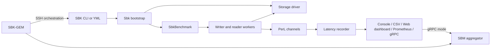

<!--
Copyright (c) KMG. All Rights Reserved.

Licensed under the Apache License, Version 2.0 (the "License");
you may not use this file except in compliance with the License.
You may obtain a copy of the License at

    http://www.apache.org/licenses/LICENSE-2.0

Unless required by applicable law or agreed to in writing, software
distributed under the License is distributed on an "AS IS" BASIS,
WITHOUT WARRANTIES OR CONDITIONS OF ANY KIND, either express or implied.
See the License for the specific language governing permissions and
limitations under the License.
-->

# Storage Benchmark Kit (SBK)

[](https://github.com/kmgowda/SBK/releases)
[](https://github.com/kmgowda/SBK/actions/workflows/gradle.yml)
[](LICENSE)

SBK is a Java framework for measuring the throughput and latency of storage systems with one common workload engine. Its drivers cover object stores, message systems, databases, file systems, caches, and local queues. The harness controls concurrency, duration, rate, payloads, timestamps, and reporting; each driver only adapts those operations to a backend.

Repository: <https://github.com/kmgowda/SBK>

## Start here

Choose the guide that matches your task:

| Goal | Documentation |
|---|---|
| Build and run SBK | This README |
| Understand modules and runtime flow | [Architecture and code flow](docs/ARCHITECTURE.md) |
| Browse all documentation | [Documentation index](docs/README.md) |
| View live graphs without Docker | [WebLogger guide](docs/WEB_LOGGER.md) |
| Add or modify a storage driver | [Driver guide](docs/DRIVER_GUIDE.md) |
| Make a code contribution | [Contributing guide](CONTRIBUTING.md) |
| Follow a task-specific procedure | [Engineering recipes](docs/AGENT_RECIPES.md) |
| Work as a coding agent | [Agent guide](AGENTS.md) |
| Study measurement internals in depth | [Internal design](docs/sbk-internals.md) |

## Architecture in one minute


```mermaid
flowchart LR
    CLI[SBK CLI or YML] --> BOOT[Sbk bootstrap]
    BOOT --> DRIVER[Storage driver]
    BOOT --> BENCH[SbkBenchmark]
    BENCH --> WORKERS[Writer and reader workers]
    WORKERS --> DRIVER
    WORKERS --> CHANNEL[PerL channels]
    CHANNEL --> RECORDER[Latency recorder]
    RECORDER --> OUTPUT[Console / CSV / Web dashboard / Prometheus / gRPC]
    OUTPUT -->|gRPC mode| SBM[SBM aggregator]
    GEM[SBK-GEM] -->|SSH orchestration| CLI
    GEM --> SBM
```

The main runtime path is:

1. `io.sbk.main.SbkMain` delegates to `io.sbk.api.impl.Sbk`.
2. `Sbk` discovers the requested driver and logger by class name, builds the combined CLI, parses it, and constructs `SbkBenchmark`.
3. `SbkBenchmark` opens the storage, creates driver readers and writers, starts PerL recorders, and schedules worker execution.
4. Driver operations are timed by the `Writer` and `Reader` default methods and submitted to a `PerlChannel`.
5. PerL processes every latency record away from the worker threads and publishes periodic and total results through the selected logger.

See [docs/ARCHITECTURE.md](docs/ARCHITECTURE.md) for source links, lifecycle details, concurrency boundaries, and distributed execution.

## Requirements

- JDK 25
- Git
- The Gradle wrapper included in the repository; a separate Gradle installation is not required
- A real backend only when exercising a remote-storage driver

Confirm the active JVM before building:

```bash
java -version
./gradlew --version
```

`SBK_JAVA_HOME` takes precedence over `JAVA_HOME` when the build selects its Java installation.

### Runtime JVM and garbage collector defaults

Every generated SBK launcher uses one consolidated JDK 25 runtime profile from
[`gradle/java.gradle`](gradle/java.gradle):

```text
-XX:+UseZGC
-XX:+UseCompactObjectHeaders
-XX:MaxRAMPercentage=50.0
-XX:+DisableExplicitGC
-XX:+ExitOnOutOfMemoryError
```

- **Generational ZGC** performs expensive collection work concurrently and
  dynamically scales generation sizes and GC threads. This keeps GC pauses
  small as benchmark concurrency, CPU count, and live heap grow.
- **Compact object headers** reduce per-object heap overhead and improve cache
  density for queues and measurement records.
- **50% maximum RAM** gives large benchmark processes more heap than the JVM's
  default server sizing while retaining half of detected memory for SDK native
  buffers, direct buffers, thread stacks, filesystem cache, and the operating
  system.
- **Disabled explicit GC** prevents a driver or dependency from injecting a
  benchmark-distorting `System.gc()` collection. Necessary collections still
  run normally.
- **Exit on OOM** prevents a memory-exhausted benchmark from continuing and
  publishing misleading results.

The same options are applied to `sbk`, `sbk-yal`, `sbm`, `sbk-gem`,
`sbk-gem-yal`, module launchers, and the WebLogger dashboard process.

ZGC reserves address space using many memory mappings. On large-memory Linux
hosts, check `sysctl vm.max_map_count`; if it is too small, JDK 25 prints the
minimum required value at startup. Configure that operating-system limit
before a production benchmark.

These are safe cross-host defaults, not a substitute for capacity planning.
For a dedicated benchmark host, `JAVA_OPTS` can override heap sizing. For
example, a fixed heap removes resizing and commit/uncommit variation:

```bash
export JAVA_OPTS='-Xms32g -Xmx32g -XX:+AlwaysPreTouch'
```

Use fixed pre-touched heaps only when that memory is reserved for the process.
Large pages are not enabled automatically because they require operating-system
provisioning. To compare G1 with ZGC, explicitly disable ZGC before selecting
G1:

```bash
export JAVA_OPTS='-XX:-UseZGC -XX:+UseG1GC'
```

## Build

Clone and build the project:

```bash
git clone https://github.com/kmgowda/SBK.git
cd SBK
./gradlew check
./gradlew installDist
```

The installed launcher is created at:

```text
build/install/sbk/bin/sbk
```

Useful development commands:

```bash
# Compile, check style, and run tests for the whole build
./gradlew check

# Iterate on one driver
./gradlew :drivers:minio:check

# Generate launch scripts and runtime libraries
./gradlew installDist

# Rebuild the pathing JAR after dependency changes
./gradlew clean :pathingJar installDist --rerun-tasks
```

HaloDB and Ignite are present in the source tree but are not enabled in the aggregate build. HaloDB depends on a GitHub Packages artifact that may require credentials. The `sbktemplate` directory is a scaffold, not a runtime driver.

## Run a benchmark

List drivers and common options:

```bash
./build/install/sbk/bin/sbk -help
```

Write to a local file for 30 seconds:

```bash
./build/install/sbk/bin/sbk \
  -class file \
  -file /tmp/sbk.bin \
  -writers 1 \
  -size 1048576 \
  -seconds 30
```

Read the same file:

```bash
./build/install/sbk/bin/sbk \
  -class file \
  -file /tmp/sbk.bin \
  -readers 1 \
  -size 1048576 \
  -seconds 30
```

Driver-specific options are added after SBK discovers `-class`. Use the selected driver with `-help` to see the merged option set:

```bash
./build/install/sbk/bin/sbk -class minio -help
```

### Common workload options

| Option | Meaning |
|---|---|
| `-class NAME` | Driver simple class name, matched case-insensitively |
| `-writers N` | Number of writer workers |
| `-readers N` | Number of reader workers |
| `-size BYTES` | Payload size per record |
| `-seconds N` | Time-based run duration |
| `-records N` | Total records in count mode, or the per-second target in timed mode |
| `-throughput MBPS` | Throughput target; `-1` requests maximum throughput |
| `-mpscqueue true\|false` | Select intrusive `TimeStampMpscQueue` or the JDK `ConcurrentLinkedQueue` fallback |
| `-sync N` | Records per flush/sync or transaction |
| `-ro true` | With readers and writers configured, read without writing new records |
| `-thread p\|f\|v` | Platform, fork-join, or virtual worker executor; default: virtual (`v`) |
| `-out NAME` | Output logger, such as `SystemLogger`, `CSVLogger`, `WebLogger`, `PrometheusLogger`, or `GrpcLogger` |

Always treat `-help` as authoritative because drivers and loggers add their own options at runtime.

## Modules

| Path | Responsibility |
|---|---|
| `perl/` | Performance Logger library: queues, latency windows, histograms, percentiles, and metrics |
| `sbk-api/` | Storage and logger SPIs, CLI parsing, payload types, workers, and benchmark lifecycle |
| `drivers/<name>/` | Backend-specific adapters |
| `sbm/` | gRPC service that aggregates measurements from SBK clients |
| `sbk-gem/` | SSH-based multi-host launcher that embeds SBM |
| `sbk-yal/` | YML-to-SBK argument adapter |
| `sbk-gem-yal/` | YML-to-SBK-GEM argument adapter |

The dependency direction is `perl <- sbk-api <- drivers`. SBM depends on `sbk-api`; SBK-GEM depends on SBM. The YML launchers wrap their corresponding programmatic APIs.

## Drivers and output loggers

Enabled drivers are registered in both `settings-drivers.gradle` and `build-drivers.gradle`. The complete categorized inventory and the driver contract are in [docs/DRIVER_GUIDE.md](docs/DRIVER_GUIDE.md).

Use the synthetic [`PerlBench` driver](drivers/perlbench/README.md) to compare
the intrusive PerL timestamp queue with the JDK fallback under exact-count,
timed-saturation, and rate-controlled workloads. It performs no storage I/O,
so its results describe harness and measurement-pipeline behavior rather than
a storage device.

SBK currently ships these logger implementations:

- `SystemLogger`: human-readable periodic and final output.
- `Sl4jLogger`: SLF4J-backed output.
- `CSVLogger`: results written in CSV form.
- `WebLogger`: console/CSV output plus an embedded, dependency-free live browser dashboard.
- `PrometheusLogger`: CSV behavior plus Prometheus metrics exposure.
- `GrpcLogger`: forwards measurements to SBM for distributed aggregation.

### Local live dashboard

Use `WebLogger` when you want live graphs without Docker, Prometheus, or Grafana:

```bash
./build/install/sbk/bin/sbk -class file -file /tmp/sbk.bin \
  -writers 4 -size 4096 -seconds 60 -out WebLogger
```

For a filesystem read benchmark, first create an input file and then read it with `WebLogger`. The record size must
match between preparation and reading:

```bash
# Prepare a 1 GiB file: 1,048,576 records x 1,024 bytes.
./build/install/sbk/bin/sbk \
  -class file -file /tmp/sbk-weblogger.dat \
  -writers 1 -size 1024 -records 1048576

# Measure filesystem reads for 60 seconds and display live graphs.
./build/install/sbk/bin/sbk \
  -class file -file /tmp/sbk-weblogger.dat \
  -readers 1 -size 1024 -seconds 60 \
  -out WebLogger
```

SBK opens `http://127.0.0.1:9720` in the default browser. By default, the lightweight Java server accepts plain HTTP
on all network interfaces at port 9720, retains the latest 180 minutes of snapshots in
memory and streams new summaries with server-sent events. Change that duration with `-dashboardminutes N`.
A later SBK process reuses a compatible server already on
that port. Startup prints copy-paste dashboard links for loopback, hostname, and available public/private host IPv4
addresses. The server accepts one active SBK, SBM, or SBK-GEM benchmark at a time and reports an error if another
WebLogger benchmark already owns it. Completed graphs remain available while a browser is connected; after the
benchmark has finished and no browser has been connected for one minute, the server exits automatically. Snapshots
and 15-second logger heartbeats renew the active-run lease. If a benchmark is killed without completing, one minute
without either signal marks that run abandoned and releases dashboard ownership; an attached browser may continue
viewing its graphs without preventing a new run. Use
`-dashboardopen false` on headless hosts, `-dashboardstart false` to require a pre-existing server, and
`-dashboardport PORT` to select another port. No SSH tunnel, TLS certificate, or HTTPS setup is enabled or required
by default. From another system, open `http://<benchmark-host>:9720`; use this only on a trusted benchmark network.
Run `sbk -out WebLogger -help` for the complete option set.
See the [WebLogger guide](docs/WEB_LOGGER.md) for every option, dashboard lifecycle, distributed usage, security,
and troubleshooting.

Distributed monitoring uses the same dashboard and data model:

```bash
# Standalone SBM aggregate dashboard
sbm -out SbmWebLogger -class file -action r

# SBK-GEM aggregate dashboard; remote nodes continue sending results through GrpcLogger
sbk-gem -out GemWebLogger -class file -nodes host1,host2 -writers 2 -size 4096 -seconds 60
```

The dashboard listener defaults to `0.0.0.0` for direct HTTP access. Restrict it with
`-dashboardhost 127.0.0.1` when remote browser access is not required.

## Distributed execution

- [SBM](sbm/README.md) accepts SBP/gRPC measurements and aggregates them.
- [SBK-GEM](sbk-gem/README.md) copies and launches SBK on remote hosts over SSH while running an embedded SBM instance.
- [SBK-YAL](sbk-yal/README.md) loads single-node SBK arguments from YML.
- [SBK-GEM-YAL](sbk-gem-yal/README.md) loads distributed SBK-GEM arguments from YML.

The default SBM gRPC port is `9717`; Prometheus/JMX endpoints use separate configured ports. Review the component help before exposing any port outside a trusted benchmark network.

## Measurement model

SBK records operation latency without sampling. Worker threads submit `(start, end, records, bytes)` measurements through PerL channels to concurrent queues. Dedicated recorder logic calculates window and total statistics and invokes the logger. This keeps histogram work out of the driver operation path.

Results are meaningful only when the experiment is controlled. Record at least:

- SBK version and commit SHA.
- Driver and vendor-client versions.
- Full command line and non-default properties.
- JVM, CPU, memory, network, and operating-system details.
- Storage topology and durability settings.
- Warm-up policy and whether results are cold-cache or warm-cache.

See the [reproducibility section](docs/sbk-internals.md#134-reproducibility-checklist-for-an-sbk-based-study) for a longer checklist.

## Contributing

Read [CONTRIBUTING.md](CONTRIBUTING.md) before changing code. The minimum verification sequence is normally:

```bash
./gradlew :<module>:check
./gradlew check
./gradlew installDist
```

Driver changes also require a smoke test against the relevant backend. Pull requests target `master`. Do not re-enable HaloDB or upgrade the intentionally pinned MinIO SDK without discussing the compatibility implications.

## License and support

SBK is licensed under the [Apache License 2.0](LICENSE). Use [GitHub Issues](https://github.com/kmgowda/SBK/issues) for bugs and feature requests and [GitHub Discussions](https://github.com/kmgowda/SBK/discussions) for usage and design questions.
