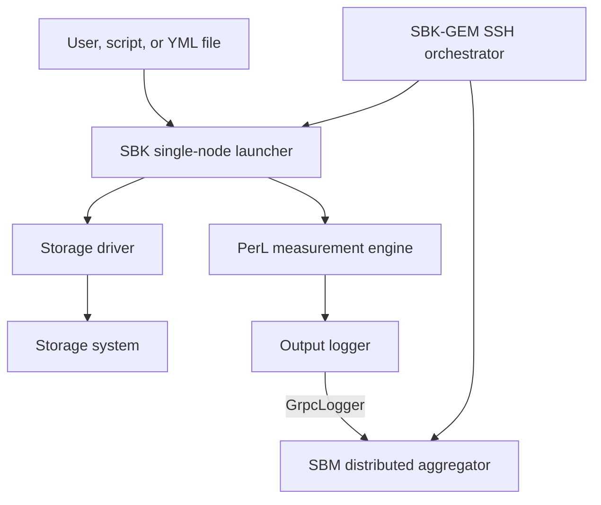
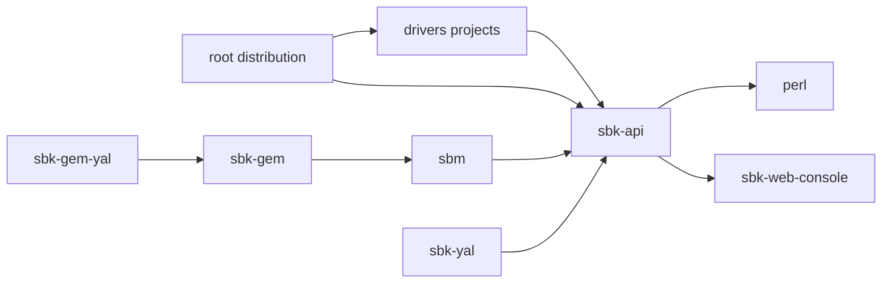
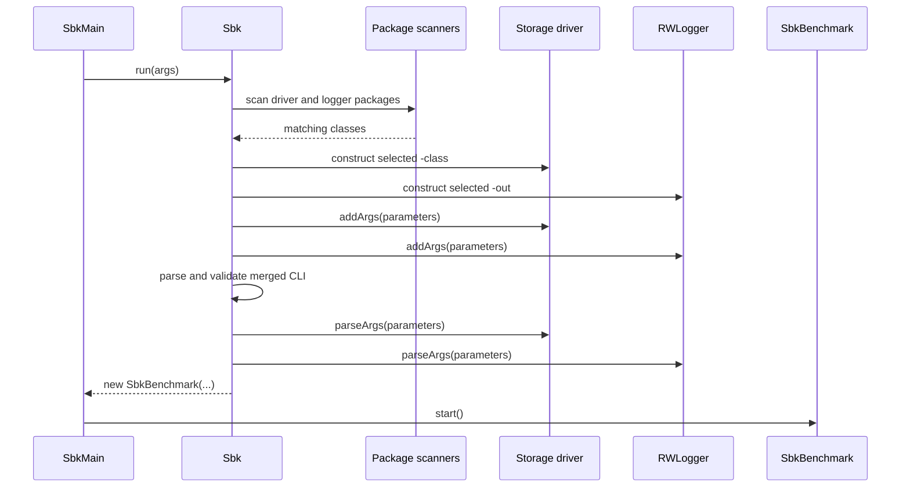
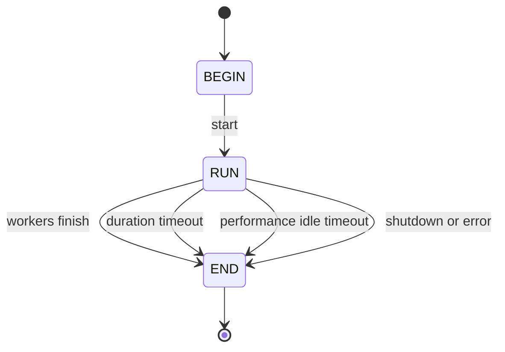
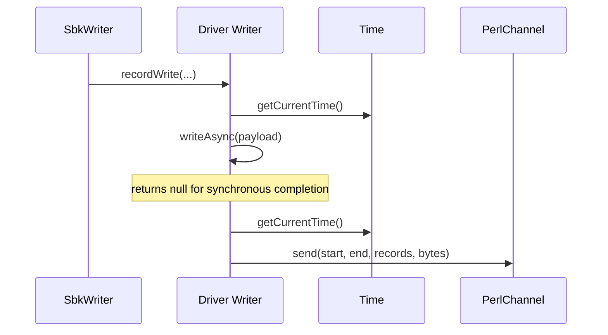
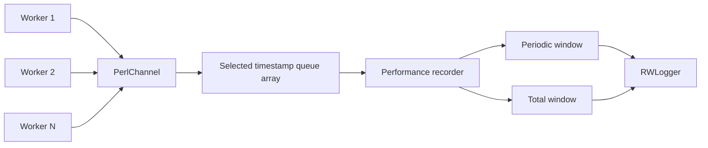
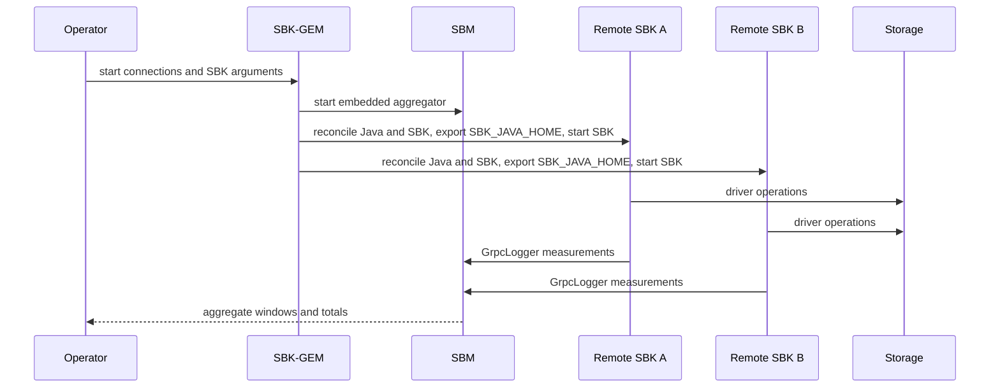

<!--
Copyright (c) KMG. All Rights Reserved.

Licensed under the Apache License, Version 2.0 (the "License");
you may not use this file except in compliance with the License.
You may obtain a copy of the License at

    http://www.apache.org/licenses/LICENSE-2.0

Unless required by applicable law or agreed to in writing, software
distributed under the License is distributed on an "AS IS" BASIS,
WITHOUT WARRANTIES OR CONDITIONS OF ANY KIND, either express or implied.
See the License for the specific language governing permissions and
limitations under the License.
-->

# SBK architecture and code flow

This guide explains how SBK is assembled and how one benchmark command moves through the code. It is intended for software engineers, reviewers, operators, and coding agents. For algorithm-level detail, continue with [sbk-internals.md](sbk-internals.md).

## System context

SBK separates workload control from storage-specific I/O. The same harness can drive a local file, an S3 endpoint, a message broker, a database, or an in-memory queue because all backends implement the same `Storage<T>` contract.



## Build-time module boundaries



| Module | Owns | Does not own |
|---|---|---|
| `perl` | Timestamp abstraction, concurrent queues, latency windows, percentiles, periodic/total recording | Storage semantics or CLI driver configuration |
| `sbk-web-console` | Local HTTP console server/client protocol, bounded histories, standalone process, and browser resources | Benchmark workers, measurement aggregation, or application-specific logger adapters |
| `sbk-api` | Storage/logger SPIs, bootstrap, common CLI, worker orchestration, payload types | Vendor SDK calls |
| `drivers/*` | Backend configuration and I/O adaptation | Benchmark scheduling or general percentile computation |
| `sbm` | SBP/gRPC ingestion and multi-client aggregation | Remote process launch |
| `sbk-gem` | SSH connections, remote distribution/launch, embedded SBM lifecycle | Driver implementation |
| `sbk-yal` | Mapping a YML document to SBK arguments | A separate benchmark engine |
| `sbk-gem-yal` | Mapping YML to SBK-GEM arguments | A separate distributed protocol |

## Single-node bootstrap

The installed script starts `io.sbk.main.SbkMain`, configured by the Gradle application plugin.



Important details:

- `StoragePackage` scans `io.sbk.driver` and `RWLoggerPackage` scans `io.sbk.logger` using the Reflections library.
- Selection uses the simple class name case-insensitively. It is package scanning, not Java `ServiceLoader` registration.
- `-class` and `-out` are removed before the merged driver/logger argument parser handles the remainder.
- Without `-out`, `SystemLogger` is selected.
- The chosen driver's `DataType<T>` controls payload creation, sizing, and optional timestamp embedding.

Primary sources:

- `sbk-api/src/main/java/io/sbk/main/SbkMain.java`
- `sbk-api/src/main/java/io/sbk/api/impl/Sbk.java`
- `sbk-api/src/main/java/io/sbk/api/Package.java`
- `sbk-api/src/main/java/io/sbk/api/StoragePackage.java`
- `sbk-api/src/main/java/io/sbk/api/RWLoggerPackage.java`

## Benchmark lifecycle

`SbkBenchmark` is the lifecycle owner. Its states prevent a benchmark from being started or stopped twice.



At `start()` it:

1. Opens the selected `RWLogger`.
2. Calls `Storage.openStorage()` once for shared driver resources.
3. Calls `createWriter(id, params)` and `createReader(id, params)` for configured workers.
4. Wraps driver objects in `SbkWriter` and `SbkReader` harness workers.
5. Starts write/read PerL recorders where the selected action needs them.
6. Distributes count-based records across workers, preserving the remainder on the last worker.
7. Starts workers in configured steps and optionally delays between steps.
8. Schedules `stop()` for timed runs, applies the PerL performance-event idle
   deadline only to fixed-record runs, and also chains shutdown after worker completion.

At shutdown it stops new work, closes driver readers and writers, closes the storage and logger, shuts down executors, and completes the benchmark future. Duration-based shutdown can interrupt an SDK call, so drivers must tolerate interruption-related exceptions during normal teardown. The shared `-idletimeoutseconds` option defaults to 600 seconds and applies only when a positive `-records` target is used without `-seconds`. It must be strictly greater than the active logger reporting interval. It is evaluated by PerL only while its queues are empty and by SBM only while fixed-record mode is selected and its ingestion queues are empty; each positive result renews the full deadline. SBK-GEM forwards the mode and value to remote SBK clients and its embedded SBM.

PerL, SBK, SBM, and SBK-GEM use the same terminal lifecycle vocabulary. Their final log message identifies successful `-seconds` or `-records` mode completion, an explicit lifecycle stop, an `-idletimeoutseconds` exit, or an internal exception. A failure remains authoritative during cleanup: later recorder, logger, storage, SSH-session, or embedded-SBM failures are retained as suppressed causes and prevent a misleading successful completion message.

Primary source: `sbk-api/src/main/java/io/sbk/api/impl/SbkBenchmark.java`.

## Operation path and timing

The driver-facing types are deliberately layered:

- `Storage<T>` creates and owns driver resources.
- `DataWriter<T>` and `DataReader<T>` define higher-level record loops.
- `Writer<T>` and `Reader<T>` provide the common single-operation primitives and default timed behavior.
- `SbkWriter` and `SbkReader` choose the correct loop for duration/count, rate control, combined read/write operation, and request logging.

### Synchronous write



### Asynchronous write

When `writeAsync()` returns a `CompletableFuture`, the default implementation records completion time in the future callback. Exceptional completion is passed to the PerL exception handler. A driver must not report a future as complete before the storage operation has reached the completion semantics promised by that driver.

### Read

`Reader.read()` returns one payload, while default reader methods time the operation, derive the byte count through `DataType<T>`, and submit the result. Callback or batch-oriented backends can implement the more specialized reader abstractions.

The harness already measures calls. A driver should only override timing helpers when its backend semantics require it, such as measuring a batch, embedding a producer timestamp, or avoiding an unavoidable adapter copy.

Primary sources:

- `sbk-api/src/main/java/io/sbk/api/Storage.java`
- `sbk-api/src/main/java/io/sbk/api/Writer.java`
- `sbk-api/src/main/java/io/sbk/api/Reader.java`
- `sbk-api/src/main/java/io/sbk/api/impl/SbkWriter.java`
- `sbk-api/src/main/java/io/sbk/api/impl/SbkReader.java`

## PerL measurement pipeline

PerL decouples measurement ingestion from statistics calculation.



Each measurement contains start time, end time, record count, and byte count. PerL records all submitted operations rather than sampling them. The recorder drains concurrent queues and updates latency storage and counters away from the I/O worker.

By default, the selected array contains intrusive
`TimeStampMpscQueue` instances. Each submitted `TimeStampNode` is both the
measurement payload and its linked-queue node, so enqueue does not allocate a
second wrapper. `-mpscqueue false` selects the compatibility path based on JDK
`ConcurrentLinkedQueue<TimeStamp>`; `-mpscqueue true` selects the intrusive
path. The default comes from `MpscQueueEnable` in
`sbk-api/src/main/resources/sbk.properties`.

Queue topology is a separate concern. `qPerWorker` and `maxQs` remain
property-backed settings rather than public CLI options. SBK prints both the
effective queue implementation and topology after argument parsing, before the
benchmark starts.

The timestamp queues have a multiple-producer, single-consumer workload:
worker threads produce measurements and the PerL recorder consumes them.
`TimeStampMpscQueue` specializes for that contract; the JDK fallback retains
general MPMC Collection behavior. See
[the queue research guide](TIMESTAMP_MPSC_QUEUE.md) for linearization,
memory-ordering, reclamation, complexity, and benchmark evidence.

`TimeStampMpscQueue` uses one single-use `TimeStampNode` as both payload and
link. Producers publish through a CAS on the predecessor's `next` reference;
the single consumer owns `head`. Every 16 dequeues, the consumer
release-publishes a recovery head and self-links the retired predecessor
batch. A producer paused on an old node detects that self-link and resumes
from the recovery head. This bounds stale-chain retention without pooling
nodes or adding a consumer-side head CAS. The specialization is appropriate
only for PerL's many-producer/one-consumer hand-off; it is not intended for
multiple consumers, iterators, arbitrary removals, or general collection use.

The default recorder also avoids querying the clock on every queue scan.
While records are available it reuses `TimeStamp.endTime`. While all queues
are empty, `ElasticWait` parks and checks the clock only after an adaptively
calibrated batch. The learned parks-per-millisecond rate is retained in an
exponential moving average. When activity briefly interrupts idleness, the
first subsequent empty scan starts a clean idle sample from the last record
timestamp while retaining that learned rate. This prevents active time from
diluting calibration and adds no new clock read. Setting `sleepMS > 0`
selects the simpler sleeping recorder and bypasses `ElasticWait`.

The phrase “lock-free hot path” applies to harness measurement transport. It does not promise that a vendor SDK, filesystem, JVM scheduler, allocator, or backend is lock-free. Driver wrappers should avoid adding their own locks to the per-operation path. In `sbk-api`, PerL, and SBM, keep per-operation branches, live bookkeeping state, conversions, clock reads, allocation, dynamic dispatch, and non-inlined call depth to the measured minimum; choose mode-specific implementations during startup where benchmarks justify specialization. Do not add atomic, `VarHandle`, fence, volatile, mutex, monitor, or conditional-wait operations. Existing PerL queue publication primitives are part of its proven MPSC memory-ordering protocol and must not be removed without a correctness proof plus stress and performance evidence. SBK-GEM is lifecycle orchestration, not a per-record measurement hot path.

Primary sources:

- `perl/src/main/java/io/perl/api/PerlChannel.java`
- `perl/src/main/java/io/perl/api/TimeStampNode.java`
- `perl/src/main/java/io/perl/api/impl/TimeStampMpscQueue.java`
- `perl/src/main/java/io/perl/api/impl/TimeStampMpscQueueArray.java`
- `perl/src/main/java/io/perl/api/impl/ConcurrentLinkedQueueArray.java`
- `perl/src/main/java/io/perl/api/impl/PerformanceRecorderElasticWait.java`
- `perl/src/main/java/io/perl/api/impl/PerformanceRecorderIdleSleep.java`
- `perl/src/main/java/io/perl/api/impl/ElasticWait.java`
- `perl/src/main/java/io/perl/api/impl/PerlBuilder.java`

## Output boundary

`RWLogger` is both a lifecycle interface and a metrics sink. Implementations can print, write CSV, expose Prometheus metrics, or forward data over gRPC.

| Logger | Use |
|---|---|
| `SystemLogger` | Default terminal output |
| `Sl4jLogger` | SLF4J logging path |
| `CSVLogger` | CSV result persistence |
| `WebLogger` | Console/CSV behavior plus dependency-free local live graphs; see [WebLogger guide](WEB_LOGGER.md) |
| `PrometheusLogger` | Metrics endpoint plus inherited result behavior |
| `GrpcLogger` | SBP/gRPC forwarding to SBM |

Logger discovery follows the same class-scanning pattern as drivers. New loggers belong under `io.sbk.logger` and must implement `RWLogger`, usually by extending the existing abstract implementation.

## Distributed flow

SBM aggregates measurements; it does not generate storage load. SBK-GEM orchestrates load generators; it does not replace the driver or the single-node harness.



SBP messages and gRPC services are generated from protobuf definitions in `sbk-api/src/main/proto`. SBM receives client registrations and latency records through `SbmGrpcService`, queues them in `SbmLatencyBenchmark`, and merges them into periodic and total windows. The default gRPC port is 9717.

SBK-GEM uses Apache MINA SSHD for connection, exact-file transfer, and command execution. It supports passwordless public-key authentication through the launching user's SSH agent and OpenSSH-configured identity files; an explicitly configured password is an optional fallback. Server identities are verified against that user's `~/.ssh/known_hosts`, or the path selected by `-knownhosts`, so unknown or changed host keys fail before deployment. Strict checking is the default; `-hostkeycheck false` is an explicit, insecure opt-out for isolated environments.

Remote execution uses an immutable, content-addressed runtime bundle rather than independent mutable SBK and Java directory copies. GEM first validates the installed SBK pathing JAR and all manifest dependencies, then packages the complete distribution plus the controller JDK when `javacopy=true`. The identity includes file bytes, contained relative symbolic links, normalized directory modes, and executable file state; escaping or absolute links are rejected. Managed `sbk-runtime-*` and `.sbk-runtime-*` top-level deployment artifacts are excluded from SBK bundle input, preventing a controller targeted through localhost from recursively packaging its prior deployed runtimes and mutable lease state. A per-identity cache lock and archive-digest sidecar prevent concurrent or interrupted local archive creation from supplying incomplete bytes. Controller, containers, and nodes must use the same supported operating system, Linux or macOS; CPU architecture is deliberately not part of deployment compatibility. Each node verifies the archive SHA-256, operating-system descriptor, and per-file SHA-256 manifest in a unique staging directory before an atomic rename. An exact valid identity is reused and missing content is provisioned automatically; incomplete staging data is cleaned and is never launched. A per-host lifecycle lock, authoritative current-runtime marker, and per-command PID leases allow `runtimecleanup=true` to remove every inactive non-current managed identity, whether its displayed SBK version is lower or higher, without deleting the current runtime or one used by a concurrent benchmark. The same option reconciles the controller-side managed bundle cache; an archive locked for a concurrent transfer is retained until inactive. Remote cleanup applies to every deployment target, including the controller when selected in `-nodes`; unmanaged installations remain outside the cleanup boundary. Bundle preparation, transfer, and lifecycle cleanup emit bounded progress heartbeats using the module-configured interval. With `javacopy=false`, the same SBK bundle is used but every node must supply a matching executable `java` and `javac`; external JDKs are never managed or deleted. PATH discovery uses a Linux/macOS portable symlink-resolution chain. Each launch exports the selected node-specific `SBK_JAVA_HOME`, and remote SBK uses `GrpcLogger` to reach the embedded SBM instance.

The local distribution is selected with `-sbkdir`. SBK-GEM always validates,
packages, and executes its standard `bin/sbk` launcher; arbitrary launcher
overrides are not part of the deployment contract.

## Configuration layers

Configuration comes from several layers:

1. Gradle/application defaults establish program name, main class, and application home.
2. Resource property files provide harness, logger, SBM, GEM, and driver defaults.
3. Common CLI options are registered by `SbkParameters`.
4. The selected logger and driver add their CLI options.
5. Parsed CLI values override applicable defaults.
6. YAL variants translate YML entries into the same argument model; they do not bypass normal validation.

For the PerL transport, `MpscQueueEnable` supplies the default and the common
`-mpscqueue true|false` option overrides it for that benchmark. The topology
properties `qPerWorker` and `maxQs` are validated when `SbkParameters` loads
`sbk.properties`, but are not exposed as command-line options. This keeps an
A/B queue comparison to one explicit runtime switch while preventing
accidental topology changes between runs.

Use generated `-help` output as the authority for accepted options. Use the relevant resource property file as the authority for defaults that are not printed in help.

Operational defaults have one owning source:

| Settings | Authoritative source |
|---|---|
| JDK download version, checksums, and bootstrap timeouts | `gradle/sbk-java-bootstrap.properties` |
| Build repositories, publication endpoints, and Maven POM identity | `gradle.properties` |
| Release-gate topology, timing, workload, and artifact limits | `gradle/release-qualification.properties` |
| SBK command defaults | `sbk-api/src/main/resources/sbk-command.properties` |
| SBK PerL queue topology | `sbk-api/src/main/resources/sbk.properties` |
| SBK lifecycle, executor reserve, and shutdown timeouts | `sbk-api/src/main/resources/sbk-runtime.properties` |
| Logger reporting and request-ID dimensions | `sbk-api/src/main/resources/logger.properties` |
| SBM client transport queue and close timeouts | `sbk-api/src/main/resources/sbmhost.properties` |
| SBM server defaults, including its default action | `sbm/src/main/resources/sbm.properties` |
| Web Console server, client, browser, retention, and log settings | `sbk-web-console/src/main/resources/webconsole.properties` |
| GEM orchestration and bounded diagnostic settings | `sbk-gem/src/main/resources/gem.properties` |

The SBP failure text limits are protocol constraints rather than operator tuning;
`SbpFailureLimits` is the shared client/server authority. Container manifests read
service ports from their runtime properties where the build DSL supports it. Fixed
HTTP paths, status codes, unit conversions, exit codes, collection dimensions, and
algorithm constants remain named source constants because changing them is a code or
protocol change rather than runtime configuration.

## Packaging and class loading

The root distribution includes `sbk-api` and all drivers declared as API dependencies in `build-drivers.gradle`. Drivers also must be included in `settings-drivers.gradle` so Gradle creates their projects.

The generated launcher uses a pathing JAR whose manifest points at runtime dependencies. After changing dependencies, force regeneration:

```bash
./gradlew clean :pathingJar installDist --rerun-tasks
```

A driver can compile successfully yet be unavailable at runtime if either registration file is missing or the distribution/pathing JAR is stale.

## Safe extension boundaries

| Desired change | Primary location |
|---|---|
| Support a backend | `drivers/<name>/` plus both driver registration files |
| Add a workload-wide CLI option | `SbkParameters` and `ParameterOptions` contracts |
| Add a payload representation | `io.sbk.data` implementation |
| Add result output | `io.sbk.logger` implementation |
| Change latency storage or percentile behavior | `perl` |
| Change timestamp queue selection or topology | `perl`, `SbkParameters`, and `SbkBenchmark` |
| Change distributed aggregation | `sbm` and protobuf compatibility review |
| Change remote launch | `sbk-gem` |
| Change YML mapping | the applicable YAL module |

Crossing these boundaries should be an explicit design decision. In particular, do not put vendor behavior into `sbk-api` or generic measurement behavior into a driver.

## Failure propagation

- Synchronous driver failures normally surface as `IOException` and end the worker path.
- Asynchronous failures complete the returned future exceptionally and are forwarded through the PerL exception handler.
- Recorder or logger failures invoke benchmark shutdown through configured exception handlers.
- Timed shutdown can race with SDK dispatchers; interruption and rejected-execution conditions during teardown may represent a clean stop.
- Remote GEM failures add SSH, transfer, remote-process, and callback-network failure domains.

When diagnosing a failure, identify the boundary first: argument discovery, distribution/classpath, driver open, worker I/O, measurement recorder, logger, gRPC aggregation, or SSH orchestration.

## Source reading order

For a practical code walkthrough:

1. `sbk-api/src/main/java/io/sbk/main/SbkMain.java`
2. `sbk-api/src/main/java/io/sbk/api/impl/Sbk.java`
3. `sbk-api/src/main/java/io/sbk/api/Storage.java`
4. One simple driver, such as `drivers/file/`
5. `sbk-api/src/main/java/io/sbk/api/impl/SbkBenchmark.java`
6. `SbkWriter`, `SbkReader`, `Writer`, and `Reader`
7. `perl/src/main/java/io/perl/api/impl/PerlBuilder.java`
8. The PerL queue and recorder selected by that builder
9. `drivers/perlbench/` and [the queue research guide](TIMESTAMP_MPSC_QUEUE.md)
   for a controlled end-to-end queue comparison
10. `GrpcLogger` and `SbmGrpcService` for distributed reporting
11. `SbkGem` and `SbkGemBenchmark` for remote orchestration

## Architectural invariants

Review changes against these invariants:

- Storage-specific behavior remains behind `Storage<T>` and its reader/writer objects.
- Benchmark timing is performed consistently by the harness unless a documented backend constraint requires an override.
- Every accepted operation contributes to measurement; no silent sampling is introduced.
- Histogram and reporting work stays off the driver operation path.
- Driver wrappers do not add synchronization to the per-record path.
- Async completion represents the documented storage completion point.
- Driver discovery and distribution registration remain consistent.
- Protobuf and gRPC changes consider mixed-version compatibility.
- Shutdown remains idempotent and tolerates in-flight I/O.
