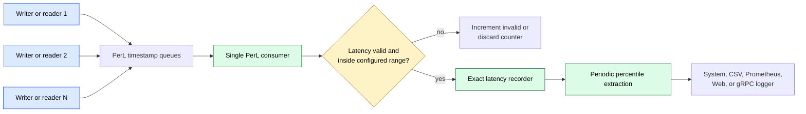
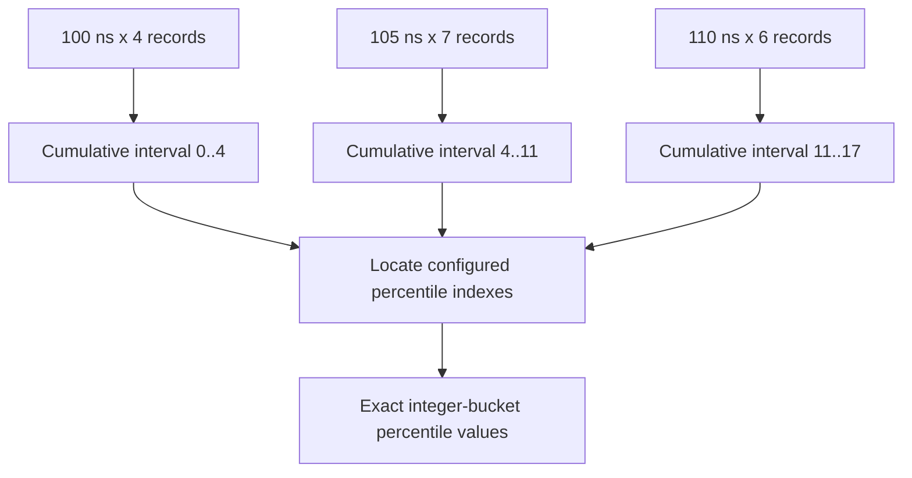
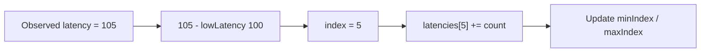
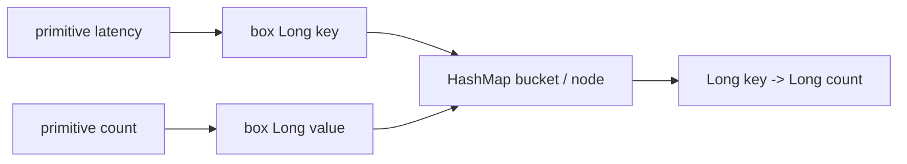
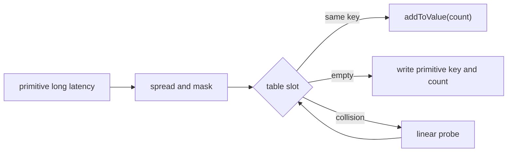
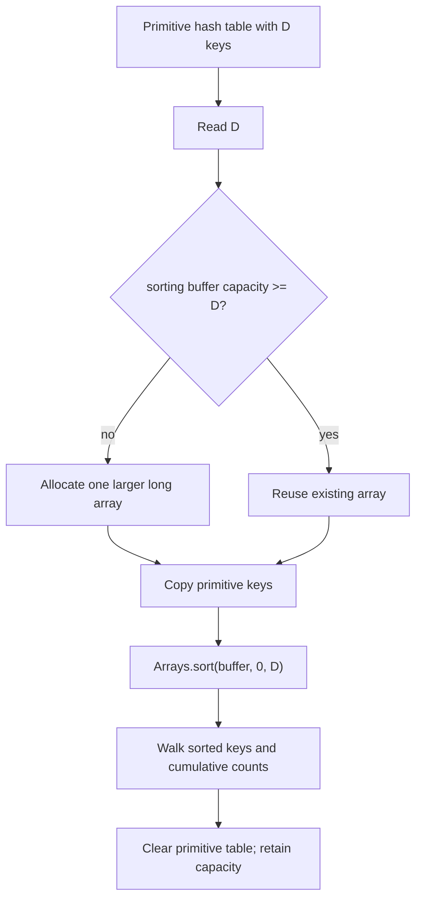
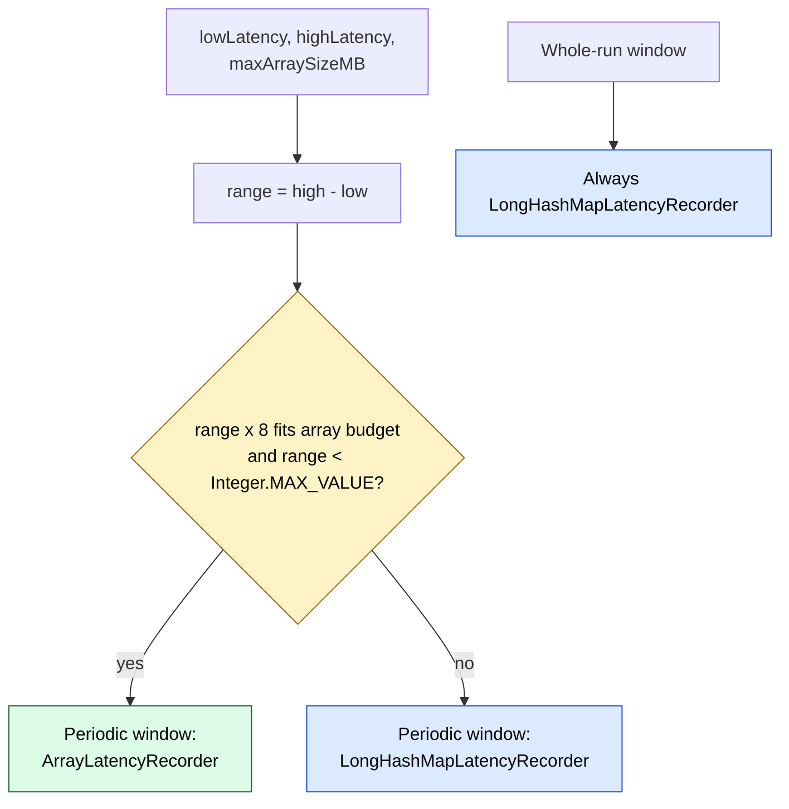
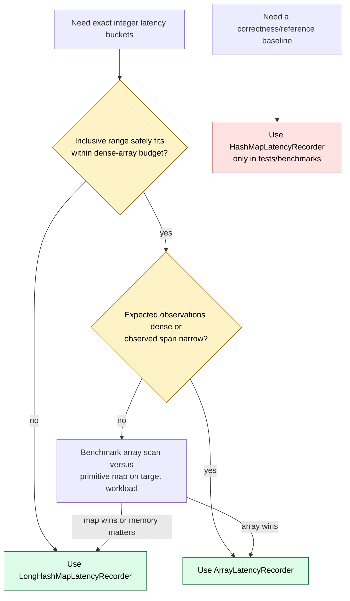

<!--
Copyright (c) KMG. All Rights Reserved.

Licensed under the Apache License, Version 2.0 (the "License");
you may not use this file except in compliance with the License.
You may obtain a copy of the License at

    http://www.apache.org/licenses/LICENSE-2.0

Unless required by applicable law or agreed to in writing, software
distributed under the License is distributed on an "AS IS" BASIS,
WITHOUT WARRANTIES OR CONDITIONS OF ANY KIND, either express or implied.
See the License for the specific language governing permissions and
limitations under the License.
-->

# Exact latency recorders in PerL: architecture, memory, and performance

- **System:** Storage Benchmark Kit (SBK) 10.6, Performance Logger (PerL)
- **Runtime:** JDK 25
- **Evaluation date:** 2026-08-29
- **Implementations:** `ArrayLatencyRecorder`, `HashMapLatencyRecorder`,
  `LongHashMapLatencyRecorder`, `HybridPagedLatencyRecorder`
- **Keywords:** exact percentiles, dense histogram, sparse histogram,
  primitive hash map, boxing, garbage collection, JMH, latency benchmarking

## Abstract

PerL retains every valid integer latency as an exact frequency distribution.
It does not sample observations. The storage structure behind that
distribution therefore affects the benchmarker's own CPU consumption, heap
footprint, garbage production, cache locality, and the delay required to
produce periodic percentiles.

This paper studies PerL's three general exact recorders and SBM's specialized
exact nanosecond recorder:

- `ArrayLatencyRecorder` is a dense histogram. A latency is translated
  directly into an array index.
- `HashMapLatencyRecorder` is a sparse reference implementation backed by JDK
  `HashMap<Long, Long>`. It is retained for equivalence tests and performance
  comparison, but is no longer selected by the production builder.
- `LongHashMapLatencyRecorder` is the production sparse implementation backed
  by Eclipse Collections `LongLongHashMap`. It stores primitive keys and
  counts, and reuses its percentile sorting buffer.
- `HybridPagedLatencyRecorder` is SBM's exact nanosecond aggregator. It keeps
  low-occupancy regions in sorted primitive arrays, promotes dense regions to
  counter pages, and sorts only active page identifiers when reporting.

On the measured 16-vCPU Intel Xeon Platinum 8462Y+ virtual machine, JDK 25.0.2
with ZGC and compact object headers, a 4,096-value update workload produced:

| Recorder | Updates/second | Allocation/update |
|---|---:|---:|
| `ArrayLatencyRecorder` | 561.9 million | effectively 0 B |
| `LongHashMapLatencyRecorder` | 439.0 million | 0.001 B |
| `HashMapLatencyRecorder` | 64.6 million | 47.855 B |

The array delivered 28.0% higher throughput than the primitive map for this
dense bounded workload. The primitive map delivered 580.0% higher throughput
than the boxed map and removed
effectively all hot-path allocation. These are measurements of one controlled
environment, not universal constants. The portable conclusions are
structural: array indexing avoids hashing; primitive storage avoids boxing;
and a reusable primitive sorting buffer avoids a large allocation on every
percentile extraction.

## 1. Research questions

This study answers six questions:

1. How does each recorder represent the exact latency distribution?
2. Which work happens for every completed storage operation?
3. Which work happens only at a reporting-window boundary?
4. How do latency range and number of distinct observed values affect memory?
5. When should PerL select a dense array or sparse primitive map?
6. Which performance statements are architectural facts, and which are
   environment-sensitive measurements?

The authoritative source files are:

- [`ArrayLatencyRecorder.java`](../perl/src/main/java/io/perl/api/impl/ArrayLatencyRecorder.java)
- [`MapLatencyRecorder.java`](../perl/src/main/java/io/perl/api/impl/MapLatencyRecorder.java)
- [`HashMapLatencyRecorder.java`](../perl/src/main/java/io/perl/api/impl/HashMapLatencyRecorder.java)
- [`LongHashMapLatencyRecorder.java`](../perl/src/main/java/io/perl/api/impl/LongHashMapLatencyRecorder.java)
- [`HybridPagedLatencyRecorder.java`](../perl/src/main/java/io/perl/api/impl/HybridPagedLatencyRecorder.java)
- [`PerlBuilder.java`](../perl/src/main/java/io/perl/api/impl/PerlBuilder.java)

## 2. Position in the SBK measurement pipeline

Benchmark workers do not update the latency distribution directly. They send
completed timestamps through a PerL channel. One recorder thread consumes the
timestamps and owns both the periodic and whole-run latency windows.



This ownership model is essential: all four recorders are deliberately
`@NotThreadSafe`. The queues provide cross-thread publication; the consumer
alone mutates a recorder. Adding atomic counters or locks inside the recorder
would add overhead without improving correctness under the intended topology.

## 3. Shared semantics

All four classes extend `LatencyRecordWindow`. They share the same validation
and accounting implemented by the `LatencyRecorder`/`LatencyWindow` hierarchy:

- total records and bytes;
- total accumulated latency;
- minimum and maximum valid latency;
- invalid latency records;
- records below `lowLatency`;
- records above `highLatency`;
- overflow based on configured total limits.

The normal call is:

```text
recordLatency(startTime, events, bytes, latency)
    |
    +-- record(events, bytes, latency)
    |       |
    |       +-- update totals
    |       +-- classify invalid / lower / higher
    |       +-- return true only for a valid in-range latency
    |
    +-- reportLatency(latency, events)
            |
            +-- update exact frequency bucket
```

`events` is the frequency increment. A single timing observation can represent
more than one record, so the distribution stores `latency -> record count`,
not merely `latency -> number of method calls`.

### 3.1 Exact percentile calculation

At the end of a window, each implementation emits latency/count pairs in
ascending latency order. `LatencyPercentiles` walks their cumulative counts:



No recorder approximates an accepted integer latency. Precision is determined
by the configured time unit and the inclusive `[lowLatency, highLatency]`
range. Values outside that range are counted explicitly but do not enter the
percentile distribution.

### 3.2 Lifecycle invariant

The production lifecycle is:

```text
startWindow -> record many values -> copyPercentiles -> reset -> startWindow
```

`copyPercentiles()` consumes the current distribution. The array implementation
zeros each visited non-empty slot during extraction. The map implementations
clear their maps after extraction. `reset()` resets common counters and window
time.

This order matters. `ArrayLatencyRecorder.reset()` does not scan and clear its
entire backing array; doing so would turn every reset into an `O(range)` memory
write. Code that bypasses the production lifecycle must extract before reusing
the array window.

## 4. `ArrayLatencyRecorder`

### 4.1 Representation

For inclusive bounds `L` and `H`, the recorder allocates:

```text
slot count R = H - L + 1
counter bytes = 8R
index(latency) = latency - L
```



The dense layout contains no keys. The array position is the key:

```text
lowLatency = 100

array index       0    1    2    3    4    5    6   ...   10
latency value   100  101  102  103  104  105  106   ...  110
record count      4    0    0    0    0    7    0   ...    6
```

### 4.2 Hot path

For each valid measurement:

1. subtract `lowLatency`;
2. update `minIndex` and `maxIndex`;
3. increment one `long` array element.

There is no hash calculation, collision probe, object allocation, pointer
chase, or resize.

### 4.3 Extraction

The recorder scans from the smallest observed index to the largest observed
index. For each non-zero slot it:

1. reconstructs the latency as `index + lowLatency`;
2. feeds the bucket into `LatencyPercentiles`;
3. optionally copies it to another recorder;
4. zeros that slot.

The `minIndex`/`maxIndex` bounds avoid scanning unused prefixes and suffixes.
They do not avoid holes inside the observed span.

### 4.4 Best use cases

Use the array when:

- the configured latency range is small enough to allocate safely;
- values are dense or the observed minimum-to-maximum span is narrow;
- update latency is more important than minimizing fixed memory;
- the time unit is milliseconds or another naturally bounded unit;
- predictable zero-allocation updates are required.

Avoid it when:

- nanosecond bounds span millions or billions of possible values;
- observed values are sparse across a very wide range;
- the fixed array would consume a large fraction of heap;
- empty holes between minimum and maximum would dominate extraction time.

### 4.5 Important API constraint

`recordLatency()` validates the configured bounds before indexing and is the
normal safe API. Direct callers of `reportLatency()` must provide an in-range
value. The current direct method checks the upper index but not a negative
index; a latency below `lowLatency` can therefore cause a negative array
access. Production input reaches it only after validation or through
compatible recorder-to-recorder aggregation.

## 5. `HashMapLatencyRecorder`

### 5.1 Representation

`HashMapLatencyRecorder` supplies `new HashMap<Long, Long>()` to
`MapLatencyRecorder`:



JDK `HashMap` provides expected constant-time `get` and `put` with a suitable
hash distribution. Iteration costs are proportional to capacity plus size,
and its default load factor is 0.75. See the
[JDK 25 `HashMap` specification](https://docs.oracle.com/en/java/javase/25/docs/api/java.base/java/util/HashMap.html).

### 5.2 Hot path

```java
Long value = latencies.get(latency);
if (value == null) {
    latencies.put(latency, count);
} else {
    latencies.replace(latency, value + count);
}
```

Generic `Map<Long, Long>` requires boxing. For latencies and counts outside
the small wrapper cache, an update can allocate temporary key wrappers and a
replacement value wrapper. The map also retains a node and key object for
each distinct latency.

The measured steady update workload allocated 47.855 bytes per operation.
At 64.6 million updates/second this corresponded to approximately 2.9 GB/s of
allocation in JMH, producing 36 observed ZGC collections across the measured
forks.

Compact object headers reduce the size of many Java objects, but do not remove
the wrappers or map nodes. SBK enables the JDK 25 product feature
`-XX:+UseCompactObjectHeaders`; see
[JEP 519](https://openjdk.org/jeps/519).

### 5.3 Extraction

The boxed map creates a sorted stream over its key set:

```text
key set -> boxed stream -> sort -> iterator -> map lookup per key
```

This produces ascending exact buckets, but sorting is `O(D log D)` for `D`
distinct latencies and creates temporary stream/sorting machinery. The map is
cleared after extraction.

### 5.4 Current role

`HashMapLatencyRecorder` is useful as:

- a readable correctness oracle;
- an equivalence-test baseline;
- a benchmark baseline demonstrating boxing cost;
- a compatibility reference for the primitive implementation.

It is not selected by `PerlBuilder` in production. For a sparse exact window,
the builder selects `LongHashMapLatencyRecorder`.

## 6. `LongHashMapLatencyRecorder`

### 6.1 Representation

The recorder uses Eclipse Collections 13.0.0 `LongLongHashMap`. Keys and
values reside in one interleaved primitive array:

```text
keysValues:
+--------+--------+--------+--------+--------+--------+
| key 0  | value 0| key 1  | value 1| key 2  | value 2|
+--------+--------+--------+--------+--------+--------+
```

The implementation uses open addressing and linear probing. It grows before
the table exceeds approximately 50% occupancy. Latencies `0` and `1` are
handled as sentinel keys by the collection implementation.



No `Long` wrapper, entry node, or replacement value object is required.

### 6.2 Hot path

```java
long value = latencies.get(latency);
if (value == 0) {
    latencies.put(latency, count);
} else {
    latencies.addToValue(latency, count);
}
```

SBK supplies positive record counts. Under that invariant, zero means
"missing" for the recorder's update path. A general-purpose caller that stores
zero or negative bucket counts would violate this assumption.

The measured update path reached 438.8 million operations/second and allocated
0.001 B/op, effectively eliminating the boxed map's hot-path garbage.

### 6.3 Reusable percentile sorting buffer

Hash iteration is not ordered, so exact percentile calculation still needs
sorted keys. The recorder keeps a `long[] sortedLatencies`:



The buffer grows only when a window exceeds the previous high-water mark. It
is reused by later windows. This converts extraction from repeated
`O(D)` temporary allocation to retained `O(Dmax)` storage.

For 65,536 keys, the measured comparison was:

| Extraction mechanism | Time | Allocation |
|---|---:|---:|
| Allocating primitive sorted list | 320.282 us | 524,379 B |
| Reusable primitive array | 173.992 us | 49.701 B |

The reusable array reduced measured extraction time by 45.7% and allocation
by 99.99% in this environment.

### 6.4 Clear and retention behavior

`LongLongHashMap.clear()` fills its complete backing array with zeros. It does
not shrink the table. This has two intentional effects:

- later windows reuse capacity without rehash/resizing allocation;
- a single unusually large window establishes a retained memory high-water
  mark.

`copyPercentiles()` clears the map. The subsequent `reset()` checks
`notEmpty()` before clearing, avoiding a second full-array fill over an
already-empty large table.

### 6.5 Best use cases

Use the primitive map when:

- the configured latency range is too large for a dense array;
- nanosecond or microsecond measurements produce sparse exact values;
- the whole-run window may contain a large but sparse distribution;
- fixed memory proportional to the entire theoretical range is unacceptable;
- exact values are required and approximate histograms are not acceptable.

### 6.6 SBM exact nanosecond hybrid pages

SBM receives already aggregated exact latency/count pairs from every remote
SBK process. With thousands of clients, the combined nanosecond distribution
often contains dense local regions plus a small number of sparse outliers.
A flat primitive map stores every exact value as a hash entry and sorts every
distinct key before each periodic report.

For nanosecond SBM windows, `HybridPagedLatencyRecorder` divides the signed
latency domain into configurable power-of-two pages. Each page:

- begins as sorted primitive offset/count arrays;
- grows without boxing;
- promotes to a dense `long[]` after the configured sparse-entry threshold;
- preserves every exact latency and count; and
- is cleared and retained for allocation-free reuse between normal windows.

Only page identifiers are globally sorted. Sparse offsets are maintained in
order as they are inserted, while dense pages are scanned directly. The total
window uses the same exact representation, so periodic and final aggregated
percentiles have identical precision. If retained page memory exceeds its
configured target, the completed window is still printed and the retained
page cache is released before the next window; reporting is never silently
skipped.

SBM owns this selection. `PerlBuilder` continues to select the dense array or
primitive map for ordinary local PerL windows. The bundled SBM properties are:

```properties
exactLatencyPageBits=8
exactLatencySparsePageEntries=32
exactLatencyMaxMemoryMB=1024
exactTotalLatencyMaxMemoryMB=2048
```

The defaults represent 256 exact values per page and dense promotion on the
33rd distinct value in that page. A retained-page JMH threshold sweep showed
why this remains the CPU-oriented default: at 64 values/page, threshold 32
completed a reporting window in 43.814 us versus 52.368 us for threshold 128;
at 128 values/page the results were 69.887 us versus 111.127 us. Threshold 128
avoids early dense allocation and is available to memory-constrained workloads,
but repeatedly rebuilding its sorted sparse arrays costs more CPU. These are
configuration properties rather than command-line arguments.

The two exact-memory settings are intentionally independent from
`maxHashMapSizeMB` and `totalMaxHashMapSizeMB`. The primitive map counts only
16 bytes of logical key/count payload per distinct latency and does not count
its backing arrays. Hybrid pages count page objects, estimated outer-map
entries, primitive-array headers and capacities, and active-page indexes.
Consequently, equal numeric limits would not represent equal retained heap.
The 1024/2048 MiB defaults preserve approximately the former periodic/total
real-heap capacity for the measured mixed nanosecond distribution while making
the fuller hybrid estimate explicit.

Accounting remains distribution-dependent. A page containing one exact value
uses approximately 144 estimated bytes for that value, versus the primitive
map's optimistic 16-byte logical payload. A full 256-value page uses about 8.3
estimated bytes/value. Promotion at the default threshold temporarily creates
a memory cliff: a page with 32 values uses about 13.3 estimated bytes/value,
while its 33-value dense representation uses about 64.7. The dense cost falls
below the flat map's logical 16 bytes/value near 134 values/page. Sparse
outliers therefore consume the hybrid budget faster even though realistic
mixed distributions have measured lower actual heap than the primitive map.
Operators can raise `exactLatencySparsePageEntries` to trade reporting CPU for
lower partial-page memory without changing millisecond/microsecond behavior.

Periodic and total policies are also distinct. Periodic cache pressure never
cuts a reporting interval short: an oversized retained cache is released only
after the natural report. The total window uses its independent limit to print
and reset accumulated statistics before releasing the cache. In both cases a
completed result is printed before recorded data is discarded.

The JDK 25 JMH comparison added with this specialization measures a complete
4,096-value window, including exact recording and percentile extraction:

| Distribution | Recorder | Time/window | Allocation/window |
|---|---|---:|---:|
| contiguous values | `LongHashMapLatencyRecorder` | 32.241 us | 48.316 B |
| contiguous values | `HybridPagedLatencyRecorder` | 28.133 us | 0.275 B |
| one value per page | `LongHashMapLatencyRecorder` | 128.002 us | 1,297.251 B |
| one value per page | `HybridPagedLatencyRecorder` | 57.961 us | 0.568 B |

In that controlled run, hybrid pages reduced complete-window time by 12.7%
for contiguous values and 54.7% for the sparse control. These measurements are
environment-specific; the exactness and representation differences are the
portable properties.

## 7. Builder selection and production roles

`PerlBuilder.buildLatencyRecordWindow()` estimates the dense-array payload:

```text
estimated bytes = (highLatency - lowLatency) * 8
```

If the estimate is below `maxArraySizeMB` and the range is indexable by an
integer, it chooses `ArrayLatencyRecorder`. Otherwise it chooses
`LongHashMapLatencyRecorder`.



Default memory configuration:

```properties
maxArraySizeMB=64
maxHashMapSizeMB=192
totalMaxHashMapSizeMB=256
```

The periodic window may therefore use an array, while the whole-run window
uses the primitive map to avoid reserving memory for the full theoretical
latency range.

### 7.1 Selection examples

| Range | Inclusive slots | Dense counter payload | Likely choice |
|---|---:|---:|---|
| 0..180,000 ms | 180,001 | 1.37 MiB | Array |
| 0..5,000,000 ns | 5,000,001 | 38.15 MiB | Array |
| 0..180,000,000 ns | 180,000,001 | 1.34 GiB | Primitive map |
| 0..180,000,000,000 ns | 180,000,000,001 | 1.31 TiB | Primitive map |

These examples describe storage feasibility, not measurement quality.
Operators should choose bounds that include meaningful expected latencies
without allowing rare pathological values to dominate memory.

## 8. Algorithmic complexity

Let:

- `R = highLatency - lowLatency + 1`, the inclusive range size;
- `D`, the number of distinct observed valid latency values;
- `S = maxObservedIndex - minObservedIndex + 1`, the observed array span;
- `C`, the current hash-table capacity.

| Operation | Array | Boxed HashMap | Primitive LongLongHashMap |
|---|---|---|---|
| Construct | `O(R)` zeroing | `O(1)` | `O(1)` small initial table |
| Record existing latency | `O(1)` worst case | expected `O(1)` | expected `O(1)` |
| Record new latency | `O(1)` worst case | expected `O(1)`, occasional resize | expected `O(1)`, occasional rehash |
| Additional allocation per normal update | none | wrapper garbage, possibly nodes | none |
| Extract ordered buckets | `O(S)` | `O(C + D log D)` | `O(C + D log D)` |
| Extraction temporary storage | `O(1)` | `O(D)` plus stream machinery | `O(Dmax)` retained reusable buffer |
| Clear during extraction | included in `O(S)` | `O(C + D)` implementation-dependent | `O(C)` array fill |
| Reset after extraction | `O(1)` | normally `O(C)` clear | `O(1)` when already empty |
| Fixed/retained distribution memory | `O(R)` | `O(C + D)` objects/references | `O(C + Dmax)` primitives |

Worst-case hash-table operations can degrade under excessive collisions.
The expected constant-time classification assumes a suitable hash spread.

## 9. Memory analysis

### 9.1 Array

The recorder reports exactly `8R` bytes for counter payload:

```text
R = 5,096 slots in the JMH configuration
payload = 5,096 x 8 = 40,768 bytes
```

The Java array header and small recorder object are additional but do not
scale with observations. No per-distinct-latency object exists.

### 9.2 Primitive map

Eclipse Collections stores key/value pairs in an interleaved `long[]` and
maintains a maximum occupancy of roughly 50%. Around a stable power-of-two
capacity, the backing table therefore requires approximately:

```text
2 table slots per distinct key
x 2 longs per slot
x 8 bytes per long
= approximately 32 bytes per distinct latency
```

The reusable sorting buffer adds up to 8 bytes per high-water distinct key.
Consequently, a stable large recorder is approximately 40 bytes per distinct
latency plus small object/array headers, with step changes at power-of-two
resizes.

For 4,096 distinct latencies:

```text
interleaved hash table: approximately 128 KiB
reusable sorted keys:                    32 KiB
combined primitive payload:             160 KiB
```

### 9.3 Boxed map

The boxed representation retains:

- a HashMap table reference per capacity slot;
- one HashMap node per distinct latency;
- a `Long` key per distinct latency outside the wrapper cache;
- a current boxed `Long` value where the count is not cached;
- table and recorder objects.

It additionally allocates temporary wrappers during updates. Exact retained
bytes depend on JVM object layout, compressed references, table capacity,
counts, and whether wrapper-cache values are reused. The documented JMH run's
allocation result of 47.855 B/update is therefore a stronger observed
statement than a universal retained-byte formula.

### 9.4 Configured budget versus actual heap

Both map recorders increment `mapBytesCount` by 16 bytes for each distinct
latency, representing one primitive key and one primitive count. This is a
logical payload estimate used by `isFull()`, not a measurement of the backing
collection's full retained heap.

For the primitive map, open-addressing capacity and the sorting buffer make
actual retained primitive storage closer to roughly 40 bytes per distinct key
at stable capacity. For the boxed map, nodes, references, wrappers, and
temporary garbage increase the difference further.

Therefore:

```text
maxHashMapSizeMB is a recorder payload policy,
not a strict JVM heap or RSS limit.
```

Capacity is retained after `clear()`, so heap use follows the largest observed
window rather than the current empty-window size.

### 9.5 Approximate dense-versus-sparse memory crossover

Using only the dominant primitive payloads:

```text
array memory         ~= 8R
primitive-map memory ~= 40D
```

The approximate equality is:

```text
8R = 40D
D / R = 0.20
```

If more than roughly 20% of a bounded range becomes populated, the dense array
can use less retained primitive storage than the map plus sorting buffer. If
only a small fraction is populated, the primitive map can save substantial
memory. Power-of-two table growth, array/object headers, and high-water
retention shift the exact crossover, so 20% is a design estimate rather than
a runtime guarantee.

| Range slots `R` | Distinct values `D` | Density | Array payload | Approx. primitive-map payload | Memory-oriented choice |
|---:|---:|---:|---:|---:|---|
| 1,000,000 | 1,000 | 0.1% | 7.63 MiB | 39 KiB | Primitive map |
| 1,000,000 | 100,000 | 10% | 7.63 MiB | 3.81 MiB | Primitive map |
| 1,000,000 | 250,000 | 25% | 7.63 MiB | 9.54 MiB | Array |
| 1,000,000 | 1,000,000 | 100% | 7.63 MiB | 38.15 MiB | Array |

Memory is not the only criterion. The array extraction cost follows observed
span `S`, while map extraction sorts `D` keys. A sparse distribution clustered
inside a narrow span can still favor the array; a few values spread across the
entire range can favor the map even when the array fits.

## 10. Experimental method

The reproducible benchmark is
[`LatencyMapBenchmark.java`](../perl/src/jmh/java/io/perl/benchmark/LatencyMapBenchmark.java).
Run:

```bash
./gradlew :perl:latencyMapPerformanceTest
```

The task:

- builds with JDK 25;
- uses JMH 1.37;
- runs three independent forks;
- performs three one-second warmup iterations per fork;
- performs five one-second measurement iterations per fork;
- uses one thread because a recorder has one production owner;
- enables the JMH GC profiler;
- writes raw JSON to
  `perl/build/reports/jmh/latency-map-performance.json`.

The benchmark cycles across 4,096 exact values beginning at latency 1,000.
Values are outside the small boxed-`Long` cache. It measures:

1. individual frequency updates;
2. complete 4,096-value record-and-extract windows;
3. allocating versus reusable primitive key extraction for 65,536 keys.

### 10.1 Environment

| Component | Measured value |
|---|---|
| CPU | Intel Xeon Platinum 8462Y+, 16 vCPUs |
| Topology | VMware VM, 1 NUMA node |
| Memory | 61 GiB |
| OS | Ubuntu Linux, kernel 5.15.0-181 |
| JVM | Oracle JDK 25.0.2+10-LTS-69 |
| GC | ZGC |
| Object headers | `-XX:+UseCompactObjectHeaders` |
| JMH | 1.37 |

JMH is the OpenJDK harness for JVM nano-, micro-, milli-, and macrobenchmarks;
see the [OpenJDK JMH project](https://openjdk.org/projects/code-tools/jmh/).

## 11. Performance results

### 11.1 Update hot path

| Recorder | Mean throughput | 99.9% confidence interval | Allocation |
|---|---:|---:|---:|
| Array | 561.874 M ops/s | 552.030..571.719 M | effectively 0 B/op |
| Primitive map | 439.011 M ops/s | 435.194..442.828 M | 0.001 B/op |
| Boxed map | 64.560 M ops/s | 38.833..90.287 M | 47.855 B/op |

Derived comparisons:

- Array versus primitive map: **28.0% higher mean throughput**.
- Primitive versus boxed map: **580.0% higher mean throughput**.
- Primitive versus boxed allocation: effectively **100% reduction**.
- Array versus boxed map: **770.3% higher mean throughput**.

The boxed result has a wide confidence interval because its high allocation
rate introduced GC-dependent bimodality. Even its upper confidence bound is
well below the primitive map's lower bound in this run.

### 11.2 Complete window

The complete-window benchmark records 4,096 distinct values and then
calculates percentiles while clearing the distribution. Results are populated
from the same raw JMH report and include both hot-path and boundary work:

| Recorder | Time/window | Allocation/window |
|---|---:|---:|
| Array | 9.531 us | 0.093 B |
| Primitive map | 32.346 us | 48.317 B |
| Boxed map | 213.952 us | 429,058.098 B |

This measure is more representative of PerL than update throughput alone.
The update benchmark isolates the cost paid for every record; the window
benchmark includes ordering, percentile traversal, and clearing. For this
dense window, the array completed in 29.5% of the primitive-map time. The
primitive map completed in 15.1% of the boxed-map time and avoided about
419 KiB of allocation per window.

### 11.3 Primitive extraction optimization

| Mechanism, 65,536 keys | Mean time | Allocation |
|---|---:|---:|
| Allocating sorted primitive list | 320.282 us | 524,379.133 B/op |
| Reusable primitive array | 173.992 us | 49.701 B/op |

The reusable implementation required 45.7% less time and avoided approximately
512 KiB of allocation per extraction.

## 12. Correctness evidence

The recorders are tested for exact equivalence rather than approximate
tolerance.

[`ArrayLatencyRecorderTest.java`](../perl/src/test/java/io/perl/test/ArrayLatencyRecorderTest.java)
compares array and primitive-map behavior for:

- non-zero lower bounds;
- inclusive minimum and maximum;
- lower and higher discarded values;
- invalid negative latency;
- duplicate latency values;
- batched record counts;
- empty windows;
- growing and shrinking windows;
- repeated reset/extract cycles;
- deterministic random distributions;
- exact ordered latency/count pairs;
- every configured percentile and its bucket count;
- median;
- valid, invalid, lower-discard, and higher-discard counters.

[`LatencyMapRecorderTest.java`](../perl/src/test/java/io/perl/test/LatencyMapRecorderTest.java)
compares primitive and boxed map behavior, verifies production builder
selection, exercises reusable sorting-buffer growth, and tests repeated
windows.

These tests establish semantic equivalence for the supported lifecycle. JMH
establishes performance observations, not correctness.

## 13. Decision guide



| Workload | Recommended recorder | Reason |
|---|---|---|
| Small bounded millisecond range | Array | fastest direct indexing, small fixed array |
| Dense microsecond range below budget | Array | cache-friendly exact counters |
| Nanosecond range spanning billions | Primitive map | memory proportional to observed values |
| Sparse values separated by large holes | Primitive map | avoids scanning/reserving holes |
| Whole-run aggregation | Primitive map | theoretical range can be enormous |
| Correctness oracle or regression baseline | Boxed map | simple JDK representation |

## 14. Limitations and threats to validity

1. Microbenchmarks do not include timestamp queue traffic, logger formatting,
   storage SDK calls, or operating-system I/O.
2. Results apply to the declared CPU, JVM, GC, and flags. Different CPUs,
   collectors, heap sizes, or JDK builds can change throughput.
3. The benchmark has one recorder thread because production ownership is
   single-threaded. It does not measure unsupported concurrent mutation.
4. The update workload has 4,096 repeating values. Different cardinality,
   hash distribution, and density change cache behavior.
5. `gc.alloc.rate.norm` values near zero are profiler/harness noise and should
   be interpreted as "no structural per-operation allocation," not literally
   a fractional object.
6. Reported array memory is counter payload; reported map budgets are logical
   payload estimates, not complete retained-heap measurements.
7. The reusable sorting buffer trades lower repeated allocation for retained
   high-water memory.
8. Exact percentile retention can require much more memory than an approximate
   histogram. That is a deliberate precision tradeoff.

## 15. Conclusions

The four recorders occupy distinct architectural roles:

- `ArrayLatencyRecorder` is the preferred dense-window implementation. It has
  the simplest hot path, deterministic fixed memory, and the highest measured
  update throughput.
- `LongHashMapLatencyRecorder` is the preferred sparse and whole-run
  implementation. It preserves exact values while avoiding boxed-map garbage
  and reserving memory only as distinct values appear.
- `HashMapLatencyRecorder` is a valuable reference implementation but is not
  suitable for PerL's production hot path because wrapper and node allocation
  consume CPU, memory bandwidth, and GC capacity.
- `HybridPagedLatencyRecorder` is the exact SBM nanosecond specialization. It
  reduces flat-map storage and window-boundary sorting for aggregated remote
  distributions without changing the general PerL builder policy.

The production policy—array when the range fits, primitive map otherwise—is
sound. A future density-aware policy could improve decisions for ranges that
fit in memory but contain very sparse observations. Such a change should be
driven by end-to-end PerL measurements, not by data-structure theory alone.

The most durable result is not a single throughput number. It is the mapping
between workload shape and representation:

```text
dense bounded domain  -> direct primitive array
sparse large domain   -> primitive open-addressed map
dense/sparse aggregate -> hybrid primitive pages
boxed object graph    -> reference/testing baseline
```

## References

1. SBK PerL source:
   [`perl/src/main/java/io/perl`](../perl/src/main/java/io/perl).
2. OpenJDK, [Java Microbenchmark Harness](https://openjdk.org/projects/code-tools/jmh/).
3. Oracle, [JDK 25 `HashMap` API](https://docs.oracle.com/en/java/javase/25/docs/api/java.base/java/util/HashMap.html).
4. OpenJDK, [JEP 519: Compact Object Headers](https://openjdk.org/jeps/519).
5. Eclipse Collections,
   [`LongLongHashMap`](https://github.com/eclipse/eclipse-collections/blob/master/eclipse-collections/src/main/java/org/eclipse/collections/impl/map/mutable/primitive/LongLongHashMap.java).
6. Gil Tene, [HdrHistogram](https://github.com/HdrHistogram/HdrHistogram)
   for the optional approximate whole-run extension used by PerL.
