<!--
Copyright (c) KMG. All Rights Reserved.

Licensed under the Apache License, Version 2.0 (the "License");
you may not use this file except in compliance with the License.
You may obtain a copy of the License at

    http://www.apache.org/licenses/LICENSE-2.0

Unless required by applicable law or agreed to in writing, software
distributed under the License is distributed on an "AS IS" BASIS,
WITHOUT WARRANTIES OR CONDITIONS OF ANY KIND, either express or implied.
See the License for the specific language governing permissions and
limitations under the License.
-->

# TimeStampMpscQueue: architecture, correctness, and performance

## Abstract

`TimeStampMpscQueue` is the specialized hand-off queue used by SBK's
Performance Logger (PerL). Many benchmark workers publish completed-operation
timestamps, while exactly one recorder consumes them and updates latency
windows. The queue exploits this multiple-producer, single-consumer (MPSC)
contract instead of implementing every operation and concurrency pattern
supported by JDK `ConcurrentLinkedQueue`.

The central optimization is **intrusive representation**. A `TimeStampNode` is
both the measurement and its linked-queue node. The JDK fallback stores a
`TimeStamp` inside a second, private `ConcurrentLinkedQueue.Node`. On the JDK
25 runtime measured in this repository, the complete intrusive round trip
allocates 40 bytes instead of 56 bytes per measurement.

This document is intended for graduate students, researchers, performance
engineers, and reviewers of concurrent algorithms. It distinguishes:

- the queue's required contract from properties it does not provide;
- safety arguments from empirical testing;
- deterministic allocation differences from environment-sensitive throughput;
- implementation evidence from general performance claims.

The authoritative implementation is
[`TimeStampMpscQueue.java`](../perl/src/main/java/io/perl/api/impl/TimeStampMpscQueue.java).

## 1. Research question and scope

SBK measures storage operations that may complete at millions of operations per
second. Each completion contributes four values:

```text
(startTime, endTime, records, bytes)
```

The measurement transport must preserve every submitted record while adding as
little latency, allocation, cache coherence, and garbage-collection pressure as
practical.

The relevant comparison is not "which Java queue is universally better?" The
research question is narrower:

> Under PerL's MPSC, FIFO, add/poll/clear-only contract, does an intrusive
> timestamp queue reduce measurement overhead relative to placing a separate
> `TimeStamp` object in JDK 25 `ConcurrentLinkedQueue`?

JDK `ConcurrentLinkedQueue` is a general-purpose, unbounded, non-blocking FIFO
collection with multiple consumers, weakly consistent iterators, bulk
operations, interior-node deletion, serialization, and the complete Java
Collections `Queue` contract. `TimeStampMpscQueue` deliberately does not
provide those features.

## 2. Position in the PerL measurement pipeline

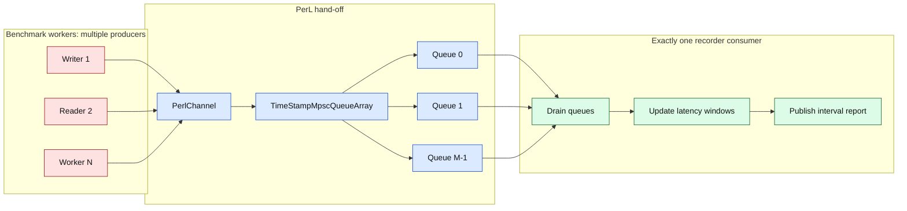

`CQueuePerl` creates one `TimeStampMpscQueueChannel` per configured worker by
default. Each channel contains several queues, and a worker-local index rotates
submissions across them. One recorder drains all channels. Queue sharding
distributes producer writes across more head/tail locations; it does not create
multiple latency-window consumers.

Source trail:

1. [`CQueuePerl`](../perl/src/main/java/io/perl/api/impl/CQueuePerl.java)
   selects the intrusive or JDK-backed channel.
2. [`TimeStampMpscQueueArray`](../perl/src/main/java/io/perl/api/impl/TimeStampMpscQueueArray.java)
   owns the indexed queues.
3. [`PerformanceRecorderIdleBusyWait`](../perl/src/main/java/io/perl/api/impl/PerformanceRecorderIdleBusyWait.java)
   is the single queue consumer.

## 3. Data representation: one object versus two

### 3.1 Intrusive PerL representation

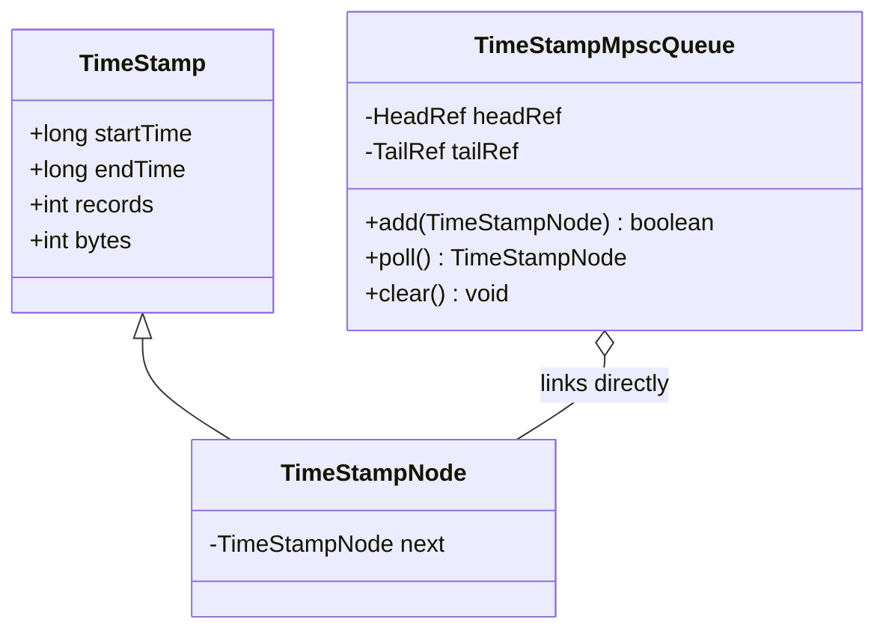

The producer constructs one `TimeStampNode`. Its inherited fields are the
measurement payload; its `next` field is the queue link. `add` does not create
a wrapper.

### 3.2 JDK fallback representation

The following diagram is conceptual. `ConcurrentLinkedQueue.Node` is a private
JDK implementation type and is not part of the public API.

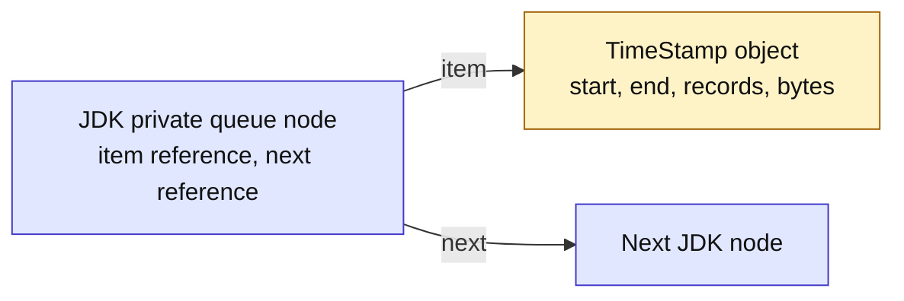

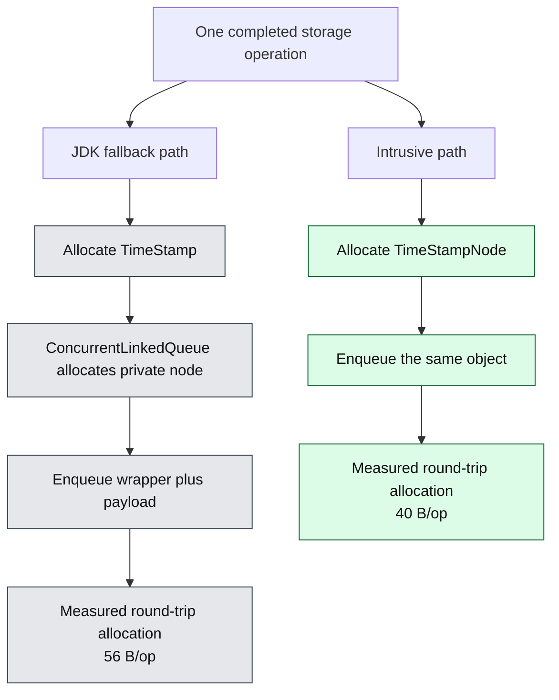

The 40 and 56 byte values are observations from the controlled JMH run
documented in Section 10. Object size depends on VM layout, alignment, pointer
compression, and flags; it is not a Java language constant.

## 4. State and ownership

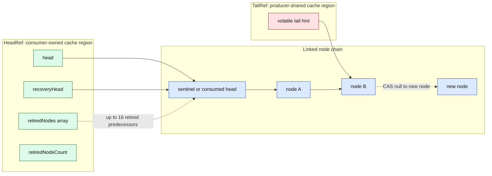

The state is split into padded `HeadRef` and `TailRef` holders:

- only the consumer writes `head`, `retiredNodes`, and `retiredNodeCount`;
- producers share the `tail` hint and node `next` links;
- `recoveryHead` is release-published by the consumer and acquire-read by a
  producer that encounters a retired self-link;
- padding attempts to keep producer and consumer state on different cache
  lines. It is an implementation hint, not a Java-level cache-line guarantee.

The queue starts with one sentinel. The sentinel simplifies empty/non-empty
transitions because `head` always identifies a node and the first real element
is `head.next`.

## 5. Producer algorithm and linearization

### 5.1 Normal enqueue

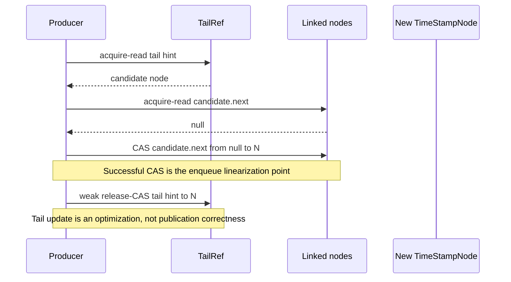

The successful `NEXT.compareAndSet(current, null, newNode)` is the enqueue
linearization point. Before that CAS, another thread cannot reach the new node
from the queue. After it succeeds, the node is in the FIFO chain even if the
best-effort tail update fails.

### 5.2 Contended enqueue

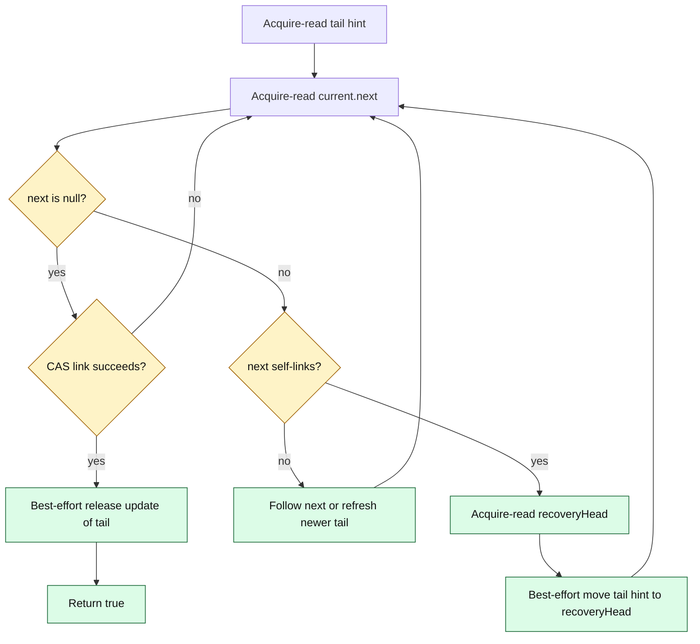

If a producer loses the link CAS, some other producer has linked a node and
therefore the system has made progress. The losing producer follows the chain
or refreshes the tail hint and retries. This is a lock-free system-progress
argument; it is not a wait-free per-thread bound. One producer may retry
indefinitely under adversarial scheduling.

## 6. Consumer algorithm

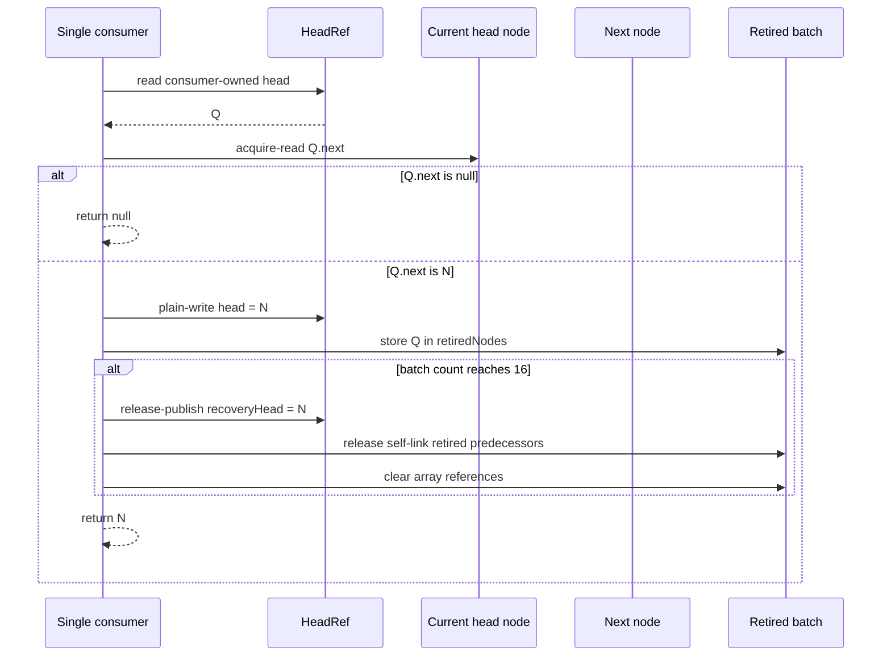

Only one consumer may call `poll` or `clear`. Because there is no competing
consumer, advancing `head` is a plain owner-thread write rather than a head
CAS. The acquire read of `currentHead.next` observes the fields initialized by
the producer before publication.

The node returned by `poll` becomes the new head sentinel while also carrying
the returned timestamp. It must never be enqueued again.

## 7. Batched retirement and stale-producer recovery

Immediate self-linking of every consumed predecessor would add a release store
to every dequeue. Never unlinking predecessors would allow a producer paused on
an old node to retain a long consumed chain. The implementation groups
retirement work in batches of 16.

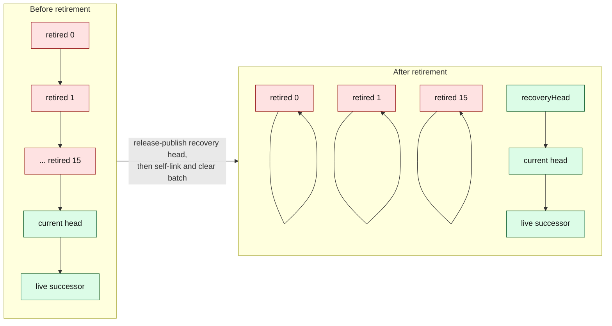

A producer may be descheduled after reading an old tail or traversal node. If
the consumer drains and retires that region before the producer resumes, the
producer reads `next == current`. This self-link is a recovery marker, not a
queue cycle:

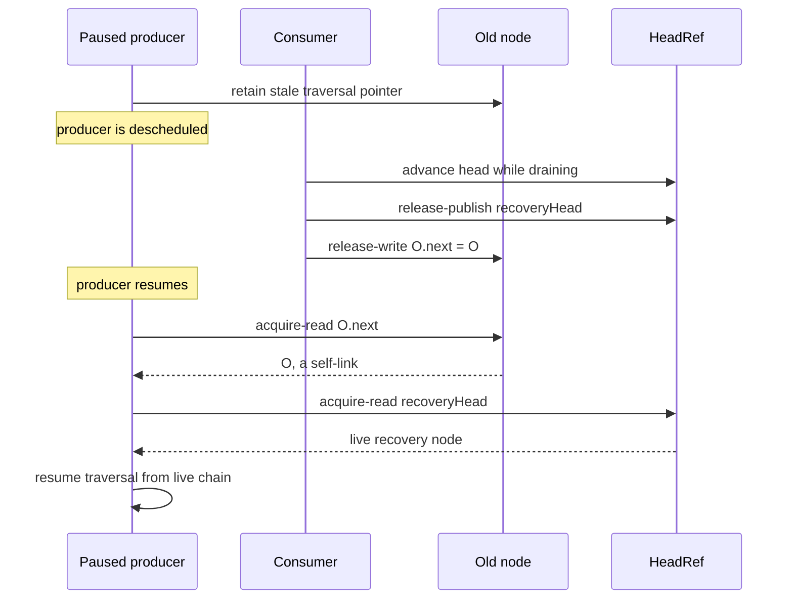

The ordering of retirement matters: the consumer publishes a live recovery
head before it creates self-links. A producer that observes a self-link can
therefore acquire a recovery point that was made available first.

The implementation clears each `retiredNodes` array slot after self-linking.
This avoids retaining the retired object through the helper array. At most 15
not-yet-retired predecessors remain in the current partial batch.

## 8. Java Memory Model argument

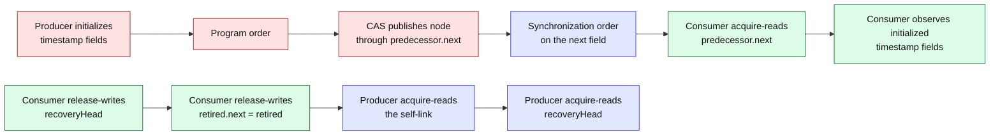

The queue uses JDK `VarHandle`, not `sun.misc.Unsafe`:

| Shared location | Producer operation | Consumer operation | Purpose |
|---|---|---|---|
| `node.next` | acquire read and compare-and-set | acquire read; release self-link on retirement | Publish and consume nodes; mark retired nodes |
| `tailRef.tail` | acquire read and weak release CAS | none | Traversal hint only |
| `headRef.recoveryHead` | acquire read after self-link | release write before self-link | Recover stale producers |
| `headRef.head` | none | plain read/write | Single-consumer ownership |

The argument relies on the JDK 25 `VarHandle` acquire/release and
compare-and-set semantics cited in the references. Tests can find violations;
they are not a substitute for a complete mechanized proof.

## 9. Feature comparison with JDK ConcurrentLinkedQueue

| Property | `TimeStampMpscQueue` | JDK 25 `ConcurrentLinkedQueue` |
|---|---|---|
| Intended role | PerL timestamp hand-off | General concurrent collection |
| Element type | Exactly `TimeStampNode` | Any non-null reference type |
| Producers | Multiple | Multiple |
| Consumers | Exactly one | Multiple |
| FIFO | Yes; per-producer order and successful-link order | Yes |
| Progress | Lock-free enqueue; owner-only dequeue | Non-blocking general queue |
| Queue allocation during enqueue | None after caller creates intrusive node | Private JDK node per offered element |
| Measurement objects per operation | One `TimeStampNode` | One `TimeStamp` plus one private node |
| Consumer head update | Plain owner write | General multi-consumer coordination |
| Tail | Best-effort traversal hint | Best-effort traversal hint |
| Stale traversal recovery | Batched self-links plus published recovery head | Self-links and JDK traversal recovery |
| Retired-node policy | Batch of 16 predecessors | General-purpose head advancement and unlinking |
| Interior dead-node cleanup | Not needed; removal is unsupported | Supported by traversal/unlink behavior |
| Iteration | Unsupported | Weakly consistent iterator |
| `remove(Object)` and bulk operations | Unsupported | Supported |
| `size()` | Unsupported | Supported but requires traversal |
| Serialization | Unsupported | Supported |
| Public interface | PerL's three-method `io.perl.api.Queue` | Java Collections `java.util.Queue` |
| Portability risk | Custom algorithm must be revalidated on JVM changes | Maintained and tested with the JDK |

The two classes sharing the name `Queue` can be confusing.
`TimeStampMpscQueue` implements SBK's minimal
[`io.perl.api.Queue`](../perl/src/main/java/io/perl/api/Queue.java), which
contains only `add`, `poll`, and `clear`. It does **not** implement
`java.util.Queue`.

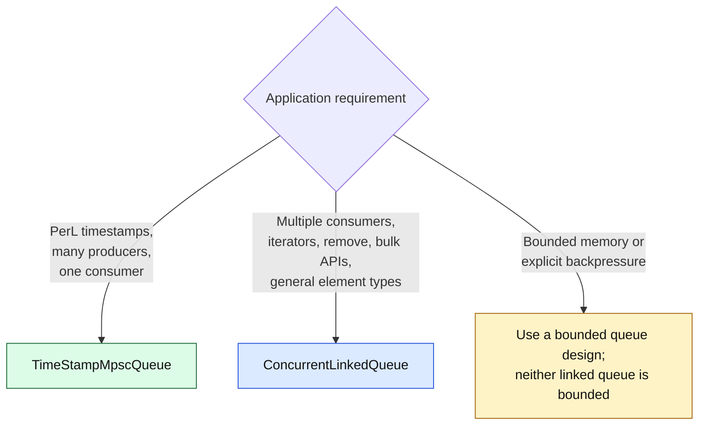

## 10. Performance evaluation

### 10.1 Benchmarks

[`TimeStampQueueBenchmark`](../perl/src/jmh/java/io/perl/benchmark/TimeStampQueueBenchmark.java)
contains two complementary experiments:

1. **Round trip:** one thread allocates a measurement, enqueues it, and polls
   it. This isolates end-to-end queue latency and normalized allocation.
2. **Contended MPSC:** four producer threads and one consumer share a queue.
   The consumer drains up to eight records and briefly parks after an empty
   poll, matching PerL's non-spinning idle behavior.

The verification task uses three isolated JVM forks, three one-second warm-up
iterations, five one-second measurement iterations, JMH's GC profiler, and
99.9% confidence intervals.

### 10.2 Reproducible run on 2026-07-27

Environment:

| Variable | Value |
|---|---|
| Host | VMware virtual machine |
| CPU allocation | 16 vCPUs, Intel Xeon Platinum 8462Y+ |
| Memory | 61 GiB |
| OS | Linux 5.15.0-181-generic, x86-64 |
| JVM | Oracle HotSpot 25.0.2+10-LTS-69 |
| GC and layout | ZGC, compact object headers enabled |
| JMH | 1.37 |
| JVM options | `-XX:+UseZGC -XX:+UseCompactObjectHeaders -XX:MaxRAMPercentage=50.0 -XX:+DisableExplicitGC -XX:+ExitOnOutOfMemoryError` |

Command:

```bash
./gradlew :perl:timeStampQueuePerformanceTest
```

Results:

| Metric | `TimeStampMpscQueue` | JDK `ConcurrentLinkedQueue` path | Relative result |
|---|---:|---:|---:|
| Round-trip latency | 34.208 ns/op | 47.107 ns/op | 27.38% lower |
| Round-trip normalized allocation | 40.000 B/op | 56.000 B/op | 28.57% lower |
| Four-producer producer throughput | 5,406,094 ops/s | 5,557,486 ops/s | 2.72% lower |
| Producer-throughput 99.9% CI | 5,317,109 to 5,495,078 | 5,248,995 to 5,865,977 | intervals overlap |

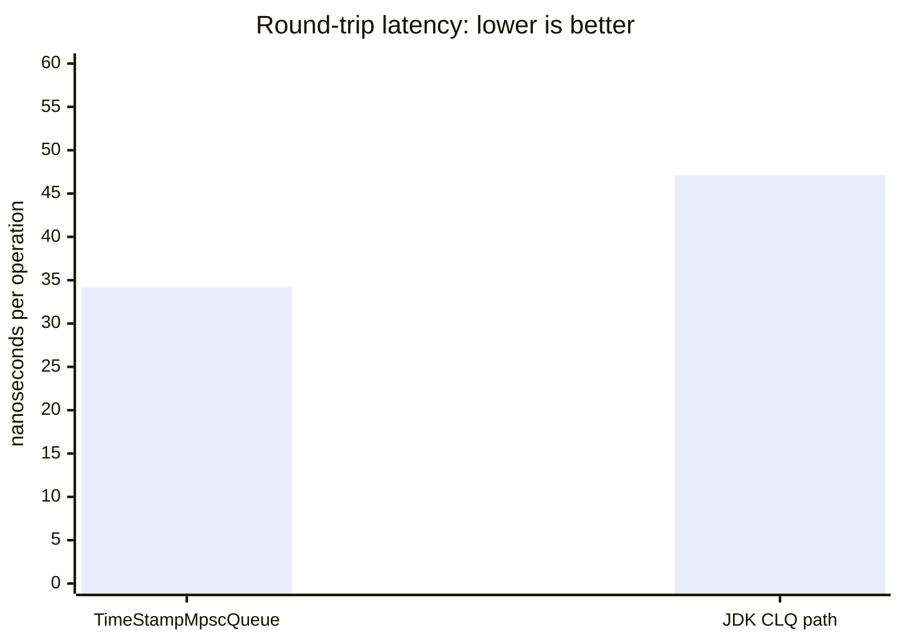

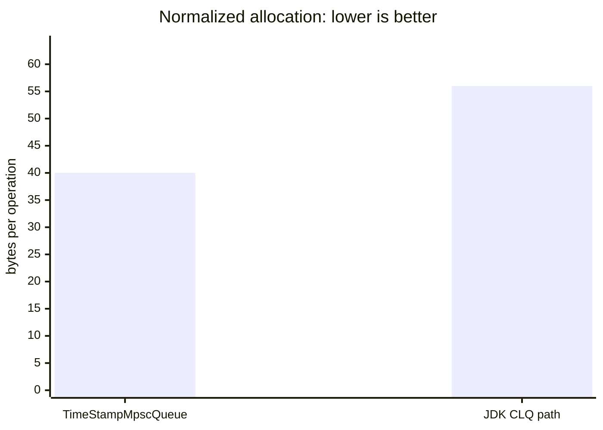

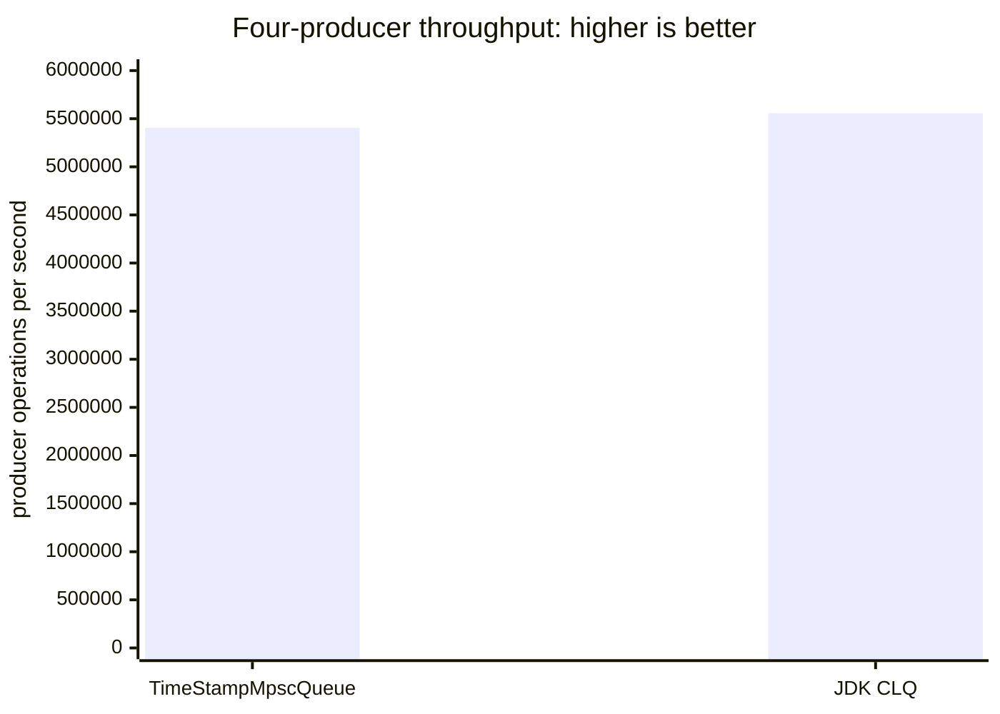

### 10.3 Interpretation

The allocation result directly supports the intrusive-object hypothesis:
removing the JDK wrapper node saved 16 normalized bytes for each complete
measurement round trip on this VM configuration.

The latency result favored the intrusive queue in this run. Fewer allocations,
a narrower API, a single-consumer head, and separated head/tail state are
plausible contributing mechanisms. The benchmark establishes correlation
under this setup; it does not isolate the contribution of each mechanism.

The contended producer-throughput result did **not** favor the intrusive queue.
The JDK path was 2.72% faster by point estimate, but the wide, overlapping
99.9% confidence intervals do not resolve a statistically clear winner. The
Gradle verification consequently failed its policy gate requiring the
intrusive producer metric to exceed the JDK metric by at least 2%.

This outcome is important:

- lower allocation is a stable structural advantage for the compared paths;
- lower round-trip latency was observed on this host;
- higher MPSC throughput must not be presented as universal;
- virtualization, scheduling, NUMA placement, CPU frequency, JIT decisions,
  GC phase, and producer/consumer balance can change throughput;
- a successful verification run is evidence for that environment, not proof
  that one implementation dominates all environments.

### 10.4 Recommended experimental protocol

For publishable comparisons:

1. Pin the JVM and benchmark threads to declared physical cores.
2. Record SMT, NUMA, frequency governor, turbo state, microcode, kernel, JVM
   build, GC, heap, and compact-header setting.
3. Run bare metal when possible; otherwise report hypervisor noise.
4. Preserve JMH JSON rather than copying only aggregate console values.
5. Compare normalized allocation (`gc.alloc.rate.norm`), not only MB/s.
   A faster implementation can allocate more MB/s while allocating fewer bytes
   per operation.
6. Repeat across producer counts such as 1, 2, 4, 8, and 16 with one consumer.
7. Add queue-depth distributions and consumer service-time distributions.
8. Report confidence intervals and effect sizes; do not rank overlapping
   estimates without an explicit statistical model.
9. Run end-to-end SBK workloads in addition to microbenchmarks. A nanosecond
   queue result may be immaterial for a millisecond storage operation.
10. Retain correctness gates independently of performance outcomes.

## 11. Correctness and reclamation evidence

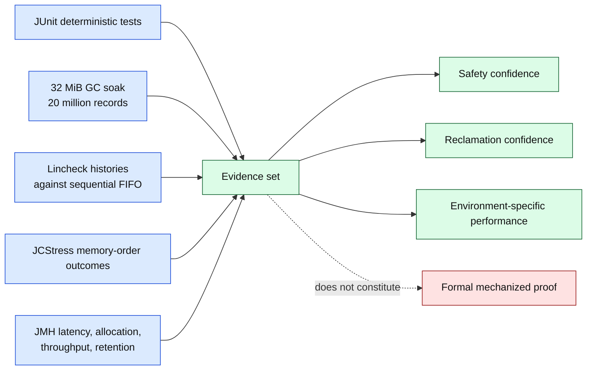

| Property under test | Evidence |
|---|---|
| FIFO and element identity | `TimeStampMpscQueueTest` |
| Multiple producer delivery | `TimeStampMpscQueueTest` |
| Per-producer ordering | Unit, Lincheck, and JCStress tests |
| Publication visibility | `TimeStampMpscQueuePublicationStress` |
| Two-producer ordering outcomes | `TimeStampMpscQueueProducerOrderStress` |
| Linearizable MPSC histories | `TimeStampMpscQueueLincheckTest` |
| Stale producer recovery | Deterministic paused-producer unit tests |
| Bounded partial retired batch | Reclamation tests and constrained-heap soak |
| Prompt release of consumed nodes | Weak-reference and constrained-heap tests |
| Relative latency and allocation | JMH `timeStampQueuePerformanceTest` |

Commands:

```bash
./gradlew :perl:test
./gradlew :perl:timeStampMpscQueueGcTest
./gradlew :perl:lincheckTest
./gradlew :perl:jcstress
./gradlew :perl:concurrencyCheck
./gradlew :perl:timeStampQueuePerformanceTest
```

Lincheck and JCStress are complementary. Lincheck searches operation histories
for violations of a sequential FIFO model. JCStress samples Java Memory Model
outcomes and can expose publication or reordering errors. Neither can enumerate
all executions of an unbounded concurrent system.

## 12. Limitations and threats to validity

1. **Single-consumer requirement.** A second consumer creates a data race on
   `head` and invalidates the design.
2. **Single-use nodes.** Re-enqueueing a consumed node can create cycles or ABA
   hazards and is forbidden.
3. **Unbounded capacity.** If producers permanently exceed recorder capacity,
   memory grows. Queue sharding is not backpressure.
4. **No general collection semantics.** Iteration, arbitrary removal, multiple
   consumers, and bulk operations require a different queue.
5. **Lock-free is not wait-free.** Overall enqueue progress does not guarantee
   bounded completion time for every producer.
6. **One allocation remains.** Intrusion removes the wrapper, not the timestamp
   object. Object pooling was rejected because it retains memory, complicates
   ownership, and introduces reuse/ABA risks.
7. **Consumer bottleneck.** PerL's one recorder owns the latency windows and
   ultimately limits drain capacity.
8. **Padding is heuristic.** Java does not promise that the declared padding
   maps to exact hardware cache-line boundaries.
9. **Microbenchmark scope.** JMH measures the queue paths, not storage-system
   latency or complete SBK scalability.
10. **JDK evolution.** Object layout, JIT compilation, garbage collectors, and
    `ConcurrentLinkedQueue` implementation details may change. Re-run the full
    evidence suite for each supported JDK.

## 13. References

### Foundational research

1. M. M. Michael and M. L. Scott, "Simple, Fast, and Practical
   Non-Blocking and Blocking Concurrent Queue Algorithms," *Proceedings of the
   15th ACM Symposium on Principles of Distributed Computing*, pp. 267-275,
   1996. [DOI: 10.1145/248052.248106](https://doi.org/10.1145/248052.248106);
   [author-hosted PDF](https://www.cs.rochester.edu/u/scott/papers/1996_PODC_queues.pdf).
2. M. P. Herlihy and J. M. Wing, "Linearizability: A Correctness Condition
   for Concurrent Objects," *ACM Transactions on Programming Languages and
   Systems*, vol. 12, no. 3, pp. 463-492, 1990.
   [DOI: 10.1145/78969.78972](https://doi.org/10.1145/78969.78972);
   [author-hosted PDF](https://www.cs.cmu.edu/~wing/publications/HerlihyWing90.pdf).

### Java platform and implementation

3. Oracle, [`ConcurrentLinkedQueue`, Java SE 25 API](https://docs.oracle.com/en/java/javase/25/docs/api/java.base/java/util/concurrent/ConcurrentLinkedQueue.html).
4. OpenJDK, [`ConcurrentLinkedQueue.java`, JDK 25 GA source](https://github.com/openjdk/jdk/blob/jdk-25-ga/src/java.base/share/classes/java/util/concurrent/ConcurrentLinkedQueue.java).
5. OpenJDK, [JEP 193: Variable Handles](https://openjdk.org/jeps/193).
6. Oracle, [`VarHandle`, Java SE 25 API](https://docs.oracle.com/en/java/javase/25/docs/api/java.base/java/lang/invoke/VarHandle.html).
7. OpenJDK, [JEP 519: Compact Object Headers](https://openjdk.org/jeps/519).

### Evaluation and concurrency testing

8. OpenJDK, [Java Microbenchmark Harness](https://github.com/openjdk/jmh).
9. OpenJDK, [Java Concurrency Stress tests](https://openjdk.org/projects/code-tools/jcstress/).
10. JetBrains, [Lincheck](https://github.com/JetBrains/lincheck) and
    [result validation](https://kotlinlang.org/docs/lincheck-results-validation.html).

### SBK implementation evidence

11. [`TimeStampNode`](../perl/src/main/java/io/perl/api/TimeStampNode.java).
12. [`TimeStampMpscQueue`](../perl/src/main/java/io/perl/api/impl/TimeStampMpscQueue.java).
13. [`TimeStampQueueBenchmark`](../perl/src/jmh/java/io/perl/benchmark/TimeStampQueueBenchmark.java).
14. [`TimeStampMpscQueueTest`](../perl/src/test/java/io/perl/api/impl/TimeStampMpscQueueTest.java).
15. [`TimeStampMpscQueueLincheckTest`](../perl/src/lincheck/java/io/perl/api/impl/TimeStampMpscQueueLincheckTest.java).
16. [`TimeStampMpscQueuePublicationStress`](../perl/src/jcstress/java/io/perl/api/impl/TimeStampMpscQueuePublicationStress.java).
17. [`TimeStampMpscQueueProducerOrderStress`](../perl/src/jcstress/java/io/perl/api/impl/TimeStampMpscQueueProducerOrderStress.java).
