<!--
Copyright (c) KMG. All Rights Reserved.

Licensed under the Apache License, Version 2.0 (the "License");
you may not use this file except in compliance with the License.
You may obtain a copy of the License at

    http://www.apache.org/licenses/LICENSE-2.0

Unless required by applicable law or agreed to in writing, software
distributed under the License is distributed on an "AS IS" BASIS,
WITHOUT WARRANTIES OR CONDITIONS OF ANY KIND, either express or implied.
See the License for the specific language governing permissions and
limitations under the License.
-->

# TimeStampMpscQueue: architecture, correctness, and performance

**System:** Storage Benchmark Kit (SBK) 10.4, Performance Logger (PerL)

**Implementation baseline:** JDK 25 `ConcurrentLinkedQueue`

**Evaluation date:** 2026-07-27

**Keywords:** MPSC queue, lock-free queue, intrusive data structure, Java
Memory Model, VarHandle, garbage collection, low latency, throughput,
microbenchmarking

## Abstract

`TimeStampMpscQueue` is the specialized hand-off queue used by SBK's
Performance Logger (PerL). Many benchmark workers publish completed-operation
timestamps, while exactly one recorder consumes them and updates latency
windows. The queue exploits this multiple-producer, single-consumer (MPSC)
contract instead of implementing every operation and concurrency pattern
supported by JDK `ConcurrentLinkedQueue`.

The central optimization is **intrusive representation**. A `TimeStampNode` is
both the measurement and its linked-queue node. The JDK fallback stores a
`TimeStamp` inside a second, private `ConcurrentLinkedQueue.Node`. On the JDK
25 runtime measured in this repository, the complete intrusive round trip
allocates 40 bytes instead of 56 bytes per measurement.

On the declared 16-vCPU JDK 25 host, the intrusive queue measured 30.36% lower
round-trip latency and 6.74% higher four-producer enqueue throughput than the
CLQ path. End-to-end PerlBench runs also showed higher saturation throughput
and lower peak resident memory. These are environment-specific observations,
not claims of universal superiority; the structural removal of one wrapper
object per record is the portable design result.

This document is intended for graduate students, researchers, performance
engineers, and reviewers of concurrent algorithms. It distinguishes:

- the queue's required contract from properties it does not provide;
- safety arguments from empirical testing;
- deterministic allocation differences from environment-sensitive throughput;
- implementation evidence from general performance claims.

The paper makes four concrete contributions:

1. it derives a minimal queue contract from PerL's actual producer-consumer
   topology instead of beginning with the Java Collections API;
2. it presents a field-level and operation-level comparison with the JDK 25
   `ConcurrentLinkedQueue` implementation;
3. it explains which CLQ mechanisms were retained, specialized, or rejected,
   including the one-node tail-slack optimization;
4. it reports correctness, reclamation, allocation, latency, throughput, and
   end-to-end SBK evidence with explicit threats to validity.

The authoritative implementation is
[`TimeStampMpscQueue.java`](../perl/src/main/java/io/perl/api/impl/TimeStampMpscQueue.java).

## 1. Research question and scope

SBK measures storage operations that may complete at millions of operations per
second. Each completion contributes four values:

```text
(startTime, endTime, records, bytes)
```

The measurement transport must preserve every submitted record while adding as
little latency, allocation, cache coherence, and garbage-collection pressure as
practical.

The relevant comparison is not "which Java queue is universally better?" The
research question is narrower:

> Under PerL's MPSC, FIFO, add/poll/clear-only contract, does an intrusive
> timestamp queue reduce measurement overhead relative to placing a separate
> `TimeStamp` object in JDK 25 `ConcurrentLinkedQueue`?

JDK `ConcurrentLinkedQueue` is a general-purpose, unbounded, non-blocking FIFO
collection with multiple consumers, weakly consistent iterators, bulk
operations, interior-node deletion, serialization, and the complete Java
Collections `Queue` contract. `TimeStampMpscQueue` deliberately does not
provide those features [3, 4].

### 1.1 Hypotheses

The implementation and evaluation test three hypotheses:

- **H1 -- allocation:** representing the measurement and queue link with one
  intrusive object removes the JDK queue's private wrapper allocation;
- **H2 -- latency:** specializing dequeue for one consumer and reducing shared
  metadata updates lowers queue round-trip latency;
- **H3 -- throughput:** fewer allocations and less producer/consumer cache
  coherence traffic increase sustainable MPSC publication throughput.

H1 follows structurally from the object graphs and is verified with JMH
normalized allocation. H2 and H3 are empirical and must be re-measured on each
relevant JVM and machine.

### 1.2 Terminology and observation boundary

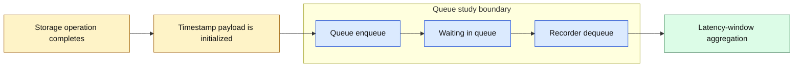

In this document:

- **payload** means the four measurement fields;
- **wrapper node** means CLQ's private structural `Node`;
- **intrusive node** means a payload object that also contains its queue link;
- **live node** means reachable queue state not yet consumed;
- **retired node** means a consumed predecessor awaiting or completing
  detachment;
- **linearization point** means the single atomic event at which an operation
  appears to take effect;
- **storage allocation** means heap storage allocated by the timestamp hand-off
  path, not bytes written to the benchmarked storage system.

## 2. Position in the PerL measurement pipeline

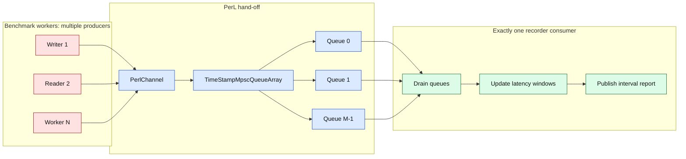

`CQueuePerl` creates one `TimeStampMpscQueueChannel` per configured worker by
default. Each channel contains several queues, and a worker-local index rotates
submissions across them. One recorder drains all channels. Queue sharding
distributes producer writes across more head/tail locations; it does not create
multiple latency-window consumers.

Source trail:

1. [`CQueuePerl`](../perl/src/main/java/io/perl/api/impl/CQueuePerl.java)
   selects the intrusive or JDK-backed channel.
2. [`TimeStampMpscQueueArray`](../perl/src/main/java/io/perl/api/impl/TimeStampMpscQueueArray.java)
   owns the indexed queues.
3. [`PerformanceRecorderElasticWait`](../perl/src/main/java/io/perl/api/impl/PerformanceRecorderElasticWait.java)
   is the single queue consumer.

## 3. Data representation: one object versus two

### 3.1 Intrusive PerL representation

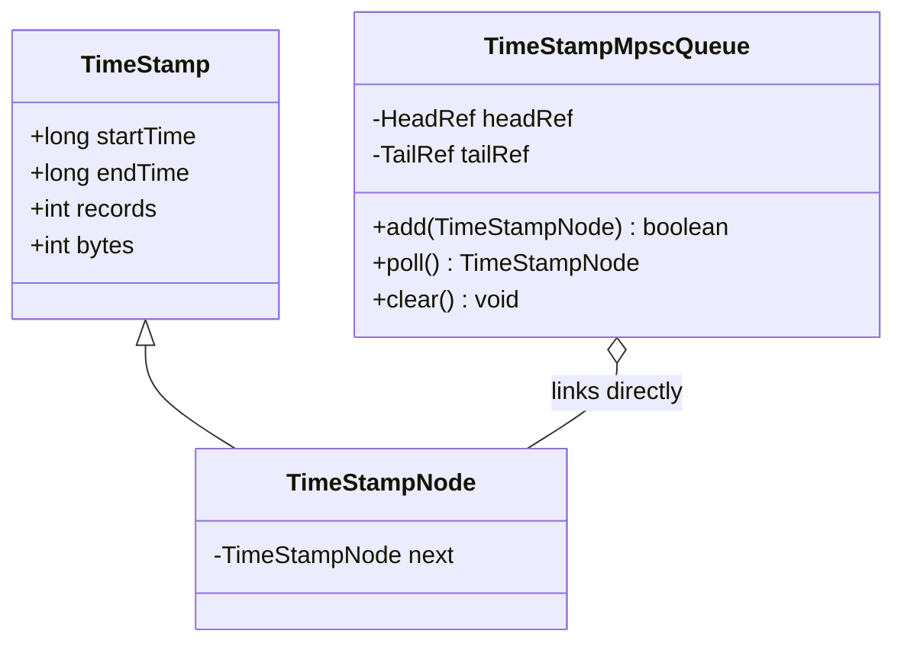

The producer constructs one `TimeStampNode`. Its inherited fields are the
measurement payload; its `next` field is the queue link. `add` does not create
a wrapper.

### 3.2 JDK fallback representation

The following diagram is conceptual. `ConcurrentLinkedQueue.Node` is a private
JDK implementation type and is not part of the public API.

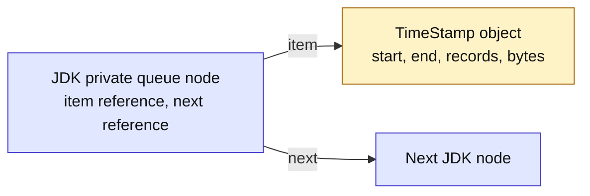

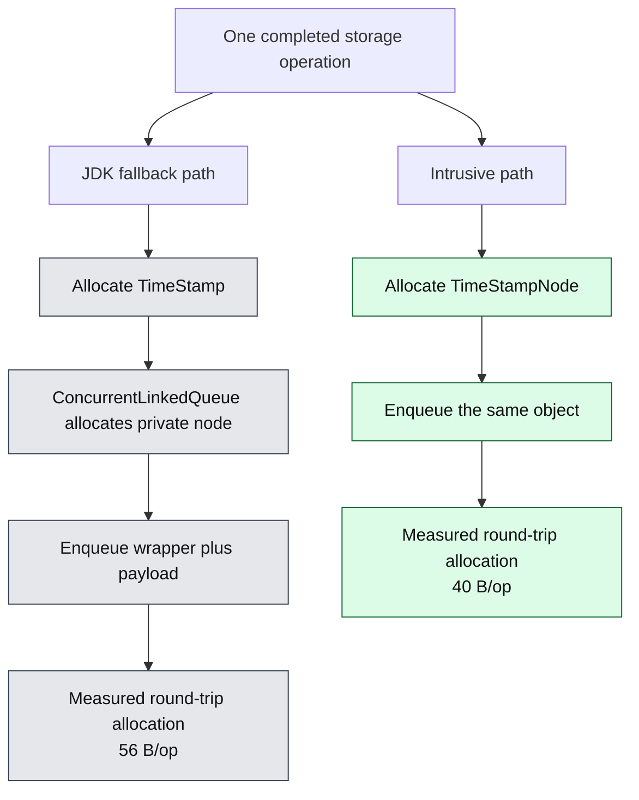

The 40 and 56 byte values are observations from the controlled JMH run
documented in Section 10. Object size depends on VM layout, alignment, pointer
compression, and flags; it is not a Java language constant.

### 3.3 Field-level storage model

The following table describes logical fields rather than promising a fixed
physical layout. HotSpot may change headers, alignment, and reference width.

| Object | Logical content | Intrusive path | JDK path |
|---|---|---:|---:|
| Timestamp payload | two `long` values and two `int` values | one instance | one instance |
| Queue link | one node reference | inside `TimeStampNode` | inside private CLQ `Node` |
| Payload indirection | reference from wrapper to payload | none | one `item` reference |
| Structural object header | header for queue node object | shared with payload | additional header |
| Enqueue-time queue allocation | allocation performed inside queue | none | one private CLQ `Node` |

For `n` measurements, ignoring the one-time sentinel and VM alignment:

```text
intrusive object count(n) = n
JDK path object count(n)  = 2n
object-count reduction    = n, or 50% of the JDK path's per-record objects
```

The measured byte model on the declared JDK 25 configuration is:

```text
intrusive allocation(n) = 40n bytes
JDK path allocation(n)  = 56n bytes
saved allocation(n)     = 16n bytes
```

At one million records per second this corresponds to approximately 16 MB/s
less normalized allocation; at ten million records per second it corresponds
to approximately 160 MB/s less. These are decimal-rate illustrations derived
from the measured 16 B/op difference, not universal object sizes.

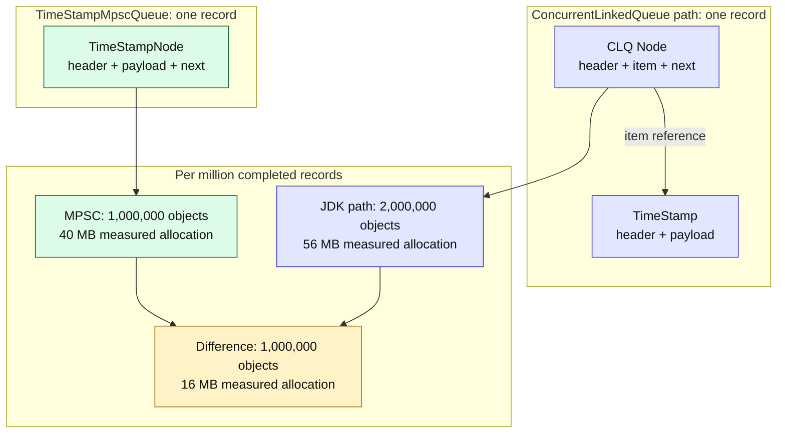

### 3.4 Why object count matters to a latency recorder

Allocation in a thread-local allocation buffer is usually cheap, but the
allocated objects are not free over their complete lifetime. More objects
consume allocation bandwidth, increase the rate at which allocation regions
fill, add references for the collector to trace or relocate, and increase
memory traffic. A linked wrapper also adds a pointer dereference from
`Node.item` to `TimeStamp`.

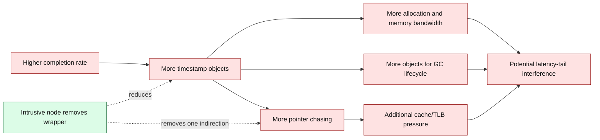

This does not mean every allocation immediately triggers a stop-the-world
collection, nor that allocation alone determines latency. It means the wrapper
is avoidable work in PerL's fixed data model, so removing it lowers the amount
of work presented to the allocator, memory hierarchy, and collector.

## 4. State and ownership

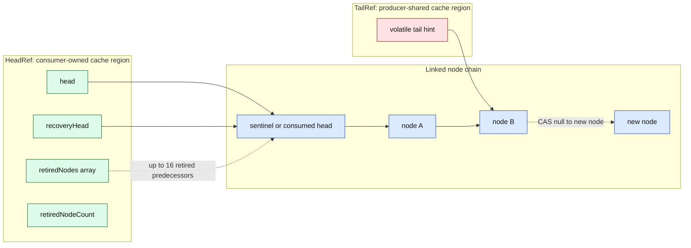

The state is split into padded `HeadRef` and `TailRef` holders:

- only the consumer writes `head`, `retiredNodes`, and `retiredNodeCount`;
- producers share the `tail` hint and node `next` links;
- `recoveryHead` is release-published by the consumer and acquire-read by a
  producer that encounters a retired self-link;
- padding attempts to keep producer and consumer state on different cache
  lines. It is an implementation hint, not a Java-level cache-line guarantee.

The queue starts with one sentinel. The sentinel simplifies empty/non-empty
transitions because `head` always identifies a node and the first real element
is `head.next`.

### 4.1 JDK CLQ internal state

JDK 25 CLQ is a modified Michael-Scott queue adapted to garbage collection and
interior deletion. Each private node has a volatile `item` and volatile
`next`. The queue has independently advancing volatile `head` and `tail`
pointers. A node may remain structurally linked after its item has been
logically removed by changing `item` to `null` [1, 4].

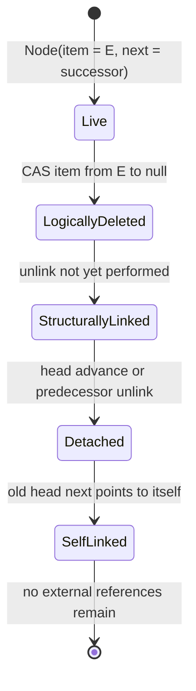

The separate `item` field is essential to CLQ's multi-consumer and arbitrary
removal contract: a successful CAS from a non-null item to `null` decides which
consumer or remover owns the element. It is also the source of the structural
wrapper that PerL can eliminate.

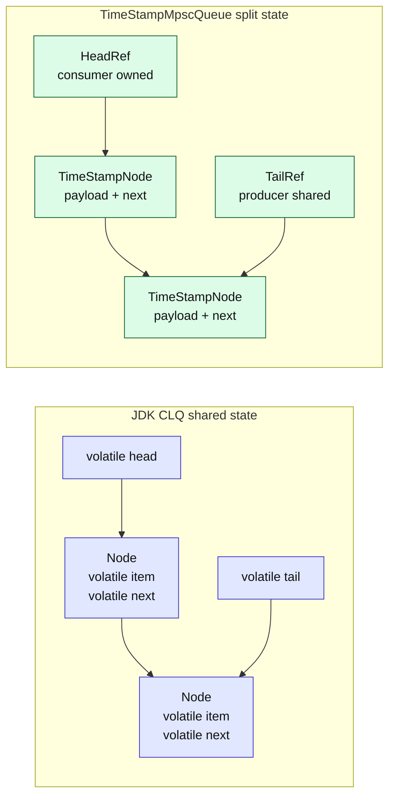

CLQ places `head` and `tail` as fields of the same queue object and relies on
the JVM's layout decisions. `TimeStampMpscQueue` places producer-shared and
consumer-owned state in separately padded holder objects. Padding reduces the
chance of false sharing but is deliberately described as a heuristic because
the Java language does not guarantee cache-line placement.

### 4.2 Ownership specialization

| State transition | JDK CLQ reason | PerL specialization |
|---|---|---|
| Claim an item | Multiple consumers/removers may race | Exactly one consumer; no claim CAS |
| Advance head | Multiple threads may update head | Consumer-owned plain head write |
| Update tail | Producers race; tail is a hint | Same principle, with one-node slack |
| Remove interior item | Required by Collection APIs | Unsupported and unnecessary |
| Traverse dead nodes | Required by iteration, removal, and MPMC polling | FIFO consumer sees only the next link |
| Recover stale traversal | Self-link means restart from head | Self-link means use newer tail or published recovery head |

The specialization does not make CLQ's mechanisms defective. It removes
mechanisms whose preconditions cannot occur in the PerL topology.

## 5. Producer algorithm and linearization

### 5.1 Normal enqueue

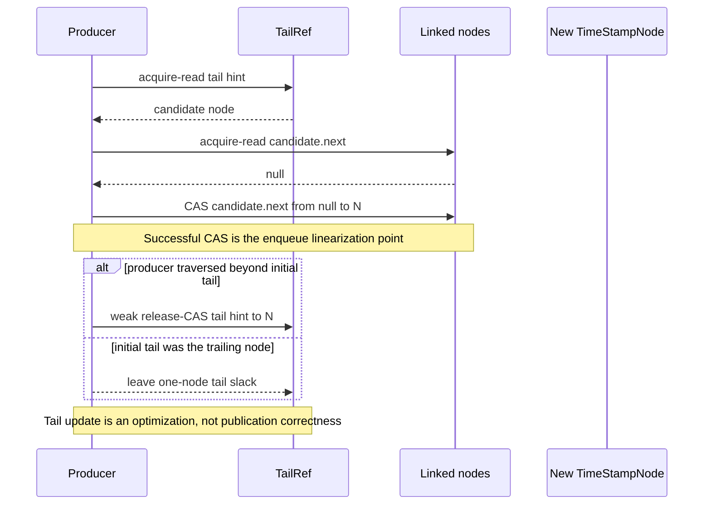

The successful `NEXT.compareAndSet(current, null, newNode)` is the enqueue
linearization point. Before that CAS, another thread cannot reach the new node
from the queue. After it succeeds, the node is in the FIFO chain even if the
best-effort tail update fails. Following JDK 25 `ConcurrentLinkedQueue`, the
queue deliberately leaves one-node tail slack when the producer appended
directly to its initial tail candidate. The next producer traverses that one
node and then advances the tail. This approximately halves tail compare-and-set
traffic in the uncontended path and reduces cache-line invalidation among
producers [2, 4].

### 5.2 Contended enqueue

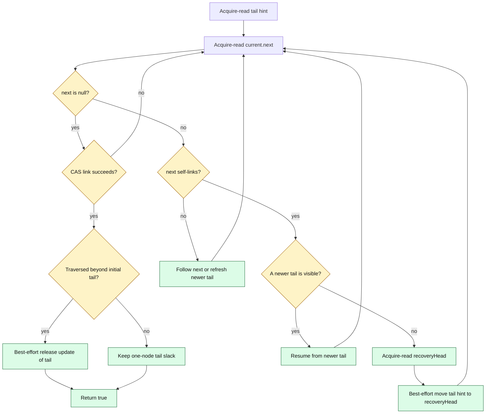

If a producer loses the link CAS, some other producer has linked a node and
therefore the system has made progress. The losing producer follows the chain
or refreshes the tail hint and retries. This is a lock-free system-progress
argument; it is not a wait-free per-thread bound. One producer may retry
indefinitely under adversarial scheduling.

### 5.3 Enqueue comparison and adopted CLQ optimization

Both implementations publish a new node by CASing the final node's `next`
from `null` to the new node. Both treat `tail` as a traversal hint rather than
the source of correctness. The important differences occur before and after
that shared linearization point.

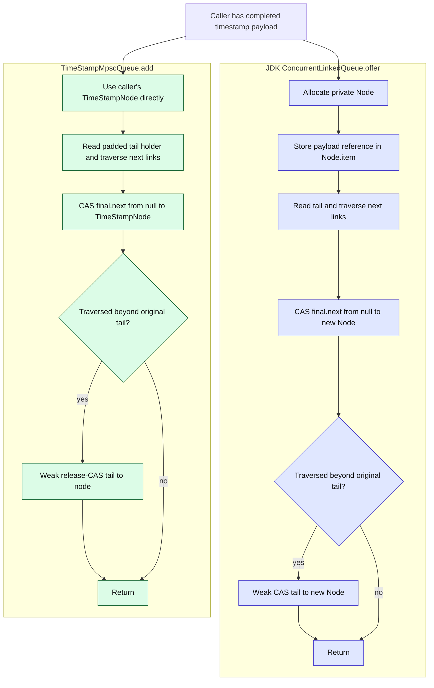

The **one-node tail-slack** mechanism was taken from JDK 25 CLQ because it is
independent of the MPMC Collection features:

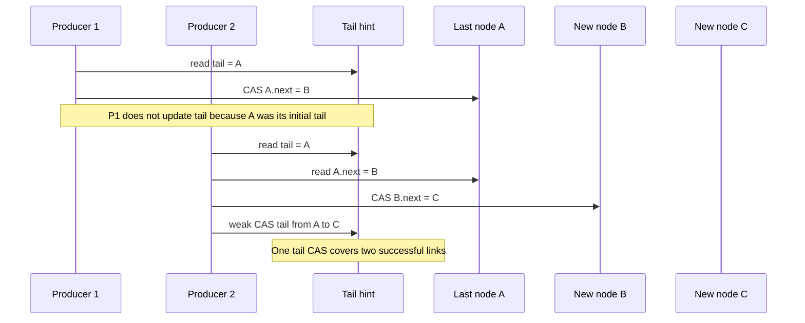

The former SBK implementation attempted a shared tail update after every
successful link. Tail slack changes the common sequence from approximately one
link CAS plus one tail CAS per record to one link CAS per record plus one
best-effort tail CAS for approximately every two links. The exact hardware cost
depends on contention and architecture, but removing atomic writes to a
producer-shared cache line gives a direct mechanism for the observed throughput
improvement.

## 6. Consumer algorithm

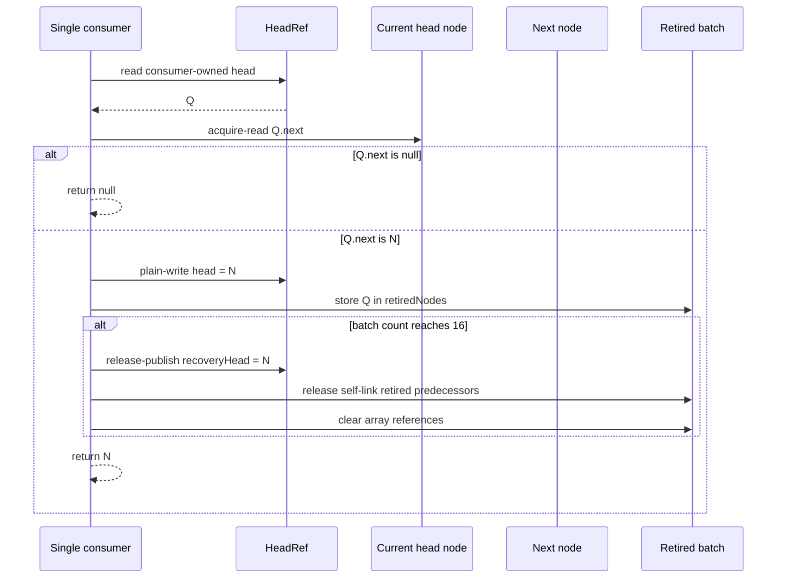

Only one consumer may call `poll` or `clear`. Because there is no competing
consumer, advancing `head` is a plain owner-thread write rather than a head
CAS. The acquire read of `currentHead.next` observes the fields initialized by
the producer before publication.

The node returned by `poll` becomes the new head sentinel while also carrying
the returned timestamp. It must never be enqueued again.

### 6.1 Why CLQ poll performs more coordination

CLQ must allow several consumers, iterator removal, and `remove(Object)` to
race safely. Its element-removal linearization point is therefore a CAS of
`Node.item` from the payload reference to `null`. A polling thread may
encounter null-item nodes, lose the item CAS to another consumer, traverse
forward, attempt to advance `head`, or restart after seeing a self-link.

PerL has one recorder. It reads `head.next`, moves its owner-only head to that
node, and returns the same `TimeStampNode`. It does not atomically claim an item
because no second consumer exists.

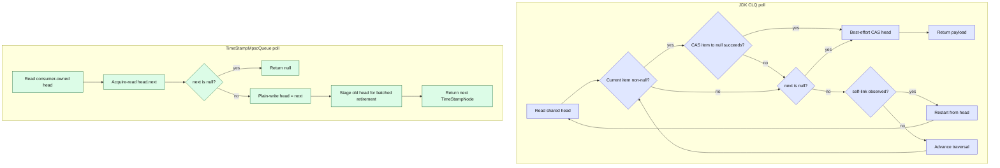

### 6.2 Hot-path operation budget

The following is a qualitative budget for successful, non-empty operations.
It is not an instruction count: retries, compiler transformations, cache
misses, and collector barriers vary.

| Hot-path work | JDK CLQ path | `TimeStampMpscQueue` |
|---|---|---|
| Producer payload allocation | `TimeStamp` | `TimeStampNode` |
| Producer structural allocation | private `Node` | none |
| Producer publication CAS | `Node.next` | `TimeStampNode.next` |
| Producer tail policy | one-node slack | one-node slack |
| Consumer payload-claim CAS | required on `Node.item` | none |
| Consumer head update | shared CAS when advanced | plain owner write |
| Consumer payload indirection | `Node.item -> TimeStamp` | returned node is payload |
| Consumer retirement | general dead-node/head logic | amortized batch of 16 |

The MPSC path shifts some retirement work into every sixteenth dequeue. This
reduces the average release-store count but introduces a small periodic burst;
Section 7 explains why the batch remains bounded.

## 7. Batched retirement and stale-producer recovery

Immediate self-linking of every consumed predecessor would add a release store
to every dequeue. Never unlinking predecessors would allow a producer paused on
an old node to retain a long consumed chain. The implementation groups
retirement work in batches of 16.

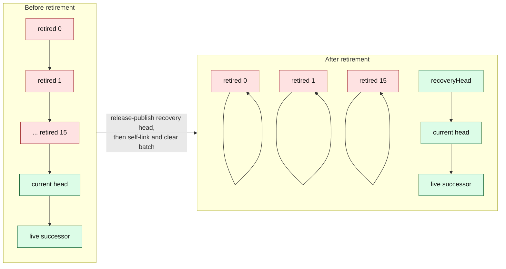

A producer may be descheduled after reading an old tail or traversal node. If
the consumer drains and retires that region before the producer resumes, the
producer reads `next == current`. This self-link is a recovery marker, not a
queue cycle:

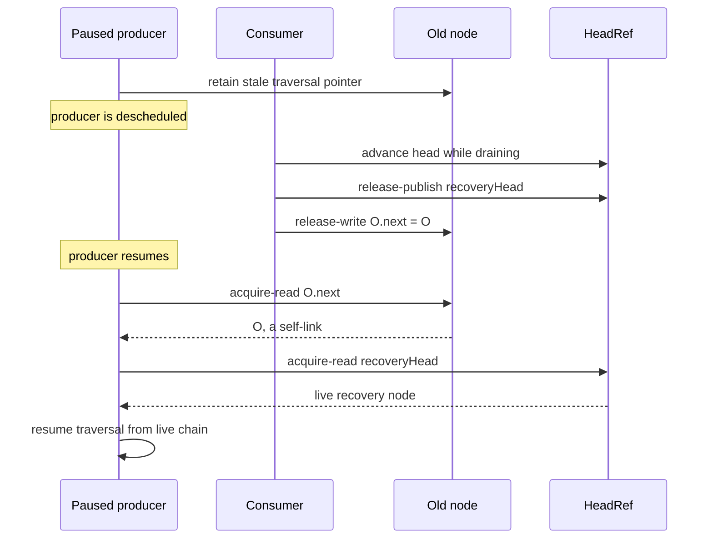

The ordering of retirement matters: the consumer publishes a live recovery
head before it creates self-links. A producer that observes a self-link can
therefore acquire a recovery point that was made available first.

The implementation clears each `retiredNodes` array slot after self-linking.
This avoids retaining the retired object through the helper array. At most 15
not-yet-retired predecessors remain in the current partial batch.

### 7.1 Reclamation differs because the payload placement differs

CLQ can logically delete an element by nulling `Node.item` while keeping the
wrapper node reachable for traversal safety. The payload may become
collectable even when the structural node remains. That distinction is useful
for MPMC traversal and interior deletion.

An intrusive node has no separate item reference to clear. If a consumed
`TimeStampNode` remains linked to the live suffix, the node itself—and
therefore its timestamp payload—remains reachable. `TimeStampMpscQueue` must
detach or self-link consumed nodes promptly rather than directly copying CLQ's
payload-nulling policy.

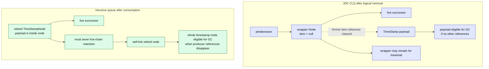

### 7.2 Why the retirement batch is 16

Batching balances two opposing costs:

- a batch of one performs a release self-link and helper cleanup on every
  dequeue;
- a very large batch retains a longer consumed prefix and creates a larger
  periodic cleanup burst;
- a batch of 16 bounds the partial retired set at 15 nodes while amortizing
  retirement stores.

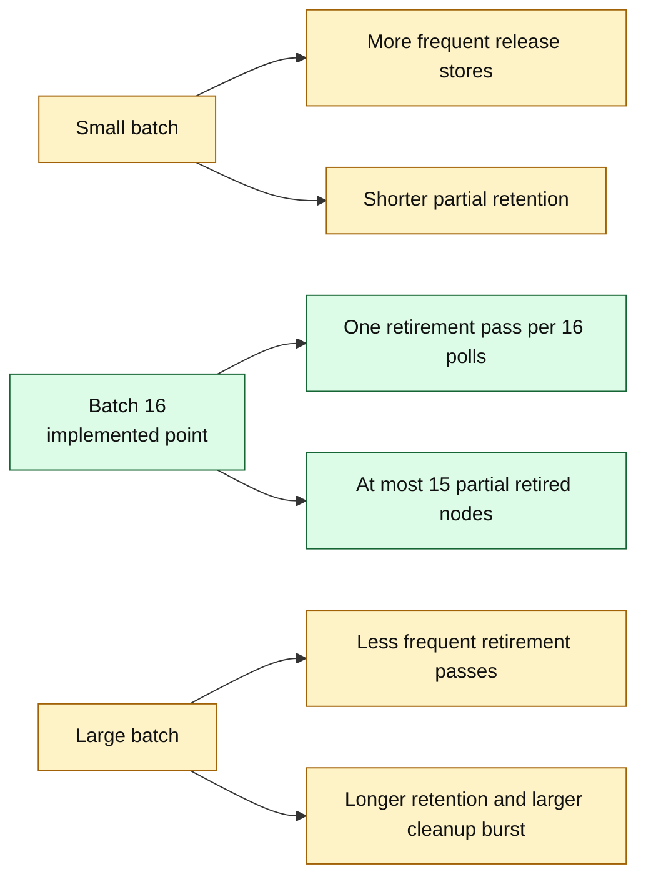

The chart is conceptual, not benchmark data. Sixteen is the implemented and
tested engineering point. Changing it requires repeating GC retention,
stale-producer, latency, and throughput tests rather than optimizing only one
metric.

### 7.3 Node lifetime comparison

```mermaid
sequenceDiagram
    participant P as Producer
    participant Q as Queue
    participant C as Consumer
    participant G as Garbage collector

    rect rgb(224, 231, 255)
        Note over P,G: JDK CLQ path
        P->>P: allocate TimeStamp
        P->>Q: offer allocates wrapper Node
        C->>Q: CAS wrapper.item to null
        Q-->>C: return TimeStamp
        Note over Q: wrapper may remain structurally reachable
        G->>G: reclaim payload and wrapper when separately unreachable
    end

    rect rgb(220, 252, 231)
        Note over P,G: Intrusive MPSC path
        P->>P: allocate TimeStampNode
        P->>Q: link same node
        C->>Q: owner-only head advance
        Q-->>C: return same TimeStampNode
        C->>Q: batch self-link consumed predecessor
        G->>G: reclaim whole node when unreachable
    end
```

## 8. Java Memory Model argument

```mermaid
flowchart LR
    I["Producer initializes<br/>timestamp fields"] --> PO["Program order"]
    PO --> CAS["CAS publishes node<br/>through predecessor.next"]
    CAS --> HB["Synchronization order<br/>on the next field"]
    HB --> ACQ["Consumer acquire-reads<br/>predecessor.next"]
    ACQ --> OBS["Consumer observes initialized<br/>timestamp fields"]

    RHW["Consumer release-writes<br/>recoveryHead"] --> SR["Consumer release-writes<br/>retired.next = retired"]
    SR --> SA["Producer acquire-reads<br/>the self-link"]
    SA --> RHR["Producer acquire-reads<br/>recoveryHead"]

    classDef producer fill:#fee2e2,stroke:#991b1b,color:#111
    classDef consumer fill:#dcfce7,stroke:#166534,color:#111
    classDef relation fill:#e0e7ff,stroke:#4338ca,color:#111
    class I,PO,CAS producer
    class ACQ,OBS,RHW,SR consumer
    class HB,SA,RHR relation
```

The queue uses JDK `VarHandle`, not `sun.misc.Unsafe`:

| Shared location | Producer operation | Consumer operation | Purpose |
|---|---|---|---|
| `node.next` | acquire read and compare-and-set | acquire read; release self-link on retirement | Publish and consume nodes; mark retired nodes |
| `tailRef.tail` | acquire read and weak release CAS | none | Traversal hint only |
| `headRef.recoveryHead` | acquire read after self-link | release write before self-link | Recover stale producers |
| `headRef.head` | none | plain read/write | Single-consumer ownership |

The argument relies on the JDK 25 `VarHandle` acquire/release and
compare-and-set semantics and the Java Memory Model [5, 6, 8]. Tests can find
violations; they are not a substitute for a complete mechanized proof.

## 9. Feature comparison with JDK ConcurrentLinkedQueue

| Property | `TimeStampMpscQueue` | JDK 25 `ConcurrentLinkedQueue` |
|---|---|---|
| Intended role | PerL timestamp hand-off | General concurrent collection |
| Element type | Exactly `TimeStampNode` | Any non-null reference type |
| Producers | Multiple | Multiple |
| Consumers | Exactly one | Multiple |
| FIFO | Yes; per-producer order and successful-link order | Yes |
| Progress | Lock-free enqueue; owner-only dequeue | Non-blocking general queue |
| Queue allocation during enqueue | None after caller creates intrusive node | Private JDK node per offered element |
| Measurement objects per operation | One `TimeStampNode` | One `TimeStamp` plus one private node |
| Consumer head update | Plain owner write | General multi-consumer coordination |
| Tail | Best-effort hint with one-node slack | Best-effort hint with one-node slack |
| Stale traversal recovery | Batched self-links plus published recovery head | Self-links and JDK traversal recovery |
| Retired-node policy | Batch of 16 predecessors | General-purpose head advancement and unlinking |
| Interior dead-node cleanup | Not needed; removal is unsupported | Supported by traversal/unlink behavior |
| Iteration | Unsupported | Weakly consistent iterator |
| `remove(Object)` and bulk operations | Unsupported | Supported |
| `size()` | Unsupported | Supported but requires traversal |
| Serialization | Unsupported | Supported |
| Public interface | PerL's three-method `io.perl.api.Queue` | Java Collections `java.util.Queue` |
| Portability risk | Custom algorithm must be revalidated on JVM changes | Maintained and tested with the JDK |

### 9.1 CLQ limitations for PerL's timestamp hand-off

The word **limitation** here means "cost or semantic mismatch for this specific
PerL workload." It does not mean a defect in CLQ.

#### 9.1.1 Mandatory wrapper allocation

CLQ owns a private `Node<E>` and therefore must allocate one node for each
ordinary `offer(E)`. A caller cannot supply an intrusive node or reuse the
payload object as CLQ's structural node. PerL consequently creates a
`TimeStamp`, and CLQ creates the second object. This is the most deterministic
disadvantage because it follows directly from the public API and private node
representation.

#### 9.1.2 Multi-consumer item claiming

CLQ's `poll` must CAS a non-null `item` to `null` so only one of multiple
consumers or removers obtains it. PerL has exactly one recorder, so this
read-modify-write operation provides no additional correctness. The specialized
queue replaces it with a consumer-owned head advance.

#### 9.1.3 General traversal and interior deletion

CLQ supports weakly consistent iterators, `contains`, `remove(Object)`,
`removeIf`, `forEach`, spliterators, and bulk operations. Supporting these
operations requires:

- distinguishing live nodes from null-item dead nodes;
- traversing and opportunistically collapsing dead-node chains;
- recovering from self-linked stale traversal positions;
- preserving reachability for concurrent iterators and removers.

PerL performs strict FIFO `poll` only and never removes an interior timestamp.
Its hot path does not need these states.

#### 9.1.4 Shared general-purpose head coordination

CLQ cannot assign `head` to one owner because consumers, traversal methods, and
removal methods may all help advance it. `TimeStampMpscQueue` separates
consumer-owned head state from producer-shared tail state and uses a plain head
write. This reduces atomic coordination and reduces the probability of
producer-consumer false sharing.

#### 9.1.5 O(n), observational `size`

The Java SE 25 API explicitly states that CLQ `size()` traverses the queue,
takes O(n) time, and may be inaccurate during concurrent modification. This is
appropriate for its weakly consistent Collection contract but unsuitable as
hot-path flow control. PerL does not expose `size`; it drains until `poll`
returns `null`.

#### 9.1.6 No capacity bound or backpressure

Both queues are unbounded. CLQ does not solve overload when producers
permanently outrun the consumer, and neither does the intrusive queue. PerL
addresses contention with configurable queue topology, but queue sharding does
not impose a memory bound.

#### 9.1.7 Genericity prevents payload-aware layout

CLQ must accept arbitrary non-null reference types. It cannot know that every
element contains exactly two times, a record count, and a byte count, or that
the element is single-use. `TimeStampMpscQueue` can encode those invariants in
the type and eliminate the `item` indirection.

```mermaid
flowchart LR
    subgraph REQUIRED["What CLQ must support"]
        MC["Multiple consumers"]
        IT["Iterators and spliterators"]
        IR["Interior removal"]
        GE["Generic element type"]
        CO["Collection operations"]
    end

    subgraph MECHANISM["Resulting mechanisms"]
        IC["CAS item to null"]
        WR["Private wrapper node"]
        DN["Dead-node traversal"]
        HC["Shared head coordination"]
        BI["Bulk and iteration paths"]
    end

    subgraph PERL["PerL fixed contract"]
        SC["One consumer"]
        FO["FIFO add and poll only"]
        TT["TimeStampNode only"]
    end

    MC --> IC
    GE --> WR
    IT --> DN
    IR --> DN
    MC --> HC
    CO --> BI

    SC -. "removes need for" .-> IC
    FO -. "removes need for" .-> DN
    FO -. "removes need for" .-> BI
    TT -. "removes need for" .-> WR

    classDef requirement fill:#e0e7ff,stroke:#4338ca,color:#111
    classDef mechanism fill:#fee2e2,stroke:#991b1b,color:#111
    classDef specialization fill:#dcfce7,stroke:#166534,color:#111
    class MC,IT,IR,GE,CO requirement
    class IC,WR,DN,HC,BI mechanism
    class SC,FO,TT specialization
```

### 9.2 What SBK borrowed, specialized, and did not copy

| JDK CLQ concept | SBK decision | Reason |
|---|---|---|
| CAS the final `next` from null | **Retained** | Simple lock-free publication and FIFO linearization |
| Tail is only a hint | **Retained** | Correctness remains in the linked chain |
| One-node pointer slack | **Retained** | Fewer shared tail CAS operations |
| Self-link marks an off-list node | **Retained and specialized** | Stale producers need a recognizable recovery condition |
| Jump to a live point after self-link | **Specialized** | Prefer newer tail, otherwise use release-published `recoveryHead` |
| Separate wrapper and item | **Rejected** | Intrusive timestamp removes allocation and indirection |
| CAS item to null on poll | **Rejected** | Only one consumer exists |
| Shared CAS head advancement | **Rejected** | Head is consumer-owned |
| Interior deletion and iterators | **Rejected** | Not part of the PerL contract |
| Immediate old-head self-link only | **Not copied directly** | Intrusive payload requires prompt whole-node detachment |
| Node pooling/reuse | **Rejected** | Retention, ownership complexity, and ABA/reuse hazards |

```mermaid
flowchart TB
    CLQ["JDK 25 CLQ engineering"]
    KEEP["Retain<br/>link CAS, tail hint,<br/>tail slack, self-link marker"]
    SPEC["Specialize<br/>single-consumer head,<br/>recoveryHead, batch retirement"]
    DROP["Remove from hot path<br/>wrapper item, item CAS,<br/>iteration, interior removal"]
    RESULT["TimeStampMpscQueue"]

    CLQ --> KEEP --> RESULT
    CLQ --> SPEC --> RESULT
    CLQ --> DROP --> RESULT

    classDef source fill:#e0e7ff,stroke:#4338ca,color:#111
    classDef keep fill:#dbeafe,stroke:#1d4ed8,color:#111
    classDef specialize fill:#dcfce7,stroke:#166534,color:#111
    classDef remove fill:#fee2e2,stroke:#991b1b,color:#111
    class CLQ source
    class KEEP keep
    class SPEC,RESULT specialize
    class DROP remove
```

### 9.3 Complexity and contention model

#### 9.3.1 How to read the complexity claims

The following symbols are used:

| Symbol | Meaning |
|---|---|
| `n` | Number of nodes reachable during the operation |
| `m` | Number of elements in an input collection |
| `k` | Number of stale, retired, or logically deleted nodes skipped before reaching the desired node; `0 <= k <= n` in a quiescent finite queue |
| `b` | Number of elements copied by one spliterator batch |
| `B` | `TimeStampMpscQueue` retirement batch size; 16 in production and injectable only through a package-private constructor for concurrency-model tests |
| `C(m)` | Cost of one `contains` call on an input collection of size `m` |

Three different bounds must not be confused:

1. **Fast path** describes an operation whose starting hint is current and whose
   compare-and-set is not defeated by another thread.
2. **Quiescent worst case** assumes that concurrent modifications stop, so a
   call eventually traverses a finite chain.
3. **Concurrent worst case** includes adversarial scheduling and continued
   interference.

Both queues are **lock-free**, not wait-free. System-wide progress is
guaranteed, but a particular producer can repeatedly lose compare-and-set
races. Consequently, neither implementation has a finite per-thread
worst-case completion bound while other threads continue to modify the queue.
Writing only "enqueue is O(1)" would hide this important property.
The JDK entries below follow the Java SE 25 API contract and the JDK 25 GA
implementation in references 3 and 4; they are not inferred only from the
Michael-Scott paper.

```mermaid
flowchart LR
    CALL["Queue operation"]
    FAST{"Current pointer<br/>and no lost CAS?"}
    DONE["Constant fast path<br/>O(1)"]
    WALK["Follow stale or<br/>deleted links"]
    QUIET{"Concurrent changes<br/>eventually stop?"}
    FINITE["Finite traversal<br/>up to O(n)"]
    RETRY["Retry may continue<br/>no per-thread bound"]

    CALL --> FAST
    FAST -->|"yes"| DONE
    FAST -->|"no"| WALK
    WALK --> QUIET
    QUIET -->|"yes"| FINITE
    QUIET -->|"no"| RETRY

    classDef good fill:#dcfce7,stroke:#166534,color:#111
    classDef work fill:#fef3c7,stroke:#a16207,color:#111
    classDef warning fill:#fee2e2,stroke:#991b1b,color:#111
    class DONE good
    class WALK,FINITE work
    class RETRY warning
```

#### 9.3.2 Core operation complexity

These are the operations relevant to PerL. "Unsupported" means the operation
is intentionally absent from SBK's minimal
[`io.perl.api.Queue`](../perl/src/main/java/io/perl/api/Queue.java), not that it
has an expensive hidden implementation.

| Operation | `TimeStampMpscQueue` | JDK 25 `ConcurrentLinkedQueue` | Explanation |
|---|---:|---:|---|
| Construct an empty queue | Time O(1), space O(1) | Time O(1), space O(1) | Each creates a sentinel. The SBK queue also creates one fixed `B`-entry retirement array. |
| `add(node)` / `offer(element)` fast path | O(1) | O(1) | Allocate or receive a node, read the tail hint, read `next`, and CAS the null terminal link. |
| Enqueue, amortized | O(1) | O(1) | Tail slack avoids a shared tail CAS on every insertion. Successful terminal-link CAS is the linearization point. |
| Enqueue after a stale hint, quiescent | O(n) worst case | O(n) worst case | A producer may have to walk from a stale tail or recovery point to the terminal node. |
| Enqueue under continuing contention | No finite per-thread bound | No finite per-thread bound | A failed CAS proves that some producer progressed, but the same producer may repeatedly lose. |
| Successful `poll()` fast path | O(1) | O(1) when the head points at a live item | SBK performs one acquire link read and advances its consumer-owned head. CLQ must CAS the live node's `item` to null. |
| Successful `poll()`, quiescent worst case | O(1), because only the single consumer retires the head | O(k + 1), therefore O(n) worst case | CLQ can skip a prefix of logically deleted nodes. SBK cannot have competing consumers create such a prefix. |
| Every `B`th SBK `poll()` | O(B), therefore O(1) for fixed `B = 16` | Not applicable | SBK release-publishes a recovery point and self-links up to 16 retired predecessors. Spread over 16 polls, retirement remains amortized O(1). |
| Empty `poll()` | O(1) | O(k + 1), therefore O(n) worst case | SBK reads `head.next` once. CLQ may scan and help unlink deleted nodes before proving emptiness. |
| `peek()` | Unsupported | O(k + 1), therefore O(n) worst case | CLQ finds the first live item and may update `head`; PerL never requires a non-removing read. |
| `element()` | Unsupported | Same as `peek()`, plus an O(1) empty-queue exception path | `AbstractQueue.element()` delegates to `peek()`. |
| No-argument `remove()` | Unsupported | Same as `poll()`, plus an O(1) empty-queue exception path | `AbstractQueue.remove()` delegates to `poll()`. |
| `isEmpty()` | Unsupported | O(k + 1), therefore O(n) worst case | CLQ calls its `first()` traversal. PerL detects emptiness through `poll() == null`. |
| `clear()` | O(n) time, O(1) auxiliary space | O(n) time, O(1) auxiliary space | SBK drains through `poll()` and retires the final partial batch. CLQ traverses nodes, nulls live items, and periodically collapses dead chains. |
| Queue-capacity check | Not applicable | Not applicable | Both queues are unbounded and therefore provide neither an O(1) full check nor backpressure. |

`TimeStampMpscQueue.poll()` has a stronger constant-time bound only because its
contract allows exactly one consumer and FIFO head removal only. Calling it
from multiple consumers violates the contract and invalidates both the
correctness and complexity claims.

#### 9.3.3 JDK Collection operations

JDK CLQ provides general-purpose traversal, search, bulk mutation, arrays,
iterators, and spliterators. `TimeStampMpscQueue` intentionally provides none
of these operations, so they add no code, branches, or coordination to PerL's
hot path.

| JDK CLQ operation | Time complexity | Auxiliary space | Notes |
|---|---:|---:|---|
| `size()` | O(n) | O(1) | Traverses the queue and counts live items. The result is observational and may be inaccurate during concurrent modification. |
| `contains(object)` | O(n) | O(1) | Linear search; may also help unlink dead-node runs. |
| `remove(object)` | O(n) | O(1) | Linear search followed by an item CAS and optional dead-node collapse. |
| `addAll(collection)` | O(m) expected; O(m + n) quiescent worst case after a stale tail | O(m) | Builds `m` private wrapper nodes, then atomically splices the chain at the terminal link. Continued interference gives no finite per-thread bound. |
| `containsAll(collection)` | O(mn) worst case | O(1) | The inherited implementation performs up to `m` linear `contains` searches. |
| `removeIf(predicate)` | O(n) plus predicate cost | O(1) | Visits each reachable node and may logically delete matching items. |
| `removeAll(collection)` | O(n * C(m)) | O(1) | O(nm) with a linear-search collection such as `ArrayList`; expected O(n) when membership is expected O(1), such as a well-sized `HashSet`. |
| `retainAll(collection)` | O(n * C(m)) | O(1) | Has the same dependency on the input collection's membership complexity as `removeAll`. |
| `iterator()` construction | O(k + 1), O(n) worst case | O(1) | Finds the first live node and may advance `head`. |
| Iterator `hasNext()` | O(1) | O(1) | Reads the iterator's cached next item. |
| Iterator `next()` | O(k + 1), O(n) worst case | O(1) | May skip and help unlink deleted nodes. A complete iteration is O(n) when concurrent restarts are excluded. |
| Iterator `remove()` | O(1) | O(1) | Logically deletes the last returned item; later traversal performs structural cleanup. |
| `toArray()` / `toArray(T[])` | O(n) | O(n) if a new/growing array is needed | Concurrent self-link detection can restart traversal. |
| `toString()` | O(n + characters) | O(n + characters) | Traverses live items and materializes strings/output storage. |
| `spliterator()` construction | O(1) | O(1) | Traversal is deferred. |
| Spliterator `tryAdvance()` | O(k + 1), O(n) worst case | O(1) | Skips deleted nodes before yielding one element. |
| Spliterator `trySplit()` | O(b + k) | O(b) | Copies a bounded batch into a temporary array. |
| Spliterator `forEachRemaining()` | O(n) plus action cost | O(1) | Weakly consistent traversal. |
| Serialization | O(n) plus element serialization | Serialization-dependent | Writes every live element in FIFO order. |

For traversal methods, O(n) is the useful quiescent bound. Under concurrent
self-link detection, a traversal may restart; as with enqueue, sustained
interference removes a finite per-invocation upper bound.

#### 9.3.4 Allocation and retained-space complexity

| Storage property | `TimeStampMpscQueue` | JDK CLQ used with `TimeStamp` |
|---|---:|---:|
| Queue metadata | O(1) | O(1) |
| Storage for `n` pending measurements | O(n) `TimeStampNode` objects | O(n) `TimeStamp` objects plus O(n) private CLQ wrapper nodes |
| Per-enqueue queue allocation | **Zero** additional objects and bytes | One O(1)-size CLQ wrapper node |
| Per-poll auxiliary allocation | **Zero** | **Zero** |
| Retirement bookkeeping | O(B) references, which is O(1) because `B = 16` | No fixed retirement array; dead wrappers are collapsed during traversal |
| `clear()` auxiliary storage | O(1) | O(1) |

Both representations therefore have O(n) asymptotic live storage. Big-O alone
does not expose the practical difference: CLQ needs approximately twice as
many measurement-related objects in this use case because the timestamp and
the structural node are separate. The intrusive queue stores the timestamp
payload and `next` link in one `TimeStampNode`.

The table describes queue-owned reachable storage. Transiently retired nodes
can add more references. SBK bounds its consumer retirement batch by `B` plus
the current head; CLQ can retain logically deleted wrappers until a traversal
advances the head or collapses the dead chain. In either implementation, a
suspended thread's local variable can independently keep an otherwise retired
node reachable until that thread resumes or terminates.

#### 9.3.5 Summary for the PerL workload

| Operation/property | JDK CLQ | `TimeStampMpscQueue` |
|---|---|---|
| Successful enqueue | Amortized O(1), lock-free | Amortized O(1), lock-free |
| Successful dequeue | Fast-path/amortized O(1), O(n) quiescent worst case, lock-free MPMC | O(1) owner-only, including amortized retirement |
| Empty poll | O(k + 1), O(n) worst case | O(1): one acquire read of `head.next` |
| Enqueue allocation | O(1) time and one wrapper object | O(1) time and zero queue allocation |
| `size` | O(n), observational | unsupported |
| Worst-case individual retry under interference | Unbounded | unbounded |
| Capacity | Unbounded | unbounded |
| Primary producer contention | Terminal `next`, tail hint | Terminal `next`, padded tail hint |
| Primary consumer contention | `item` and head with other consumers/helpers | None with another consumer by contract |

The two classes sharing the name `Queue` can be confusing.
`TimeStampMpscQueue` implements SBK's minimal
[`io.perl.api.Queue`](../perl/src/main/java/io/perl/api/Queue.java), which
contains only `add`, `poll`, and `clear`. It does **not** implement
`java.util.Queue`.

```mermaid
flowchart TB
    NEED{"Application requirement"}
    NEED -->|"PerL timestamps,<br/>many producers,<br/>one consumer"| TM["TimeStampMpscQueue"]
    NEED -->|"Multiple consumers,<br/>iterators, remove, bulk APIs,<br/>general element types"| CLQ["ConcurrentLinkedQueue"]
    NEED -->|"Bounded memory or<br/>explicit backpressure"| BQ["Use a bounded queue design;<br/>neither linked queue is bounded"]

    classDef selected fill:#dcfce7,stroke:#166534,color:#111
    classDef general fill:#dbeafe,stroke:#1d4ed8,color:#111
    classDef warning fill:#fef3c7,stroke:#a16207,color:#111
    class TM selected
    class CLQ general
    class BQ warning
```

## 10. Performance evaluation

### 10.1 Benchmarks

[`TimeStampQueueBenchmark`](../perl/src/jmh/java/io/perl/benchmark/TimeStampQueueBenchmark.java)
contains two complementary experiments:

1. **Round trip:** one thread allocates a measurement, enqueues it, and polls
   it. This isolates end-to-end queue latency and normalized allocation.
2. **Contended MPSC:** four producer threads and one consumer share a queue.
   The consumer drains up to eight records and briefly parks after an empty
   poll, matching PerL's non-spinning idle behavior.

The verification task uses three isolated JVM forks, three one-second warm-up
iterations, five one-second measurement iterations, JMH's GC profiler, and
99.9% confidence intervals [10, 13, 14].

```mermaid
flowchart LR
    SRC["Same timestamp values"]
    A["Intrusive benchmark path"]
    B["JDK CLQ benchmark path"]
    FORK["3 isolated JVM forks"]
    WARM["3 warm-up iterations"]
    MEAS["5 measurement iterations"]
    GC["JMH GC profiler"]
    OUT["ns/op, B/op, ops/s,<br/>99.9% confidence interval"]

    SRC --> A --> FORK
    SRC --> B --> FORK
    FORK --> WARM --> MEAS
    MEAS --> GC --> OUT

    classDef input fill:#fef3c7,stroke:#a16207,color:#111
    classDef path fill:#dbeafe,stroke:#1d4ed8,color:#111
    classDef output fill:#dcfce7,stroke:#166534,color:#111
    class SRC input
    class A,B,FORK,WARM,MEAS,GC path
    class OUT output
```

### 10.2 Reproducible run on 2026-07-27

Environment:

| Variable | Value |
|---|---|
| Host | VMware virtual machine |
| CPU allocation | 16 vCPUs, Intel Xeon Platinum 8462Y+ |
| Memory | 61 GiB |
| OS | Linux 5.15.0-181-generic, x86-64 |
| JVM | Oracle HotSpot 25.0.2+10-LTS-69 |
| GC and layout | ZGC, compact object headers enabled |
| JMH | 1.37 |
| JVM options | `-XX:+UseZGC -XX:+UseCompactObjectHeaders -XX:MaxRAMPercentage=50.0 -XX:+DisableExplicitGC -XX:+ExitOnOutOfMemoryError` |

Command:

```bash
./gradlew :perl:timeStampQueuePerformanceTest
```

Results:

| Metric | `TimeStampMpscQueue` | JDK `ConcurrentLinkedQueue` path | Relative result |
|---|---:|---:|---:|
| Round-trip latency | 32.732 ns/op | 47.000 ns/op | 30.36% lower |
| Round-trip normalized allocation | 40.000 B/op | 56.000 B/op | 28.57% lower |
| Four-producer producer throughput | 5,853,294 ops/s | 5,483,912 ops/s | 6.74% higher |
| Producer-throughput 99.9% CI | 5,763,602 to 5,942,986 | 5,025,833 to 5,941,990 | intervals overlap |

```mermaid
xychart-beta
    title "Round-trip latency: lower is better"
    x-axis ["TimeStampMpscQueue", "JDK CLQ path"]
    y-axis "nanoseconds per operation" 0 --> 60
    bar [32.732, 47.000]
```

```mermaid
xychart-beta
    title "Normalized allocation: lower is better"
    x-axis ["TimeStampMpscQueue", "JDK CLQ path"]
    y-axis "bytes per operation" 0 --> 64
    bar [40, 56]
```

```mermaid
xychart-beta
    title "Four-producer throughput: higher is better"
    x-axis ["TimeStampMpscQueue", "JDK CLQ"]
    y-axis "producer operations per second" 0 --> 6000000
    bar [5853294, 5483912]
```

### 10.3 Interpretation

The allocation result directly supports the intrusive-object hypothesis:
removing the JDK wrapper node saved 16 normalized bytes for each complete
measurement round trip on this VM configuration.

The latency result favored the intrusive queue in this run. Fewer allocations,
a narrower API, a single-consumer head, and separated head/tail state are
plausible contributing mechanisms. The benchmark establishes correlation
under this setup; it does not isolate the contribution of each mechanism.

The contended producer-throughput point estimate favored the intrusive queue
by 6.74%. The 99.9% confidence intervals overlapped, so the automated
throughput verdict is `INCONCLUSIVE`: this run does not establish
interval-level separation for producer throughput. Throughput is
characterized rather than used as a build gate.

That interval separation belongs to the recorded run, not to every rerun.
Producer-throughput confidence intervals can overlap on a noisy or
oversubscribed host even when the point-estimate gate passes. A publication
claim about throughput should therefore use multiple forks, an otherwise idle
machine, fixed CPU-frequency policy, and producer/consumer affinity to
dedicated physical cores. The latency and allocation results are the more
repeatable evidence; the allocation reduction is structural.

The improvement came from adopting CLQ's tail-slack strategy. The earlier
implementation attempted to update the producer-shared tail after every
successful link. The optimized implementation skips that update when the
producer appended directly to its initial tail candidate and advances tail
after a later producer traverses beyond it. This retains the intrusive
representation and MPSC consumer specialization while removing unnecessary
tail cache-line traffic.

This outcome is important:

- lower allocation is a stable structural advantage for the compared paths;
- lower round-trip latency was observed on this host;
- higher MPSC throughput was demonstrated for this controlled topology;
- virtualization, scheduling, NUMA placement, CPU frequency, JIT decisions,
  GC phase, and producer/consumer balance can change throughput;
- a successful verification run is evidence for that environment, not proof
  that one implementation dominates all environments.

```mermaid
flowchart LR
    IR["Intrusive representation"] --> OA["One object per record"]
    OA --> BA["16 B/op measured saving"]
    OA --> GI["No wrapper item indirection"]

    SC["Single-consumer specialization"] --> NC["No item-claim CAS"]
    SC --> PH["Plain owner head write"]

    TS["JDK-derived tail slack"] --> TC["Fewer tail CAS updates"]
    TC --> CC["Less shared cache-line traffic"]

    BR["Batched retirement"] --> AR["Amortized release stores"]
    BR --> BD["At most 15 partial retired nodes"]

    BA --> LAT["Lower measured round-trip latency"]
    GI --> LAT
    NC --> LAT
    PH --> LAT
    CC --> THR["Higher measured MPSC throughput"]
    AR --> THR
    BD --> MEM["Lower observed memory pressure"]

    classDef design fill:#dbeafe,stroke:#1d4ed8,color:#111
    classDef mechanism fill:#fef3c7,stroke:#a16207,color:#111
    classDef evidence fill:#dcfce7,stroke:#166534,color:#111
    class IR,SC,TS,BR design
    class OA,GI,NC,PH,TC,CC,AR,BD mechanism
    class BA,LAT,THR,MEM evidence
```

Arrows in this causal map identify plausible mechanisms supported by source
inspection and aggregate measurements. They do not claim that the experiment
independently estimates every arrow. A factorial benchmark would be required
to isolate each mechanism's effect.

### 10.4 Recommended experimental protocol

For publishable comparisons:

1. Pin the JVM and benchmark threads to declared physical cores.
2. Record SMT, NUMA, frequency governor, turbo state, microcode, kernel, JVM
   build, GC, heap, and compact-header setting.
3. Run bare metal when possible; otherwise report hypervisor noise.
4. Preserve JMH JSON rather than copying only aggregate console values.
5. Compare normalized allocation (`gc.alloc.rate.norm`), not only MB/s.
   A faster implementation can allocate more MB/s while allocating fewer bytes
   per operation.
6. Repeat across producer counts such as 1, 2, 4, 8, and 16 with one consumer.
7. Add queue-depth distributions and consumer service-time distributions.
8. Report confidence intervals and effect sizes; do not rank overlapping
   estimates without an explicit statistical model.
9. Run end-to-end SBK workloads in addition to microbenchmarks. A nanosecond
   queue result may be immaterial for a millisecond storage operation.
10. Retain correctness gates independently of performance outcomes.

### 10.5 End-to-end SBK evaluation with PerlBench

The queue JMH benchmark isolates add/poll latency and allocation. The
[`PerlBench` driver](../drivers/perlbench/README.md) answers a different
question: how do the queue paths affect the complete SBK worker, clock,
timestamp publication, recorder, latency-window, and reporting pipeline?

The [`Null` driver](../drivers/null/README.md) is not a substitute for this
experiment. Its default write deliberately remains incomplete, so it exercises
idle reporting, timeout, interruption, and shutdown without publishing a
completed timestamp. PerlBench deliberately does the opposite: every
operation completes immediately and enters the selected timestamp queue.

```mermaid
flowchart LR
    PB["PerlBench no-op operation"]
    TS["Start and end timestamp"]
    SEL{"-mpscqueue"}
    MQ["TimeStampMpscQueue"]
    JQ["JDK ConcurrentLinkedQueue"]
    REC["One PerL recorder"]
    RES["Throughput, latency,<br/>count, process memory"]

    PB --> TS --> SEL
    SEL -->|"true"| MQ
    SEL -->|"false"| JQ
    MQ --> REC
    JQ --> REC
    REC --> RES

    classDef intrusive fill:#dcfce7,stroke:#166534,color:#111
    classDef fallback fill:#e0e7ff,stroke:#4338ca,color:#111
    class MQ intrusive
    class JQ fallback
```

For a deliberate all-producers-to-one-queue experiment, set `maxQs=1` in
`sbk-api/src/main/resources/sbk.properties` and rebuild SBK. The automated
`perlBenchQueuePerformanceTest` instead supplies the same setting through a
test-only resource, leaving the production default unchanged. Queue topology
is not exposed as a command-line option because an unsuitable shared-queue
count can add benchmark-harness contention. Use `-records` to verify exact
delivery and complete draining, `-seconds` for maximum timed throughput, and
`-seconds` with `-throughput` to compare latency and stability at the same
offered MB/s. Startup logs identify the effective queue implementation and
topology.

The operation's end timestamp is captured before queue insertion. PerlBench
latency percentiles therefore measure the no-op operation and clock path, not
direct enqueue latency. Queue effects appear in sustainable record rate,
allocation, garbage collection, memory, and drain behavior. This separation
is why JMH and PerlBench are complementary rather than interchangeable.

On the Section 10.2 host, three 20-million-record runs with four producers and
one shared queue had median rates of 5.53 M records/s for the intrusive queue
and 5.19 M records/s for the JDK path, a 6.6% advantage. Median peak resident
memory was about 1.24 GiB and 1.54 GiB respectively. A one-producer timed run
favored the intrusive queue by 26.9%. Fresh six-second saturation checks after
the tail-slack change measured 5.61 M records/s versus 4.47 M with four writers
and 8.11 M records/s versus 6.16 M with one reader. All runs reported zero
invalid latencies. These observations support both the microbenchmark mechanism
and the end-to-end benefit, while remaining specific to the declared host,
JVM, topology, and workload.

The reproducible functional comparison is:

```bash
./gradlew :drivers:perlbench:perlBenchQueuePerformanceTest
```

It executes each sample in a separately warmed JVM, randomizes the order of
the two implementations, and uses one shared queue for all producers. Exact
record counts and zero invalid latencies are hard correctness assertions. The
task reports mean 95% confidence intervals and classifies throughput as
`MPSC_FASTER`, `JDK_CLQ_FASTER`, or `INCONCLUSIVE`; overlapping intervals are
inconclusive rather than a build failure. The same report includes JMH
normalized allocation, for which eliminating the CLQ wrapper node remains a
hard architectural check.

## 11. Correctness and reclamation evidence

```mermaid
flowchart LR
    U["JUnit deterministic tests"] --> E["Evidence set"]
    G["32 MiB GC soak<br/>20 million records"] --> E
    L["Lincheck histories<br/>against sequential FIFO"] --> E
    J["JCStress memory-order outcomes"] --> E
    M["JMH latency, allocation,<br/>throughput, retention"] --> E

    E --> S["Safety confidence"]
    E --> R["Reclamation confidence"]
    E --> P["Environment-specific performance"]
    E -. "does not constitute" .-> F["Formal mechanized proof"]

    classDef test fill:#dbeafe,stroke:#1d4ed8,color:#111
    classDef evidence fill:#dcfce7,stroke:#166534,color:#111
    classDef limit fill:#fee2e2,stroke:#991b1b,color:#111
    class U,G,L,J,M test
    class E,S,R,P evidence
    class F limit
```

| Property under test | Evidence |
|---|---|
| FIFO and element identity | `TimeStampMpscQueueTest` |
| Multiple producer delivery | `TimeStampMpscQueueTest` |
| Per-producer ordering | Unit, Lincheck, and JCStress tests |
| Publication visibility | `TimeStampMpscQueuePublicationStress` |
| Two-producer ordering outcomes | `TimeStampMpscQueueProducerOrderStress` |
| Linearizable MPSC histories, including batch retirement | `TimeStampMpscQueueLincheckTest` with test batch size 2 |
| Stale producer recovery | Deterministic paused-producer tests and `TimeStampMpscQueueRetirementRecoveryStress` |
| Recovery-head acquire/release ordering | `TimeStampMpscQueueRecoveryHeadStress` with test batch size 1 |
| Bounded partial retired batch | Reclamation tests and constrained-heap soak |
| Prompt release of consumed nodes | Weak-reference and constrained-heap tests |
| Relative latency and allocation | JMH `timeStampQueuePerformanceTest` |

Commands:

```bash
./gradlew :perl:test
./gradlew :perl:timeStampMpscQueueGcTest
./gradlew :perl:lincheckTest
./gradlew :perl:jcstress
./gradlew :perl:concurrencyCheck
./gradlew :perl:timeStampQueuePerformanceTest
```

Lincheck and JCStress are complementary. Lincheck searches operation histories
for violations of a sequential FIFO model. JCStress samples Java Memory Model
outcomes and can expose publication or reordering errors. Neither can enumerate
all executions of an unbounded concurrent system [11, 12].

Production retires predecessors in batches of 16. Short Lincheck histories and
the basic publication tests cannot naturally cross that boundary, so the queue
has a package-private constructor for test injection. Lincheck uses a batch of
2 to repeatedly model-check self-link retirement. JCStress separately forces a
producer to retain a pointer across a two-node retired batch, and uses a batch
of 1 in a focused test to force the fallback acquire-read of the
release-published recovery head. The public constructor and production path
remain fixed at 16.

## 12. Limitations and threats to validity

### 12.1 TimeStampMpscQueue limitations

1. **Single-consumer requirement.** A second consumer creates a data race on
   `head` and invalidates the design.
2. **Single-use nodes.** Re-enqueueing a consumed node can create cycles or ABA
   hazards and is forbidden.
3. **Unbounded capacity.** If producers permanently exceed recorder capacity,
   memory grows. Queue sharding is not backpressure.
4. **No general collection semantics.** Iteration, arbitrary removal, multiple
   consumers, and bulk operations require a different queue.
5. **Lock-free is not wait-free.** Overall enqueue progress does not guarantee
   bounded completion time for every producer.
6. **One allocation remains.** Intrusion removes the wrapper, not the timestamp
   object. Object pooling was rejected because it retains memory, complicates
   ownership, and introduces reuse/ABA risks.
7. **Consumer bottleneck.** PerL's one recorder owns the latency windows and
   ultimately limits drain capacity.
8. **Padding is heuristic.** Java does not promise that the declared padding
   maps to exact hardware cache-line boundaries.
9. **Microbenchmark scope.** JMH measures the queue paths, not storage-system
   latency or complete SBK scalability.
10. **JDK evolution.** Object layout, JIT compilation, garbage collectors, and
    `ConcurrentLinkedQueue` implementation details may change. Re-run the full
    evidence suite for each supported JDK.

### 12.2 Comparison limitations

1. **Specialized versus general-purpose API.** The performance comparison is
   intentionally asymmetric: CLQ provides substantially more functionality.
   Results must not be generalized to workloads requiring multiple consumers,
   iteration, or arbitrary removal.
2. **Object-size dependence.** The observed 40 B/op and 56 B/op values depend
   on JDK 25, compact headers, alignment, and the benchmark path. The
   one-object-versus-two-object distinction is structural; exact bytes are not.
3. **JMH topology.** Four producers and one consumer represent an important
   PerL case but do not cover every producer count, queue depth, NUMA placement,
   or consumer service rate.
4. **End-to-end coupling.** PerlBench includes timestamp capture, worker
   scheduling, recorder work, reporting, JVM warm-up, and shutdown. Its
   throughput difference cannot be assigned only to the queue.
5. **Short saturation observations.** Six-second SBK runs are smoke-level
   evidence. Publication-quality results need longer alternating runs,
   multiple process forks, affinity control, and preserved raw data.
6. **No formal proof.** Linearization arguments, JCStress, Lincheck, unit
   tests, and GC soaks provide complementary confidence but are not a
   machine-checked proof over all executions.
7. **Collector dependence.** ZGC was used for the reported measurement.
   Generational ZGC, G1, Shenandoah, and other collectors can respond
   differently to allocation rate and cross-generational links.
8. **Hardware dependence.** CAS cost, cache-coherence behavior, memory
   bandwidth, SMT, and frequency scaling differ across architectures.

```mermaid
flowchart TB
    CLAIM["Measured result on declared host"]
    JVM["JVM and GC"]
    HW["CPU, NUMA, cache hierarchy"]
    LOAD["Producer count and queue depth"]
    OS["Scheduler and virtualization"]
    API["Required queue semantics"]
    GENERAL["Valid conclusion"]

    JVM --> CLAIM
    HW --> CLAIM
    LOAD --> CLAIM
    OS --> CLAIM
    API --> CLAIM
    CLAIM --> GENERAL
    GENERAL --> TEXT["For PerL's MPSC contract, this implementation<br/>showed lower allocation and better measured performance"]
    GENERAL -. "does not establish" .-> UNIVERSAL["Universal dominance over CLQ"]

    classDef factor fill:#fef3c7,stroke:#a16207,color:#111
    classDef evidence fill:#dcfce7,stroke:#166534,color:#111
    classDef warning fill:#fee2e2,stroke:#991b1b,color:#111
    class JVM,HW,LOAD,OS,API factor
    class CLAIM,GENERAL,TEXT evidence
    class UNIVERSAL warning
```

### 12.3 When CLQ remains the better engineering choice

Use JDK `ConcurrentLinkedQueue` when any of the following is required:

- more than one consumer;
- a general `Queue<E>` usable by unrelated element types;
- weakly consistent iteration or spliteration;
- arbitrary element removal or Collection bulk operations;
- JDK-maintained implementation and compatibility are more important than
  PerL-specific allocation savings;
- the workload has not justified the verification burden of custom lock-free
  code.

Use neither unbounded linked queue when a hard memory limit or explicit
backpressure is required.

## 13. Conclusion

JDK 25 `ConcurrentLinkedQueue` is a mature, lock-free, general-purpose MPMC
collection. Its private wrapper node, item-claim CAS, shared head coordination,
dead-node traversal, and Collection operations are consequences of that broad
contract. They are useful when the application needs them.

PerL has a narrower topology: many timestamp producers, exactly one recorder,
FIFO hand-off, single-use elements, and no iteration or arbitrary removal.
`TimeStampMpscQueue` converts those restrictions into implementation
advantages:

- `TimeStampNode` combines payload and link, removing one object and one
  indirection per measurement;
- the consumer owns `head`, eliminating an MPMC item-claim CAS and shared head
  CAS;
- separately padded head and tail state reduce likely producer-consumer cache
  interference;
- the queue retains CLQ's successful final-link CAS, tail-as-hint invariant,
  self-link recovery concept, and one-node tail slack;
- batched self-link retirement is adapted to the fact that an intrusive node
  cannot discard a separate payload reference.

The resulting implementation allocated 40 B/op rather than 56 B/op in the
declared JDK 25 experiment, measured 30.36% lower round-trip latency, and
measured 6.74% higher four-producer throughput. End-to-end PerlBench evidence
was consistent with the microbenchmark and showed lower observed process
memory. Correctness and reclamation are covered by deterministic tests,
constrained-heap GC tests, Lincheck, and JCStress.

The defensible conclusion is therefore specific: for SBK PerL's declared MPSC
timestamp contract, the intrusive specialization removes unnecessary storage
allocation and coordination and performs better in the reported environment.
It is not a replacement for CLQ's general MPMC Collection semantics, and its
performance and correctness evidence must continue to be rerun as the JDK,
hardware, and queue implementation evolve.

## 14. References

### Foundational research

1. M. M. Michael and M. L. Scott, "Simple, Fast, and Practical
   Non-Blocking and Blocking Concurrent Queue Algorithms," *Proceedings of the
   15th ACM Symposium on Principles of Distributed Computing*, pp. 267-275,
   1996. [DOI: 10.1145/248052.248106](https://doi.org/10.1145/248052.248106);
   [author-hosted PDF](https://www.cs.rochester.edu/u/scott/papers/1996_PODC_queues.pdf).
2. M. P. Herlihy and J. M. Wing, "Linearizability: A Correctness Condition
   for Concurrent Objects," *ACM Transactions on Programming Languages and
   Systems*, vol. 12, no. 3, pp. 463-492, 1990.
   [DOI: 10.1145/78969.78972](https://doi.org/10.1145/78969.78972);
   [author-hosted PDF](https://www.cs.cmu.edu/~wing/publications/HerlihyWing90.pdf).

### Java platform and implementation

3. Oracle, [`ConcurrentLinkedQueue`, Java SE 25 API](https://docs.oracle.com/en/java/javase/25/docs/api/java.base/java/util/concurrent/ConcurrentLinkedQueue.html).
4. OpenJDK, [`ConcurrentLinkedQueue.java`, JDK 25 GA source](https://github.com/openjdk/jdk/blob/jdk-25-ga/src/java.base/share/classes/java/util/concurrent/ConcurrentLinkedQueue.java).
5. OpenJDK, [JEP 193: Variable Handles](https://openjdk.org/jeps/193).
6. Oracle, [`VarHandle`, Java SE 25 API](https://docs.oracle.com/en/java/javase/25/docs/api/java.base/java/lang/invoke/VarHandle.html).
7. OpenJDK, [JEP 519: Compact Object Headers](https://openjdk.org/jeps/519).
8. Oracle, [Java Language Specification, Chapter 17: Threads and
   Locks](https://docs.oracle.com/javase/specs/jls/se25/html/jls-17.html).
9. OpenJDK, [Java Object Layout](https://openjdk.org/projects/code-tools/jol/).

### Evaluation and concurrency testing

10. OpenJDK, [Java Microbenchmark Harness](https://github.com/openjdk/jmh).
11. OpenJDK, [Java Concurrency Stress tests](https://openjdk.org/projects/code-tools/jcstress/).
12. JetBrains, [Lincheck](https://github.com/JetBrains/lincheck) and
    [result validation](https://kotlinlang.org/docs/lincheck-results-validation.html).
13. A. Georges, D. Buytaert, and L. Eeckhout, "Statistically Rigorous
    Java Performance Evaluation," *Proceedings of OOPSLA*, 2007.
    [DOI: 10.1145/1297027.1297033](https://doi.org/10.1145/1297027.1297033).
14. T. Kalibera and R. Jones, "Rigorous Benchmarking in Reasonable
    Time," *Proceedings of ISMM*, 2013.
    [DOI: 10.1145/2464157.2464160](https://doi.org/10.1145/2464157.2464160).

### SBK implementation evidence

15. [`TimeStampNode`](../perl/src/main/java/io/perl/api/TimeStampNode.java).
16. [`TimeStampMpscQueue`](../perl/src/main/java/io/perl/api/impl/TimeStampMpscQueue.java).
17. [`TimeStampQueueBenchmark`](../perl/src/jmh/java/io/perl/benchmark/TimeStampQueueBenchmark.java).
18. [`TimeStampMpscQueueTest`](../perl/src/test/java/io/perl/api/impl/TimeStampMpscQueueTest.java).
19. [`TimeStampMpscQueueLincheckTest`](../perl/src/lincheck/java/io/perl/api/impl/TimeStampMpscQueueLincheckTest.java).
20. [`TimeStampMpscQueuePublicationStress`](../perl/src/jcstress/java/io/perl/api/impl/TimeStampMpscQueuePublicationStress.java).
21. [`TimeStampMpscQueueProducerOrderStress`](../perl/src/jcstress/java/io/perl/api/impl/TimeStampMpscQueueProducerOrderStress.java).
22. [`TimeStampMpscQueueRetirementRecoveryStress`](../perl/src/jcstress/java/io/perl/api/impl/TimeStampMpscQueueRetirementRecoveryStress.java).
23. [`TimeStampMpscQueueRecoveryHeadStress`](../perl/src/jcstress/java/io/perl/api/impl/TimeStampMpscQueueRecoveryHeadStress.java).
