<!--
Copyright (c) KMG. All Rights Reserved.

Licensed under the Apache License, Version 2.0 (the "License");
you may not use this file except in compliance with the License.
You may obtain a copy of the License at

    http://www.apache.org/licenses/LICENSE-2.0
-->

# The SBK Architecture — Internal Design and Implementation

> **Audience.** This document is written for **computer-science engineering
> students, graduate researchers, and engineers** who want to understand how
> SBK is built — not just what it does. Every claim here is traceable to
> Java source in this repository; class names, method signatures, and file
> paths are real and current. Read top-to-bottom for a guided tour, or jump
> to any section using the table of contents.

---

## Abbreviations

This document uses these abbreviations consistently. Memorise them once and
the rest reads easily:

| Abbrev. | Expansion | One-line role |
|---|---|---|
| **SBK** | **Storage Benchmark Kit** | The whole framework / the single-node CLI launcher |
| **PerL** | **Performance Logger** | The latency-recording library at the heart of SBK |
| **SBM** | **Storage Benchmark Monitor** | gRPC server that aggregates results from many SBK clients |
| **SBP** | **Storage Benchmark Protocol** | The wire protocol clients use to talk to SBM |
| **SBK-GEM** | **SBK Group Execution Monitor** | SSH-based distributed launcher (runs SBK on N hosts) |
| **SBK-YAL** | **SBK YML Arguments Loader** | YML-driven wrapper for SBK (single node) |
| **SBK-GEM-YAL** | **SBK-GEM YML Arguments Loader** | YML-driven wrapper for SBK-GEM (multi-node) |

These names appear all over the codebase, the existing READMEs, and the
PDFs in `docs/`. Wherever this document refers to a component for the
first time it includes the full expansion; later mentions use the short
form.

This document uses **YML** uniformly — for the abbreviation expansion
(`YAL = YML Arguments Loader`, per `SbkYal.DESC`), for the configuration
file format, and for the default file extension (`.yml`). Where the
source code uses the variant spelling `Yml` in identifiers
(`SbkYmlMap`, `YmlMap`, `getYmlArgs()`), the text reproduces those
identifiers verbatim.

---

## Table of contents

1. [What is SBK, and why does it exist?](#1-what-is-sbk-and-why-does-it-exist)
2. [The ecosystem at a glance](#2-the-ecosystem-at-a-glance)
3. [PerL — the Performance Logger foundation](#3-perl--the-performance-logger-foundation)
4. [SBK-API — the pluggable benchmark harness](#4-sbk-api--the-pluggable-benchmark-harness)
5. [The four launchers (SBK / SBK-YAL / SBK-GEM / SBK-GEM-YAL)](#5-the-four-launchers)
6. [SBM — the distributed results aggregator](#6-sbm--the-distributed-results-aggregator)
7. [SBK-GEM — the distributed orchestrator](#7-sbk-gem--the-distributed-orchestrator)
8. [Why is SBK a high-performance framework?](#8-why-is-sbk-a-high-performance-framework)
9. [Pluggable drivers — worked example](#9-pluggable-drivers--worked-example)
10. [Pluggable loggers — worked example](#10-pluggable-loggers--worked-example)
11. [End-to-end execution trace](#11-end-to-end-execution-trace)
12. [Data flow examples — local storage vs remote storage](#12-data-flow-examples--local-storage-vs-remote-storage)
13. [For research scholars — choosing SBK for accurate, vendor-neutral benchmarking](#13-for-research-scholars--choosing-sbk-for-accurate-vendor-neutral-benchmarking)
14. [Where to read next](#14-where-to-read-next)

---

## 1. What is SBK, and why does it exist?

**SBK** — **Storage Benchmark Kit** — is a Java framework for measuring the
performance of *any* storage system: object stores, message queues, key-value
stores, relational databases, file systems, in-memory caches. The same
harness drives all of them through a single, very small SPI (Service
Provider Interface).

The framework's stated design principle, quoted verbatim from
<ref_file file="/root/projects/SBK/README.md" />:

> "The design principle of SBK is the **Performance Benchmarking of *'Any
> Storage System'* with *'Any Type of data payload'* and *'Any Time
> Stamp'***, because the SBK is not specific to particular type of storage
> system, it can be used for performance benchmarking of any storage
> system…"

In practice that means:

- **Storage agnostic.** ~55 drivers ship in this repo today (Kafka,
  Pulsar, Pravega, BookKeeper, S3, HDFS, Cassandra, MongoDB, Redis,
  RocksDB, PostgreSQL, …). Adding a new one is a matter of implementing
  one Java interface with seven methods.
- **Payload agnostic.** Default `byte[]`, but drivers can register
  `String`, `ByteBuffer`, or custom payload types.
- **Timestamp agnostic.** Latencies can be measured in milliseconds,
  microseconds, or nanoseconds — the same code paths work for all
  three.

### Three design properties that make SBK unusual

1. **Every operation is measured.** SBK does *not* sample. Every PUT,
   every GET, every record contributes one data point to a histogram.
   This is in deliberate contrast to YCSB, COSBench, and many
   load-generation tools that use reservoir sampling at high request
   rates to keep memory bounded. The README puts it as
   *"100% accurate percentiles without sampling"*. SBK pays for that
   accuracy with carefully engineered data structures (§3).

2. **The hot path is lock-free.** Worker threads (writers/readers)
   deposit their latency records into **lock-free concurrent queues**
   (Java's `ConcurrentLinkedQueue` — the Michael-Scott non-blocking
   algorithm, CAS-only, no `synchronized` blocks anywhere on the
   producer or consumer path). A `ConcurrentLinkedQueueArray` stacks
   many of these queues so that even at high producer counts, no
   single queue's tail pointer becomes a CAS contention point. The
   recorder is the *only* consumer. This eliminates lock-induced
   stalls entirely from the harness's hot path, which is what makes
   SBK suitable for benchmarking systems whose own per-request
   latency floor is on the order of microseconds — the harness
   itself must not be the bottleneck, and it cannot be, because there
   is no mutex it could be waiting on.

3. **The framework is its own ecosystem.** **PerL** (Performance Logger,
   the latency library) is a reusable Java library independent of SBK;
   **SBM** (Storage Benchmark Monitor, the aggregator) is a reusable
   gRPC server; **SBK-GEM** (SBK Group Execution Monitor, the SSH
   orchestrator) is a reusable distributed launcher. Each piece is a
   separate Gradle subproject and can be used standalone.

This document walks through each of those pieces in turn.

---

## 2. The ecosystem at a glance

SBK is a multi-project Gradle build. The six modules listed in
<ref_file file="/root/projects/SBK/settings.gradle" /> form two layers — a
**library/SPI layer** and a **launcher layer** — plus a distributed
**aggregator** and **orchestrator**.

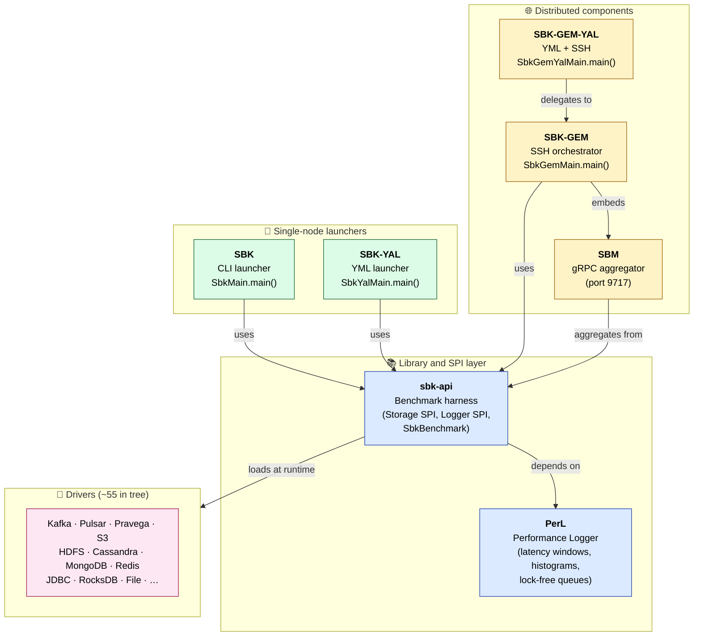
```mermaid
flowchart TB
    subgraph LIB["📚 Library and SPI layer"]
        PERL["<b>PerL</b><br/>Performance Logger<br/>(latency windows, histograms,<br/>lock-free queues)"]
        API["<b>sbk-api</b><br/>Benchmark harness<br/>(Storage SPI, Logger SPI,<br/>SbkBenchmark)"]
    end

    subgraph LAUNCH["🚀 Single-node launchers"]
        SBK["<b>SBK</b><br/>CLI launcher<br/>SbkMain.main()"]
        YAL["<b>SBK-YAL</b><br/>YML launcher<br/>SbkYalMain.main()"]
    end

    subgraph DIST["🌐 Distributed components"]
        SBM["<b>SBM</b><br/>gRPC aggregator<br/>(port 9717)"]
        GEM["<b>SBK-GEM</b><br/>SSH orchestrator<br/>SbkGemMain.main()"]
        GYAL["<b>SBK-GEM-YAL</b><br/>YML + SSH<br/>SbkGemYalMain.main()"]
    end

    subgraph DRIVERS["🔌 Drivers (~55 in tree)"]
        DRV["Kafka · Pulsar · Pravega · S3<br/>HDFS · Cassandra · MongoDB · Redis<br/>JDBC · RocksDB · File · …"]
    end

    API -->|depends on| PERL
    SBK -->|uses| API
    YAL -->|uses| API
    GEM -->|uses| API
    GEM -->|embeds| SBM
    GYAL -->|delegates to| GEM
    SBM -->|aggregates from| API
    API -->|loads at runtime| DRIVERS

    classDef lib fill:#dbeafe,stroke:#1e40af,color:#000
    classDef launch fill:#dcfce7,stroke:#166534,color:#000
    classDef dist fill:#fef3c7,stroke:#a16207,color:#000
    classDef drv fill:#fce7f3,stroke:#9d174d,color:#000

    class PERL,API lib
    class SBK,YAL launch
    class SBM,GEM,GYAL dist
    class DRV drv
```

### Module purposes in one sentence each

| Module | Full name | Purpose |
|---|---|---|
| `perl` | **PerL** — Performance Logger | Storage-agnostic latency-recording library: lock-free queues, sliding windows, HdrHistogram / HashMap / Array storage backends. |
| `sbk-api` | **SBK** — Storage Benchmark Kit (harness layer) | The benchmarking harness: defines the `Storage<T>` SPI for drivers, orchestrates writers and readers, parses CLI args, integrates loggers. |
| `sbk-yal` | **SBK-YAL** — SBK YML Arguments Loader | YML-driven launcher; converts a `.yml` benchmark spec into `sbk-api` args. |
| `sbm` | **SBM** — Storage Benchmark Monitor | Standalone gRPC server that *aggregates* latency histograms from many SBK clients into a cluster-wide view. Listens on port 9717. Speaks the **SBP** (Storage Benchmark Protocol). |
| `sbk-gem` | **SBK-GEM** — SBK Group Execution Monitor | SSH-based distributed launcher: copies SBK to each node, starts SBM locally, then runs SBK on every remote host. |
| `sbk-gem-yal` | **SBK-GEM-YAL** — SBK-GEM YML Arguments Loader | YML-driven variant of SBK-GEM. |

### Driver and logger discovery

Drivers are looked up by **simple class name** (e.g. `-class minio` finds
`io.sbk.driver.MinIO.MinIO`). Loggers are looked up the same way
(e.g. `-out CSVLogger` finds `io.sbk.logger.impl.CSVLogger`). The
discovery itself happens via a small package-scanning helper in
`sbk-api`, ultimately backed by [Reflections][reflections] (the library,
not Java's `java.lang.reflect`). The same pattern is used for
`GemLogger` discovery in SBK-GEM.

[reflections]: https://github.com/ronmamo/reflections

---

## 3. PerL — the Performance Logger foundation

**PerL** — short for **Performance Logger** — is the heart of SBK. It is a
**storage-agnostic Java library** for recording per-operation latencies,
sliding them through periodic windows, computing percentiles, and
exporting metrics. Nothing in PerL knows about S3, Kafka, or any
specific storage system.

The PerL README states the goal succinctly:

> *"The PerL provides the foundation APIs for performance benchmarking,
> storing latency values and calculating percentiles."*

### 3.1 The control-flow problem PerL solves

When a writer thread completes a PUT, it produces one piece of data:
`(startTime, endTime, records, bytes)`. The benchmark harness needs to
do five things with it, every time, at potentially millions of records
per second:

1. **Record** the latency `(endTime - startTime)` into a histogram.
2. **Accumulate** bytes/records into running totals.
3. **Slide** the recording window every N seconds and emit periodic
   reports.
4. **Track** an overall total so the final report has lifetime numbers.
5. **Forward** the data to one or more output sinks (console, CSV,
   Prometheus, gRPC).

Doing all five of these on the writer thread would tank throughput.
PerL's solution: **move all of this off the writer thread, onto a
single dedicated recorder thread**, communicating via lock-free
queues.

### 3.2 The PerL architecture

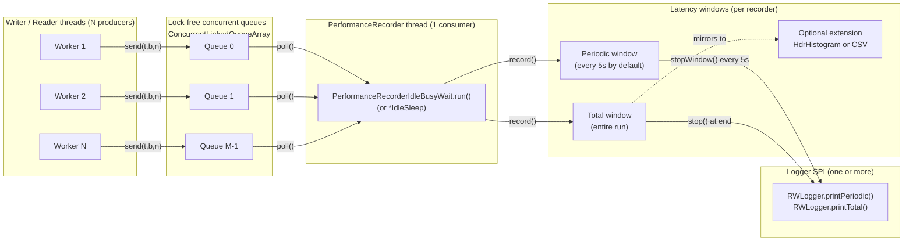
```mermaid
flowchart LR
    subgraph WRITERS["Writer / Reader threads (N producers)"]
        W1["Worker 1"]
        W2["Worker 2"]
        WN["Worker N"]
    end

    subgraph QUEUES["Lock-free concurrent queues<br/>ConcurrentLinkedQueueArray"]
        Q1["Queue 0"]
        Q2["Queue 1"]
        QN["Queue M-1"]
    end

    subgraph RECORDER["PerformanceRecorder thread (1 consumer)"]
        RUN["PerformanceRecorderIdleBusyWait.run()<br/>(or *IdleSleep)"]
    end

    subgraph WINDOWS["Latency windows (per recorder)"]
        PER["Periodic window<br/>(every 5s by default)"]
        TOT["Total window<br/>(entire run)"]
        EXT["Optional extension<br/>HdrHistogram or CSV"]
    end

    subgraph LOGGER["Logger SPI (one or more)"]
        LOG["RWLogger.printPeriodic()<br/>RWLogger.printTotal()"]
    end

    W1 -- send(t,b,n) --> Q1
    W2 -- send(t,b,n) --> Q2
    WN -- send(t,b,n) --> QN

    Q1 -- poll() --> RUN
    Q2 -- poll() --> RUN
    QN -- poll() --> RUN

    RUN -- record() --> PER
    RUN -- record() --> TOT
    TOT -. mirrors to .-> EXT
    PER -- stopWindow() every 5s --> LOG
    TOT -- stop() at end --> LOG
```

### 3.3 The five pillars of PerL

#### Pillar 1 — `CQueuePerl`: the orchestrator

<ref_file file="/root/projects/SBK/perl/src/main/java/io/perl/api/impl/CQueuePerl.java" />
ties everything together. On construction it:

```java
this.channels = new CQueueChannel[this.index];   // N concurrent channels
for (int i = 0; i < channels.length; i++) {
    channels[i] = new CQueueChannel(maxQs, new OnError());
}
this.perlReceiver = new PerformanceRecorderIdleBusyWait(   // ...or *IdleSleep
        periodicRecorder, channels, time, reportingIntervalMS, idleNS);
```

`getPerlChannel()` hands a **fresh `PerlChannel` (the writer-facing
proxy)** to each newly-spawned worker, rotating round-robin through the
array. A worker calls `perlChannel.send(startTime, endTime, records,
bytes)` on its hot path — that's the *only* thing it has to do.

Each `CQueueChannel` is implemented as a
`ConcurrentLinkedQueueArray` — an **array of lock-free
`java.util.concurrent.ConcurrentLinkedQueue` instances**. The
"lock-free" property is the structural one that matters: there is
**no `synchronized` block, no `ReentrantLock`, no mutex anywhere on
the producer or consumer path**. Both `offer()` (enqueue) and
`poll()` (dequeue) are implemented with the Michael-Scott non-blocking
algorithm — atomic compare-and-swap (CAS) operations on the queue's
head and tail pointers. That is the JDK-level guarantee that no
thread can ever block waiting for another thread to release a lock,
because there are no locks to release.

The array-of-queues design layered on top is an additional
optimisation: producers spread their writes across multiple queues
(indexed by `wIndex`, rotated by the recorder via `rIndex`). This
reduces *CAS contention* on any single queue's tail pointer when
many workers are running, but the lock-freedom property is what each
underlying queue gives us — the array merely scales it across cores.

#### Pillar 2 — `PerformanceRecorderIdleBusyWait`: the single consumer

The recorder thread runs the loop in
<ref_file file="/root/projects/SBK/perl/src/main/java/io/perl/api/impl/PerformanceRecorderIdleBusyWait.java" />:

```java
while (doWork) {
    notFound = true;
    for (int i = 0; doWork && (i < channels.length); i++) {
        t = channels[i].receive(windowIntervalMS);
        if (t != null) {
            notFound = false;
            ctime = t.endTime;
            if (t.isEnd()) { doWork = false; }
            else {
                recordsCnt += t.records;
                periodicRecorder.record(t.startTime, t.endTime, t.records, t.bytes);
                ...
            }
            if (periodicRecorder.elapsedMilliSecondsWindow(ctime) > windowIntervalMS) {
                periodicRecorder.stopWindow(ctime);  // emit periodic report
                periodicRecorder.startWindow(ctime);
                idleWait.reset();
            }
        }
    }
    if (doWork && notFound) {
        if (idleWait.waitAndCheck()) { /* elastic back-off */ }
    }
}
```

There are **two variants** of the recorder, chosen by config:

| Variant | When chosen | Behavior on empty queue |
|---|---|---|
| `PerformanceRecorderIdleBusyWait` | `sleepMS = 0` (default) | Adaptive (`ElasticWait`) busy-wait — minimum **1 µs** idle, scales up. |
| `PerformanceRecorderIdleSleep` | `sleepMS > 0` | Thread sleeps for `min(sleepMS, windowIntervalMS)`. |

Busy-wait is the default because **PerL is designed to keep latency on
nanosecond-class storage systems**. A `Thread.sleep(1)` here would
artificially lengthen the measured tail of any system whose actual p99
is sub-millisecond.

#### Pillar 3 — `ElasticWait`: amortising clock queries

This is one of PerL's most important — and easily overlooked — design
choices. To understand why it exists, first see what a *naive* idle
back-off would look like:

```java
// Naive — DO NOT do this in a high-rate benchmark
while (queueEmpty()) {
    LockSupport.parkNanos(idleNS);
    long now = time.getCurrentTime();          // <-- clock call per spin
    if (now - lastWindow > windowIntervalMS) {
        rotateWindow();
        lastWindow = now;
    }
}
```

The problem is that line `long now = time.getCurrentTime()`. At
`idleNS = 1000` (the PerL default — 1 µs), this loop spins **one
million times per second per idle recorder**, calling
`System.nanoTime()` or `System.currentTimeMillis()` on every iteration.

Those Java clock methods are not free:

- `System.nanoTime()` on Linux issues a vDSO call to
  `clock_gettime(CLOCK_MONOTONIC)`. It is usually cheap, but it
  involves a memory fence and, on some platforms, an actual syscall.
- `System.currentTimeMillis()` on some JVMs has historically suffered
  from per-thread cache-line contention.
- **Crucially, the worker threads are already calling these same
  clock methods** for every record's `startTime` and `endTime`. If the
  recorder thread also spins on the clock at megahertz rates, the two
  contend on the same time-source infrastructure, and the measurement
  thread starts to perturb the very thing it is measuring.

`ElasticWait`
(<ref_file file="/root/projects/SBK/perl/src/main/java/io/perl/api/impl/ElasticWait.java" />)
solves this by **converting time-checks into counter-checks**. The
clock is queried only once per "elastic batch" of idle spins, and the
batch size is auto-calibrated to match the configured window
interval.

##### The mechanism

`ElasticWait.waitAndCheck()`, called inside the recorder's idle path,
does just three things:

```java
public boolean waitAndCheck() {
    LockSupport.parkNanos(idleNS);   // park for ~idleNS ns
    idleCount++;
    totalCount++;
    return idleCount > elasticCount; // true ⇒ "now it's time to check the clock"
}
```

No clock call. Just a park and two counter increments. The recorder's
idle loop becomes:

```java
while (queueEmpty()) {
    if (idleWait.waitAndCheck()) {                  // park + count
        long now = time.getCurrentTime();           // <-- ONE clock call per batch
        long elapsed = now - windowStart;
        if (elapsed > windowIntervalMS) {
            rotateWindow();
            idleWait.setElastic(elapsed);           // recalibrate elasticCount
        } else {
            idleWait.updateElastic(elapsed);        // refine
        }
        idleWait.reset();                           // restart batch
    }
}
```

So instead of *N* clock calls per *N* parks, we get *1* clock call
per *elasticCount* parks. With the defaults (`idleNS=1000`,
`windowIntervalMS=5000`), `elasticCount` settles around
**5 000 000** — so the clock is sampled roughly every 5 seconds, not
every microsecond. That is **a six-orders-of-magnitude reduction** in
clock-query frequency on the recorder thread.

##### The calibration loop

`elasticCount` adapts to reality at runtime. The two updater methods
work like this:

| Method | When called | What it does |
|---|---|---|
| `setElastic(actualElapsedMs)` | After a window rotation | Sets `elasticCount = (totalCount × windowIntervalMS) / actualElapsedMs`. I.e., "given we managed `totalCount` parks in `actualElapsedMs` ms, how many parks would fit in `windowIntervalMS`?" |
| `updateElastic(elapsedMs)` | After a clock check that did *not* rotate the window | Sets `elasticCount = countRatio × (windowIntervalMS - elapsedMs)`. I.e., "we're partway through the window; aim the next check at the remaining time." |

The `countRatio = NS_PER_MS / idleNS = 1_000_000` is constant for a
given `idleNS`. The calibration is self-correcting: if `LockSupport`
oversleeps (which it can, by tens of microseconds on a busy host),
`setElastic` shrinks `elasticCount` on the next rotation so we don't
miss the next window boundary.

There is also a floor — `minIdleCount` — so that pathological
clock-resolution issues can never make `elasticCount` collapse to
zero (which would re-introduce the megahertz clock-query loop).

##### The second optimisation: reuse worker timestamps

There is one more clock-saving trick. Look at the recorder loop:

```java
for (Channel ch : channels) {
    t = ch.receive(...);
    if (t != null) {
        ctime = t.endTime;              // <-- the WORKER's timestamp, NOT a new clock call
        recorder.record(t.startTime, t.endTime, ...);
        if (recorder.elapsedMilliSecondsWindow(ctime) > windowIntervalMS) {
            recorder.stopWindow(ctime); ...
        }
    }
}
```

When the queue has work, **the recorder doesn't call the clock at
all**. The worker has already stamped `endTime` into the
`TimeStamp` object when it did `perlChannel.send(...)`. The recorder
just reuses that as its notion of "now" — close enough for window
rotation, free of any clock call.

So the full picture of when the recorder actually asks the operating
system for the time:

| Recorder state | Clock-query rate |
|---|---|
| **Processing a record** | **0** clock calls (uses `t.endTime`) |
| **Queue empty, mid-batch** | **0** clock calls (just parks) |
| **Queue empty, batch complete** | **1** clock call (then re-calibrate) |
| **Benchmark start / end** | **1** clock call each |

So at the full event rate of the storage system, the recorder thread
contributes **zero clock contention** to the worker threads. ElasticWait
is the structural reason the harness can measure nanosecond-class
storage systems without distorting them.

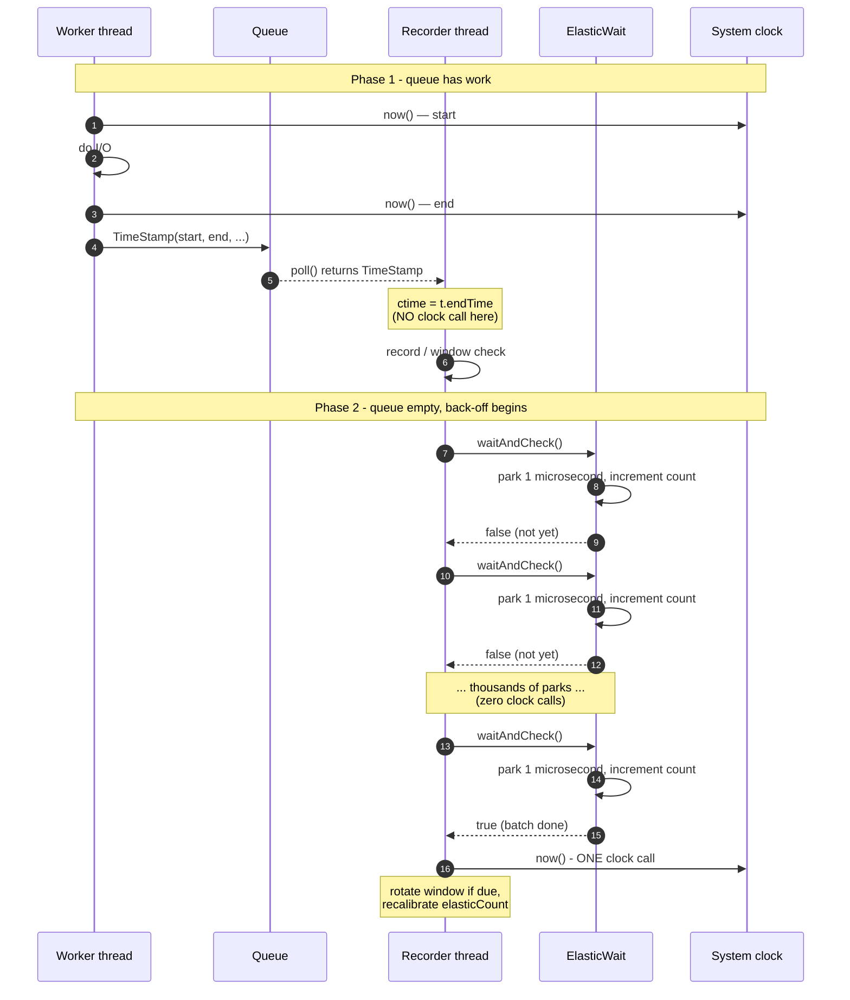
```mermaid
sequenceDiagram
    autonumber
    participant W as Worker thread
    participant Q as Queue
    participant R as Recorder thread
    participant E as ElasticWait
    participant C as System clock

    Note over W,C: Phase 1 - queue has work
    W->>C: now() — start
    W->>W: do I/O
    W->>C: now() — end
    W->>Q: TimeStamp(start, end, ...)
    Q-->>R: poll() returns TimeStamp
    Note over R: ctime = t.endTime<br/>(NO clock call here)
    R->>R: record / window check

    Note over W,C: Phase 2 - queue empty, back-off begins
    R->>E: waitAndCheck()
    E->>E: park 1 microsecond, increment count
    E-->>R: false (not yet)
    R->>E: waitAndCheck()
    E->>E: park 1 microsecond, increment count
    E-->>R: false (not yet)
    Note over R,E: ... thousands of parks ...<br/>(zero clock calls)
    R->>E: waitAndCheck()
    E->>E: park 1 microsecond, increment count
    E-->>R: true (batch done)
    R->>C: now() - ONE clock call
    Note over R: rotate window if due,<br/>recalibrate elasticCount
```

#### Pillar 4 — Three latency-storage backends

The recorder writes to a `LatencyRecordWindow`. PerL chooses **one of
three implementations at startup**, based on the configured
`(minLatency, maxLatency)` range and memory budget. This choice is made
by `PerlBuilder.buildLatencyRecordWindow()`:

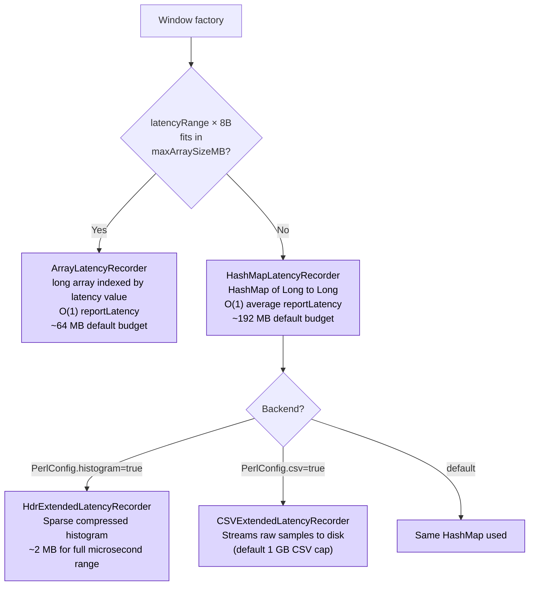
```mermaid
flowchart TD
    START["Window factory"] --> Q1{"latencyRange × 8B<br/>fits in<br/>maxArraySizeMB?"}
    Q1 -->|Yes| ARR["ArrayLatencyRecorder<br/>long array indexed by latency value<br/>O(1) reportLatency<br/>~64 MB default budget"]
    Q1 -->|No| HM["HashMapLatencyRecorder<br/>HashMap of Long to Long<br/>O(1) average reportLatency<br/>~192 MB default budget"]

    HM --> EXT{"Backend?"}
    EXT -->|"PerlConfig.histogram=true"| HDR["HdrExtendedLatencyRecorder<br/>Sparse compressed histogram<br/>~2 MB for full microsecond range"]
    EXT -->|"PerlConfig.csv=true"| CSV["CSVExtendedLatencyRecorder<br/>Streams raw samples to disk<br/>(default 1 GB CSV cap)"]
    EXT -->|default| NONE["Same HashMap used"]

    classDef impl fill:#ddd6fe,stroke:#5b21b6,color:#000
    class ARR,HM,HDR,CSV,NONE impl
```

The defaults in
<ref_file file="/root/projects/SBK/perl/src/main/resources/perl.properties" />:

```properties
maxArraySizeMB=64           # Use Array backend if latency range fits
maxHashMapSizeMB=192        # Periodic window HashMap budget
totalMaxHashMapSizeMB=256   # Total window HashMap budget
histogram=false             # Optional HdrHistogram for total window
csv=false                   # Optional raw-CSV total backend
csvFileSizeGB=1
```

**Why three backends?** The Array backend is the fastest (one indexed
write, zero allocations) but only works when the latency range
(`maxLatency - minLatency`) fits in your memory budget. For
nanosecond-resolution measurements over a 180-second window, that may
exceed budget — at which point PerL transparently falls back to the
HashMap backend. If you also enable HdrHistogram, the total-window
extension uses a sparse compressed representation that handles a 7+
decade range in roughly 2 MB. The point: PerL adapts to your
configuration *without you having to know which structure is in play*.

#### Pillar 5 — The window machinery

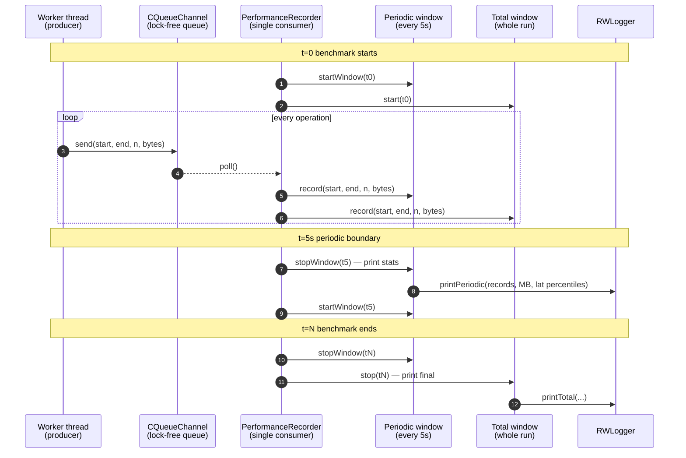
```mermaid
sequenceDiagram
    autonumber
    participant Worker as Worker thread<br/>(producer)
    participant Channel as CQueueChannel<br/>(lock-free queue)
    participant Rec as PerformanceRecorder<br/>(single consumer)
    participant Per as Periodic window<br/>(every 5s)
    participant Tot as Total window<br/>(whole run)
    participant Log as RWLogger
    Note over Worker,Log: t=0  benchmark starts
    Rec->>Per: startWindow(t0)
    Rec->>Tot: start(t0)

    loop every operation
        Worker->>Channel: send(start, end, n, bytes)
        Channel-->>Rec: poll()
        Rec->>Per: record(start, end, n, bytes)
        Rec->>Tot: record(start, end, n, bytes)
    end

    Note over Worker,Log: t=5s  periodic boundary
    Rec->>Per: stopWindow(t5) — print stats
    Per->>Log: printPeriodic(records, MB, lat percentiles)
    Rec->>Per: startWindow(t5)

    Note over Worker,Log: t=N  benchmark ends
    Rec->>Per: stopWindow(tN)
    Rec->>Tot: stop(tN) — print final
    Tot->>Log: printTotal(...)
```

The recorder maintains two windows at all times. The **periodic window**
is reset every `printingIntervalSeconds` (5 by default), so you get
live progress; the **total window** holds the whole-run cumulative
distribution and is only printed at the end. Both windows share the
storage backend logic.

### 3.4 Why this design is fast

Six concrete reasons, traceable to specific code:

1. **No locks on the hot path.** `CQueueChannel.send()` and the
   underlying `ConcurrentLinkedQueue.offer()` are both lock-free (CAS).
2. **No allocation on the hot path** for the producer beyond a
   short-lived `TimeStamp` object — and that one is small (4 longs).
3. **One consumer.** A single recorder thread eliminates contention on
   the windows; no synchronisation is needed because only one thread
   ever reads the queue and writes to the histogram.
4. **Lock-free concurrent queues — across the board.** PerL never
   uses a `synchronized` block or any `Lock` for inter-thread
   handoff. Every queue is a `ConcurrentLinkedQueue` (Michael-Scott
   non-blocking algorithm; CAS-only). To keep that lock-freedom
   *scalable* under high concurrency, the queues are organized as an
   array (`ConcurrentLinkedQueueArray`), with producers distributed
   across the array via `wIndex` and the consumer rotating through it
   via `rIndex`. The array layout is an optimisation; the lock-free
   guarantee is the foundation.
5. **Clock-query amortisation via `ElasticWait`** (Pillar 3 above).
   The recorder's clock-query rate is six orders of magnitude lower
   than the naive `park-then-check-time` design would yield. The
   recorder never competes with the workers for the system clock —
   it reuses the workers' own timestamps as its notion of "now" while
   processing, and only consults the actual clock once per multi-
   million-iteration idle batch.
6. **Adaptive idle.** When queues are empty, the recorder doesn't burn
   100% CPU — `ElasticWait` ramps idle time from 1 µs up to the window
   interval, then back down on the next non-empty cycle.

---

## 4. SBK-API — the pluggable benchmark harness

`sbk-api` wraps PerL with a storage-agnostic harness. It is what gives
SBK its *"any storage system"* property.

### 4.1 The Storage SPI — seven methods

A driver implements one Java interface:
<ref_file file="/root/projects/SBK/sbk-api/src/main/java/io/sbk/api/Storage.java" />:

```java
public interface Storage<T> {
    void          addArgs(InputOptions params);           // declare CLI flags
    void          parseArgs(ParameterOptions params);     // read CLI flags
    void          openStorage(ParameterOptions params);   // open client connection
    void          closeStorage(ParameterOptions params);  // close it
    DataWriter<T> createWriter(int id, ParameterOptions p);  // factory
    DataReader<T> createReader(int id, ParameterOptions p);  // factory
    DataType<T>   getDataType();                          // byte[] by default
}
```

`DataWriter<T>` and `DataReader<T>` each have an even smaller surface
(typically `writeAsync(T)` / `read()` plus `close()`); SBK provides
default implementations of all the timing / channel-send machinery in
`Writer<T>` and `Reader<T>` interfaces so drivers don't repeat that
boilerplate.

That is the **entire SPI**. Everything else — threading, latency
recording, output formatting, distribution — is the harness's job.

### 4.2 SBK-API class diagram

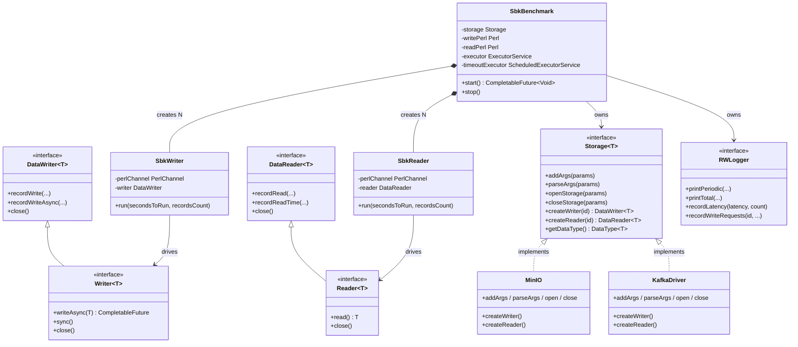
```mermaid
classDiagram
    class Storage~T~ {
        <<interface>>
        +addArgs(params)
        +parseArgs(params)
        +openStorage(params)
        +closeStorage(params)
        +createWriter(id) DataWriter~T~
        +createReader(id) DataReader~T~
        +getDataType() DataType~T~
    }

    class DataWriter~T~ {
        <<interface>>
        +recordWrite(...)
        +recordWriteAsync(...)
        +close()
    }

    class DataReader~T~ {
        <<interface>>
        +recordRead(...)
        +recordReadTime(...)
        +close()
    }

    class Writer~T~ {
        <<interface>>
        +writeAsync(T) CompletableFuture
        +sync()
        +close()
    }

    class Reader~T~ {
        <<interface>>
        +read() T
        +close()
    }

    class SbkBenchmark {
        +start() CompletableFuture~Void~
        +stop()
        -storage  Storage
        -writePerl Perl
        -readPerl  Perl
        -executor  ExecutorService
        -timeoutExecutor ScheduledExecutorService
    }

    class SbkWriter {
        +run(secondsToRun, recordsCount)
        -perlChannel PerlChannel
        -writer DataWriter
    }

    class SbkReader {
        +run(secondsToRun, recordsCount)
        -perlChannel PerlChannel
        -reader DataReader
    }

    class RWLogger {
        <<interface>>
        +printPeriodic(...)
        +printTotal(...)
        +recordLatency(latency, count)
        +recordWriteRequests(id, ...)
    }

    class MinIO {
        +addArgs / parseArgs / open / close
        +createWriter()
        +createReader()
    }

    class KafkaDriver {
        +addArgs / parseArgs / open / close
        +createWriter()
        +createReader()
    }

    Storage <|.. MinIO  : implements
    Storage <|.. KafkaDriver : implements
    DataWriter <|-- Writer
    DataReader <|-- Reader
    SbkBenchmark *-- SbkWriter : creates N
    SbkBenchmark *-- SbkReader : creates N
    SbkBenchmark --> Storage : owns
    SbkBenchmark --> RWLogger : owns
    SbkWriter --> Writer : drives
    SbkReader --> Reader : drives
```

### 4.3 SbkBenchmark — the orchestrator

<ref_file file="/root/projects/SBK/sbk-api/src/main/java/io/sbk/api/impl/SbkBenchmark.java" />
owns the lifecycle of one benchmark run. Reading the constructor
(simplified):

```java
public SbkBenchmark(ParameterOptions params, Storage<Object> storage,
                    DataType<Object> dType, RWLogger rwLogger, Time time) {
    int threadCount = params.getWritersCount() + params.getReadersCount() + 23;
    this.executor = switch (params.getThreadType()) {
        case ForkJoin -> new ForkJoinPool(threadCount);
        case Virtual  -> Executors.newFixedThreadPool(threadCount, Thread.ofVirtual().factory());
        default       -> Executors.newFixedThreadPool(threadCount);
    };
    this.perlExecutor = new ForkJoinPool(5);

    if (writersCount > 0 && action == Writing) {
        writePerl = PerlBuilder.build(rwLogger, time, wConfig, perlExecutor);
    }
    if (readersCount > 0) {
        readPerl  = PerlBuilder.build(rwLogger, time, rConfig, perlExecutor);
    }
    timeoutExecutor = Executors.newScheduledThreadPool(0, Thread.ofVirtual().factory());
}
```

Three things to notice:

1. **Two independent PerL instances.** Writers and readers have their own
   recorder threads, queues, and windows. They never share state.
2. **Thread-model selectable at runtime.** `-threadtype virtual` switches
   the workers to JVM virtual threads (lightweight, ideal for I/O-bound
   drivers); `ForkJoin` and the default `Executors.newFixedThreadPool`
   are also available.
3. **A separate `ScheduledExecutorService`** schedules the duration
   watchdog so the main scheduler doesn't get stuck behind a long-running
   write.

`start()` spawns one `SbkWriter` per `-writers` and one `SbkReader` per
`-readers`. Each `SbkWriter.run()` is wrapped in
`CompletableFuture.runAsync(..., executor)` so all writers run
concurrently. A `chainFuture = allOf(writersCB, readersCB)` triggers
`stop()` when both groups are done.

### 4.4 Logger SPI — the other plug point

Drivers are the *consumers* of latency events (they generate them);
loggers are the *producers* of human/machine-readable output. The
contract is `RWLogger`
(<ref_file file="/root/projects/SBK/sbk-api/src/main/java/io/sbk/logger/RWLogger.java" />):

```java
public non-sealed interface RWLogger
        extends Logger, CountRW, WriteRequestsLogger, ReadRequestsLogger, RWPrint { ... }
```

Five shipping implementations:

| Class | Output target | When to use |
|---|---|---|
| `SystemLogger` | stdout (default) | Local interactive runs |
| `Sl4jLogger` | SLF4J facade | Integrating SBK into another Java app |
| `CSVLogger` | CSV file | Post-run analysis with pandas / Excel |
| `PrometheusLogger` | Prometheus scrape endpoint (port 9718) | Real-time Grafana dashboards |
| `GrpcLogger` | gRPC to SBM | Distributed benchmarks (§6) |

Selected at runtime by `-out <ClassName>`. The driver discovery and
logger discovery use the same package-scan helper.

### 4.5 Wiring a single benchmark — the bootstrap

This is the control flow when a user runs
`./sbk -class minio -writers 4 -size 1048576 -seconds 60`:

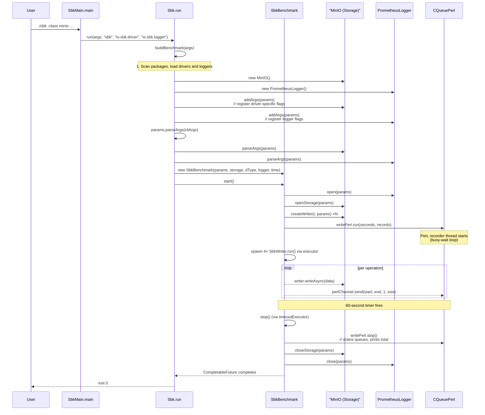
```mermaid
sequenceDiagram
    participant User
    participant Main as SbkMain.main
    participant Sbk as Sbk.run
    participant Bench as SbkBenchmark
    participant Store as "MinIO (Storage)"
    participant Log as PrometheusLogger
    participant Perl as CQueuePerl

    User->>Main: ./sbk -class minio ...
    Main->>Sbk: run(args, "sbk", "io.sbk.driver", "io.sbk.logger")
    Sbk->>Sbk: buildBenchmark(args)
    Note over Sbk: 1. Scan packages, load drivers and loggers
    Sbk->>Store: new MinIO()
    Sbk->>Log:   new PrometheusLogger()
    Sbk->>Store: addArgs(params)<br/>// register driver-specific flags
    Sbk->>Log:   addArgs(params)<br/>// register logger flags
    Sbk->>Sbk: params.parseArgs(cliArgs)
    Sbk->>Store: parseArgs(params)
    Sbk->>Log:   parseArgs(params)
    Sbk->>Bench: new SbkBenchmark(params, storage, dType, logger, time)

    Sbk->>Bench: start()
    Bench->>Log:   open(params)
    Bench->>Store: openStorage(params)
    Bench->>Store: createWriter(i, params)  ×N
    Bench->>Perl: writePerl.run(seconds, records)
    Note over Perl: PerL recorder thread starts<br/>(busy-wait loop)
    Bench->>Bench: spawn 4× SbkWriter.run() via executor

    loop per operation
        Bench-->>Store: writer.writeAsync(data)
        Bench-->>Perl: perlChannel.send(start, end, 1, size)
    end

    Note over Bench,Perl: 60-second timer fires
    Bench->>Bench: stop() (via timeoutExecutor)
    Bench->>Perl: writePerl.stop()<br/>// drains queues, prints total
    Bench->>Store: closeStorage(params)
    Bench->>Log:   close(params)
    Bench-->>Sbk: CompletableFuture completes
    Sbk-->>User: exit 0
```

The whole boot — argument parsing, class discovery, instantiation,
PerL wiring, executor sizing, timeout scheduling — happens in roughly
the 300 lines of
<ref_file file="/root/projects/SBK/sbk-api/src/main/java/io/sbk/api/impl/Sbk.java" />.
The actual benchmark loop is in `SbkWriter`/`SbkReader` and finishes via
the chained `CompletableFuture`s set up in `SbkBenchmark.start()`.

---

## 5. The four launchers

Single-node or multi-node? CLI or YML? SBK ships all four combinations
as separate Gradle subprojects:

- **SBK** — Storage Benchmark Kit (the single-node CLI launcher).
- **SBK-YAL** — SBK YML Arguments Loader (single-node, YML-driven).
- **SBK-GEM** — SBK Group Execution Monitor (multi-node, CLI-driven, SSH-orchestrated).
- **SBK-GEM-YAL** — SBK-GEM YML Arguments Loader (multi-node, YML-driven).


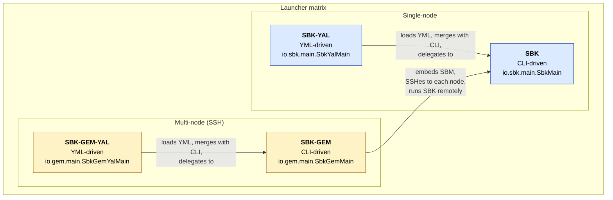
```mermaid
flowchart TB
    subgraph MATRIX["Launcher matrix"]
        direction LR
        subgraph SINGLE["Single-node"]
            CLI1["<b>SBK</b><br/>CLI-driven<br/>io.sbk.main.SbkMain"]
            YML1["<b>SBK-YAL</b><br/>YML-driven<br/>io.sbk.main.SbkYalMain"]
        end
        subgraph MULTI["Multi-node (SSH)"]
            CLI2["<b>SBK-GEM</b><br/>CLI-driven<br/>io.gem.main.SbkGemMain"]
            YML2["<b>SBK-GEM-YAL</b><br/>YML-driven<br/>io.gem.main.SbkGemYalMain"]
        end
    end

    YML1 -->|"loads YML, merges with CLI,<br/>delegates to"| CLI1
    YML2 -->|"loads YML, merges with CLI,<br/>delegates to"| CLI2
    CLI2 -->|"embeds SBM,<br/>SSHes to each node,<br/>runs SBK remotely"| CLI1

    classDef single fill:#dbeafe,stroke:#1e40af,color:#000
    classDef multi  fill:#fef3c7,stroke:#a16207,color:#000
    class CLI1,YML1 single
    class CLI2,YML2 multi
```

### When to use which

| Variant | Concrete situation |
|---|---|
| **SBK** | "I have one client machine and one storage cluster. Run a benchmark." |
| **SBK-YAL** | "I run the same benchmark every night in CI; let me commit the config to git." |
| **SBK-GEM** | "I need 8 client machines to saturate the storage system. Run SBK on all of them and give me one cluster-wide percentile report." |
| **SBK-GEM-YAL** | Same as SBK-GEM, but the multi-host benchmark spec lives in a YML file. |

### What does YAL — "YML Arguments Loader" — do?

The two YAL variants — **SBK-YAL** (SBK YML Arguments Loader) and
**SBK-GEM-YAL** (SBK-GEM YML Arguments Loader) — are intentionally thin
shells. They do three things, exemplified by
<ref_file file="/root/projects/SBK/sbk-yal/src/main/java/io/sbk/api/impl/SbkYal.java" />:

1. Parse the YML file with the Jackson dataformat library (`SbkYmlMap`
   looks for an `sbkArgs:` key; `SbkGemYmlMap` looks for an
   `sbkGemArgs:` key).
2. Convert the YML keys/values into the same `-flag value` token
   stream that `SbkMain` (or `SbkGemMain`) would accept.
3. Merge any CLI overrides (CLI wins) via `SbkUtils.mergeArgs()`.
4. Delegate to `Sbk.run(mergedArgs, ...)` (or `SbkGem.run(...)`).

Example YML for SBK-YAL:

```yml
sbkArgs:
  class:    minio
  writers:  4
  size:     1048576
  seconds:  60
  bucket:   sbk-bench
  url:      https://my.s3.endpoint:9021
```

You can override any of these from the CLI: `./sbk-yal --file run.yml -seconds 600`.
(The default filename, set in `sbk-yal.properties`, is `./sbk.yml`.)

The same pattern applies to `sbk-gem-yal`, which uses `SbkGemYmlMap`
looking for an `sbkGemArgs:` key, then delegates to `SbkGem.run()`.

---

## 6. SBM — the distributed results aggregator

**SBM** — **Storage Benchmark Monitor** — is the gRPC server that
aggregates results from many SBK client instances into one cluster-wide
view. It speaks the **SBP** (Storage Benchmark Protocol — described in §6.2).

When you run a single SBK instance, the latency numbers are reported by
that one client. But what if you need many client machines to saturate
a single storage cluster? You want one consolidated percentile report
across all clients — not eight separate p99 numbers that don't combine
trivially. That is what SBM solves. (The SBK README also refers to it
historically as *"SBK-RAM: Results Aggregation Monitor"* — same thing.)

### 6.1 SBM in the distributed picture

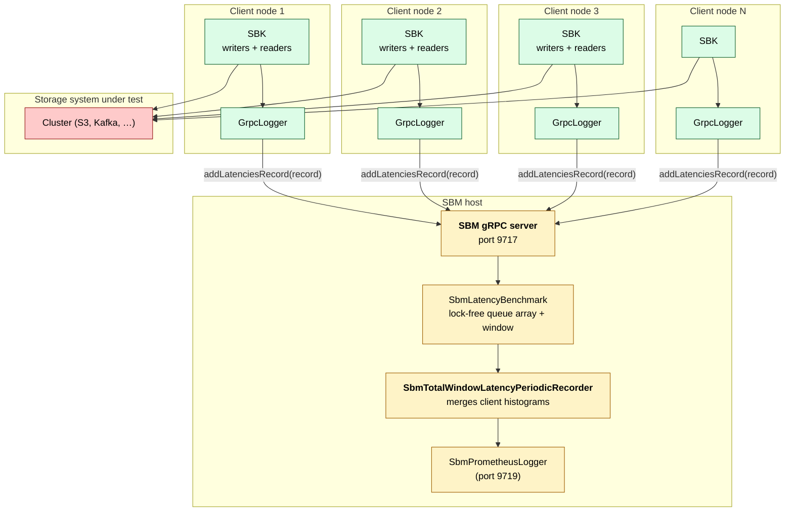
```mermaid
flowchart TB
    subgraph NODE1["Client node 1"]
        S1["SBK<br/>writers + readers"] --> G1["GrpcLogger"]
    end
    subgraph NODE2["Client node 2"]
        S2["SBK<br/>writers + readers"] --> G2["GrpcLogger"]
    end
    subgraph NODE3["Client node 3"]
        S3["SBK<br/>writers + readers"] --> G3["GrpcLogger"]
    end
    subgraph NODE4["Client node N"]
        SN["SBK"] --> GN["GrpcLogger"]
    end

    subgraph SBM_HOST["SBM host"]
        SBM_SRV["<b>SBM gRPC server</b><br/>port 9717"]
        AGG["SbmLatencyBenchmark<br/>lock-free queue array + window"]
        REC["<b>SbmTotalWindowLatencyPeriodicRecorder</b><br/>merges client histograms"]
        SBM_LOG["SbmPrometheusLogger<br/>(port 9719)"]
    end

    G1 -- "addLatenciesRecord(record)" --> SBM_SRV
    G2 -- "addLatenciesRecord(record)" --> SBM_SRV
    G3 -- "addLatenciesRecord(record)" --> SBM_SRV
    GN -- "addLatenciesRecord(record)" --> SBM_SRV

    SBM_SRV --> AGG
    AGG     --> REC
    REC     --> SBM_LOG

    subgraph STORAGE["Storage system under test"]
        SUT["Cluster (S3, Kafka, …)"]
    end

    S1 --> SUT
    S2 --> SUT
    S3 --> SUT
    SN --> SUT

    classDef cli fill:#dcfce7,stroke:#166534,color:#000
    classDef sbm fill:#fef3c7,stroke:#a16207,color:#000
    classDef sut fill:#fecaca,stroke:#991b1b,color:#000
    class S1,S2,S3,SN,G1,G2,G3,GN cli
    class SBM_SRV,AGG,REC,SBM_LOG sbm
    class SUT sut
```

### 6.2 The SBP gRPC contract

**SBP** — **Storage Benchmark Protocol** — is the wire protocol clients
use to talk to SBM. It is a gRPC service defined in
`sbk-api/src/main/proto/sbp.proto`, with six RPCs:

| RPC | Request | Response | Purpose |
|---|---|---|---|
| `getVersion` | Empty | `Version(major, minor)` | Client checks protocol compatibility |
| `isVersionSupported` | `Version` | `BoolValue` | Explicit version negotiation |
| `getConfig` | Empty | `Config` | Client fetches SBM's run config |
| `registerClient` | `Config` | `ClientID` | Returns a unique long ID |
| `addLatenciesRecord` | `MessageLatenciesRecord` | Empty | **Hot path** — push a batch |
| `closeClient` | `ClientID` | Empty | Graceful disconnect |

The critical message is `MessageLatenciesRecord`:

```protobuf
message MessageLatenciesRecord {
  int64 clientID         = 1;   // who is sending
  int64 sequenceNumber   = 2;   // for ordering / detecting drops
  int32 writers          = 3;
  int32 readers          = 4;
  int64 writeRequestBytes  = 7;
  int64 writeRequestRecords = 8;
  ...
  int64 totalRecords     = 13;
  int64 totalLatency     = 19;
  int64 minLatency       = 20;
  int64 maxLatency       = 21;
  map<int64, int64> latency = 22;   // <-- the histogram: latency → count
}
```

**This is the key design choice**: clients ship pre-aggregated
*histograms*, not raw samples. A client that has just observed one
million PUTs at p50 ≈ 300 ms can encode the entire distribution into a
map of perhaps ~200 entries (latency-value → count). Across N clients
that's `200N` bytes per push, not `8 × 1_000_000 × N` bytes of raw
samples. Bandwidth and SBM-side memory both stay bounded.

### 6.3 SBM's internal architecture

SBM is itself a multi-thread application — but it borrows the same
**lock-free-queue-array + single-consumer** pattern PerL uses on the
client side. The queues here are also `ConcurrentLinkedQueue`
instances (held inside a `ConcurrentLinkedQueueArray`), so the gRPC
worker threads enqueue with a single CAS and never block each other.
The single background consumer drains them and feeds the aggregation
window:

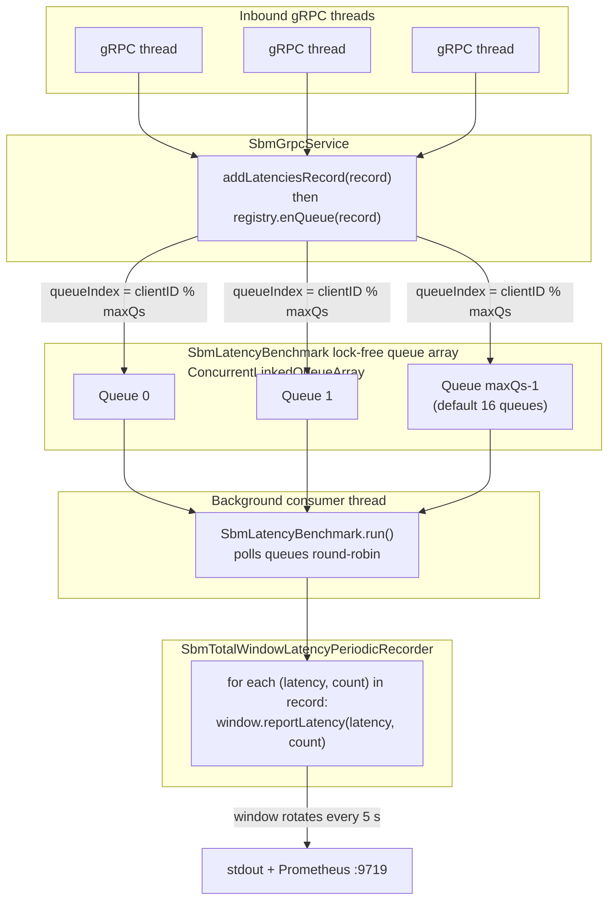
```mermaid
flowchart TB
    subgraph IN["Inbound gRPC threads"]
        T1["gRPC thread"]
        T2["gRPC thread"]
        T3["gRPC thread"]
    end

    subgraph SRV["SbmGrpcService"]
        ENQ["addLatenciesRecord(record)<br/>then registry.enQueue(record)"]
    end

    subgraph QUEUES["SbmLatencyBenchmark lock-free queue array<br/>ConcurrentLinkedQueueArray"]
        SQ1["Queue 0"]
        SQ2["Queue 1"]
        SQN["Queue maxQs-1<br/>(default 16 queues)"]
    end

    subgraph BG["Background consumer thread"]
        LOOP["SbmLatencyBenchmark.run()<br/>polls queues round-robin"]
    end

    subgraph REC["SbmTotalWindowLatencyPeriodicRecorder"]
        MERGE["for each (latency, count) in record:<br/>window.reportLatency(latency, count)"]
    end

    T1 --> ENQ
    T2 --> ENQ
    T3 --> ENQ
    ENQ -->|"queueIndex = clientID % maxQs"| SQ1
    ENQ -->|"queueIndex = clientID % maxQs"| SQ2
    ENQ -->|"queueIndex = clientID % maxQs"| SQN

    SQ1 --> LOOP
    SQ2 --> LOOP
    SQN --> LOOP

    LOOP --> MERGE
    MERGE -->|"window rotates every 5 s"| OUT["stdout + Prometheus :9719"]
```

Just like PerL on the client side:

- **Multiple inbound producers** (one per gRPC call) deposit into the
  **lock-free queue array**. Each individual queue is a JDK
  `ConcurrentLinkedQueue` (`offer()` is CAS-only — no
  `synchronized` blocks anywhere on the path from a gRPC call to the
  queue tail). The array stripes load across `maxQs` such queues to
  reduce CAS contention; the queue for a given record is
  `clientID % maxQs`, so every client lands in a deterministic queue
  and per-client ordering is preserved.
- **A single background thread** drains all queues round-robin and
  feeds them into a `LatencyRecordWindow` (the same PerL window class
  the clients use!). Single-consumer means no synchronisation is
  needed inside the window either — histogram updates are plain
  `++` on local data.
- **Window rotation** — every 5 s by default — produces a combined
  periodic line on stdout and ticks the Prometheus gauges.

### 6.4 Histogram merging

Aggregating histograms is the one place SBM does mathematics. When
client A reports `{100ms→500, 200ms→300}` and client B reports
`{100ms→700, 300ms→200}`, the merged histogram is:

```
{100ms → 1200,  200ms → 300,  300ms → 200}
```

Concretely
(<ref_file file="/root/projects/SBK/sbm/src/main/java/io/sbm/api/impl/SbmTotalWindowLatencyPeriodicRecorder.java" />):

```java
record.getLatencyMap().forEach(window::reportLatency);
```

`window.reportLatency(latency, count)` increments the bucket count by
`count`. After all clients have reported, percentiles are computed from
the merged distribution exactly as for a single client (cumulative
sum). The math is identical; only the *source* of the counts changes.

This is why SBM doesn't have to know how many clients are running, or
their individual percentiles, or anything else — it just adds counts.
**Histogram merging is associative** — you can merge in any order and
get the same answer.

---

## 7. SBK-GEM — the distributed orchestrator

**SBK-GEM** — **SBK Group Execution Monitor** — is SBK's distributed
launcher. SBM (§6) solves "many clients, one aggregator"; SBK-GEM
solves the question right before it — *"how do I **launch** SBK on
many client machines and route their telemetry to a local SBM?"*

The SBK-GEM README phrases it as
*"the SBK (Storage Benchmark Kit) - GEM (Group Execution Monitor)
combines SBK-RAM and SBK"* — i.e. SBK-GEM == SBK runner on each node
+ SBM aggregator on the orchestrator node, glued together over SSH.

### 7.1 The orchestrator sequence

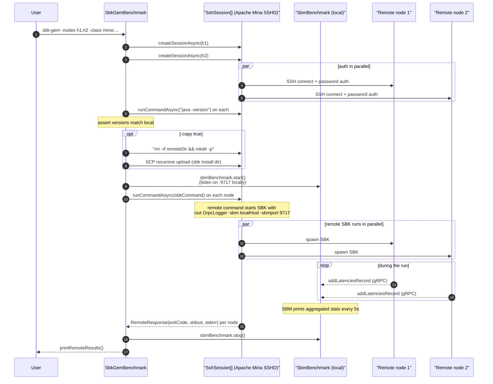
```mermaid
sequenceDiagram
    autonumber
    participant User
    participant GEM as SbkGemBenchmark
    participant SSH as "SshSession[] (Apache Mina SSHD)"
    participant SBM as "SbmBenchmark (local)"
    participant N1 as "Remote node 1"
    participant N2 as "Remote node 2"

    User->>GEM: sbk-gem -nodes h1,h2 -class minio ...
    GEM->>SSH: createSessionAsync(h1)
    GEM->>SSH: createSessionAsync(h2)
    par auth in parallel
        SSH->>N1: SSH connect + password auth
        SSH->>N2: SSH connect + password auth
    end

    GEM->>SSH: runCommandAsync("java -version") on each
    Note over GEM: assert versions match local

    opt -copy true
        GEM->>SSH: "rm -rf remoteDir && mkdir -p"
        GEM->>SSH: SCP recursive upload (sbk install dir)
    end

    GEM->>SBM: sbmBenchmark.start()<br/>(listen on :9717 locally)

    GEM->>SSH: runCommandAsync(sbkCommand) on each node
    Note over SSH: remote command starts SBK with<br/>-out GrpcLogger -sbm localHost -sbmport 9717

    par remote SBK runs in parallel
        SSH->>N1: spawn SBK
        SSH->>N2: spawn SBK
    end

    loop during the run
        N1-->>SBM: addLatenciesRecord (gRPC)
        N2-->>SBM: addLatenciesRecord (gRPC)
    end

    Note over SBM: SBM prints aggregated stats every 5s

    SSH-->>GEM: RemoteResponse(exitCode, stdout, stderr) per node
    GEM->>SBM: sbmBenchmark.stop()
    GEM-->>User: printRemoteResults()
```

### 7.2 What SBK-GEM is and isn't

SBK-GEM is a **pure orchestrator**:

- It does **not** aggregate latency numbers itself.
- It does **not** open the storage clients.
- It does **not** generate any of its own workload.
- It **does** copy binaries, start SSH sessions, kick off remote SBK
  instances, embed a local SBM, and collect exit codes / stdout / stderr.

This separation matters. The aggregator logic lives in **one place**
(SBM); changing how percentiles are reported doesn't require touching
the SSH / orchestration code at all. Likewise, you can use SBM
standalone without SBK-GEM if your nodes are already set up — just
point each one's `-out GrpcLogger -sbm <host>` at it.

### 7.3 SSH implementation

SBK-GEM uses **Apache Mina SSHD** (a pure-Java SSH client; no native
binary, no `ssh` shell-out). Each remote node is a `SshSession`:

```java
public CompletableFuture<SshResponse> runCommandAsync(
        String cmd, Boolean isOutput, long timeoutSeconds) {
    return CompletableFuture.supplyAsync(() -> {
        SshUtils.runCommand(getSession(), cmd, timeoutSeconds, response);
        return response;
    }, executor);
}
```

All three remote operations — `createSessionAsync()`,
`runCommandAsync()`, `copyDirectoryAsync()` — return
`CompletableFuture`. The orchestrator chains them via
`CompletableFuture.allOf(...)` so the slowest node bounds the wall-clock
time, not the sum of node times.

A subtle correctness point: SBK-GEM's `ConnectionsMap` *deduplicates*
operations targeting the same (host, dir) pair. If the same host
appears multiple times in `-nodes` (e.g. to stress a single client
machine with multiple worker processes), the orchestrator copies the
binary once, not twice.

---

## 8. Why is SBK a high-performance framework?

There is a tension at the core of any benchmarking tool: it has to be
*at least as fast as the thing it's measuring*. If the harness's own
recording overhead becomes the bottleneck, the latencies you measure
are the harness's tail, not the storage's tail. SBK is engineered
specifically to push the harness's overhead out of the way of the
measurement.

Here are the concrete design choices that make this work, with the
property each one buys:

### 8.1 No sampling — every operation contributes

Many benchmark tools (YCSB, sysbench, fio's `lat_log` mode at high
rates) sample down once they exceed some sample budget. This biases
the tail: the 99.9th percentile is computed from a reservoir that
*might not contain* the rare slow samples that define p99.9.

SBK records every single operation. The PerL `LatencyRecordWindow`
backends are explicitly designed for this:

- **Array backend** at O(1) per sample with zero allocation;
- **HashMap backend** at O(1) average for arbitrary latency ranges;
- **HdrHistogram backend** for the total-window — sparse compressed
  storage for nanosecond resolution across a 7+ decade range.

### 8.2 Lock-free concurrent queues on the hot path

The worker thread's only contact with PerL is
`perlChannel.send(start, end, n, bytes)`, which boils down to
`ConcurrentLinkedQueue.offer()` — a single atomic compare-and-swap
on the queue's tail pointer. **No `synchronized` block, no
`ReentrantLock`, no monitor entry of any kind** on the producer
path. This is the Michael-Scott non-blocking queue algorithm in
the JDK, and it is the structural property the rest of PerL is
built around: a worker thread *cannot* be blocked by another
thread for queue-handoff reasons, because there is no lock to
wait on. The recorder side (`poll()`) has the same property.

### 8.3 Lock-free queues, scaled by an array layout

A single lock-free queue is fast, but if N producers all CAS the
same tail pointer simultaneously, they keep retrying each other's
updates — CAS contention grows with N. PerL preserves lock-freedom
under high concurrency by stacking many lock-free queues into a
`ConcurrentLinkedQueueArray`: `qPerWorker × workers` queues
(default 10 × N). Producers route to queues via `wIndex`; the
single consumer rotates through them via `rIndex`. So each
individual queue still has only a small number of producers
touching it, the CAS retries stay rare, and the per-record cost
remains O(1) lock-free.

### 8.4 Single-consumer recorder

By construction there is exactly *one* recorder thread per direction
(read or write). The windows it writes to are never read by anyone
else during recording, so **no synchronisation is needed inside the
windows**. This is one of the biggest wins: the histogram updates,
which happen at the full event rate, are plain `++` on local data
structures.

### 8.5 Adaptive busy-wait

When all queues are empty, the recorder spins for `idleNS` ns (default
1 µs), then doubles, then doubles again, up to one window interval.
This adaptive back-off (`ElasticWait`) keeps CPU usage low at low
event rates while introducing minimum latency at high event rates.
Crucially the minimum is 1 µs — sub-millisecond storage systems get a
fair shake.

### 8.6 Clock-query amortisation via `ElasticWait`

This deserves its own line because it is what allows the harness to
*not* perturb the system it is measuring. Worker threads call
`time.getCurrentTime()` twice per operation (once for `startTime`,
once for `endTime`); if the recorder thread also called the clock on
every idle spin (megahertz rates with the default 1 µs idle), the
two would contend on the same OS time-source. PerL's recorder
contributes **zero clock calls per record processed** and roughly
**one clock call per window interval** when idle — i.e., one every
~5 seconds, not one every µs. See Pillar 3 in §3.3 for the full
mechanism; the structural property is that the harness shares the
system clock with the workers without competing for it.

### 8.7 Single-binary distribution; no native dependencies

PerL is pure Java. The hot path doesn't call into JNI; there are no
syscalls per record. This makes the whole stack JIT-friendly and means
the recorded `endTime - startTime` mostly reflects the I/O it's
measuring, not the harness.

### 8.8 JVM-native concurrency primitives

`CompletableFuture`, `ForkJoinPool`, and (optionally) virtual threads
mean the harness scales with the JVM's evolving concurrency story.
Virtual threads in particular are a major win for I/O-bound drivers:
you can run thousands of "writer threads" against an HTTP-based S3
service at the cost of a few platform threads.

### 8.9 The distributed picture also scales

For workloads where a single client can't saturate the system, SBK-GEM
+ SBM linearly scale the workload across N machines. Each client uses
the same PerL pipeline locally; only the **histograms** (not the raw
samples) cross the network. Bandwidth scales with **number of distinct
latency values**, not number of operations.

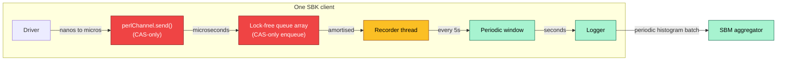
```mermaid
flowchart LR
    subgraph CLIENT["One SBK client"]
        DRV["Driver"] -->|nanos to micros| HOT["perlChannel.send()<br/>(CAS-only)"]
        HOT -->|microseconds| Q["Lock-free queue array<br/>(CAS-only enqueue)"]
        Q -->|amortised| REC["Recorder thread"]
        REC -->|every 5s| WIN["Periodic window"]
        WIN -->|seconds| LOG["Logger"]
    end
    LOG -->|periodic histogram batch| SBM["SBM aggregator"]

    classDef hot fill:#ef4444,color:#fff,stroke:#7f1d1d
    classDef warm fill:#fbbf24,color:#000,stroke:#92400e
    classDef cool fill:#a7f3d0,color:#000,stroke:#065f46
    class HOT,Q hot
    class REC warm
    class WIN,LOG,SBM cool
```

Reading this diagram: red = nanosecond-budget (on the worker thread,
must be minimal); orange = amortised work on the recorder thread; green
= "human time" — once-per-window or once-per-batch logging.

---

## 9. Pluggable drivers — worked example

How would a CS student writing a new driver actually do it? Let's walk
through it.

### 9.1 The Storage SPI in 7 methods

```java
public interface Storage<T> {
    void addArgs(InputOptions params);
    void parseArgs(ParameterOptions params);
    void openStorage(ParameterOptions params);
    void closeStorage(ParameterOptions params);
    DataWriter<T> createWriter(int id, ParameterOptions params);
    DataReader<T> createReader(int id, ParameterOptions params);
    default DataType<T> getDataType() { return new ByteArray(); }
}
```

That's the entire surface. The harness handles threading, latency
recording, output, distribution. A driver author concentrates on the
storage system.

### 9.2 Skeleton driver in ~30 lines

Suppose you wanted to benchmark a hypothetical `acme-kv` key-value
store. The skeleton would be:

```java
package io.sbk.driver.AcmeKv;

public class AcmeKv implements Storage<byte[]> {
    private AcmeClient client;
    private String namespace;

    public void addArgs(InputOptions p) {
        p.addOption("ns", true, "AcmeKV namespace");
    }
    public void parseArgs(ParameterOptions p) {
        namespace = p.getOptionValue("ns", "default");
    }
    public void openStorage(ParameterOptions p) throws IOException {
        client = AcmeClient.connect(p.getOptionValue("host"));
    }
    public void closeStorage(ParameterOptions p) {
        client.close();
    }
    public DataWriter<byte[]> createWriter(int id, ParameterOptions p) {
        return new AcmeKvWriter(id, client, namespace);
    }
    public DataReader<byte[]> createReader(int id, ParameterOptions p) {
        return new AcmeKvReader(id, client, namespace);
    }
}
```

The `AcmeKvWriter` only needs to implement
`writeAsync(byte[] data) -> CompletableFuture`. The default
`recordWrite(...)` in the `Writer<T>` interface takes care of
`startTime`, `endTime`, and the `perlChannel.send(...)` call.

Then add the driver to `settings-drivers.gradle` and `build-drivers.gradle`,
implement `AcmeKvWriter` + `AcmeKvReader` in 20 lines each, and you can
benchmark it with `./sbk -class acmekv -host my-acme:1234 -writers 4
-size 1024 -seconds 60`.

### 9.3 What happens at runtime — driver discovery

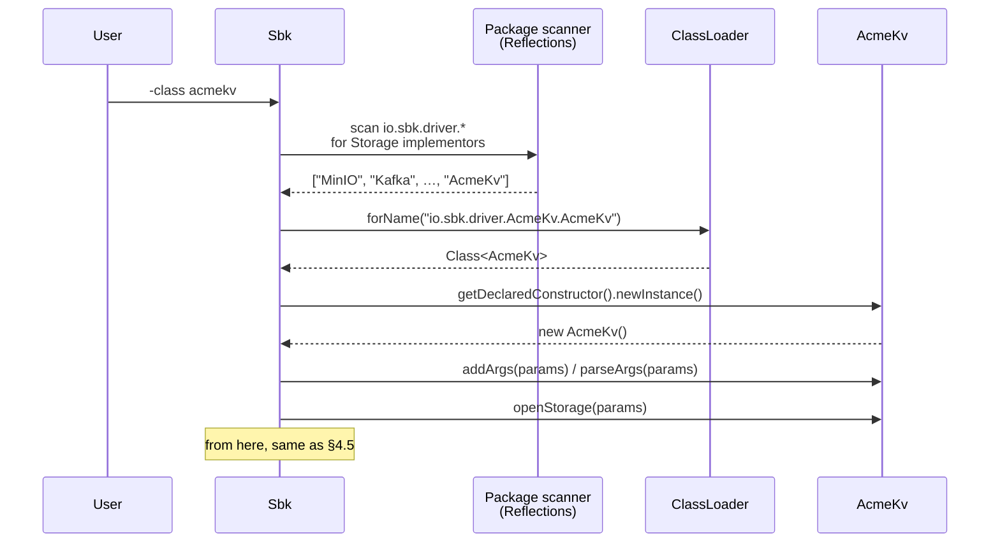
```mermaid
sequenceDiagram
    participant User
    participant Sbk
    participant Pkg as Package scanner<br/>(Reflections)
    participant CL as ClassLoader
    participant Drv as AcmeKv

    User->>Sbk: -class acmekv
    Sbk->>Pkg: scan io.sbk.driver.*<br/>for Storage implementors
    Pkg-->>Sbk: ["MinIO", "Kafka", …, "AcmeKv"]
    Sbk->>CL: forName("io.sbk.driver.AcmeKv.AcmeKv")
    CL-->>Sbk: Class<AcmeKv>
    Sbk->>Drv: getDeclaredConstructor().newInstance()
    Drv-->>Sbk: new AcmeKv()
    Sbk->>Drv: addArgs(params) / parseArgs(params)
    Sbk->>Drv: openStorage(params)
    Note over Sbk: from here, same as §4.5
```

The class-name match is **case-insensitive** for the CLI argument
(`-class acmekv` finds `AcmeKv`), making CLI usage forgiving while
keeping Java class names idiomatic.

---

## 10. Pluggable loggers — worked example

The same pluggability applies to output. Let's say a researcher wants
to ship samples to InfluxDB instead of Prometheus.

### 10.1 The RWLogger contract

```java
public interface RWLogger extends Logger, CountRW,
                                  WriteRequestsLogger, ReadRequestsLogger, RWPrint {
    // From Logger: open / close / parseArgs / addArgs / getTimeUnit / etc.
    // From RWPrint: printPeriodic(...) / printTotal(...)
    // From CountRW: setWriters / setReaders / setMaxWriters / setMaxReaders
}
```

A new logger only has to extend `AbstractRWLogger` (which gives
sensible defaults for everything) and override `printPeriodic()` and
`printTotal()`:

```java
package io.sbk.logger.impl;

public class InfluxLogger extends AbstractRWLogger {
    private InfluxDB influx;

    @Override
    public void open(...) { influx = InfluxDB.connect(...); }
    @Override
    public void close(...) { influx.close(); }

    @Override
    public void printPeriodic(int writers, int readers,
                              long records, double recsPerSec, double mbPerSec,
                              double avgLatency, long minLatency, long maxLatency,
                              long invalidLatencies, long lowerDiscard, long higherDiscard,
                              int slc1, int slc2, long[] percentileValues, ...) {
        influx.write(Point.measurement("sbk_periodic")
              .addField("records_per_sec", recsPerSec)
              .addField("p99_ms", percentileValues[20])
              ...
              .build());
    }
}
```

Drop the class into `io.sbk.logger.impl`, run
`./sbk -class minio -out InfluxLogger ...`, and you have InfluxDB
metrics. **No changes to the harness.**

### 10.2 Five shipping logger options at a glance

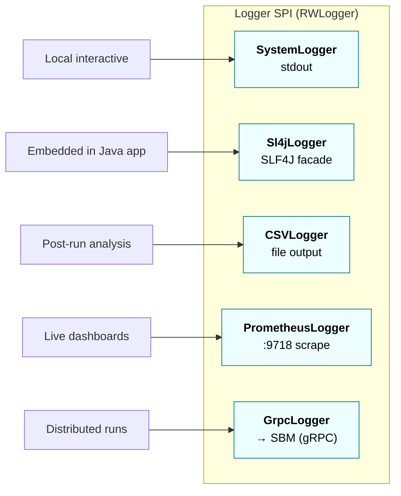
```mermaid
flowchart LR
    subgraph LOGGERS["Logger SPI (RWLogger)"]
        SYS["<b>SystemLogger</b><br/>stdout"]
        SLF["<b>Sl4jLogger</b><br/>SLF4J facade"]
        CSV["<b>CSVLogger</b><br/>file output"]
        PRM["<b>PrometheusLogger</b><br/>:9718 scrape"]
        GRP["<b>GrpcLogger</b><br/>→ SBM (gRPC)"]
    end
    USE1["Local interactive"] --> SYS
    USE2["Embedded in Java app"] --> SLF
    USE3["Post-run analysis"] --> CSV
    USE4["Live dashboards"] --> PRM
    USE5["Distributed runs"] --> GRP

    classDef opt fill:#ecfeff,stroke:#0e7490,color:#000
    class SYS,SLF,CSV,PRM,GRP opt
```

The selection is made via the `-out` flag (default
`PrometheusLogger`). The same class-name discovery used for drivers is
used for loggers, so adding a new one is purely additive.

---

## 11. End-to-end execution trace

Let's trace one specific command through the entire stack:

```bash
./sbk -class minio -url https://10.249.249.223:9021 \
      -key user -secret pass -bucket bench \
      -extra-headers x-emc-namespace=ns1 \
      -writers 4 -size 1048576 -seconds 60
```

### 11.1 Bootstrap (~3 ms)

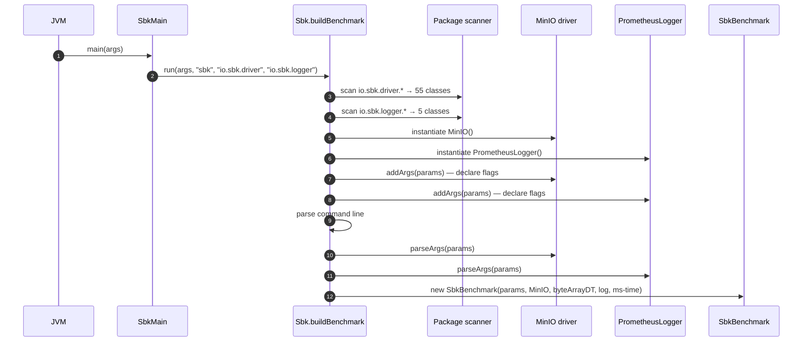
```mermaid
sequenceDiagram
    autonumber
    participant JVM
    participant Main as SbkMain
    participant Sbk as Sbk.buildBenchmark
    participant Pkg as Package scanner
    participant Drv as MinIO driver
    participant Log as PrometheusLogger
    participant Bench as SbkBenchmark

    JVM->>Main: main(args)
    Main->>Sbk: run(args, "sbk", "io.sbk.driver", "io.sbk.logger")
    Sbk->>Pkg: scan io.sbk.driver.* → 55 classes
    Sbk->>Pkg: scan io.sbk.logger.* → 5 classes
    Sbk->>Drv: instantiate MinIO()
    Sbk->>Log: instantiate PrometheusLogger()
    Sbk->>Drv: addArgs(params)  — declare flags
    Sbk->>Log: addArgs(params)  — declare flags
    Sbk->>Sbk: parse command line
    Sbk->>Drv: parseArgs(params)
    Sbk->>Log: parseArgs(params)
    Sbk->>Bench: new SbkBenchmark(params, MinIO, byteArrayDT, log, ms-time)
```

### 11.2 Open the world

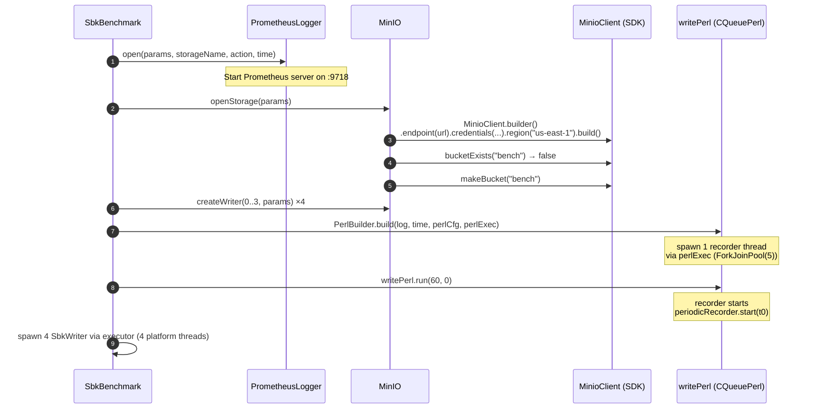
```mermaid
sequenceDiagram
    autonumber
    participant Bench as SbkBenchmark
    participant Log as PrometheusLogger
    participant Drv as MinIO
    participant Mc as MinioClient (SDK)
    participant PerlW as writePerl (CQueuePerl)

    Bench->>Log: open(params, storageName, action, time)
    Note over Log: Start Prometheus server on :9718
    Bench->>Drv: openStorage(params)
    Drv->>Mc: MinioClient.builder()<br/>.endpoint(url).credentials(...).region("us-east-1").build()
    Drv->>Mc: bucketExists("bench") → false
    Drv->>Mc: makeBucket("bench")
    Bench->>Drv: createWriter(0..3, params)  ×4
    Bench->>PerlW: PerlBuilder.build(log, time, perlCfg, perlExec)
    Note over PerlW: spawn 1 recorder thread<br/>via perlExec (ForkJoinPool(5))
    Bench->>PerlW: writePerl.run(60, 0)
    Note over PerlW: recorder starts<br/>periodicRecorder.start(t0)
    Bench->>Bench: spawn 4 SbkWriter via executor (4 platform threads)
```

### 11.3 The benchmark loop (60 seconds)

Per second the system performs (roughly): 4 writers × (1/avg_lat) ops
≈ 4 × (1000/300) = ~13 PUTs/s at 100 ms avg latency, or higher with
better hardware. Each PUT runs through this pipeline:

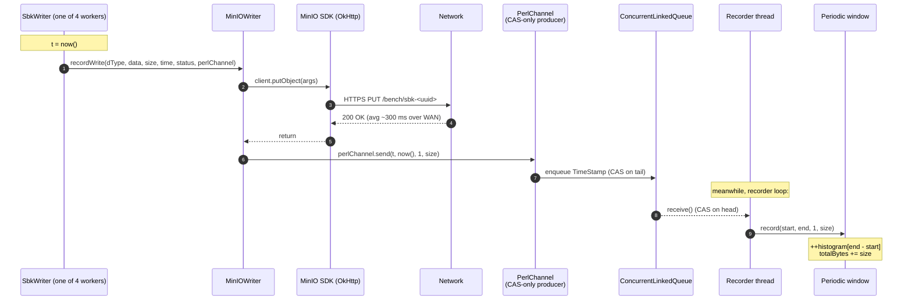
```mermaid
sequenceDiagram
    autonumber
    participant W as SbkWriter (one of 4 workers)
    participant Drv as MinIOWriter
    participant Sdk as MinIO SDK (OkHttp)
    participant Net as Network
    participant Ch as PerlChannel<br/>(CAS-only producer)
    participant Q as ConcurrentLinkedQueue
    participant R as Recorder thread
    participant Win as Periodic window

    Note over W: t = now()
    W->>Drv: recordWrite(dType, data, size, time, status, perlChannel)
    Drv->>Sdk: client.putObject(args)
    Sdk->>Net: HTTPS PUT /bench/sbk-<uuid>
    Net-->>Sdk: 200 OK (avg ~300 ms over WAN)
    Sdk-->>Drv: return
    Drv->>Ch: perlChannel.send(t, now(), 1, size)
    Ch->>Q: enqueue TimeStamp (CAS on tail)

    Note over R: meanwhile, recorder loop:
    Q-->>R: receive() (CAS on head)
    R->>Win: record(start, end, 1, size)
    Note over Win: ++histogram[end - start]<br/>totalBytes += size
```

The worker has done its job the moment it returns from
`perlChannel.send()` — that takes nanoseconds. Everything else (the
recorder, the windowing, the percentile computation) is happening on a
separate thread.

### 11.4 The window rotation (every 5 s)

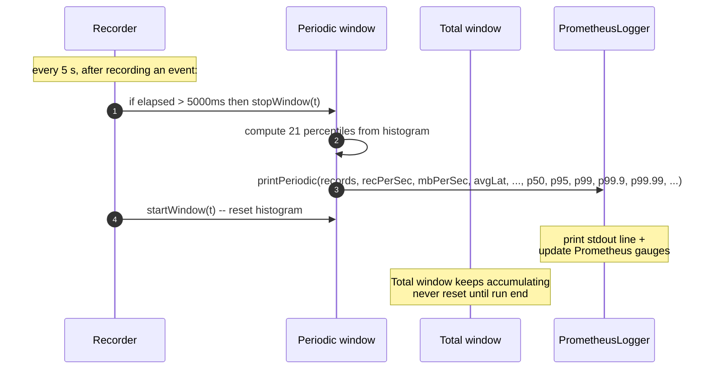
```mermaid
sequenceDiagram
    autonumber
    participant R as Recorder
    participant Win as Periodic window
    participant Tot as Total window
    participant Log as PrometheusLogger

    Note over R: every 5 s, after recording an event:
    R->>Win: if elapsed > 5000ms then stopWindow(t)
    Win->>Win: compute 21 percentiles from histogram
    Win->>Log: printPeriodic(records, recPerSec, mbPerSec, avgLat, ..., p50, p95, p99, p99.9, p99.99, ...)
    R->>Win: startWindow(t) -- reset histogram
    Note over Log: print stdout line +<br/>update Prometheus gauges
    Note over Tot: Total window keeps accumulating<br/>never reset until run end
```

### 11.5 The end

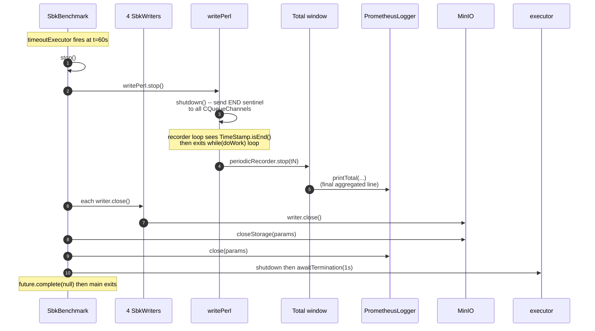
```mermaid
sequenceDiagram
    autonumber
    participant Bench as SbkBenchmark
    participant Wk as 4 SbkWriters
    participant PerlW as writePerl
    participant Win as Total window
    participant Log as PrometheusLogger
    participant Drv as MinIO
    participant Exec as executor

    Note over Bench: timeoutExecutor fires at t=60s
    Bench->>Bench: stop()
    Bench->>PerlW: writePerl.stop()
    PerlW->>PerlW: shutdown() -- send END sentinel<br/>to all CQueueChannels
    Note over PerlW: recorder loop sees TimeStamp.isEnd()<br/>then exits while(doWork) loop
    PerlW->>Win: periodicRecorder.stop(tN)
    Win->>Log: printTotal(...)<br/>(final aggregated line)
    Bench->>Wk: each writer.close()
    Wk->>Drv: writer.close()
    Bench->>Drv: closeStorage(params)
    Bench->>Log: close(params)
    Bench->>Exec: shutdown then awaitTermination(1s)
    Note over Bench: future.complete(null) then main exits
```

The exact format of the final stdout line (lifted from a real ObjectScale
run earlier in this session):

```
2026-06-06 20:00:07, Total Minio Writing  1 writers, 0 readers, ...
   148 records, 2.5 records/sec, 0.00 MB/sec,
   405.5 ms avg latency, 291 ms min latency, 9010 ms max latency;
   SLC-1: 0, SLC-2: 9;
   Latency Percentiles: 296 ms 5th, 298 ms 10th, ..., 308 ms 50th, ...,
   889 ms 95th, 990 ms 99th, 9010 ms 99.5th, 9010 ms 99.99th
```

Each percentile in that line corresponds to one cumulative-sum lookup
into the total-window histogram. **The whole distribution is intact**
— SBK doesn't sample, doesn't bin coarsely, and doesn't approximate.

---

## 12. Data flow examples — local storage vs remote storage

A common source of confusion for engineers new to SBK is *where the
storage actually lives*. The harness is identical for every driver —
but what the driver does at PUT/GET time is wildly different
depending on whether the storage system is **local** (a file on the
same machine) or **remote** (an S3 cluster across the network). This
section traces a single record through SBK for both cases, so you can
see exactly where each layer sits.

### 12.1 The principle: "the driver IS the storage client"

SBK's `Storage<T>` SPI never makes any assumption about whether the
storage system is in the same process, on the same machine, or
across the planet. The harness only knows:

> *"Hand me a `DataWriter` and a `DataReader`. I will call
> `writeAsync(data)` and `read()` on them, and time those calls."*

This means:

- For **local storage** (file system, embedded key-value store like
  RocksDB), the driver simply wraps an in-process Java API. The
  PUT goes through the OS kernel, into the page cache, possibly to
  disk. No network is involved.
- For **remote storage** (S3, Kafka, Cassandra, …), the driver is
  effectively an **HTTP / TCP client** for a remote service. The
  driver pulls in the vendor SDK (e.g. MinIO SDK, Kafka client,
  Cassandra driver), and that SDK handles the network protocol.
  SBK never touches the wire — it just measures how long the
  vendor's API call took.

The harness, the latency recorder, the percentile machinery, the
periodic reports — **all of that is byte-for-byte identical** between
the two cases. That is precisely what makes cross-vendor comparisons
fair: the *only* thing that differs is the driver's `writeAsync` /
`read` implementation.

### 12.2 Example A — local file system benchmarking

Command:

```bash
./build/install/sbk/bin/sbk -class file -file /mnt/ssd/sbk.bin \
  -writers 1 -size 4096 -seconds 60
```

This runs the `File` driver — see
<ref_file file="/root/projects/SBK/drivers/file/src/main/java/io/sbk/driver/File/File.java" />.
Every layer in the stack is on the same host:

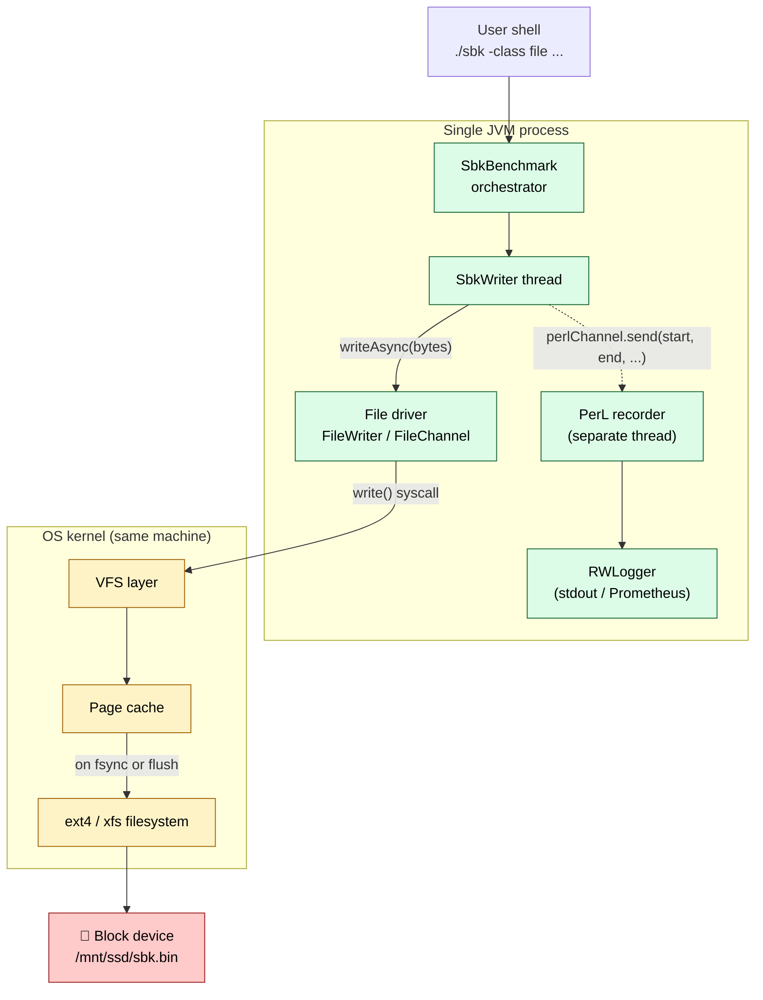
```mermaid
flowchart TB
    USER["User shell<br/>./sbk -class file ..."]

    subgraph JVM["Single JVM process"]
        BENCH["SbkBenchmark<br/>orchestrator"]
        WRITER["SbkWriter thread"]
        DRV["File driver<br/>FileWriter / FileChannel"]
        PERL["PerL recorder<br/>(separate thread)"]
        LOG["RWLogger<br/>(stdout / Prometheus)"]
    end

    subgraph KERNEL["OS kernel (same machine)"]
        VFS["VFS layer"]
        CACHE["Page cache"]
        FS["ext4 / xfs filesystem"]
    end

    DEV["💾 Block device<br/>/mnt/ssd/sbk.bin"]

    USER --> BENCH
    BENCH --> WRITER
    WRITER -->|"writeAsync(bytes)"| DRV
    DRV -->|"write() syscall"| VFS
    VFS --> CACHE
    CACHE -->|"on fsync or flush"| FS
    FS --> DEV
    WRITER -.->|"perlChannel.send(start, end, ...)"| PERL
    PERL --> LOG

    classDef proc fill:#dcfce7,stroke:#166534,color:#000
    classDef os   fill:#fef3c7,stroke:#a16207,color:#000
    classDef dev  fill:#fecaca,stroke:#991b1b,color:#000
    class BENCH,WRITER,DRV,PERL,LOG proc
    class VFS,CACHE,FS os
    class DEV dev
```

**What gets measured?** The interval from `time.getCurrentTime()` just
before `writer.writeAsync(data)` to the moment that call returns.
For a buffered file write that is *very* fast — typically tens of
microseconds — because the bytes only have to land in the kernel's
page cache. To measure the storage device honestly, the user adds
`-sync 1` to force an `fsync()` on every record (see the File driver
README), which drives the latency up by several orders of magnitude
and exposes the real device behaviour.

**What latency floor is the harness adding?** With `-sync 0` (buffered)
and 4 KiB records, the File driver's `writeAsync` call is itself only
a few microseconds. The PerL hot path (`perlChannel.send()`) is sub-
microsecond. So the harness overhead is a single-digit percentage of
the smallest measurable PUT — even on the most extreme case the
framework supports.

### 12.3 Example B — remote S3 (MinIO / ObjectScale) benchmarking

Command (from the MinIO driver README):

```bash
./build/install/sbk/bin/sbk -class minio \
  -url https://10.249.249.223:9021 \
  -key user -secret pass -bucket bench \
  -extra-headers x-emc-namespace=ns1 \
  -writers 4 -size 1048576 -seconds 60
```

Now the driver acts as an HTTP/TLS client. See
<ref_file file="/root/projects/SBK/drivers/minio/src/main/java/io/sbk/driver/MinIO/MinIOWriter.java" />.

```mermaid
flowchart TB
    USER["User shell<br/>./sbk -class minio ..."]

    subgraph CLIENT["Client host (running SBK)"]
        BENCH["SbkBenchmark"]
        W1["SbkWriter #1"]
        W2["SbkWriter #2"]
        W3["SbkWriter #3"]
        W4["SbkWriter #4"]
        DRV["MinIO driver<br/>(MinIOWriter)"]
        SDK["MinIO Java SDK<br/>PutObjectArgs.builder()"]
        OK["OkHttp client<br/>(TLS, connection pool)"]
        PERL["PerL recorder"]
        LOG["PrometheusLogger :9718"]
    end

    NET(("🌐 Network<br/>(HTTPS / TLS)"))

    subgraph SUT["S3-compatible cluster (the system under test)"]
        LB["Load balancer / endpoint"]
        S3A["S3 node A"]
        S3B["S3 node B"]
        S3C["S3 node C"]
        DISK["Backend disks"]
    end

    USER --> BENCH
    BENCH --> W1
    BENCH --> W2
    BENCH --> W3
    BENCH --> W4
    W1 -->|"writeAsync(bytes)"| DRV
    W2 -->|"writeAsync(bytes)"| DRV
    W3 -->|"writeAsync(bytes)"| DRV
    W4 -->|"writeAsync(bytes)"| DRV
    DRV -->|"client.putObject(args)"| SDK
    SDK -->|"PUT /bench/obj-<uuid>"| OK
    OK --> NET
    NET --> LB
    LB --> S3A
    LB --> S3B
    LB --> S3C
    S3A --> DISK
    S3B --> DISK
    S3C --> DISK
    W1 -.->|"perlChannel.send(start, end, ...)"| PERL
    W2 -.-> PERL
    W3 -.-> PERL
    W4 -.-> PERL
    PERL --> LOG

    classDef proc  fill:#dcfce7,stroke:#166534,color:#000
    classDef net   fill:#dbeafe,stroke:#1e40af,color:#000
    classDef sut   fill:#fecaca,stroke:#991b1b,color:#000
    class BENCH,W1,W2,W3,W4,DRV,SDK,OK,PERL,LOG proc
    class NET net
    class LB,S3A,S3B,S3C,DISK sut
```

**What gets measured?** The interval from just before
`client.putObject(args)` to the moment the SDK returns success. That
interval includes:

1. SDK marshalling (`PutObjectArgs` → HTTP request).
2. SigV4 signature computation.
3. TLS handshake (amortised across the connection pool).
4. Network round-trip (client ↔ S3 endpoint).
5. Server-side processing (signature validation, write to backend,
   replication if any, response).
6. Network reverse trip and HTTP response parsing.

So the number that lands in PerL's histogram is the **client-observed
per-PUT latency**, which is what an application engineer cares about
in production. It is *not* just the device latency — it includes all
the protocol overhead that a real client would see.

**Cross-vendor comparability.** Because the SBK harness, the PerL
recording path, and the workload-generation logic are identical
between this run and (say) the same command against an AWS S3 bucket
or a Ceph RGW gateway, the *only* difference in the numbers is the
storage system itself. Any latency comparison made this way is
genuinely apples-to-apples.

### 12.4 Side-by-side: the only thing that changes is the driver

```mermaid
flowchart LR
    subgraph HARNESS["The harness — identical for every driver"]
        SB["SbkBenchmark"]
        SW["SbkWriter"]
        SR["SbkReader"]
        PE["PerL recorder"]
        LG["RWLogger"]
    end

    subgraph DRV1["File driver"]
        D1["FileChannel.write() — local syscall"]
    end

    subgraph DRV2["MinIO driver"]
        D2["MinioClient.putObject() — HTTPS to remote endpoint"]
    end

    subgraph DRV3["Kafka driver"]
        D3["KafkaProducer.send() — TCP to broker"]
    end

    subgraph DRV4["Cassandra driver"]
        D4["Session.executeAsync() — CQL over TCP"]
    end

    HARNESS --> DRV1
    HARNESS --> DRV2
    HARNESS --> DRV3
    HARNESS --> DRV4

    classDef same fill:#dcfce7,stroke:#166534,color:#000
    classDef diff fill:#fef3c7,stroke:#a16207,color:#000
    class SB,SW,SR,PE,LG same
    class D1,D2,D3,D4 diff
```

The driver layer (yellow) is the **only** thing that differs across
storage backends. The green harness — `SbkBenchmark`, `SbkWriter`,
`SbkReader`, PerL, `RWLogger` — is identical bit-for-bit. That is the
property that lets a researcher compare RocksDB to Cassandra to S3 on
exactly the same latency-measurement methodology, with no
methodology-attributable noise creeping in.

---

## 13. For research scholars — choosing SBK for accurate, vendor-neutral benchmarking

If you are a graduate student or researcher designing a study that
compares storage systems — whether for a thesis, a paper, a system
selection at a sponsor lab, or a thesis chapter on a custom system —
this section explains, with **technical evidence drawn from the code
above**, why SBK is a defensible choice for the measurement
methodology.

The recommendation is not "SBK is the best benchmarking tool ever
made". The recommendation is: **SBK eliminates several specific
classes of measurement error** that plague hand-rolled benchmarks
and many older tools. If your study cares about those error sources,
SBK is the right substrate.

### 13.1 Six measurement-quality properties, with evidence

| Property | What it gives you | Code evidence |
|---|---|---|
| **No-sample percentiles** | The p99.9 and p99.99 you publish are computed from **every** operation, not a reservoir sample. There is no sampling-bias term in your tail. | `LatencyRecordWindow.reportLatency()` increments a histogram bucket on every call. <ref_file file="/root/projects/SBK/perl/src/main/java/io/perl/api/impl/HashMapLatencyRecorder.java" /> + <ref_file file="/root/projects/SBK/perl/src/main/java/io/perl/api/impl/ArrayLatencyRecorder.java" />. |
| **Lock-free concurrent queues end-to-end** | The measurement does **not** distort the latency you measure: the worker thread executes a single CAS to enqueue (no `synchronized`, no `Lock`, no allocation beyond a 32-byte `TimeStamp`); the single consumer dequeues with another CAS. A `ConcurrentLinkedQueueArray` stripes the load so the lock-free property holds even with many concurrent workers. SBM uses the same primitive on its server side. | `CQueueChannel.send()` → `ConcurrentLinkedQueue.offer()`. <ref_file file="/root/projects/SBK/perl/src/main/java/io/perl/api/impl/CQueuePerl.java" /> and <ref_file file="/root/projects/SBK/perl/src/main/java/io/perl/api/impl/ConcurrentLinkedQueueArray.java" />. |
| **Single-consumer recording** | No contention between workers and recorder; histogram updates are `++` on local data. The harness will not become the bottleneck before the storage system does. | `PerformanceRecorderIdleBusyWait.run()` — one thread reads from all channels. <ref_file file="/root/projects/SBK/perl/src/main/java/io/perl/api/impl/PerformanceRecorderIdleBusyWait.java" />. |
| **No clock contention between measurer and measured** | The recorder makes 0 clock calls per record processed, and ~1 per window interval when idle. Workers do not compete with the harness for `System.nanoTime()`/`currentTimeMillis()`, so the harness does not perturb its own measurements. | `ElasticWait.waitAndCheck()` (counter-based back-off) + `PerformanceRecorderIdleBusyWait.run()` (reuses `t.endTime` instead of re-querying). <ref_file file="/root/projects/SBK/perl/src/main/java/io/perl/api/impl/ElasticWait.java" />. See §3.3 Pillar 3. |
| **Identical methodology across vendors** | Comparison between, say, S3 and Cassandra has zero methodology-attributable variance. Only the driver's `writeAsync` differs (§12.4). | The same `SbkBenchmark`, `SbkWriter`, `PerL`, `RWLogger` instantiate identically for every `-class <driver>`. See <ref_file file="/root/projects/SBK/sbk-api/src/main/java/io/sbk/api/impl/Sbk.java" />. |
| **Distributed measurement is mathematically sound** | When you scale your study to N client machines, SBM aggregates **histograms**, which are associative. Merging is order-independent and lossless — unlike combining per-client averages or per-client percentiles, which is mathematically wrong. | `SbmTotalWindowLatencyPeriodicRecorder.addLatenciesRecord(record)`: `record.getLatencyMap().forEach(window::reportLatency)`. <ref_file file="/root/projects/SBK/sbm/src/main/java/io/sbm/api/impl/SbmTotalWindowLatencyPeriodicRecorder.java" />. |

### 13.2 Why "histograms are mergeable" matters for distributed studies

A point that often catches graduate students: **you cannot average
two percentiles**. If client A measures p99 = 100 ms and client B
measures p99 = 200 ms, the *combined* p99 is not (100+200)/2 = 150 ms.
It depends on the underlying distributions and the number of samples
each client produced. The correct way is to merge the raw
distributions and recompute.

SBK does this correctly because it ships **histograms** (the full
distribution per period) over SBP rather than pre-computed
percentiles. SBM then merges histograms before computing
percentiles. The mathematics is in §6.4.

If your study uses N client machines and reports a single p99, you
need this property — and most ad-hoc benchmarking scripts get it
wrong.

### 13.3 The Sliding Latency Coverage (SLC) factors

SBK publishes two summary statistics specific to its design — **SLC1**
and **SLC2** — defined in the README and the design PDF
<ref_file file="/root/projects/SBK/docs/sbk-slc.pdf" />. From the README:

> *"The SLC1 indicates the coefficient of dispersion from lower
> latency percentile to median percentile. … The SLC2 indicates the
> coefficient of dispersion from median latency percentile and all
> other percentile values to the last (maximum) percentile (99.99th
> percentile). If you are comparing two or more storage systems
> which are having similar / approximate median latency percentiles
> then SLC2 gives which storage system is doing better."*

For a research thesis comparing systems with similar medians but
different tail behaviour, SLC2 is a single-number tail-quality score
that travels well in tables and abstracts. Cite the PDF in the
methodology section.

### 13.4 Reproducibility checklist for an SBK-based study

If you publish results obtained with SBK, including the following in
your "Experimental Setup" section makes the study fully reproducible:

1. **SBK version and commit hash** (e.g. v10.0, commit `5a623178`).
2. **Driver** used (e.g. `minio`, `cassandra`, `kafka`).
3. **PerL configuration**: `qPerWorker`, `idleNS`, `maxArraySizeMB`,
   `maxHashMapSizeMB`, `histogram` (yes/no). Defaults are in
   <ref_file file="/root/projects/SBK/perl/src/main/resources/perl.properties" />.
4. **Workload**: `-writers`, `-readers`, `-size`, `-seconds` or
   `-records`, `-throughput`, and any driver-specific flags.
5. **Storage configuration** (cluster size, replication, region,
   storage class, etc.).
6. **JVM**: vendor + version + heap size, e.g. `OpenJDK 25 -Xmx16g`.
7. **Hardware and network**: client host CPU/RAM, network bandwidth/RTT
   between client and storage.
8. **Output logger**: `-out PrometheusLogger` (with metrics endpoint)
   or `-out CSVLogger` (with the CSV file attached as supplementary
   material).

Every one of these can be controlled via flags or properties, so the
exact run is bit-reproducible from the same command.

### 13.5 When *not* to use SBK for a study

Being explicit about scope strengthens any methodology section:

- **Modelling realistic application workloads.** SBK runs a closed
  loop of one-record-at-a-time operations. If your research question
  is *"how does this system behave under the YCSB workload-D access
  pattern with Zipfian keys"*, SBK does not generate that workload
  out of the box. Use YCSB for that question, or extend SBK with a
  custom `Reader`/`Writer` (§9).
- **Root-causing internal storage-system behaviour.** SBK measures
  external behaviour. For "*why* is the p99 high?" you also need
  bpftrace, eBPF, perf, or vendor-specific tools.
- **Sub-microsecond inter-process IPC studies.** PerL's busy-wait
  idle is configured at 1 µs minimum; for benchmarks where the
  measured latency is below 1 µs, the harness's recording floor
  starts to matter. Most storage benchmarks are nowhere near this
  regime, but local IPC ring-buffer benchmarks may be.

### 13.6 Tradeoffs SBK makes (and why they are usually the right ones)

| Tradeoff | Why SBK chooses this |
|---|---|
| **Memory grows with distinct latency values** | The default 192 MB HashMap budget covers nanosecond resolution over hour-long runs for almost any storage system. If you exhaust it, SBK degrades gracefully to HdrHistogram (~2 MB sparse). |
| **One CPU core caps recording rate** | Histogram updates take ~10 ns; even 100 M ops/sec is < 100 % of one core. In return, the histogram needs no synchronisation. For 99 % of storage benchmarks this is invisible. |
| **JVM warm-up in the first 1–2 seconds** | SBK is Java. The standard `-seconds 60` defaults absorb warm-up. For sub-10-second studies, discard the first window (and SBK prints periodic windows so you can do this without re-running). |
| **End-to-end latency is per-driver** | The harness cannot know whether a driver's payload format supports embedding a timestamp. Drivers that do (e.g. Kafka, Pravega) measure true E2E; others measure per-operation. The driver README should make this explicit. |

### 13.7 In summary — when to choose SBK

> ✅ Choose SBK if your study makes **quantitative latency or throughput
> claims that need to be defensible at the tail percentile**, and
> especially if it makes **cross-vendor or cross-configuration
> comparisons** that require identical measurement methodology.

The framework gives you, by design and with code-level evidence, the
properties that an academic-grade methodology requires: no-sample
fidelity, **lock-free concurrent queues** that connect the workers to
the recorder without ever taking a mutex, identical instrumentation
across heterogeneous storage systems, and mathematically-correct
distributed aggregation.

You still own the workload design, the SUT configuration, and the
analysis. SBK is the *measurement substrate* — and on that axis it
is, today, one of the strongest open-source choices available.

---

## 14. Where to read next

This document gave you the SBK architecture from 10,000 feet. To go
deeper:

### In this repository

- <ref_file file="/root/projects/SBK/README.md" /> — the user manual (~1200 lines)
- <ref_file file="/root/projects/SBK/perl/README.md" /> — PerL library notes
- <ref_file file="/root/projects/SBK/sbm/README.md" /> — SBM deployment guide
- <ref_file file="/root/projects/SBK/sbk-gem/README.md" /> — SBK-GEM deployment guide
- <ref_file file="/root/projects/SBK/sbk-yal/README.md" /> — YML format
- <ref_file file="/root/projects/SBK/drivers/minio/README.md" /> — example driver doc + S3-specific tutorial

### Original design documents (PDFs in this repo)

- <ref_file file="/root/projects/SBK/docs/sbk.pdf" /> — original SBK design paper, especially the concurrent-queue architecture
- <ref_file file="/root/projects/SBK/docs/sbp.pdf" /> — SBP (Storage Benchmark Protocol) wire-format specification
- <ref_file file="/root/projects/SBK/docs/sbk-slc.pdf" /> — SLC1/SLC2 (Sliding Latency Coverage) factor definitions
- <ref_file file="/root/projects/SBK/docs/kafka-pravega.pdf" /> — comparison benchmark that motivated SBK

### Source-code reading order suggested for new contributors

1. `perl/src/main/java/io/perl/api/impl/CQueuePerl.java` — the heart
2. `perl/src/main/java/io/perl/api/impl/PerformanceRecorderIdleBusyWait.java` — the consumer
3. `perl/src/main/java/io/perl/api/impl/PerlBuilder.java` — the wiring
4. `sbk-api/src/main/java/io/sbk/api/Storage.java` — the SPI
5. `sbk-api/src/main/java/io/sbk/api/impl/SbkBenchmark.java` — the orchestrator
6. `sbk-api/src/main/java/io/sbk/api/impl/Sbk.java` — the bootstrap
7. `sbk-api/src/main/java/io/sbk/logger/impl/PrometheusLogger.java` — a real logger
8. `drivers/file/src/main/java/io/sbk/driver/File/File.java` — the simplest real driver
9. `sbm/src/main/java/io/sbm/api/impl/SbmBenchmark.java` — distributed aggregation
10. `sbk-gem/src/main/java/io/gem/api/impl/SbkGemBenchmark.java` — SSH orchestration

If you make it through that reading list, you understand SBK as well
as anyone outside its core maintainers. From there, picking up a
driver or logger contribution is short work.

---

*This architecture document was generated by reading every relevant
class in the SBK source tree against the existing README and PDF
documentation. Every class name, method signature, file path, and
configuration default cited above can be verified directly against the
code in this repository.*
