<!--
Copyright (c) KMG. All Rights Reserved.

Licensed under the Apache License, Version 2.0 (the "License");
you may not use this file except in compliance with the License.
You may obtain a copy of the License at

    http://www.apache.org/licenses/LICENSE-2.0
-->

# The SBK Architecture — Internal Design and Implementation

> **Audience.** This document is written for **computer-science engineering
> students, graduate researchers, and engineers** who want to understand how
> SBK is built — not just what it does. Claims link to the Java, protobuf,
> properties, and Gradle sources that define current behavior. Read
> top-to-bottom for a guided tour, or jump to any section using the table of
> contents. Performance statements are architectural explanations, not fixed
> latency or throughput guarantees for every JVM and host. The guide assumes
> basic Java knowledge, but it does **not** assume prior experience with
> benchmarking frameworks, lock-free queues, histograms, gRPC, or distributed
> systems. New terms are defined before they are used.

---

## Abbreviations

This document uses these abbreviations consistently. Memorise them once and
the rest reads easily:

| Abbrev. | Expansion | One-line role |
|---|---|---|
| **SBK** | **Storage Benchmark Kit** | The whole framework / the single-node CLI launcher |
| **PerL** | **Performance Logger** | The latency-recording library at the heart of SBK |
| **SBM** | **Storage Benchmark Monitor** | gRPC server that aggregates results from many SBK clients |
| **SBP** | **Storage Benchmark Protocol** | The wire protocol clients use to talk to SBM |
| **SBK-GEM** | **SBK Group Execution Monitor** | SSH-based distributed launcher (runs SBK on N hosts) |
| **SBK-YAL** | **SBK YML Arguments Loader** | YML-driven wrapper for SBK (single node) |
| **SBK-GEM-YAL** | **SBK-GEM YML Arguments Loader** | YML-driven wrapper for SBK-GEM (multi-node) |

These names appear all over the codebase, the existing READMEs, and the
PDFs in `docs/`. Wherever this document refers to a component for the
first time it includes the full expansion; later mentions use the short
form.

This document uses **YML** uniformly — for the abbreviation expansion
(`YAL = YML Arguments Loader`, per `SbkYal.DESC`), for the configuration
file format, and for the default file extension (`.yml`). Where the
source code uses the variant spelling `Yml` in identifiers
(`SbkYmlMap`, `YmlMap`, `getYmlArgs()`), the text reproduces those
identifiers verbatim.

### Beginner vocabulary

These terms recur throughout the guide:

| Term | Plain-language meaning |
|---|---|
| **Operation** | One storage action, such as one object PUT, file write, queue send, or database read. |
| **Latency** | Elapsed time between an operation's recorded start and completion. |
| **Throughput** | Work completed per unit of time, usually records/s or MiB/s. |
| **Worker / producer** | A task that calls a storage driver. It produces latency records for PerL. |
| **Recorder / consumer** | The PerL task that consumes latency records and updates statistics. |
| **Hot path** | Code executed for every measured operation; small costs here multiply by operation count. |
| **Queue** | A thread-safe hand-off structure: workers add records, the recorder removes them. |
| **Latency bucket** | A latency value and its observation count; for example, `5 ms -> 120 operations`. |
| **Window** | Statistics collected for a bounded interval. SBK reports periodic windows and a total window. |
| **Percentile** | A latency boundary. p99 means 99% of valid observations are at or below that value. |
| **SPI** | A small Java interface implemented by plugins such as storage drivers or loggers. |
| **Back pressure / backlog** | Records accumulate because a downstream stage is slower than its producers. |

### The one-operation mental model

Before studying classes, follow one write through the system. Every detailed
diagram later in the document expands one box from this picture:

```mermaid
flowchart LR
    CLI["1. CLI selects<br/>driver + workload"] --> H["2. Harness creates<br/>worker tasks"]
    H --> D["3. Driver calls<br/>storage API"]
    D --> T["4. Completion produces<br/>start/end timestamps"]
    T --> Q["5. PerL channel enqueues<br/>a TimeStamp record"]
    Q --> R["6. Recorder updates<br/>latency window"]
    R --> L["7. Logger emits<br/>periodic + total results"]
    L -. optional distributed path .-> P["8. SBP sends counts<br/>to SBM"]

    classDef input fill:#e0e7ff,stroke:#4338ca,color:#000
    classDef work fill:#dcfce7,stroke:#166534,color:#000
    classDef measure fill:#fef3c7,stroke:#a16207,color:#000
    classDef distributed fill:#f3e8ff,stroke:#7e22ce,color:#000
    class CLI,H input
    class D,T work
    class Q,R,L measure
    class P distributed
```

The crucial separation is between boxes 3–4 (doing and timing storage work)
and boxes 5–7 (aggregating and reporting measurements). SBK exists largely to
make that separation reusable and consistent across storage technologies.

---

## Table of contents

1. [What is SBK, and why does it exist?](#1-what-is-sbk-and-why-does-it-exist)
2. [The ecosystem at a glance](#2-the-ecosystem-at-a-glance)
3. [PerL — the Performance Logger foundation](#3-perl--the-performance-logger-foundation)
4. [SBK-API — the pluggable benchmark harness](#4-sbk-api--the-pluggable-benchmark-harness)
5. [The four launchers (SBK / SBK-YAL / SBK-GEM / SBK-GEM-YAL)](#5-the-four-launchers)
6. [SBM — the distributed results aggregator](#6-sbm--the-distributed-results-aggregator)
7. [SBK-GEM — the distributed orchestrator](#7-sbk-gem--the-distributed-orchestrator)
8. [Why is SBK a high-performance framework?](#8-why-is-sbk-a-high-performance-framework)
9. [Pluggable drivers — worked example](#9-pluggable-drivers--worked-example)
10. [Pluggable loggers — worked example](#10-pluggable-loggers--worked-example)
11. [End-to-end execution trace](#11-end-to-end-execution-trace)
12. [Data flow examples — local storage vs remote storage](#12-data-flow-examples--local-storage-vs-remote-storage)
13. [For research scholars — choosing SBK for accurate, vendor-neutral benchmarking](#13-for-research-scholars--choosing-sbk-for-accurate-vendor-neutral-benchmarking)
14. [Where to read next](#14-where-to-read-next)

---

## 1. What is SBK, and why does it exist?

**SBK** — **Storage Benchmark Kit** — is a Java framework for measuring the
performance of *any* storage system: object stores, message queues, key-value
stores, relational databases, file systems, in-memory caches. The same
harness drives all of them through a single, very small SPI (Service
Provider Interface).

Why is a framework needed? A small benchmark often mixes storage calls,
timestamping, percentile calculation, logging, retries, and thread management
inside one loop. That makes it difficult to know whether a result describes
the storage system or the benchmark program. It also makes comparisons unfair
when every backend gets a different measurement loop.

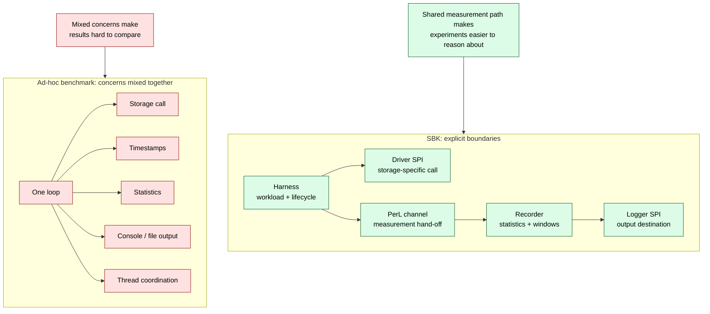

SBK does not remove every source of measurement error. Instead, it gives
storage systems a common harness and makes the remaining choices—driver
completion semantics, latency range, time unit, durability, concurrency,
warm-up, and environment—visible and documentable.

The framework's stated design principle, quoted verbatim from
[README](../README.md):

> "The design principle of SBK is the **Performance Benchmarking of *'Any
> Storage System'* with *'Any Type of data payload'* and *'Any Time
> Stamp'***, because the SBK is not specific to particular type of storage
> system, it can be used for performance benchmarking of any storage
> system…"

In practice that means:

- **Storage agnostic.** 53 drivers are enabled in the aggregate build today (Kafka,
  Pulsar, Pravega, BookKeeper, S3, HDFS, Cassandra, MongoDB, Redis,
  RocksDB, PostgreSQL, …). Adding a new one is a matter of implementing
  one Java interface with seven methods.
- **Payload agnostic.** Default `byte[]`, but drivers can register
  `String`, `ByteBuffer`, or custom payload types.
- **Timestamp agnostic.** Latencies can be measured in milliseconds,
  microseconds, or nanoseconds — the same code paths work for all
  three.

### Three design properties that make SBK unusual

1. **Operations are recorded without reservoir sampling.** Each completed
   operation submitted to PerL contributes its latency and record count to a
   latency distribution. Array and primitive-map windows preserve exact
   integer latency values within the configured range; the optional HdrHistogram
   extension trades exact values for bounded, three-significant-digit
   precision. Invalid and out-of-range values are counted separately rather
   than silently treated as valid samples (§3).

2. **Measurement hand-off uses intrusive non-blocking queues.** By default,
   worker threads submit `TimeStampNode` records through PerL's specialized
   multiple-producer, single-consumer queues. One object is both timestamp and
   linked node, avoiding the separate wrapper allocated by a general-purpose
   `ConcurrentLinkedQueue`. PerL shards traffic across an array of queues to
   reduce contention, while a single recorder owns each latency window.
   `MpscQueueEnable=false` supplies a property-level JDK fallback, while the
   common `-mpscqueue false` option can select that path for one SBK run.
   Lock-free does not mean zero cost: enqueue can retry a CAS, but progress
   does not depend on another thread releasing a lock (§3).

3. **The framework is its own ecosystem.** **PerL** (Performance Logger,
   the latency library) is a reusable Java library independent of SBK;
   **SBM** (Storage Benchmark Monitor, the aggregator) is a reusable
   gRPC server; **SBK-GEM** (SBK Group Execution Monitor, the SSH
   orchestrator) is a reusable distributed launcher. Each piece is a
   separate Gradle subproject and can be used standalone.

This document walks through each of those pieces in turn.

---

## 2. The ecosystem at a glance

SBK is a multi-project Gradle build. The seven modules listed in
[settings.gradle](../settings.gradle) form two layers — a
**library/SPI layer** and a **launcher layer** — plus a distributed
**aggregator** and **orchestrator**.

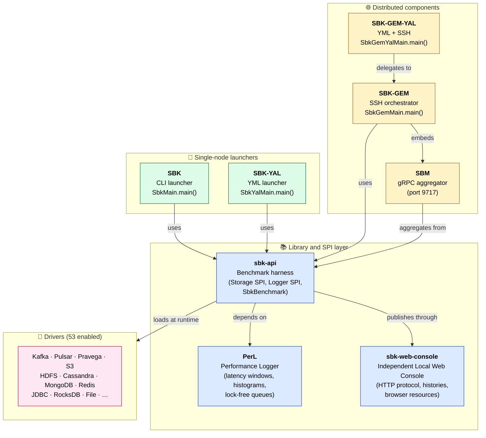

### Module purposes in one sentence each

| Module | Full name | Purpose |
|---|---|---|
| `perl` | **PerL** — Performance Logger | Storage-agnostic latency-recording library: lock-free queues, sliding windows, and exact primitive-map / array latency recorders. |
| `sbk-web-console` | **SBK Local Web Console** | Independent HTTP server/client protocol, bounded histories, browser resources, and standalone launcher shared by the WebLogger adapters. |
| `sbk-api` | **SBK** — Storage Benchmark Kit (harness layer) | The benchmarking harness: defines the `Storage<T>` SPI for drivers, orchestrates writers and readers, parses CLI args, integrates loggers. |
| `sbk-yal` | **SBK-YAL** — SBK YML Arguments Loader | YML-driven launcher; converts a `.yml` benchmark spec into `sbk-api` args. |
| `sbm` | **SBM** — Storage Benchmark Monitor | Standalone gRPC server that *aggregates* latency histograms from many SBK clients into a cluster-wide view. Listens on port 9717. Speaks the **SBP** (Storage Benchmark Protocol). |
| `sbk-gem` | **SBK-GEM** — SBK Group Execution Monitor | SSH-based distributed launcher: copies SBK to each node, starts SBM locally, then runs SBK on every remote host. |
| `sbk-gem-yal` | **SBK-GEM-YAL** — SBK-GEM YML Arguments Loader | YML-driven variant of SBK-GEM. |

### Driver and logger discovery

Drivers are looked up by **simple class name** (e.g. `-class minio` finds
`io.sbk.driver.MinIO.MinIO`). Loggers are looked up the same way
(e.g. `-out CSVLogger` finds `io.sbk.logger.impl.CSVLogger`). The
discovery itself happens via a small package-scanning helper in
`sbk-api`, ultimately backed by [Reflections][reflections] (the library,
not Java's `java.lang.reflect`). The same pattern is used for
`GemLogger` discovery in SBK-GEM.

Think of discovery as a runtime plugin directory: the command supplies a short
name, package scanning finds candidate Java classes, and SBK instantiates the
matching implementation before it asks that implementation to register and
parse its own flags.

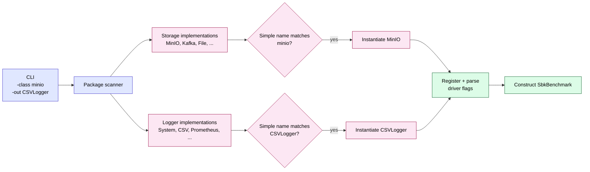

[reflections]: https://github.com/ronmamo/reflections

---

## 3. PerL — the Performance Logger foundation

**PerL** — short for **Performance Logger** — is the heart of SBK. It is a
**storage-agnostic Java library** for recording per-operation latencies,
sliding them through periodic windows, computing percentiles, and
exporting metrics. Nothing in PerL knows about S3, Kafka, or any
specific storage system.

The PerL README states the goal succinctly:

> *"The PerL provides the foundation APIs for performance benchmarking,
> storing latency values and calculating percentiles."*

### 3.1 The control-flow problem PerL solves

When a writer thread completes a PUT, it produces one piece of data:
`(startTime, endTime, records, bytes)`. The benchmark harness needs to
do five things with it, every time, at potentially millions of records
per second:

1. **Record** the latency `(endTime - startTime)` into a histogram.
2. **Accumulate** bytes/records into running totals.
3. **Slide** the recording window every N seconds and emit periodic
   reports.
4. **Track** an overall total so the final report has lifetime numbers.
5. **Forward** the data to one or more output sinks (console, CSV,
   Prometheus, gRPC).

Doing all five on every writer would add statistics and output work directly
to the operation loop, making the worker more likely to become the bottleneck.
PerL's solution is to **move aggregation off the writer thread and onto a
single recorder task**, communicating through non-blocking queues.

A useful analogy is a restaurant pass. Cooks (workers) finish dishes and place
small tickets on the pass (queues). One expediter (recorder) reads tickets and
updates the order board (latency windows). Cooks do not stop to calculate the
restaurant's average preparation time or print a report after every dish.

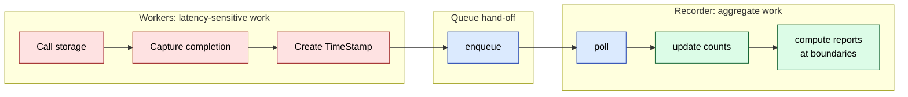

### 3.2 The PerL architecture

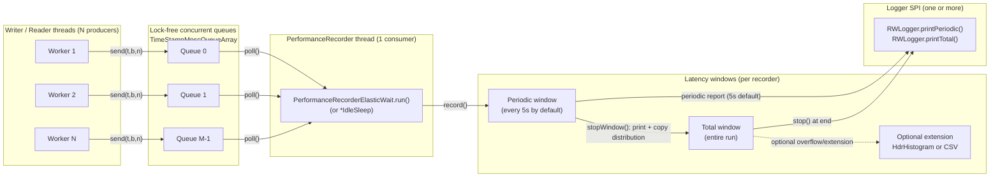

### 3.3 The five pillars of PerL

#### Pillar 1 — `CQueuePerl`: the orchestrator

[CQueuePerl.java](../perl/src/main/java/io/perl/api/impl/CQueuePerl.java)
ties everything together. On construction it:

```java
this.channels = new Channel[this.index];   // N concurrent channels
for (int i = 0; i < channels.length; i++) {
    channels[i] = perlConfig.mpscQueueEnable
            ? new TimeStampMpscQueueChannel(maxQs, new OnError())
            : new CQueueChannel(maxQs, new OnError());
}
this.perlReceiver = new PerformanceRecorderElasticWait(   // ...or *IdleSleep
        periodicRecorder, channels, time, reportingIntervalMS, idleNS);
```

`getPerlChannel()` hands a **fresh `PerlChannel` (the writer-facing
proxy)** to each newly-spawned worker, rotating round-robin through the
array. A worker calls `perlChannel.send(startTime, endTime, records,
bytes)` on its hot path — that's the *only* thing it has to do.

The two channel implementations remain independent.
`TimeStampMpscQueueChannel` extends `TimeStampMpscQueueArray`; every element is
a single-use `TimeStampNode`, the only permitted subclass of `TimeStamp`, with
its queue link in the same object. The original `CQueueChannel` continues to
extend `ConcurrentLinkedQueueArray<TimeStamp>` unchanged. `MpscQueueEnable` supplies
the property default, and SBK's common `-mpscqueue true|false` option overrides
that selection before either writer or reader PerL instance is built. Both
provide **non-blocking queue operations** without an application mutex or
monitor.

The array-of-queues design is the scaling layer. `CQueuePerl` normally
creates one channel per configured worker. Each channel contains
`qPerWorker` queues (10 by default, with a minimum of 3). A worker-facing
`PerlChannel` advances its private `wIndex` for each send, while the recorder
advances `rIndex` while polling. This spreads updates over more queue head and
tail locations as worker count grows and reduces the chance that many cores
continually update one queue. `maxQs`, when non-zero, changes the topology to
a configured total queue count instead of the per-worker default.

The default producer allocates exactly one `TimeStampNode` per measurement.
The fallback allocates a `TimeStamp`, and `ConcurrentLinkedQueue` allocates
its internal node. The intrusive path therefore removes one young-generation
object per operation while keeping percentile calculation, sorting, and
logger I/O out of the storage-operation call path.

`TimeStampMpscQueue` is specialized for the topology PerL actually has:
**many worker producers and exactly one recorder consumer**. That restriction
is what permits the recorder to own `head` without a consumer CAS and permits
the timestamp itself to be the linked node. It is not a general replacement
for `ConcurrentLinkedQueue`: use the JDK queue when multiple consumers,
iterators, arbitrary element types, removal, or collection APIs are required.

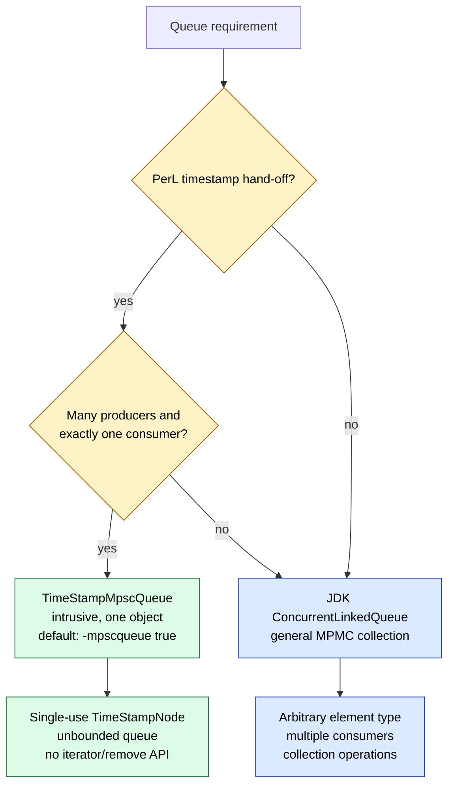

The current queue algorithm has four important steps:

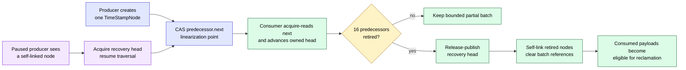

The successful `predecessor.next` CAS publishes the immutable timestamp fields
to the consumer. The consumer's acquire read observes that publication.
Retirement is batched at 16 in production to group reclamation stores.
Before self-linking a batch, the consumer release-publishes a live recovery
head. A producer paused on an old predecessor can therefore detect the
self-link and restart without retaining or traversing an unbounded consumed
chain. Nodes are not pooled: pooling would retain heap, complicate ownership,
and introduce reuse/ABA hazards. Producer and consumer state are held in
separate manually padded objects as a best-effort false-sharing reduction;
Java does not guarantee cache-line placement, and the padding is not part of
the correctness argument.

For a research-oriented treatment of the queue algorithm, including its
linearization points, Java Memory Model edges, stale-producer recovery,
batched reclamation, feature-by-feature comparison with JDK 25
`ConcurrentLinkedQueue`, reproducible JMH results, threats to validity, and
primary references, see
[TimeStampMpscQueue: architecture, correctness, and performance](TIMESTAMP_MPSC_QUEUE.md).

The two-level topology is easy to miss in code. With two workers and the
default `qPerWorker=10`, the conceptual layout is:

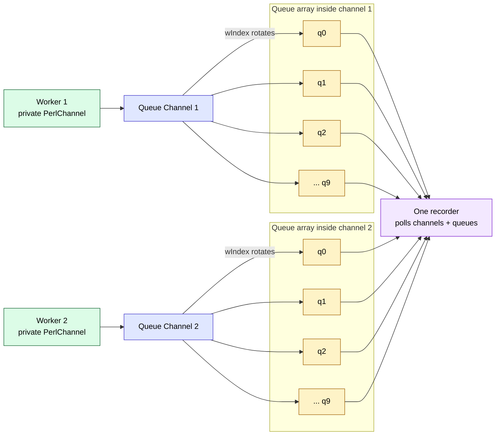

`wIndex` prevents one worker from repeatedly touching one queue. The recorder
uses each channel's `rIndex` to inspect those queues in turn. Queue sharding
reduces shared-location contention; the one recorder still defines the drain
capacity of this PerL instance.

#### Pillar 2 — `PerformanceRecorderElasticWait`: the single consumer

The recorder thread runs the loop in
[PerformanceRecorderElasticWait.java](../perl/src/main/java/io/perl/api/impl/PerformanceRecorderElasticWait.java):

```java
while (doWork) {
    notFound = true;
    for (int i = 0; doWork && (i < channels.length); i++) {
        t = channels[i].receive(windowIntervalMS);
        if (t != null) {
            notFound = false;
            dataSinceIdle = true;
            ctime = t.endTime;
            if (t.isEnd()) { doWork = false; }
            else {
                recordsCnt += t.records;
                periodicRecorder.record(t.startTime, t.endTime, t.records, t.bytes);
                ...
            }
            if (periodicRecorder.elapsedMilliSecondsWindow(ctime) >= windowIntervalMS) {
                periodicRecorder.stopWindow(ctime);  // emit periodic report
                periodicRecorder.startWindow(ctime);
                idleWait.reset();
                dataSinceIdle = false;
            }
        }
    }
    if (doWork && notFound) {
        if (dataSinceIdle) {
            idleWait.startIdle(
                    periodicRecorder.elapsedMilliSecondsWindow(ctime));
            dataSinceIdle = false;
        }
        if (idleWait.waitAndCheck()) { /* elastic back-off */ }
    }
}
```

There are **two variants** of the recorder, chosen by config:

| Variant | When chosen | Behavior on empty queue |
|---|---|---|
| `PerformanceRecorderElasticWait` | `sleepMS = 0` (default) | Calls `LockSupport.parkNanos(idleNS)` between empty scans and uses `ElasticWait` to decide when to check the clock. The configured default is **1 ms**; the enforced minimum is **1 µs**. |
| `PerformanceRecorderIdleSleep` | `sleepMS > 0` | Thread sleeps for `min(sleepMS, windowIntervalMS)`. |

`PerformanceRecorderElasticWait` is not a tight CPU spin: it parks with
`LockSupport`. The delay affects how quickly the
recorder drains a newly non-empty queue and how much temporary queue backlog
can build. It does **not** add directly to the measured operation latency,
because workers capture `endTime` before enqueueing the record.

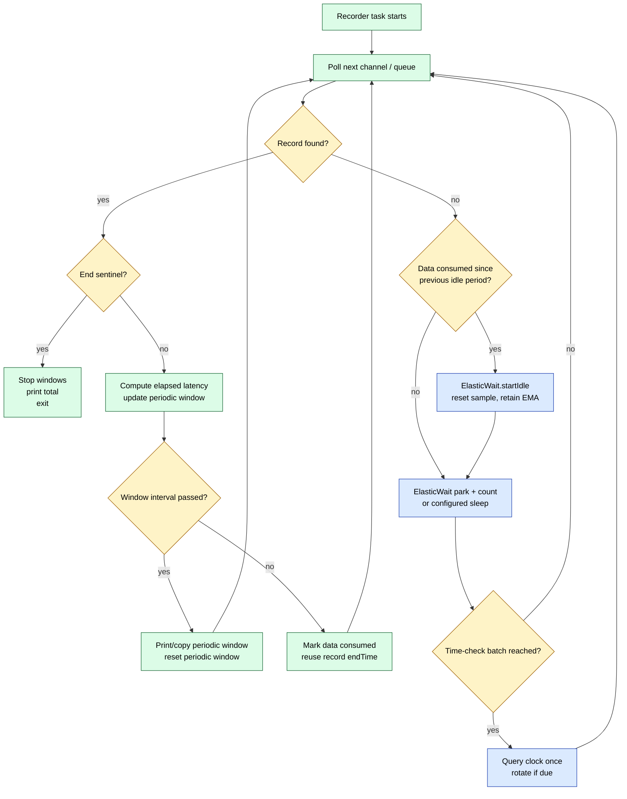

This diagram explains why the class has two responsibilities: it drains work
quickly when records exist, and it keeps time-based reports moving even when
no operation completes for a while.

#### Pillar 3 — `ElasticWait`: amortising clock queries

This is one of PerL's most important — and easily overlooked — design
choices. To understand why it exists, first see what a *naive* idle
back-off would look like:

```java
// Naive — DO NOT do this in a high-rate benchmark
while (queueEmpty()) {
    LockSupport.parkNanos(idleNS);
    long now = time.getCurrentTime();          // <-- clock call per spin
    if (now - lastWindow > windowIntervalMS) {
        rotateWindow();
        lastWindow = now;
    }
}
```

The problem is the `time.getCurrentTime()` call on every empty scan. Even
when the park duration is short, scheduler wake-up behavior is platform
dependent and a clock query per scan is unnecessary work. PerL's configured
default is `idleNS=1_000_000` (1 ms); `1_000` ns (1 µs) is the enforced
minimum, not the default.

Those Java clock methods are not free:

- `System.nanoTime()` on Linux issues a vDSO call to
  `clock_gettime(CLOCK_MONOTONIC)`. It is usually cheap, but it
  involves a memory fence and, on some platforms, an actual syscall.
- `System.currentTimeMillis()` on some JVMs has historically suffered
  from per-thread cache-line contention.
- Worker threads already call the selected `Time` implementation to capture
  operation boundaries. Avoiding redundant recorder-side calls reduces
  harness work and shared time-source traffic, especially when queues are
  frequently empty.

`ElasticWait`
([ElasticWait.java](../perl/src/main/java/io/perl/api/impl/ElasticWait.java))
solves this by **converting time-checks into counter-checks**. The
clock is queried only once per "elastic batch" of idle spins, and the
batch size is auto-calibrated to match the configured window
interval.

##### The mechanism

`ElasticWait.waitAndCheck()`, called inside the recorder's idle path,
does just two things:

```java
public boolean waitAndCheck() {
    idleStrategy.accept(idleNS);     // production strategy: LockSupport.parkNanos
    idleCount++;
    return idleCount >= elasticCount; // true means: sample the clock now
}
```

No clock call and no processor-speed-dependent instruction loop. Just a park
and a counter increment. The recorder's
idle loop becomes:

```java
while (queueEmpty()) {
    if (idleWait.waitAndCheck()) {            // park + count
        long now = time.getCurrentTime();      // one clock call per batch
        long elapsed = now - windowStart;
        if (elapsed >= windowIntervalMS) {
            rotateWindow();
            idleWait.setElastic(elapsed);      // calibrate and start a new window
        } else {
            idleWait.updateElastic(elapsed);  // calibrate and clear this batch
        }
    }
}
```

So instead of *N* clock calls for *N* empty-queue parks, PerL normally makes
one clock call after an adaptive batch. At construction it computes only a
safe upper bound for bootstrap calibration:

```text
nominalWaitsPerMillisecond = 1_000_000 ns per ms / idleNS
maximumCalibrationCount   = nominalWaitsPerMillisecond * calibrationIntervalMS
elasticCount              = 1
```

The first clock check therefore occurs after one park. If a coarse clock has
not advanced, the probe grows as `1, 2, 4, 8, ...` up to the bootstrap bound.
This needs only logarithmically many clock checks and avoids assuming that a
requested 1 microsecond or 1 millisecond park really consumes that duration.

##### The calibration loop

`elasticCount` adapts to measured wait throughput at runtime. A successful
sample computes:

```text
observedWaitsPerMillisecond = parksInThisBatch / elapsedMilliseconds
```

Later observations use a weighted moving average so that a temporary
scheduler pause does not completely replace the established estimate. The
calibration and transition methods work like this:

| Method | When called | What it does |
|---|---|---|
| `setElastic(actualElapsedMs)` | After a window rotation | Learns from only the just-completed batch, clears all window-local counters, and schedules the next check using `measuredRate × windowIntervalMS`. |
| `updateElastic(elapsedMs)` | After a clock check that did *not* rotate the window | Learns from only the parks since the previous clock check, clears that batch, and schedules the next check using `measuredRate × remainingWindowMs`. |
| `startIdle(elapsedMs)` | On the first empty scan after one or more records were consumed | Retains the established moving-average park rate, discards parks from the earlier idle period, advances the sample origin to the greater of its previous value and the last record's elapsed-window time, and schedules a check for the remaining window. During bootstrap it conservatively checks after one park. |
| `reset()` | After a record timestamp rotates the reporting window | Retains the measured park rate but clears all counters and elapsed state belonging to the old window. |

The learned rate, rather than the requested park duration, is retained across
reporting windows. Batch counters and elapsed-window state are never retained
across a rotation. This prevents a busy or partially idle old window from
inflating the next window's threshold.

A reporting window can alternate between empty and active periods. Without an
active-to-idle reset, parks accumulated before a brief burst of records would
be divided by elapsed time that also includes the active burst. That would
underestimate the measured park rate and cause more frequent clock checks.
`PerformanceRecorderElasticWait` therefore remembers whether data has been
consumed. On the first subsequent empty scan it calls `startIdle()` with the
elapsed time derived from the last consumed `TimeStamp.endTime`. This starts a
clean idle sample **without a new clock query** and without delaying a window
boundary. The learned exponential moving average (EMA) survives, so a brief
data burst does not throw away calibration. Taking the maximum of the prior
sample origin and the supplied elapsed time also prevents an out-of-order
completion timestamp from moving calibration backwards.

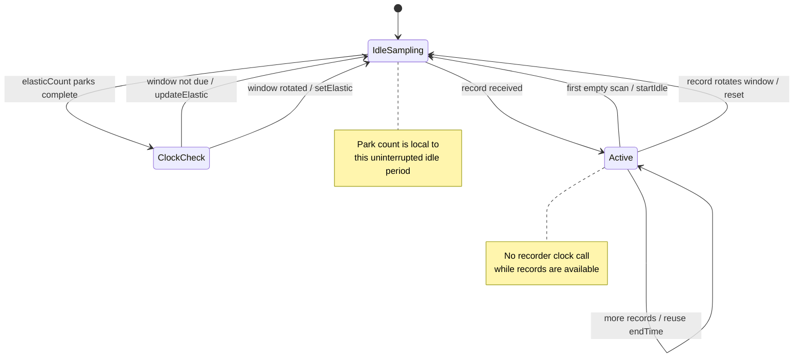

Every computed threshold is clamped to at least one and saturates at
`Long.MAX_VALUE`. Consequently, unusual clock resolution, very slow hosts,
very fast hosts, and arithmetic overflow cannot create a zero-count
clock-query loop.

This design does not use a CPU frequency, MIPS value, or a fixed number of
Java instructions. It measures the behavior that matters: how many configured
parks this JVM completes per millisecond on the current OS and hardware.

##### The second optimisation: reuse worker timestamps

There is one more clock-saving trick. Look at the recorder loop:

```java
for (Channel ch : channels) {
    t = ch.receive(...);
    if (t != null) {
        ctime = t.endTime;              // <-- the WORKER's timestamp, NOT a new clock call
        recorder.record(t.startTime, t.endTime, ...);
        if (recorder.elapsedMilliSecondsWindow(ctime) >= windowIntervalMS) {
            recorder.stopWindow(ctime); ...
        }
    }
}
```

When the queue has work, **the recorder doesn't call the clock at
all**. The worker has already stamped `endTime` into the
`TimeStamp` object when it did `perlChannel.send(...)`. The recorder
just reuses that as its notion of "now" — close enough for window
rotation, free of any clock call.

So the full picture of when the recorder actually asks the operating
system for the time:

| Recorder state | Clock-query rate |
|---|---|
| **Processing a record** | **0** clock calls (uses `t.endTime`) |
| **Queue empty, mid-batch** | **0** clock calls (just parks) |
| **Queue empty, batch complete** | **1** clock call (then re-calibrate) |
| **Benchmark start / end** | **1** clock call each |

On the record-processing path the recorder reuses worker timestamps instead
of issuing a clock call per record. `ElasticWait` similarly amortises clock
queries on the empty path. This reduces recorder overhead; it does not claim
that the harness contributes zero system-wide contention or zero measurement
cost.

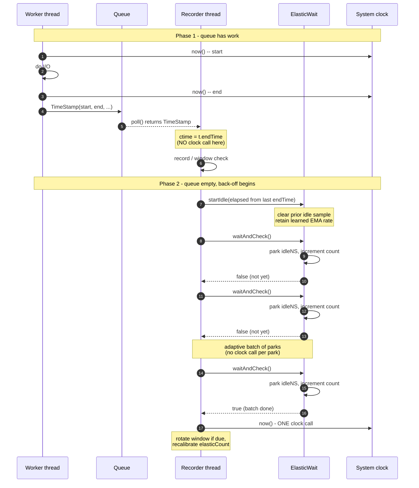

#### Pillar 4 — Memory-aware latency storage

The recorder writes to a `LatencyRecordWindow`. For each periodic window,
`PerlBuilder.buildLatencyRecordWindow()` chooses either a dense primitive
array or a sparse primitive long-to-long map from the configured latency range
and memory budget. The whole-run window is a primitive-map buffer with an
optional HDR or CSV overflow/extension strategy. The boxed
`HashMapLatencyRecorder` remains only as a correctness and benchmark baseline;
see the complete [latency-recorder research guide](LATENCY_RECORDERS.md).

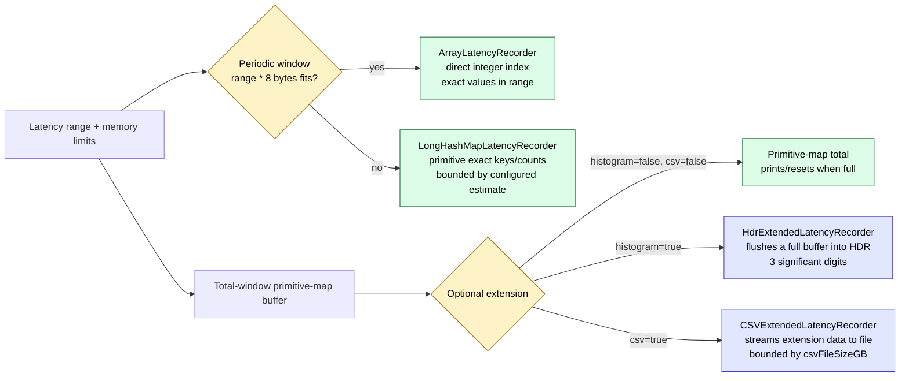

Standalone PerL defaults are in
[perl.properties](../perl/src/main/resources/perl.properties). SBK applications
load the equivalent values from
[`sbk.properties`](../sbk-api/src/main/resources/sbk.properties), then apply
the optional `-mpscqueue` override:

```properties
maxArraySizeMB=64           # Use Array backend if latency range fits
maxHashMapSizeMB=192        # Periodic primitive-map logical budget
totalMaxHashMapSizeMB=256   # Total primitive-map logical budget
MpscQueueEnable=true        # One-object intrusive MPSC timestamp hand-off
histogram=false             # Optional HdrHistogram for total window
csv=false                   # Optional raw-CSV total backend
csvFileSizeGB=1
```

`qPerWorker` and `maxQs` are topology properties, not public command-line
options. SBK validates them while loading `sbk.properties` and prints the
effective queue name and topology at startup. Keeping topology fixed while
changing only `-mpscqueue` makes JDK-versus-intrusive comparisons less prone
to accidental configuration drift.

**How available memory changes the design:** an array has predictable memory
and direct indexing, but its size is proportional to the configured latency
range, whether or not every value occurs. The primitive map stores only
observed integer latency values without boxing, but open-addressed table
capacity and the reusable sorting buffer still add overhead. Its configured
limit is a logical payload estimate rather than an exact heap cap. Increasing
`maxArraySizeMB`, `maxHashMapSizeMB`, or `totalMaxHashMapSizeMB` lets PerL keep
larger exact-value distributions before a window must be printed/reset or an
extension must absorb it.

HdrHistogram is not an exact-value fallback: it uses three significant digits
(`LatencyConfig.HDR_SIGNIFICANT_DIGITS`). It is useful when bounded footprint
across a wide latency range matters more than retaining every integer value.
CSV preserves a stream for offline work but adds disk I/O and a configured
file-size limit. These tradeoffs must be recorded with published benchmark
results.

#### Pillar 5 — The window machinery

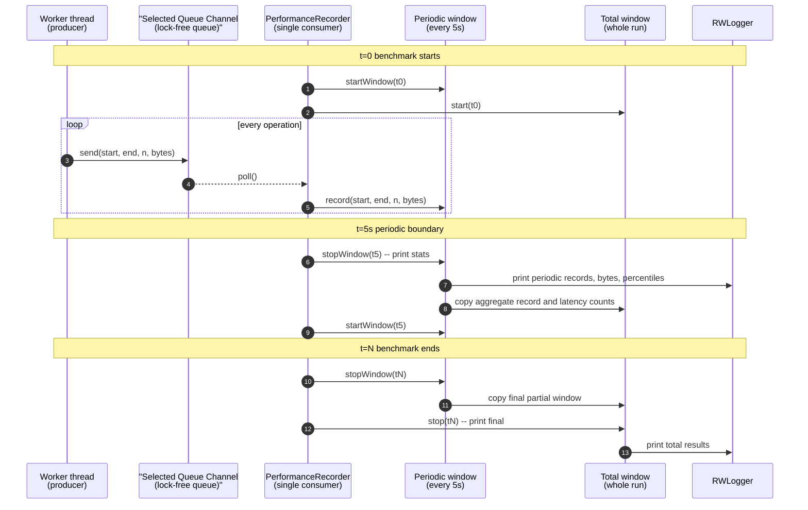

The recorder maintains two logical windows. Incoming operations first update
the **periodic window**. At rotation, `window.print(..., totalWindow)` computes
the periodic report and copies aggregate counters plus latency counts into the
**total window** before the periodic window resets. The total window is printed
at the end, and may also be flushed/reset if its configured storage fills.

### 3.4 Why this design is fast

Six concrete reasons, traceable to specific code:

1. **Non-blocking hand-off.** `TimeStampMpscQueueChannel.send()` delegates to
   an intrusive `TimeStampMpscQueue`; progress does not depend on a mutex
   owner, though CAS retries are still possible. The original
   `CQueueChannel` remains the JDK fallback.
2. **One producer-side allocation.** The producer creates a
   `TimeStampNode`, which is also the queue node. Percentile computation and
   logger I/O stay on the recorder side.
3. **One consumer.** A single recorder thread eliminates contention on
   the windows; no synchronisation is needed because only one thread
   ever reads the queue and writes to the histogram.
4. **Queue sharding follows worker concurrency.** With `maxQs=0`, PerL creates
   channels from worker count and multiple queues per channel. More workers
   therefore bring more queue state rather than forcing all producers through
   one tail pointer.
5. **Clock-query amortisation via `ElasticWait`.** The recorder reuses
   `TimeStamp.endTime` while processing and checks the clock only after an
   adaptive batch of empty-queue parks.
6. **Configurable memory and precision.** Array, primitive-map, HDR, and CSV modes
   let operators choose between direct indexing, sparse exact values, bounded
   approximate histograms, and offline raw output.

These properties raise the point at which the harness becomes the limiting
stage; they do not prove that it can never bottleneck. Measure queue backlog,
GC, CPU saturation, and discarded latency counts when pushing the framework
near the host's limits.

---

## 4. SBK-API — the pluggable benchmark harness

`sbk-api` wraps PerL with a storage-agnostic harness. It is what gives
SBK its *"any storage system"* property.

### 4.1 The Storage SPI — seven methods

A driver implements one Java interface:
[Storage.java](../sbk-api/src/main/java/io/sbk/api/Storage.java):

```java
public interface Storage<T> {
    void          addArgs(InputOptions params);           // declare CLI flags
    void          parseArgs(ParameterOptions params);     // read CLI flags
    void          openStorage(ParameterOptions params);   // open client connection
    void          closeStorage(ParameterOptions params);  // close it
    DataWriter<T> createWriter(int id, ParameterOptions p);  // factory
    DataReader<T> createReader(int id, ParameterOptions p);  // factory
    DataType<T>   getDataType();                          // byte[] by default
}
```

`DataWriter<T>` and `DataReader<T>` each have an even smaller surface
(typically `writeAsync(T)` / `read()` plus `close()`); SBK provides
default implementations of all the timing / channel-send machinery in
`Writer<T>` and `Reader<T>` interfaces so drivers don't repeat that
boilerplate.

That is the **entire SPI**. Everything else — threading, latency
recording, output formatting, distribution — is the harness's job.

The seven methods fall into three phases. A driver is configured first,
opened once, asked to create per-worker readers/writers, and finally closed:

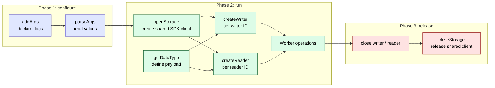

The boundary matters because storage-specific code remains inside the driver.
For example, `openStorage` may construct a MinIO client or database session,
while `SbkBenchmark` remains unaware of credentials, buckets, brokers, or SQL.

### 4.2 SBK-API class diagram

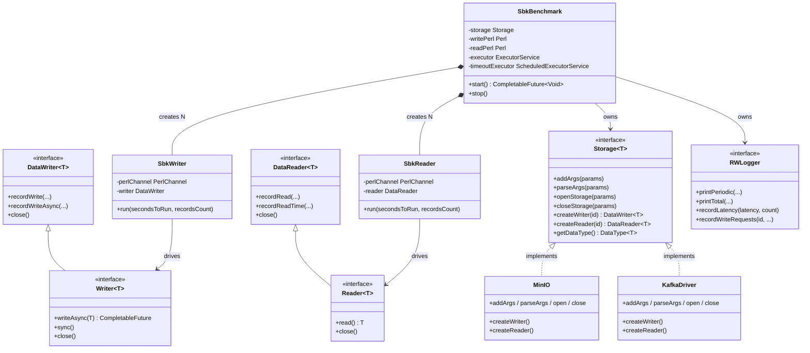

### 4.3 SbkBenchmark — the orchestrator

[SbkBenchmark.java](../sbk-api/src/main/java/io/sbk/api/impl/SbkBenchmark.java)
owns the lifecycle of one benchmark run. Reading the constructor
(simplified):

```java
public SbkBenchmark(ParameterOptions params, Storage<Object> storage,
                    DataType<Object> dType, RWLogger rwLogger, Time time) {
    int threadCount = params.getWritersCount() + params.getReadersCount()
            + runtimeConfig.workerExecutorReserve;
    this.executor = switch (params.getThreadType()) {
        case ForkJoin -> new ForkJoinPool(threadCount);
        case Virtual  -> Executors.newFixedThreadPool(threadCount, Thread.ofVirtual().factory());
        default       -> Executors.newFixedThreadPool(threadCount);
    };
    this.perlExecutor = new ForkJoinPool(runtimeConfig.perlExecutorParallelism);

    if (writersCount > 0 && action == Writing) {
        writePerl = PerlBuilder.build(rwLogger, time, wConfig, perlExecutor);
    }
    if (readersCount > 0) {
        readPerl  = PerlBuilder.build(rwLogger, time, rConfig, perlExecutor);
    }
    timeoutExecutor = Executors.newScheduledThreadPool(0, Thread.ofVirtual().factory());
}
```

Three things to notice:

1. **Direction-specific PerL instances.** A write PerL is built for normal
   writing actions when writers are configured; a read PerL is built when
   readers are configured. Each instance owns its channels, recorder, and
   windows, while both use the same `RWLogger` and the benchmark's shared,
   configured `perlExecutor`.
2. **Thread model is selectable at runtime.** Virtual worker threads are used
   by default. `-thread v` selects them explicitly; `-thread f` selects a
   `ForkJoinPool`; and `-thread p` selects a fixed platform-thread pool. The
   pool size is writers plus readers plus `workerExecutorReserve` from
   `sbk-runtime.properties`, providing capacity for
   worker and coordination tasks. More workers can expose more storage and
   CPU parallelism, but useful scaling ends when the driver, storage target,
   recorder, network, memory allocator, or CPU becomes saturated.
3. **A separate `ScheduledExecutorService`** schedules the duration
   watchdog so the main scheduler doesn't get stuck behind a long-running
   write.

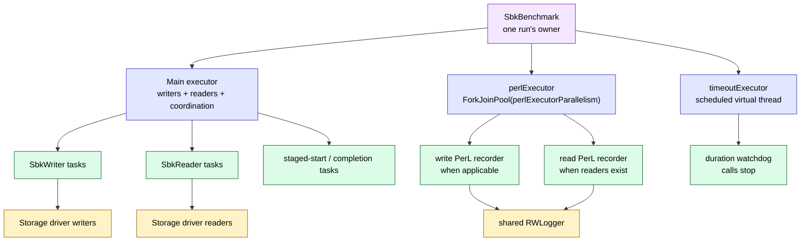

The executors are separate so storage workers, measurement consumers, and the
stop timer do not all wait in the same task queue. They still share the same
JVM, CPU cores, heap, and garbage collector, so isolation is architectural—not
physical.

`start()` spawns one `SbkWriter` per `-writers` and one `SbkReader` per
`-readers`. Each `SbkWriter.run()` is wrapped in
`CompletableFuture.runAsync(..., executor)` so all writers run
concurrently. A `chainFuture = allOf(writersCB, readersCB)` triggers
`stop()` when both groups are done.

### 4.4 Logger SPI — the other plug point

The logger is the output-side plugin, mirroring the storage driver on the
input/work side. The logger choices and their destinations are visualized in
§10.2; the bootstrap sequence in §4.5 shows exactly when a logger is selected,
opened, called, and closed.

Drivers are the *consumers* of latency events (they generate them);
loggers are the *producers* of human/machine-readable output. The
contract is `RWLogger`
([RWLogger.java](../sbk-api/src/main/java/io/sbk/logger/RWLogger.java)):

```java
public non-sealed interface RWLogger
        extends Logger, CountRW, WriteRequestsLogger, ReadRequestsLogger, RWPrint { ... }
```

Six shipping implementations:

| Class | Output target | When to use |
|---|---|---|
| `SystemLogger` | stdout (default) | Local interactive runs |
| `Sl4jLogger` | SLF4J facade | Integrating SBK into another Java app |
| `CSVLogger` | CSV file | Post-run analysis with pandas / Excel |
| `PrometheusLogger` | Prometheus scrape endpoint (port 9718) | Real-time Grafana dashboards |
| `WebLogger` | SBK Local Web Console over HTTP (port 9720) | Dependency-free local live graphs |
| `GrpcLogger` | gRPC to SBM | Distributed benchmarks (§6) |

Selected at runtime by `-out <ClassName>`. The driver discovery and
logger discovery use the same package-scan helper.

Micrometer applies three low-cardinality common tags to every Prometheus
meter: `component` identifies the exporting process (`sbk` or `sbm`), `class`
identifies the resolved storage driver, and `action` identifies the workload.
SBK-GEM launches and coordinates distributed work, but SBM owns the aggregated
metrics endpoint; consequently GEM-managed metrics use `component="sbm"`.

### 4.5 Wiring a single benchmark — the bootstrap

This is the control flow when a user runs
`./build/install/sbk/bin/sbk -class minio -writers 4 -size 1048576 -seconds 60`:

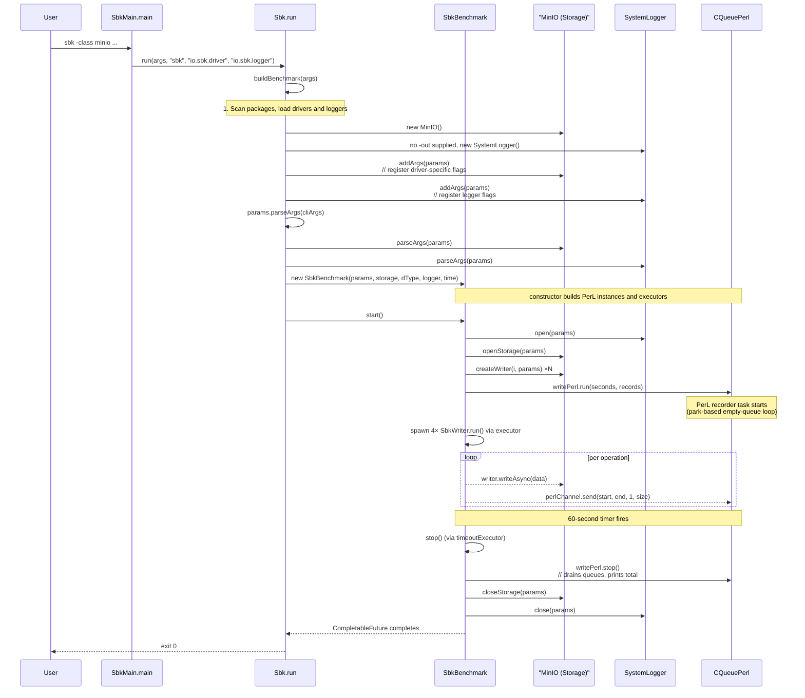

The whole boot — argument parsing, class discovery, instantiation,
PerL wiring, executor sizing, timeout scheduling — happens in roughly
the 300 lines of
[Sbk.java](../sbk-api/src/main/java/io/sbk/api/impl/Sbk.java).
The actual benchmark loop is in `SbkWriter`/`SbkReader` and finishes via
the chained `CompletableFuture`s set up in `SbkBenchmark.start()`.

---

## 5. The four launchers

Single-node or multi-node? CLI or YML? SBK ships all four combinations
as separate Gradle subprojects:

- **SBK** — Storage Benchmark Kit (the single-node CLI launcher).
- **SBK-YAL** — SBK YML Arguments Loader (single-node, YML-driven).
- **SBK-GEM** — SBK Group Execution Monitor (multi-node, CLI-driven, SSH-orchestrated).
- **SBK-GEM-YAL** — SBK-GEM YML Arguments Loader (multi-node, YML-driven).


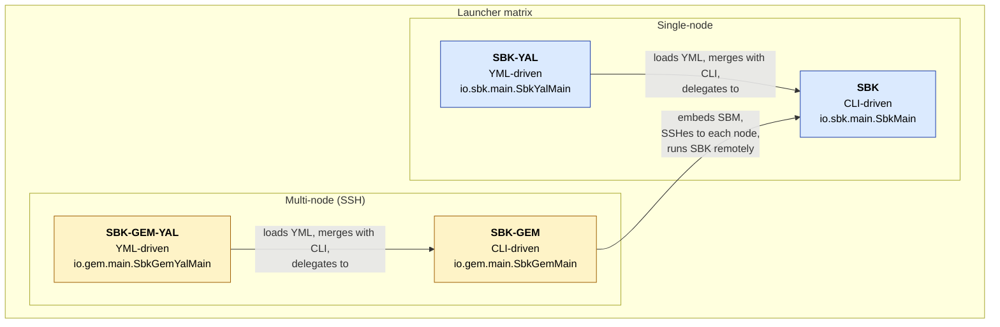

### When to use which

| Variant | Concrete situation |
|---|---|
| **SBK** | "I have one client machine and one storage cluster. Run a benchmark." |
| **SBK-YAL** | "I run the same benchmark every night in CI; let me commit the config to git." |
| **SBK-GEM** | "I need 8 client machines to saturate the storage system. Run SBK on all of them and give me one cluster-wide percentile report." |
| **SBK-GEM-YAL** | Same as SBK-GEM, but the multi-host benchmark spec lives in a YML file. |

### What does YAL — "YML Arguments Loader" — do?

The two YAL variants — **SBK-YAL** (SBK YML Arguments Loader) and
**SBK-GEM-YAL** (SBK-GEM YML Arguments Loader) — are intentionally thin
shells. They do four things, exemplified by
[SbkYal.java](../sbk-yal/src/main/java/io/sbk/api/impl/SbkYal.java):

1. Parse the YML file with the Jackson dataformat library (`SbkYmlMap`
   looks for an `sbkArgs:` key; `SbkGemYmlMap` looks for an
   `sbkGemArgs:` key).
2. Convert the YML keys/values into the same `-flag value` token
   stream that `SbkMain` (or `SbkGemMain`) would accept.
3. Merge any CLI overrides (CLI wins) via `SbkUtils.mergeArgs()`.
4. Delegate to `Sbk.run(mergedArgs, ...)` (or `SbkGem.run(...)`).

Example YML for SBK-YAL:

```yml
sbkArgs:
  class:    minio
  writers:  4
  size:     1048576
  seconds:  60
  bucket:   sbk-bench
  url:      https://my.s3.endpoint:9021
```

You can override any of these from the CLI:
`./build/install/sbk-yal/bin/sbk-yal -file run.yml -seconds 600`.
(The default filename, set in `sbk-yal.properties`, is `./sbk.yml`.)

The same pattern applies to `sbk-gem-yal`, which uses `SbkGemYmlMap`
looking for an `sbkGemArgs:` key, then delegates to `SbkGem.run()`.

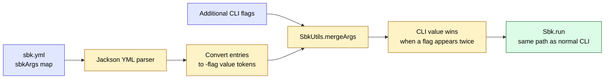

YAL is therefore not a second benchmark engine. It is an argument adapter;
after merging, the ordinary SBK bootstrap, driver, PerL, and logger code run.

---

## 6. SBM — the distributed results aggregator

**SBM** — **Storage Benchmark Monitor** — is the gRPC server that
aggregates results from many SBK client instances into one cluster-wide
view. It speaks the **SBP** (Storage Benchmark Protocol — described in §6.2).

When you run a single SBK instance, the latency numbers are reported by
that one client. But what if you need many client machines to saturate
a single storage cluster? You want one consolidated percentile report
across all clients — not eight separate p99 numbers that don't combine
trivially. That is what SBM solves. (The SBK README also refers to it
historically as *"SBK-RAM: Results Aggregation Monitor"* — same thing.)

### 6.1 SBM in the distributed picture

```mermaid
flowchart TB
    subgraph CLIENTS["Load-generator hosts"]
        direction LR
        C1["SBK client 1<br/>workers + local PerL"] --> L1["GrpcLogger<br/>batch latency counts"]
        C2["SBK client 2<br/>workers + local PerL"] --> L2["GrpcLogger<br/>batch latency counts"]
        CN["SBK client N<br/>workers + local PerL"] --> LN["GrpcLogger<br/>batch latency counts"]
    end

    subgraph TARGET["Storage system under test"]
        SUT["Shared storage cluster<br/>S3, Kafka, database, filesystem, ..."]
    end

    subgraph CONTROL["SBP control plane"]
        VER["Version check"] --> CFG["Configuration check"] --> REG["Client registration"]
    end

    subgraph SBM_HOST["SBM aggregation host"]
        RPC["gRPC service<br/>port 9717"] --> QA["Queue array<br/>clientID modulo maxQueues"]
        QA --> ONE["Single aggregation consumer"]
        ONE --> MERGE["Merge counters + latency counts"]
        MERGE --> REPORT["Combined reports<br/>stdout / Prometheus 9719"]
    end

    C1 --> SUT
    C2 --> SUT
    CN --> SUT
    L1 --> VER
    L2 --> VER
    LN --> VER
    REG --> RPC

    classDef client fill:#dcfce7,stroke:#166534,color:#000
    classDef protocol fill:#e0e7ff,stroke:#4338ca,color:#000
    classDef server fill:#fef3c7,stroke:#a16207,color:#000
    classDef target fill:#fee2e2,stroke:#991b1b,color:#000
    class C1,C2,CN,L1,L2,LN client
    class VER,CFG,REG protocol
    class RPC,QA,ONE,MERGE,REPORT server
    class SUT target
```

### 6.2 The SBP gRPC contract

**SBP** — **Storage Benchmark Protocol** — is the wire protocol clients
use to talk to SBM. It is a gRPC service defined in
[`sbp.proto`](../sbk-api/src/main/proto/sbp.proto), with six RPCs:

| RPC | Request | Response | Purpose |
|---|---|---|---|
| `getVersion` | Empty | `Version(major, minor)` | Client checks protocol compatibility |
| `isVersionSupported` | `Version` | `BoolValue` | Explicit version negotiation |
| `getConfig` | Empty | `Config` | Client fetches SBM's run config |
| `registerClient` | `Config` | `ClientID` | Returns a unique long ID |
| `streamLatencies` | stream of `MessageLatenciesRecord` | Empty | **SBP 4.0 hot path** — ordered, flow-controlled batches |
| `closeClient` | `ClientID` | Empty | Graceful disconnect |

The critical message is `MessageLatenciesRecord`:

```protobuf
message MessageLatenciesRecord {
  int64 clientID         = 1;   // who is sending
  int64 sequenceNumber   = 2;   // for ordering / detecting drops
  int32 writers          = 3;
  int32 readers          = 4;
  int64 writeRequestBytes  = 7;
  int64 writeRequestRecords = 8;
  ...
  int64 totalRecords     = 13;
  int64 totalLatency     = 19;
  int64 minLatency       = 20;
  int64 maxLatency       = 21;
  reserved 22;                      // retired pre-SBP-4 map field
  repeated uint64 latencyValues = 23 [packed = true];
  repeated uint64 latencyCounts = 24 [packed = true];
}
```

The differentiating design choice is still one exact count per **distinct
recorded latency value**. SBP 4.0 represents those keys and counts as two
same-length packed primitive arrays. This avoids the boxed `Long` keys,
boxed values, per-entry map objects, and embedded protobuf map-entry messages
used by earlier protocol versions. It also sends totals, valid/invalid/discard counts,
bytes, active/max reader and writer counts, and request/timeout counters. SBM
therefore receives enough information to recompute a global percentile
distribution; it does not attempt the mathematically invalid operation of
averaging client percentiles.

`GrpcLogger` first accumulates exact counts in a primitive
`LongLongHashMap`. It creates a protobuf message only when periodic output or
the configured message-size limit requires a flush. The accumulator calculates
the actual unsigned-varint widths of the packed latency and count arrays. Before
an addition would make the complete record exceed `maxRecordSizeMB` (16 MiB by
default), SBK sends the current batch to SBM and starts a new batch. A small
schema-derived bound covers the non-latency protobuf fields; no percentage of
the configured capacity is withheld. SBK also verifies the final serialized
size before transmission. The network saving depends on the workload:

SBM applies the same configured value to gRPC's inbound-message limit and
advertises the byte limit through `getConfig`. SBK uses the smaller of its
local limit and the server-advertised limit, so the producer cannot build
batches that the receiving server is configured to reject.

```text
raw representation       proportional to number of operations
SBP packed arrays         proportional to number of distinct latency values
```

If a million operations occupy 200 integer latency values, the map is much
smaller than a million raw samples. If nearly every operation has a distinct
nanosecond value, the benefit is smaller and the size threshold creates more
batches.

SBP 4.0 is an intentional wire-protocol break. The unary latency RPC and
protobuf map field from SBP 3.x are removed; SBK and SBM must both use the
same SBP major version. Field number 22 remains reserved so it cannot be
accidentally reused with a different meaning.

#### Client-side allocation and flow-control boundary

```mermaid
flowchart LR
    P["PerL consumer<br/>one latency result"] --> A["Primitive LongLongHashMap<br/>exact latency to count"]
    A -->|"5 s interval or configured size limit"| B["Immutable protobuf batch<br/>packed primitive arrays"]
    B --> Q["Bounded sender queue<br/>maximum 8 batches"]
    Q --> T["Dedicated platform sender"]
    T -->|"only while HTTP/2 isReady"| S["One client stream to SBM"]
    S --> ACK["Final Empty acknowledgment<br/>after stream drain"]

    FULL["Queue full"] --> FAIL["Fail benchmark explicitly<br/>never grow memory silently"]
    Q -. capacity check .-> FULL
    STALL["HTTP/2 flow control remains stalled<br/>for configured timeout"] --> FAIL
    T -. local timeout check .-> STALL

    classDef hot fill:#fee2e2,stroke:#991b1b,color:#000
    classDef batch fill:#fef3c7,stroke:#a16207,color:#000
    classDef transport fill:#e0e7ff,stroke:#4338ca,color:#000
    classDef safe fill:#dcfce7,stroke:#166534,color:#000
    class P,A hot
    class B,Q batch
    class T,S transport
    class ACK,FULL,STALL,FAIL safe
```

The bounded sender isolates network progress from PerL without creating an
unbounded backlog. When HTTP/2 flow control is not ready, the sender parks;
it does not spin. If flow control remains continuously stalled for
`streamStallTimeoutSeconds` (30 seconds by default), or if eight completed
batches are already pending, the logger reports transport failure through
SBK's normal exception handler and initiates normal benchmark shutdown. An
unexpected server stream completion while the benchmark is active is handled
the same way. This reuses the existing sender and HTTP/2 flow-control state;
it creates no heartbeat thread, RPC, bidirectional application message, or
additional network traffic.

#### SBP connection and data lifecycle

```mermaid
sequenceDiagram
    autonumber
    participant C as GrpcLogger
    participant S as SBM gRPC service
    participant Q as SbmLatencyBenchmark
    participant A as Aggregation window

    C->>S: getVersion()
    S-->>C: major, minor
    Note over C: reject a major-version mismatch
    C->>S: getConfig()
    S-->>C: storage, action, time unit, latency range
    Note over C: require storage/action/time-unit match
    C->>S: registerClient(config)
    S-->>C: clientID

    C->>S: streamLatencies()

    loop periodic output or safe size-triggered flush
        C->>C: aggregate in primitive map
        C->>C: build packed values and counts
        C->>S: stream batch(clientID, sequence, packed fields, totals)
        Note over C,S: sender obeys isReady flow control
        S->>Q: enqueue by clientID modulo maxQueues
        Q->>A: merge accepted record
    end

    C->>S: complete stream after final queued batch
    S-->>C: final Empty acknowledgment
    C->>S: closeClient(clientID)
    S-->>C: Empty acknowledgment
```

The major SBP version is enforced by `GrpcLogger`. Storage name, action, and
time unit must match the server configuration; latency-range and request-log
differences currently produce warnings. Every SBP 4.0 stream has one client
ID and strictly increasing sequence numbers beginning at one. SBM rejects a
client-ID change or sequence gap before the record reaches the aggregation
queue. The stream preserves order and returns its final acknowledgment only
after all submitted messages have reached the service. SBP does not retry a
failed stream, so treat transport failures, client exits,
invalid/discard counts, and connection logs as part of result validation.

### 6.3 SBM's internal architecture

SBM borrows PerL's **non-blocking queue-array + single-consumer** shape.
Inbound gRPC threads enqueue complete `MessageLatenciesRecord` batches into
`ConcurrentLinkedQueue` instances. A background task drains the queues and is
the sole owner of the aggregation window. Queue operations can allocate and
retry CAS under contention, but do not wait for an application mutex.

```mermaid
flowchart TB
    subgraph IN["Inbound gRPC threads"]
        T1["gRPC thread"]
        T2["gRPC thread"]
        T3["gRPC thread"]
    end

    subgraph SRV["SbmGrpcService"]
        ENQ["streamLatencies.onNext(record)<br/>then registry.enQueue(record)"]
    end

    subgraph QUEUES["SbmLatencyBenchmark queue array"]
        SQ1["Queue 0"]
        SQ2["Queue 1"]
        SQN["Queue maxQueues-1<br/>(default 10 queues)"]
    end

    subgraph BG["Background consumer thread"]
        LOOP["SbmLatencyBenchmark.run()<br/>polls queues round-robin"]
    end

    subgraph REC["SbmTotalWindowLatencyPeriodicRecorder"]
        MERGE["for each (latency, count) in record:<br/>window.reportLatency(latency, count)"]
    end

    T1 --> ENQ
    T2 --> ENQ
    T3 --> ENQ
    ENQ -->|"queueIndex = clientID % maxQs"| SQ1
    ENQ -->|"queueIndex = clientID % maxQs"| SQ2
    ENQ -->|"queueIndex = clientID % maxQs"| SQN

    SQ1 --> LOOP
    SQ2 --> LOOP
    SQN --> LOOP

    LOOP --> MERGE
    MERGE -->|"window rotates every 5 s"| OUT["stdout + Prometheus :9719"]
```

The important details are:

- **Multiple inbound producers** deposit into the queue array. The queue index
  is `clientID % maxQueues`, so all records from one client use the same queue
  and different clients are spread over the configured queues. The SBP 4.0
  stream validates client ID and sequence before enqueueing.
- **A single background thread** drains all queues round-robin and
  feeds them into a `LatencyRecordWindow`, reusing PerL's latency-window
  machinery. It consumes one record per queue visit so that a busy client
  cannot monopolize the consumer. Single ownership means the non-thread-safe
  window does not need concurrent updates.
- **Window rotation** — every 5 s by default — produces a combined
  periodic line on stdout and ticks the Prometheus gauges.
- **Empty-queue behavior differs from client PerL.** `SbmLatencyBenchmark`
  sleeps for `idleMS` (10 ms by default) when no record is found; it does not
  use `ElasticWait`. This is appropriate because SBP transports batches, not
  one message per storage operation.

### 6.4 Histogram merging

Aggregating histograms is the one place SBM does mathematics. When
client A reports `{100ms→500, 200ms→300}` and client B reports
`{100ms→700, 300ms→200}`, the merged histogram is:

```mermaid
flowchart LR
    A["Client A<br/>100 ms: 500<br/>200 ms: 300"] --> ADD["Add counts<br/>for equal latency keys"]
    B["Client B<br/>100 ms: 700<br/>300 ms: 200"] --> ADD
    ADD --> M["Merged distribution<br/>100 ms: 1200<br/>200 ms: 300<br/>300 ms: 200"]
    M --> CUM["Sort keys + cumulative counts"]
    CUM --> P["Compute global<br/>p50 / p95 / p99 / ..."]

    WRONG["Do not average<br/>client p99 values"] -. invalid shortcut .-> P

    classDef client fill:#e0e7ff,stroke:#4338ca,color:#000
    classDef merge fill:#dcfce7,stroke:#166534,color:#000
    classDef warning fill:#fee2e2,stroke:#991b1b,color:#000
    class A,B client
    class ADD,M,CUM,P merge
    class WRONG warning
```

```
{100ms → 1200,  200ms → 300,  300ms → 200}
```

Concretely
([SbmTotalWindowLatencyPeriodicRecorder.java](../sbm/src/main/java/io/sbm/api/impl/SbmTotalWindowLatencyPeriodicRecorder.java)):

```java
for (int index = 0; index < record.getLatencyValuesCount(); index++) {
    window.reportLatency(
        record.getLatencyValues(index),
        record.getLatencyCounts(index));
}
```

`window.reportLatency(latency, count)` increments the bucket count by
`count`. After accepted client records are merged, percentiles are computed
from the combined counts exactly as for a single integer-bucket distribution.
Addition of bucket counts is associative and commutative, so merge order does
not alter the mathematical result.

SBM tracks registered connections and per-client reader/writer maxima in
reusable primitive arrays indexed by client ID. It does not allocate boxed
client IDs or rebuild a `HashMap<Long,RW>` every reporting interval, and it
does not need each client's precomputed percentile. The merge is lossless
relative to the latency/count pairs that actually arrive. It cannot reconstruct
records lost in transport, discarded outside a configured range, quantized by
an upstream representation, duplicated, or omitted by a failed client.

### 6.5 Why SBP is a distributed-benchmarking differentiator

SBP separates **workload generation** from **result aggregation** without
reducing each node to averages or already-computed percentiles:

| Distributed concern | SBP/SBM response |
|---|---|
| One client cannot saturate the target | Add SBK client hosts; each retains its local worker/PerL pipeline. |
| Per-client p99 values cannot be averaged | Transfer latency-to-count maps and recompute p99 after merging. |
| Clients accidentally run incompatible tests | Check protocol major version, storage name, action, and time unit before registration. |
| Raw samples would create excessive network traffic | Batch repeated latency values as counts and flush periodically/at a size threshold. |
| Concurrent RPC handlers would contend on one aggregate | Enqueue batches into a sharded queue array; one consumer owns the aggregate window. |
| A single report is needed for the cluster load | Sum records, bytes, request counters, reader/writer counts, and latency buckets at SBM. |

```mermaid
flowchart TB
    subgraph SCALEOUT["Horizontal load generation"]
        C1["Client host 1<br/>CPU + network"]
        C2["Client host 2<br/>CPU + network"]
        CN["Client host N<br/>CPU + network"]
    end
    TARGET["Shared storage target"]
    C1 --> TARGET
    C2 --> TARGET
    CN --> TARGET

    C1 -->|SBP latency counts| SBM["SBM<br/>one aggregation authority"]
    C2 -->|SBP latency counts| SBM
    CN -->|SBP latency counts| SBM
    SBM --> RESULT["One combined distribution<br/>and cluster-wide report"]

    LIMIT1["Client-side limits"] -. constrain load .-> SCALEOUT
    LIMIT2["SBM CPU / queues / memory"] -. constrain aggregation .-> SBM
    LIMIT3["Target capacity"] -. constrains useful scaling .-> TARGET

    classDef client fill:#dcfce7,stroke:#166534,color:#000
    classDef target fill:#fee2e2,stroke:#991b1b,color:#000
    classDef aggregate fill:#f3e8ff,stroke:#7e22ce,color:#000
    classDef limit fill:#fef3c7,stroke:#a16207,color:#000
    class C1,C2,CN client
    class TARGET target
    class SBM,RESULT aggregate
    class LIMIT1,LIMIT2,LIMIT3 limit
```

This architecture scales load generation horizontally while keeping one
well-defined aggregation point. Its practical ceiling is determined by SBP
batch cardinality and rate, gRPC/network capacity, `maxQueues`, the single SBM
consumer, and the aggregation-window memory settings. For large studies,
monitor the SBM host and increase batching before assuming that adding clients
will produce linear throughput.

---

## 7. SBK-GEM — the distributed orchestrator

**SBK-GEM** — **SBK Group Execution Monitor** — is SBK's distributed
launcher. SBM (§6) solves "many clients, one aggregator"; SBK-GEM
solves the question right before it — *"how do I **launch** SBK on
many client machines and route their telemetry to a local SBM?"*

The SBK-GEM README phrases it as
*"the SBK (Storage Benchmark Kit) - GEM (Group Execution Monitor)
combines SBK-RAM and SBK"* — i.e. SBK-GEM == SBK runner on each node
+ SBM aggregator on the orchestrator node, glued together over SSH.

### 7.1 The orchestrator sequence

```mermaid
sequenceDiagram
    autonumber
    participant User
    participant GEM as SbkGemBenchmark
    participant SSH as "SshSession[] (Apache Mina SSHD)"
    participant SBM as "SbmBenchmark (local)"
    participant N1 as "Remote node 1"
    participant N2 as "Remote node 2"

    User->>GEM: sbk-gem -nodes h1,h2 -class minio ...
    Note over GEM: build common GrpcLogger and SBM callback arguments
    opt totalrecords is supplied
        Note over GEM: divide the aggregate count or rate<br/>into node-specific -records values
    end
    opt totalthroughput is supplied
        Note over GEM: divide aggregate MB/s<br/>into node-specific -throughput values
    end
    GEM->>SSH: createSessionAsync(h1)
    GEM->>SSH: createSessionAsync(h2)
    par connect, verify host key, and authenticate
        SSH->>N1: SSH + known_hosts + agent/key/password
        SSH->>N2: SSH + known_hosts + agent/key/password
    end

    GEM->>SSH: install small Java agent through SFTP
    GEM->>SSH: probe preferred/PATH Java and OS through the agent
    Note over GEM: require one homogeneous Linux or macOS operating system
    GEM->>GEM: validate installDist pathing JAR and dependencies
    opt matching Java is unavailable
        GEM->>SSH: copy controller JDK as a separate content-addressed tree
        GEM->>SSH: verify copied JDK through the agent
    end
    GEM->>GEM: build an SBK-only content-addressed archive
    GEM->>SSH: reserve deployment identities through MINA SFTP
    par inspect exact runtime identity
        SSH->>N1: agent verifies content marker and SBK JARs
        SSH->>N2: agent verifies content marker and SBK JARs
    end
    alt exact runtime is missing
        GEM->>SSH: upload one content-addressed archive
        SSH->>N1: agent extracts, verifies, and atomically activates SBK
        SSH->>N2: agent extracts, verifies, and atomically activates SBK
    end
    GEM->>SSH: verify activated Java, SBK, and content identity
    opt runtimecleanup is true (default)
        SSH->>N1: atomically retire inactive runtimes; delete through SFTP
        SSH->>N2: atomically retire inactive runtimes; delete through SFTP
    end

    GEM->>SBM: sbmBenchmark.start()<br/>(listen on :9717 locally)
    GEM->>SSH: send typed run request to the Java agent
    Note over SSH: ProcessBuilder starts SbkMain with<br/>-out GrpcLogger -sbm localHost -sbmport 9717

    par remote SBK runs in parallel
        SSH->>N1: spawn SBK
        SSH->>N2: spawn SBK
    end

    loop during the run
        N1-->>SBM: streamLatencies batch (gRPC)
        N2-->>SBM: streamLatencies batch (gRPC)
    end

    Note over SBM: SBM prints aggregated stats every 5s

    SSH-->>GEM: RemoteResponse(exitCode, stdout, stderr) per node
    GEM->>SBM: sbmBenchmark.stop()
GEM-->>User: printRemoteResults()
```

The reconciliation identity is content, not only the displayed SBK version.
Gradle records a build identity covering the installed runtime dependencies,
launchers, Java bootstrap files, and remote agent. GEM verifies the local
pathing JAR dependency closure and uses that identity to select a cached
OS-specific plain-tar archive without rehashing the installed runtime or
archive on every execution. Creating a new archive hashes the runtime files
once, preserves contained relative symbolic links and executable state, and
calculates the archive SHA-256 while writing it. Absolute or escaping links are
rejected. Cache creation is serialized by a per-identity file lock; digest and
size sidecars detect incomplete entries. The remote agent always performs full
archive and per-file verification, and a transferred-archive digest mismatch
causes one local rebuild and retry. All nodes are probed concurrently. A valid
exact identity is reused, so the full distribution is not transferred on every run. Physical work is
deduplicated by `(SSH user, case-insensitive host, port, resolved case-sensitive remote directory)`,
so repeated workload entries sharing one installation do not race to replace it
while distinct paths or remote accounts remain independent.

Remote activation is transactional: the uploaded archive SHA-256 is checked,
the archive is extracted to a unique staging directory, its operating-system
descriptor and every regular-file checksum are verified, and only then is the
runtime atomically renamed into its final content-addressed directory. Failed
or interrupted staging data is cleaned and cannot become a launch target.
Missing identities are uploaded automatically. An invalid final directory
bearing the expected managed identity is repaired automatically. The current verified
runtime is retained for subsequent benchmarks. With the default
`runtimecleanup=true`, an Apache MINA SFTP lifecycle lock and current-runtime
marker remove every non-current managed identity only after its controller-
refreshed leases are no longer active, regardless of whether its SBK version is
lower or higher. Each controller reserves its identity before probe, transfer,
or activation, preventing overlapping GEM processes from retiring an identity
another process is preparing.
Concurrent benchmarks may therefore retain two versions temporarily, but an
active runtime is never removed. Inactive runtime directories are atomically
renamed out of the managed namespace while the lifecycle lock is held, then
deleted by a separate SFTP operation outside that lock. Large recursive
deletions therefore do not block lease acquisition or benchmark startup. Apache
MINA SFTP also resolves and creates the deployment directory. Login shells, zsh
glob behavior, PID probes, and detached shell jobs are not used for the
lifecycle. A packaged Java agent performs OS/JDK probing, archive extraction,
verification, and benchmark launch through Java APIs; generated remote shell
scripts and platform tools are not used. The
rule also applies to the controller when it is selected as a deployment node.
The controller-side managed bundle cache
also retains only the current identity; per-archive locks protect bundles in
concurrent transfer until they become inactive. Unmanaged directories and
user-managed JDKs are outside this cleanup boundary.

The controller Java major version defines the minimum remote Java release. GEM
first validates the JDK selected by `javadir` or remote `PATH`. If it is absent
or older, the controller JDK is hashed and copied separately through MINA
SFTP. Java content and executable/POSIX permission state participate in its
identity; a matching marker whose `bin/java` or `bin/javac` is unusable is
retired and repaired. Java and SBK have independent identities and reuse markers,
so either can be reused or updated without transferring the other. The remote agent launches
`io.sbk.main.SbkMain` directly with the verified JDK and SBK JAR classpath.

### 7.2 What SBK-GEM is and isn't

Use the sequence diagram in §7.1 as the map for this section: GEM owns the SSH
and launch steps, SBM owns aggregation, and each remote SBK process still owns
its storage workers and local PerL pipeline.

SBK-GEM is a **pure orchestrator**:

- It does **not** aggregate latency numbers itself.
- It does **not** open the storage clients.
- It does **not** generate any of its own workload.
- It **does** copy binaries, start SSH sessions, kick off remote SBK
  instances, embed a local SBM, and collect exit codes / stdout / stderr.

This separation matters. The aggregator logic lives in **one place**
(SBM); changing how percentiles are reported doesn't require touching
the SSH / orchestration code at all. Likewise, you can use SBM
standalone without SBK-GEM if your nodes are already set up — just
point each one's `-out GrpcLogger -sbm <host>` at it.

GEM normally forwards `-records` unchanged to every remote SBK instance, so
that value is per client. Its `-totalrecords` orchestration option instead
splits one aggregate value into node-specific `-records` arguments. Without
`-seconds`, quotient/remainder allocation preserves the exact fixed record
count. With `-seconds`, allocation uses whole worker-rate units so the exact
aggregate records/second limit survives SBK's per-worker integer division.
The `-totalthroughput` orchestration option similarly divides one aggregate
MB/s target into node-specific `-throughput` arguments. It can pace fixed
per-client `-records` or fixed aggregate `-totalrecords`; timed
`-totalrecords` cannot be combined with it because both options would define
the run rate. Decimal allocation retains an exact aggregate command-line value,
subject to SBK's existing MB/s-to-whole-records-per-worker conversion.
Because SBK currently derives one shared per-worker rate for both directions,
timed aggregate controls require equal writer and reader counts in mixed
workloads. Unequal mixed counts are rejected; writer-only, reader-only, and
equal mixed workloads retain their existing behavior.
This planning happens before remote launch and does not add work to the SBK,
PerL, or SBM measurement hot paths.

### 7.3 SSH implementation

In the §7.1 diagram, the `SshSession[]` participant expands into the classes
described below. It is transport/orchestration infrastructure, not part of the
per-operation measurement path.

SBK-GEM uses **Apache Mina SSHD** (a pure-Java SSH client; no native
binary, no `ssh` shell-out). Each remote node is a `SshSession`:

Connection setup deliberately follows the local user's SSH trust and credential
model. By default, the server key must match an entry in
`~/.ssh/known_hosts`, or the file selected by `-knownhosts <path>`; an unknown or
changed server is rejected before GEM copies or executes anything. The explicit
`-hostkeycheck false` escape hatch is only for isolated environments because it
allows an attacker to impersonate a benchmark node. For client
authentication, GEM can use identities exposed by `SSH_AUTH_SOCK` and key files
selected by the local OpenSSH configuration (including conventional `~/.ssh`
keys). An explicit `-gempass` value, or `SBK_GEM_SSH_PASSWD`, enables password
authentication as an optional fallback. Therefore, an empty password is not an
error: it means "attempt passwordless public-key authentication." Using an SSH
agent is the normal way to make a passphrase-protected key available without
putting the passphrase in an SBK file.

```mermaid
flowchart LR
    START["Connect to node"] --> HOST{"Host key matches known_hosts?"}
    HOST -->|No| REJECT["Reject unknown or changed server"]
    HOST -->|Yes| AGENT["Try identities from ssh-agent"]
    AGENT --> FILES["Try OpenSSH-configured key files"]
    FILES --> PASS{"Optional password configured?"}
    PASS -->|Yes| PASSWORD["Try password authentication"]
    PASS -->|No| RESULT{"Any authentication succeeded?"}
    PASSWORD --> RESULT
    RESULT -->|Yes| READY["Authenticated SshSession"]
    RESULT -->|No| FAIL["Report host-specific authentication failure"]

    classDef good fill:#dcfce7,stroke:#166534,color:#000
    classDef bad fill:#fee2e2,stroke:#991b1b,color:#000
    classDef decision fill:#fef3c7,stroke:#a16207,color:#000
    class READY good
    class REJECT,FAIL bad
    class HOST,PASS,RESULT decision
```

Both TCP connection establishment and SSH authentication use the configured
timeout. Failures preserve the node, user, port, and underlying cause so a bad
credential or unreachable host is reported at the SSH boundary rather than
later as a misleading Java-discovery timeout.

All remote operations -- `createSessionAsync()`, `runCommandAsync()`,
`copyFileAsync()`, and `runRemoteFileOperationAsync()` -- return
`CompletableFuture`. The orchestrator chains them via
`CompletableFuture.allOf(...)` so the slowest node bounds the wall-clock
time, not the sum of node times.

A subtle correctness point: `RemoteTargetPlan` *deduplicates* physical
operations targeting the same user, host, port, and resolved path. Remote path
case is preserved because Linux and some macOS filesystems are case-sensitive.
If the same target
appears multiple times in `-nodes` (e.g. to stress a single client
machine with multiple worker processes), the orchestrator installs the agent
and copies the JDK/SBK once, not once per logical process.

Timeout completion owns cancellation: it interrupts the operation worker and
closes the operation-owned MINA SFTP filesystem, preventing timed-out transfers
or lock operations from continuing invisibly. The benchmark lifecycle lock is
held only for state transitions, never across SSH, SFTP, hashing, or activation.
Consequently Ctrl+C and internal failure can enter shutdown during startup,
cancel outstanding operations, and close sessions without waiting for the full
deployment deadline. The remote agent captures the launched process tree and
force-kills any surviving descendants after its graceful shutdown interval.

Execution resources are partitioned by orchestration workload. SSH connection
and control operations run on a fixed-size platform-thread pool; SFTP runtime
and JDK copies use a smaller independent fixed-size transfer pool; remote SBK
commands and the coordinated-registration waiter use virtual threads because
they remain blocked for most or all of a benchmark. Node count therefore no
longer determines the number of controller platform threads, and a saturated
transfer lane cannot prevent control-plane cancellation or lease work.

---

## 8. Why is SBK a high-performance framework?

There is a tension at the core of a benchmark harness: it must generate enough
load to expose the storage limit while doing little enough measurement work
that it does not become the observed limit. SBK addresses this with a staged
pipeline. The stages scale in different ways, and understanding those
boundaries is more useful than a blanket “zero overhead” claim.

### 8.1 Separate load generation from measurement aggregation

The red/blue/green pipeline diagram in §3.1 visualizes this separation; §3.2
then names the concrete PerL classes behind each stage.

Writer and reader tasks perform driver operations and capture operation
boundaries. They submit compact `(startTime, endTime, records, bytes)` records
to PerL. A different task drains those records, updates latency distributions,
rotates windows, and invokes the logger. Consequently, sorting percentile
buckets and exporting console/CSV/Prometheus/gRPC data do not execute inline
with a synchronous driver call.

For an asynchronous driver, the default `Writer.recordWrite` sends the record
when the returned `CompletableFuture` completes. Drivers may override these
helpers, so driver documentation must define what completion means (accepted,
acknowledged, committed, flushed, or end-to-end consumed).

### 8.2 Use non-blocking, sharded queue hand-off

See the two-level channel/queue topology in §3.3 Pillar 1. It shows why adding
workers also adds queue shards instead of directing every worker to one queue.

`TimeStampMpscQueue` removes application-level mutex ownership from the
worker-to-recorder hand-off and combines timestamp plus link in one object.
`TimeStampMpscQueueArray` distributes traffic over several queues instead of
one shared head/tail pair. With the default topology, worker count increases
the number of channels and each channel contains 10 queues. This is how PerL
avoids turning one central queue into the first point of contention as more
producer tasks run on more cores.

This is not cost-free: one `TimeStampNode` still allocates for every
measurement, and CAS may retry. Queue sharding reduces contention; it does not
abolish CPU, memory, or scheduler limits.

### 8.3 Scale the worker stage with CPU and I/O concurrency

`SbkBenchmark` sizes its main executor as writers plus readers plus the configured
`workerExecutorReserve` and supports
three modes:

| CLI | Executor | Best fit |
|---|---|---|
| `-thread p` | Fixed platform-thread pool | Default; predictable OS-thread behavior. |
| `-thread f` | `ForkJoinPool` | CPU-oriented or fork/join-friendly work. |
| `-thread v` | Fixed executor creating virtual threads | Many blocking I/O tasks, subject to driver behavior and JVM carrier availability. |

Increasing `-writers` or `-readers` exposes more independent operations to the
JVM and storage client. It can use additional CPU cores and outstanding I/O
capacity until another stage saturates. The usual ceilings are driver
connection pools, target-side limits, network bandwidth, CPU, allocation/GC,
and PerL's single recorder for that direction.

```mermaid
flowchart LR
    MORE["Increase writers / readers"] --> READY{"Unused CPU or<br/>I/O capacity exists?"}
    READY -->|yes| PAR["More operations overlap<br/>throughput may rise"]
    PAR --> NEXT{"Which resource<br/>saturates next?"}
    NEXT --> CPU["CPU cores"]
    NEXT --> NET["Network"]
    NEXT --> SDK["SDK connection pool"]
    NEXT --> STORE["Storage target"]
    NEXT --> REC["PerL recorder"]
    NEXT --> GC["Heap / GC"]
    READY -->|no| BACKLOG["Extra tasks add queueing,<br/>context switching, or backlog"]

    classDef action fill:#e0e7ff,stroke:#4338ca,color:#000
    classDef gain fill:#dcfce7,stroke:#166534,color:#000
    classDef decision fill:#fef3c7,stroke:#a16207,color:#000
    classDef limit fill:#fee2e2,stroke:#991b1b,color:#000
    class MORE action
    class PAR gain
    class READY,NEXT decision
    class CPU,NET,SDK,STORE,REC,GC,BACKLOG limit
```

The correct worker count is therefore empirical. Increase concurrency in
steps and stop when throughput flattens, latency/backlog grows unexpectedly,
or the resource relevant to the experiment reaches its intended limit.

### 8.4 Keep one owner for each latency window

The recorder decision-flow diagram in §3.3 Pillar 2 shows this ownership in
motion: only the recorder reaches the window-update and rotation boxes.

There is normally one recorder consumer for writes and one for reads. Each
consumer alone mutates its periodic and total windows, so the window
implementations can remain non-thread-safe and avoid per-bucket locking. This
is a major efficiency property, but also an explicit scaling boundary: if one
recorder cannot drain its queues at the generated event rate, adding workers
will increase backlog rather than useful benchmark throughput.

#### Hot-path review budget

The latency-critical budget covers `sbk-api` writer/reader operations and
measurement submission, PerL enqueue/dequeue/window recording, and SBM batch
ingestion/aggregation. A successful iteration should contain only the state,
loads, calls, and memory-ordering operations required by that mode:

- no application mutex, monitor, `synchronized` block, conditional wait, or
  blocking queue operation;
- no new atomic, `VarHandle`, fence, or volatile coordination operation;
- no redundant mode branch, counter, flag, getter, conversion, clock read,
  allocation, or copied value; and
- no avoidable polymorphic dispatch, callback, lambda, or helper layer that
  remains a call after JIT compilation.

Mode-dependent behavior should normally be selected once at startup. Separate
duration/fixed-record or controlled/unlimited implementations are justified
only when a focused benchmark demonstrates that specialization removes work
from the compiled loop. Activity, EOF, timeout, error, and shutdown decisions
belong in existing empty-queue or lifecycle slow paths wherever possible.

This is an operation budget, not a source-code style rule. Primitive locals and
small monomorphic methods are commonly optimized away or inlined; deleting
them mechanically may not change generated code and can obscure correctness.
Conversely, hiding a branch or allocation in a helper does not remove its
cost. Review must use JMH for the isolated operation plus a representative
SBK/PerlBench run for throughput, latency, allocation, and variance.

The rule also does not permit removing concurrency primitives required by the
algorithm. PerL's MPSC producer publication uses an existing `VarHandle`/CAS
and acquire/release protocol; changing it requires a Java Memory Model proof
and queue stress, Lincheck, jcstress, GC, and performance evidence. SBK-GEM is
outside this budget because it orchestrates SSH processes rather than handling
each measurement; the SBK and PerL processes it launches remain inside it.

### 8.5 Use available memory deliberately

PerL's storage strategy turns heap capacity into a tunable measurement
resource:

- A wider exact array range consumes more memory even for unobserved values.
- A primitive map consumes memory with the number of distinct observed
  integer latency values and has table-capacity plus reusable-sort-buffer
  overhead.
- A larger periodic/total map budget reduces how often full windows must be
  printed and reset.
- HdrHistogram bounds a wide distribution with three-significant-digit
  precision; CSV trades heap retention for file I/O and disk capacity.
- Queue count also consumes memory, and a recorder that falls behind retains
  more queued objects.

More heap can preserve larger exact distributions and absorb transient queue
backlog, but excessive heap is not automatically faster: it may lengthen GC
cycles. Record JVM heap, GC configuration, PerL properties, invalid values,
and lower/higher discard counts with the benchmark result.

```mermaid
flowchart TD
    HEAP["Available JVM heap"] --> QUEUE["Queue objects<br/>in-flight TimeStamp records"]
    HEAP --> PERIODIC["Periodic window<br/>array or primitive map"]
    HEAP --> TOTAL["Total-window<br/>primitive-map buffer"]
    DISK["Available disk"] --> CSV["Optional CSV extension"]
    TOTAL --> MODE{"When exact buffer fills"}
    MODE -->|plain primitive map| FLUSH["Print / reset total segment"]
    MODE -->|HDR enabled| HDR["Fold counts into<br/>3-digit HDR representation"]
    MODE -->|CSV enabled| CSV
    QUEUE --> PRESSURE["If recorder falls behind:<br/>backlog + allocation + GC pressure"]

    classDef resource fill:#e0e7ff,stroke:#4338ca,color:#000
    classDef structure fill:#dcfce7,stroke:#166534,color:#000
    classDef decision fill:#fef3c7,stroke:#a16207,color:#000
    classDef risk fill:#fee2e2,stroke:#991b1b,color:#000
    class HEAP,DISK resource
    class QUEUE,PERIODIC,TOTAL,HDR,CSV,FLUSH structure
    class MODE decision
    class PRESSURE risk
```

### 8.6 Amortise idle-path work with `ElasticWait`

The sequence diagram in §3.3 Pillar 3 contrasts the busy record path with the
empty-queue park/check path.

When queues contain records, the recorder uses each record's `endTime` for
window checks. When all queues are empty, it parks for `idleNS` and increments
counters; it queries the clock only after an adaptive batch. `setElastic`
calibrates the next batch from observed elapsed time, compensating for
`parkNanos` oversleep. This reduces clock-query and empty-poll overhead without
changing the operation latency already captured by the worker.

If records briefly interrupt an idle period, the recorder calls `startIdle`
on the first following empty scan. The call discards the old idle-period
counters, retains the EMA park-rate estimate, and uses the most recent record
timestamp as the new sample origin. Active processing time therefore does not
dilute the measured park rate, and the transition adds no clock call.

The configured default is 1 ms and the enforced minimum is 1 µs. Operators
can instead set `sleepMS` to select the simpler sleeping recorder. Lower idle
values favor prompt draining at the cost of more wake-ups; higher values favor
lower idle CPU consumption at the cost of temporary queue backlog.

### 8.7 Preserve every accepted observation, with explicit precision limits

The memory-strategy diagrams in §3.3 Pillar 4 and §8.5 show where exact
integer buckets end and optional HDR quantization begins.

PerL does not reservoir-sample completed records submitted to it. Exact array
and primitive-map modes retain integer latency buckets within the configured
range.
HdrHistogram deliberately quantizes to three significant digits. Values below
or above the configured range and invalid latencies are counted separately.
Therefore, “no sampling” is accurate; “zero approximation under every
configuration” is not.

### 8.8 Scale beyond one load-generator host with SBP

When a client host reaches its CPU, network, or connection limit before the
storage system is saturated, SBK-GEM can run SBK on more hosts and SBM can
combine their SBP latency/count batches. Load generation then scales
horizontally, while aggregation remains centralized and mathematically
correct for all accepted buckets. Scaling is not guaranteed to be linear:
the storage target, network, gRPC service, SBM queue array, single aggregation
consumer, or SBM memory can become the next limit.

```mermaid
flowchart LR
    subgraph CORES["CPU and I/O concurrency"]
        W1["Writer / Reader 1"]
        W2["Writer / Reader 2"]
        WN["Writer / Reader N"]
    end

    subgraph HANDOFF["Contention isolation"]
        Q1["Concurrent queue shard"]
        Q2["Concurrent queue shard"]
        QN["Concurrent queue shard"]
    end

    subgraph OWNER["Single-owner measurement stage"]
        R["Recorder for one direction"] --> P["Periodic exact window"]
        P --> T["Total window / optional extension"]
    end

    subgraph OUTPUT["Amortised output"]
        L["System / CSV / Prometheus / gRPC logger"] --> S["Optional SBP + SBM aggregation"]
    end

    W1 --> Q1
    W2 --> Q2
    WN --> QN
    Q1 --> R
    Q2 --> R
    QN --> R
    P --> L
    T --> L

    MEM["Available heap<br/>window budgets + queue backlog"] -. capacity .-> HANDOFF
    MEM -. precision / retention .-> OWNER

    classDef workers fill:#dcfce7,stroke:#166534,color:#000
    classDef queues fill:#dbeafe,stroke:#1e40af,color:#000
    classDef recorder fill:#fef3c7,stroke:#a16207,color:#000
    classDef output fill:#f3e8ff,stroke:#7e22ce,color:#000
    class W1,W2,WN workers
    class Q1,Q2,QN,MEM queues
    class R,P,T recorder
    class L,S output
```

The diagram shows both kinds of scaling: cores and outstanding I/O expand the
producer stage; heap and latency-window configuration expand buffering and
distribution retention. The single owner keeps aggregation inexpensive but
must be observed as a capacity boundary.

---

## 9. Pluggable drivers — worked example

How would a CS student writing a new driver actually do it? Let's walk
through it.

### 9.1 The Storage SPI in 7 methods

Refer back to the three-phase driver lifecycle diagram in §4.1 while reading
the interface below: configure, run, then release.

```java
public interface Storage<T> {
    void addArgs(InputOptions params);
    void parseArgs(ParameterOptions params);
    void openStorage(ParameterOptions params);
    void closeStorage(ParameterOptions params);
    DataWriter<T> createWriter(int id, ParameterOptions params);
    DataReader<T> createReader(int id, ParameterOptions params);
    default DataType<T> getDataType() { return new ByteArray(); }
}
```

That's the entire surface. The harness handles threading, latency
recording, output, distribution. A driver author concentrates on the
storage system.

### 9.2 Skeleton driver in ~30 lines

The runtime discovery diagram in §9.3 shows how this class becomes reachable
from `-class acmekv` after it is compiled into the distribution.

Suppose you wanted to benchmark a hypothetical `acme-kv` key-value
store. The skeleton would be:

```java
package io.sbk.driver.AcmeKv;

public class AcmeKv implements Storage<byte[]> {
    private AcmeClient client;
    private String namespace;

    public void addArgs(InputOptions p) {
        p.addOption("ns", true, "AcmeKV namespace");
    }
    public void parseArgs(ParameterOptions p) {
        namespace = p.getOptionValue("ns", "default");
    }
    public void openStorage(ParameterOptions p) throws IOException {
        client = AcmeClient.connect(p.getOptionValue("host"));
    }
    public void closeStorage(ParameterOptions p) {
        client.close();
    }
    public DataWriter<byte[]> createWriter(int id, ParameterOptions p) {
        return new AcmeKvWriter(id, client, namespace);
    }
    public DataReader<byte[]> createReader(int id, ParameterOptions p) {
        return new AcmeKvReader(id, client, namespace);
    }
}
```

The `AcmeKvWriter` only needs to implement
`writeAsync(byte[] data) -> CompletableFuture`. The default
`recordWrite(...)` in the `Writer<T>` interface takes care of
`startTime`, `endTime`, and the `perlChannel.send(...)` call.

Then add the driver to `settings-drivers.gradle` and `build-drivers.gradle`,
implement `AcmeKvWriter` + `AcmeKvReader` in 20 lines each, and you can
benchmark it with `./build/install/sbk/bin/sbk -class acmekv
-host my-acme:1234 -writers 4 -size 1024 -seconds 60`.

### 9.3 What happens at runtime — driver discovery

```mermaid
sequenceDiagram
    participant User
    participant Sbk
    participant Pkg as Package scanner<br/>(Reflections)
    participant CL as ClassLoader
    participant Drv as AcmeKv

    User->>Sbk: -class acmekv
    Sbk->>Pkg: scan io.sbk.driver.*<br/>for Storage implementors
    Pkg-->>Sbk: ["MinIO", "Kafka", …, "AcmeKv"]
    Sbk->>CL: forName("io.sbk.driver.AcmeKv.AcmeKv")
    CL-->>Sbk: Class<AcmeKv>
    Sbk->>Drv: getDeclaredConstructor().newInstance()
    Drv-->>Sbk: new AcmeKv()
    Sbk->>Drv: addArgs(params) / parseArgs(params)
    Sbk->>Drv: openStorage(params)
    Note over Sbk: from here, same as §4.5
```

The class-name match is **case-insensitive** for the CLI argument
(`-class acmekv` finds `AcmeKv`), making CLI usage forgiving while
keeping Java class names idiomatic.

---

## 10. Pluggable loggers — worked example

The same pluggability applies to output. Let's say a researcher wants
to ship samples to InfluxDB instead of Prometheus.

### 10.1 The RWLogger contract

```java
public interface RWLogger extends Logger, CountRW,
                                  WriteRequestsLogger, ReadRequestsLogger, RWPrint {
    // From Logger: open / close / parseArgs / addArgs / getTimeUnit / etc.
    // From RWPrint: printPeriodic(...) / printTotal(...)
    // From CountRW: setWriters / setReaders / setMaxWriters / setMaxReaders
}
```

A new logger only has to extend `AbstractRWLogger` (which gives
sensible defaults for everything) and override `printPeriodic()` and
`printTotal()`:

```java
package io.sbk.logger.impl;

public class InfluxLogger extends AbstractRWLogger {
    private InfluxDB influx;

    @Override
    public void open(...) { influx = InfluxDB.connect(...); }
    @Override
    public void close(...) { influx.close(); }

    @Override
    public void printPeriodic(int writers, int readers,
                              long records, double recsPerSec, double mbPerSec,
                              double avgLatency, long minLatency, long maxLatency,
                              long invalidLatencies, long lowerDiscard, long higherDiscard,
                              int slc1, int slc2, long[] percentileValues, ...) {
        influx.write(Point.measurement("sbk_periodic")
              .addField("records_per_sec", recsPerSec)
              .addField("p99_ms", percentileValues[20])
              ...
              .build());
    }
}
```

Drop the class into `io.sbk.logger.impl`, run
`./build/install/sbk/bin/sbk -class minio -out InfluxLogger ...`, and you have InfluxDB
metrics. **No changes to the harness.**

### 10.2 Six shipping logger options at a glance

```mermaid
flowchart LR
    subgraph LOGGERS["Logger SPI (RWLogger)"]
        SYS["<b>SystemLogger</b><br/>stdout"]
        SLF["<b>Sl4jLogger</b><br/>SLF4J facade"]
        CSV["<b>CSVLogger</b><br/>file output"]
        PRM["<b>PrometheusLogger</b><br/>:9718 scrape"]
        WEB["<b>WebLogger</b><br/>:9720 Local Web Console"]
        GRP["<b>GrpcLogger</b><br/>to SBM (gRPC)"]
    end
    USE1["Local interactive"] --> SYS
    USE2["Embedded in Java app"] --> SLF
    USE3["Post-run analysis"] --> CSV
    USE4["Live dashboards"] --> PRM
    USE5["Live graphs without Docker"] --> WEB
    USE6["Distributed runs"] --> GRP

    classDef opt fill:#ecfeff,stroke:#0e7490,color:#000
    class SYS,SLF,CSV,PRM,WEB,GRP opt
```

The selection is made via the `-out` flag (default `SystemLogger`). Select
`-out PrometheusLogger` explicitly when an HTTP metrics endpoint is required.
Select `-out WebLogger` when the self-contained SBK Local Web Console is preferred.
The same class-name discovery used for drivers is
used for loggers, so adding a new one is purely additive.

### 10.3 How WebLogger stays alive after a benchmark

`WebLogger`, `SbmWebLogger`, and `GemWebLogger` use the same Local Web Console client
and server protocol. Their `print(...)` methods publish the already-computed
periodic interval snapshots. Their `printTotal(...)` methods print cumulative
totals to the console but do not publish those totals to the Local Web Console.
The logger does not sample storage operations or insert HTTP work into the
writer/reader hot path. The server keeps a bounded history--180 minutes by
default, configurable with `-websnapshotminutes`--and streams new summaries to
browsers with server-sent events (SSE). The reusable implementation lives in
the independent `sbk-web-console` module under `io.sbk.webconsole`; the
application-specific logger adapters remain in `sbk-api`, `sbm`, and `sbk-gem`.
Its command-line and YML controls use the `-web...`
option prefix. The benchmark board name defaults to the application plus storage
class (for example, `SBK File`); `-boardname` supplies an explicit display name.
The server's idle shutdown timeout defaults to one minute and is configurable
in whole minutes with `-webtimeoutminutes`; a browser lease or active benchmark keeps
the server alive. The server binds to all IPv4 interfaces. Each logger discovers
the console host's `localhost`, loopback, hostname, and usable private/public IPv4
run URLs once, and prints the same URL set when the benchmark starts and completes.
Logger-to-server control traffic continues to use loopback.

```mermaid
flowchart LR
    HOT["Writer and reader hot paths"] --> PERL["PerL measurement pipeline"]
    PERL --> PERIODIC["Periodic interval summary from print(...)"]
    PERL --> TOTAL["Cumulative total from printTotal(...)"]
    PERIODIC --> LOGGER["WebLogger family"]
    TOTAL --> CONSOLE["Console output only"]
    LOGGER -->|Snapshot or 15-second heartbeat| LEASE["Independent run lease by UUID"]
    LEASE --> SERVER["Reusable Local Web Console server"]
    SERVER --> HISTORY["Bounded run history"]
    SERVER -->|SSE| BROWSER["Browser graphs"]
    BROWSER -->|15-second heartbeat| BLEASE["Browser lease"]
    BLEASE --> SERVER

    classDef hot fill:#fee2e2,stroke:#b91c1c,color:#000
    classDef control fill:#e0f2fe,stroke:#0369a1,color:#000
    classDef view fill:#dcfce7,stroke:#15803d,color:#000
    class HOT,PERL hot
    class PERIODIC,TOTAL,CONSOLE,LOGGER,LEASE,SERVER,HISTORY control
    class BROWSER,BLEASE view
```

Multiple benchmarks can share one Local Web Console server and port. Registration creates an
independent UUID-addressed run lease. Each snapshot renews its own lease, and a 15-second client heartbeat
renews it during quiet reporting intervals. If neither arrives for the
configured idle timeout, the server marks only that run abandoned; other SBK, SBM, or SBK-GEM runs continue.

The browser has an independent 15-second lease. A fresh browser lease preserves
the abandoned or completed run's graphs, but does not preserve benchmark
activity. When the last run lease expires with no browser attached, the server exits
immediately. Otherwise it remains available until there has been neither any
active publisher nor a browser lease for the configured idle timeout.

```mermaid
stateDiagram-v2
    [*] --> Idle: Server starts
    Idle --> ActiveRuns: First logger registers
    ActiveRuns --> ActiveRuns: Another logger registers
    ActiveRuns --> ActiveRuns: Snapshot or logger heartbeat
    ActiveRuns --> ActiveRuns: One of multiple runs completes or expires
    ActiveRuns --> Completed: Last run completes normally
    ActiveRuns --> Abandoned: Last run expires
    Abandoned --> ActiveRuns: New logger registers
    Completed --> ActiveRuns: New logger registers
    Completed --> Retained: Browser lease is active
    Abandoned --> Retained: Browser lease is active
    Completed --> Stopped: No browser for idle timeout
    Abandoned --> Stopped: No browser at lease expiry
    Retained --> Retained: Browser heartbeat
    Retained --> Stopped: No publisher or browser for idle timeout
    Stopped --> [*]
```

See the [WebLogger guide](WEB_LOGGER.md) for commands, options, distributed
modes, security, and troubleshooting.

---

## 11. End-to-end execution trace

Let's trace one specific command through the entire stack:

```bash
./build/install/sbk/bin/sbk -class minio -url https://s3.example.test:9021 \
      -key '<access-key>' -secret '<secret-key>' -bucket bench \
      -extra-headers x-emc-namespace='<namespace>' \
      -writers 4 -size 1048576 -seconds 60
```

### 11.1 Bootstrap (~3 ms)

```mermaid
sequenceDiagram
    autonumber
    participant JVM
    participant Main as SbkMain
    participant Sbk as Sbk.buildBenchmark
    participant Pkg as Package scanner
    participant Drv as MinIO driver
    participant Log as SystemLogger
    participant Bench as SbkBenchmark

    JVM->>Main: main(args)
    Main->>Sbk: run(args, "sbk", "io.sbk.driver", "io.sbk.logger")
    Sbk->>Pkg: scan configured storage package
    Sbk->>Pkg: scan configured logger package
    Sbk->>Drv: instantiate MinIO()
    Sbk->>Log: no -out supplied, instantiate SystemLogger()
    Sbk->>Drv: addArgs(params)  — declare flags
    Sbk->>Log: addArgs(params)  — declare flags
    Sbk->>Sbk: parse command line
    Sbk->>Drv: parseArgs(params)
    Sbk->>Log: parseArgs(params)
    Sbk->>Bench: new SbkBenchmark(params, MinIO, byteArrayDT, log, ms-time)
```

### 11.2 Open the world

```mermaid
sequenceDiagram
    autonumber
    participant Bench as SbkBenchmark
    participant Log as SystemLogger
    participant Drv as MinIO
    participant Mc as MinioClient (SDK)
    participant PerlW as writePerl (CQueuePerl)

    Note over Bench,PerlW: PerlBuilder.build ran in SbkBenchmark constructor
    Bench->>Log: open(params, storageName, action, time)
    Bench->>Drv: openStorage(params)
    Drv->>Mc: MinioClient.builder()<br/>.endpoint(url).credentials(...).region("us-east-1").build()
    Drv->>Mc: bucketExists("bench") → false
    Drv->>Mc: makeBucket("bench")
    Bench->>Drv: createWriter(0..3, params)  ×4
    Note over PerlW: spawn 1 recorder thread<br/>via perlExec (configured parallelism)
    Bench->>PerlW: writePerl.run(60, 0)
    Note over PerlW: recorder starts<br/>periodicRecorder.start(t0)
    Bench->>Bench: submit 4 SbkWriter tasks<br/>to platform-thread executor
```

### 11.3 The benchmark loop (60 seconds)

For a closed-loop synchronous example with four writers and 300 ms average
operation latency, the rough upper estimate is `4 × (1000/300)`, or about 13
PUTs/s. At 100 ms it would be about 40 PUTs/s. SDK concurrency, retries,
rate-limiting, batching, and asynchronous completion can change this model.
Each completed PUT runs through this pipeline:

```mermaid
sequenceDiagram
    autonumber
    participant W as SbkWriter (one of 4 workers)
    participant Drv as MinIOWriter
    participant Sdk as MinIO SDK (OkHttp)
    participant Net as Network
    participant Ch as PerlChannel<br/>(non-blocking hand-off)
    participant Q as ConcurrentLinkedQueue
    participant R as Recorder thread
    participant Win as Periodic window

    Note over W: t = now()
    W->>Drv: recordWrite(dType, data, size, time, status, perlChannel)
    Drv->>Sdk: client.putObject(args)
    Sdk->>Net: HTTPS PUT /bench/sbk-<uuid>
    Net-->>Sdk: 200 OK (avg ~300 ms over WAN)
    Sdk-->>Drv: return
    Drv->>Ch: perlChannel.send(t, now(), 1, size)
    Ch->>Q: enqueue TimeStamp

    Note over R: meanwhile, recorder loop:
    Q-->>R: receive() (CAS on head)
    R->>Win: record(start, end, 1, size)
    Note over Win: ++histogram[end - start]<br/>totalBytes += size
```

For a synchronous driver, the worker has completed measurement hand-off when
`perlChannel.send()` returns. For an asynchronous driver, the default helper
performs the send from the completion callback. Queue hand-off is intentionally
small, but its latency depends on allocation, contention, GC, JVM, and host;
the repository does not promise a fixed nanosecond cost.

### 11.4 The window rotation (every 5 s)

```mermaid
sequenceDiagram
    autonumber
    participant R as Recorder
    participant Win as Periodic window
    participant Tot as Total window
    participant Log as SystemLogger

    Note over R: every 5 s, after recording an event:
    R->>Win: if elapsed > 5000ms then stopWindow(t)
    Win->>Win: compute 21 percentiles from histogram
    Win->>Log: printPeriodic(records, recPerSec, mbPerSec, avgLat, ..., p50, p95, p99, p99.9, p99.99, ...)
    R->>Win: startWindow(t) -- reset histogram
    Note over Log: print stdout line
    Note over Tot: Total accumulates across periods<br/>and may print/reset if configured storage fills
```

### 11.5 The end

```mermaid
sequenceDiagram
    autonumber
    participant Bench as SbkBenchmark
    participant Wk as 4 SbkWriters
    participant PerlW as writePerl
    participant Win as Total window
    participant Log as SystemLogger
    participant Drv as MinIO
    participant Exec as executor

    Note over Bench: timeoutExecutor fires at t=60s
    Bench->>Bench: stop()
    Bench->>PerlW: writePerl.stop()
    PerlW->>PerlW: shutdown() -- send END sentinel<br/>to all queue channels
    Note over PerlW: recorder loop sees TimeStamp.isEnd()<br/>then exits while(doWork) loop
    PerlW->>Win: periodicRecorder.stop(tN)
    Win->>Log: printTotal(...)<br/>(final aggregated line)
    Bench->>Wk: each writer.close()
    Wk->>Drv: writer.close()
    Bench->>Drv: closeStorage(params)
    Bench->>Log: close(params)
    Bench->>Exec: shutdown then awaitTermination(1s)
    Note over Bench: future.complete(null) then main exits
```

An abbreviated example of the final stdout line is:

```
2026-01-01 12:00:00, Total Minio Writing  1 writers, 0 readers, ...
   148 records, 2.5 records/sec, 0.00 MB/sec,
   405.5 ms avg latency, 291 ms min latency, 9010 ms max latency;
   SLC-1: 0, SLC-2: 9;
   Latency Percentiles: 296 ms 5th, 298 ms 10th, ..., 308 ms 50th, ...,
   889 ms 95th, 990 ms 99th, 9010 ms 99.5th, 9010 ms 99.99th
```

Percentiles are derived from cumulative latency counts in the total window.
PerL does not reservoir-sample submitted operations. Exactness is bounded by
the selected time unit and latency range; invalid and out-of-range observations
are reported separately, and HdrHistogram mode uses three-significant-digit
quantization.

---

## 12. Data flow examples — local storage vs remote storage

A common source of confusion for engineers new to SBK is *where the
storage actually lives*. The harness is identical for every driver —
but what the driver does at PUT/GET time is wildly different
depending on whether the storage system is **local** (a file on the
same machine) or **remote** (an S3 cluster across the network). This
section traces a single record through SBK for both cases, so you can
see exactly where each layer sits.

### 12.1 The principle: "the driver IS the storage client"

SBK's `Storage<T>` SPI never makes any assumption about whether the
storage system is in the same process, on the same machine, or
across the planet. The harness only knows:

> *"Hand me a `DataWriter` and a `DataReader`. I will call
> `writeAsync(data)` and `read()` on them, and time those calls."*

This means:

- For **local storage** (file system, embedded key-value store like
  RocksDB), the driver simply wraps an in-process Java API. The
  PUT goes through the OS kernel, into the page cache, possibly to
  disk. No network is involved.
- For **remote storage** (S3, Kafka, Cassandra, …), the driver is
  effectively an **HTTP / TCP client** for a remote service. The
  driver pulls in the vendor SDK (e.g. MinIO SDK, Kafka client,
  Cassandra driver), and that SDK handles the network protocol.
  SBK never touches the wire — it just measures how long the
  vendor's API call took.

The harness, PerL pipeline, and logger contracts are shared between the two
cases. Driver payload types, operation/completion semantics, SDK retries,
batching, connection pools, and durability guarantees can differ. Fair
cross-vendor comparisons therefore require both the common harness settings
and equivalent driver/storage semantics to be documented.

### 12.2 Example A — local file system benchmarking

Command:

```bash
./build/install/sbk/bin/sbk -class file -file /mnt/ssd/sbk.bin \
  -writers 1 -size 4096 -seconds 60
```

This runs the `File` driver — see
[File.java](../drivers/file/src/main/java/io/sbk/driver/File/File.java).
Every layer in the stack is on the same host:

```mermaid
flowchart TB
    USER["User shell<br/>./sbk -class file ..."]

    subgraph JVM["Single JVM process"]
        BENCH["SbkBenchmark<br/>orchestrator"]
        WRITER["SbkWriter thread"]
        DRV["File driver<br/>FileWriter / FileChannel"]
        PERL["PerL recorder<br/>(separate thread)"]
        LOG["RWLogger<br/>(stdout / Prometheus)"]
    end

    subgraph KERNEL["OS kernel (same machine)"]
        VFS["VFS layer"]
        CACHE["Page cache"]
        FS["ext4 / xfs filesystem"]
    end

    DEV["💾 Block device<br/>/mnt/ssd/sbk.bin"]

    USER --> BENCH
    BENCH --> WRITER
    WRITER -->|"writeAsync(bytes)"| DRV
    DRV -->|"write() syscall"| VFS
    VFS --> CACHE
    CACHE -->|"on fsync or flush"| FS
    FS --> DEV
    WRITER -.->|"perlChannel.send(start, end, ...)"| PERL
    PERL --> LOG

    classDef proc fill:#dcfce7,stroke:#166534,color:#000
    classDef os   fill:#fef3c7,stroke:#a16207,color:#000
    classDef dev  fill:#fecaca,stroke:#991b1b,color:#000
    class BENCH,WRITER,DRV,PERL,LOG proc
    class VFS,CACHE,FS os
    class DEV dev
```

**What gets measured?** The interval from `time.getCurrentTime()` just
before `writer.writeAsync(data)` to the moment that call returns.
For a buffered file write that is *very* fast — typically tens of
microseconds — because the bytes only have to land in the kernel's
page cache. To measure the storage device honestly, the user adds
`-sync 1` to force an `fsync()` on every record (see the File driver
README), which drives the latency up by several orders of magnitude
and exposes the real device behaviour.

**What latency floor is the harness adding?** The answer is host- and
configuration-dependent. Buffered file calls can be fast enough that timestamp
queries, allocation, queue hand-off, JIT state, and GC are material. Measure a
control driver and the File driver on the target JVM instead of assuming a
fixed sub-microsecond or percentage overhead.

### 12.3 Example B — remote S3 (MinIO / ObjectScale) benchmarking

Command (from the MinIO driver README):

```bash
./build/install/sbk/bin/sbk -class minio \
  -url https://s3.example.test:9021 \
  -key '<access-key>' -secret '<secret-key>' -bucket bench \
  -extra-headers x-emc-namespace='<namespace>' \
  -writers 4 -size 1048576 -seconds 60
```

Now the driver acts as an HTTP/TLS client. See
[MinIOWriter.java](../drivers/minio/src/main/java/io/sbk/driver/MinIO/MinIOWriter.java).

```mermaid
flowchart TB
    USER["User shell<br/>./sbk -class minio ..."]

    subgraph CLIENT["Client host (running SBK)"]
        BENCH["SbkBenchmark"]
        W1["SbkWriter #1"]
        W2["SbkWriter #2"]
        W3["SbkWriter #3"]
        W4["SbkWriter #4"]
        DRV["MinIO driver<br/>(MinIOWriter)"]
        SDK["MinIO Java SDK<br/>PutObjectArgs.builder()"]
        OK["OkHttp client<br/>(TLS, connection pool)"]
        PERL["PerL recorder"]
        LOG["SystemLogger<br/>stdout"]
    end

    NET(("🌐 Network<br/>(HTTPS / TLS)"))

    subgraph SUT["S3-compatible cluster (the system under test)"]
        LB["Load balancer / endpoint"]
        S3A["S3 node A"]
        S3B["S3 node B"]
        S3C["S3 node C"]
        DISK["Backend disks"]
    end

    USER --> BENCH
    BENCH --> W1
    BENCH --> W2
    BENCH --> W3
    BENCH --> W4
    W1 -->|"writeAsync(bytes)"| DRV
    W2 -->|"writeAsync(bytes)"| DRV
    W3 -->|"writeAsync(bytes)"| DRV
    W4 -->|"writeAsync(bytes)"| DRV
    DRV -->|"client.putObject(args)"| SDK
    SDK -->|"PUT /bench/obj-<uuid>"| OK
    OK --> NET
    NET --> LB
    LB --> S3A
    LB --> S3B
    LB --> S3C
    S3A --> DISK
    S3B --> DISK
    S3C --> DISK
    W1 -.->|"perlChannel.send(start, end, ...)"| PERL
    W2 -.-> PERL
    W3 -.-> PERL
    W4 -.-> PERL
    PERL --> LOG

    classDef proc  fill:#dcfce7,stroke:#166534,color:#000
    classDef net   fill:#dbeafe,stroke:#1e40af,color:#000
    classDef sut   fill:#fecaca,stroke:#991b1b,color:#000
    class BENCH,W1,W2,W3,W4,DRV,SDK,OK,PERL,LOG proc
    class NET net
    class LB,S3A,S3B,S3C,DISK sut
```

**What gets measured?** The interval from just before
`client.putObject(args)` to the moment the SDK returns success. That
interval includes:

1. SDK marshalling (`PutObjectArgs` → HTTP request).
2. SigV4 signature computation.
3. TLS handshake (amortised across the connection pool).
4. Network round-trip (client ↔ S3 endpoint).
5. Server-side processing (signature validation, write to backend,
   replication if any, response).
6. Network reverse trip and HTTP response parsing.

So the number that lands in PerL's histogram is the **client-observed
per-PUT latency**, which is what an application engineer cares about
in production. It is *not* just the device latency — it includes all
the protocol overhead that a real client would see.

**Cross-vendor comparability.** Because the SBK harness, the PerL
recording path, and the workload-generation logic are identical
between this run and (say) the same command against an AWS S3 bucket
or a Ceph RGW gateway, the *only* difference in the numbers is the
storage system itself. Any latency comparison made this way is
genuinely apples-to-apples.

### 12.4 Side-by-side: the stable harness and variable driver boundary

```mermaid
flowchart LR
    subgraph HARNESS["The harness — identical for every driver"]
        SB["SbkBenchmark"]
        SW["SbkWriter"]
        SR["SbkReader"]
        PE["PerL recorder"]
        LG["RWLogger"]
    end

    subgraph DRV1["File driver"]
        D1["FileChannel.write() — local syscall"]
    end

    subgraph DRV2["MinIO driver"]
        D2["MinioClient.putObject() — HTTPS to remote endpoint"]
    end

    subgraph DRV3["Kafka driver"]
        D3["KafkaProducer.send() — TCP to broker"]
    end

    subgraph DRV4["Cassandra driver"]
        D4["Session.executeAsync() — CQL over TCP"]
    end

    HARNESS --> DRV1
    HARNESS --> DRV2
    HARNESS --> DRV3
    HARNESS --> DRV4

    classDef same fill:#dcfce7,stroke:#166534,color:#000
    classDef diff fill:#fef3c7,stroke:#a16207,color:#000
    class SB,SW,SR,PE,LG same
    class D1,D2,D3,D4 diff
```

The green harness classes are reused across storage backends; the yellow
driver/SDK boundary changes. This removes many accidental differences from
hand-written benchmark clients, but it cannot make unlike storage semantics
identical. A rigorous comparison aligns durability, acknowledgment point,
payload, batching, retry policy, concurrency, warm-up, and target state in
addition to using the same SBK flags.

---

## 13. For research scholars — choosing SBK for accurate, vendor-neutral benchmarking

If you are a graduate student or researcher designing a study that
compares storage systems — whether for a thesis, a paper, a system
selection at a sponsor lab, or a thesis chapter on a custom system —
this section explains, with **technical evidence drawn from the code
above**, why SBK is a defensible choice for the measurement
methodology.

The recommendation is not "SBK is the best benchmarking tool ever
made". The recommendation is: **SBK eliminates several specific
classes of measurement error** that plague hand-rolled benchmarks
and many older tools. If your study cares about those error sources,
SBK is the right substrate.

### 13.1 Six measurement-quality properties, with evidence

| Property | What it gives you | Code evidence |
|---|---|---|
| **No reservoir sampling** | Every completed operation submitted to PerL contributes its count; invalid and out-of-range values remain visible as counters. Precision still depends on time unit, range, and backend. | `LongHashMapLatencyRecorder` and `ArrayLatencyRecorder` implement exact integer buckets; HDR uses three significant digits. |
| **Non-blocking measurement hand-off** | Workers do not wait for an application mutex to hand a record to PerL. Queue operations can still allocate and retry under contention. | `TimeStampMpscQueueChannel` uses `TimeStampMpscQueueArray`; the original `CQueueChannel` uses `ConcurrentLinkedQueueArray`. |
| **Single-owner recording** | One consumer owns each direction's non-thread-safe windows, avoiding concurrent bucket updates. Its drain rate remains a capacity limit to monitor. | `PerformanceRecorderElasticWait.run()` reads all channels for one PerL instance. |
| **Amortised recorder clock checks** | Records carry worker timestamps; the empty path parks and checks time after an adaptive batch instead of on every poll. | `ElasticWait` plus `PerformanceRecorderElasticWait`. |
| **Shared harness across vendors** | Driver comparisons reuse orchestration, timing interfaces, PerL, and logger contracts. Equivalent durability/completion and SDK settings still require experimental control. | `Sbk`, `SbkBenchmark`, `SbkWriter`, and `SbkReader`. |
| **Mergeable distributed distributions** | SBM adds latency counts and recomputes combined percentiles instead of averaging per-client percentiles. The result covers accepted SBP records, not missing or duplicated transport data. | `SbmTotalWindowLatencyPeriodicRecorder.addLatenciesRecord()`. |

### 13.2 Why "histograms are mergeable" matters for distributed studies

A point that often catches graduate students: **you cannot average
two percentiles**. If client A measures p99 = 100 ms and client B
measures p99 = 200 ms, the *combined* p99 is not (100+200)/2 = 150 ms.
It depends on the underlying distributions and the number of samples
each client produced. The correct way is to merge the raw
distributions and recompute.

SBP ships latency-to-count maps rather than pre-computed percentiles. SBM then
merges those maps before computing percentiles. The mathematics and delivery
limitations are in §6.4.

If your study uses N client machines and reports a single p99, you
need this property — and most ad-hoc benchmarking scripts get it
wrong.

### 13.3 The Sliding Latency Coverage (SLC) factors

SBK publishes two summary statistics specific to its design — **SLC1**
and **SLC2** — defined in the README and the design PDF
[sbk-slc.pdf](sbk-slc.pdf). From the README:

> *"The SLC1 indicates the coefficient of dispersion from lower
> latency percentile to median percentile. … The SLC2 indicates the
> coefficient of dispersion from median latency percentile and all
> other percentile values to the last (maximum) percentile (99.99th
> percentile). If you are comparing two or more storage systems
> which are having similar / approximate median latency percentiles
> then SLC2 gives which storage system is doing better."*

For a research thesis comparing systems with similar medians but
different tail behaviour, SLC2 is a single-number tail-quality score
that travels well in tables and abstracts. Cite the PDF in the
methodology section.

### 13.4 Reproducibility checklist for an SBK-based study

If you publish results obtained with SBK, including the following in
your "Experimental Setup" section makes the study fully reproducible:

1. **SBK version and commit hash** from the exact build under test.
2. **Driver** used (e.g. `minio`, `cassandra`, `kafka`).
3. **PerL configuration**: effective `-mpscqueue` selection,
   `-idletimeoutseconds`, `qPerWorker`, `maxQs`, `idleNS`, `maxArraySizeMB`, `maxHashMapSizeMB`, and
   `histogram` (yes/no). SBK defaults are in
   [`sbk.properties`](../sbk-api/src/main/resources/sbk.properties);
   standalone PerL defaults are in
   [perl.properties](../perl/src/main/resources/perl.properties).
4. **Workload**: `-writers`, `-readers`, `-size`, `-seconds` or
   `-records`, SBK-GEM `-totalrecords` when used, `-throughput`, SBK-GEM
   `-totalthroughput` when used, `-idletimeoutseconds`, and any
   driver-specific flags.
5. **Storage configuration** (cluster size, replication, region,
   storage class, etc.).
6. **JVM**: vendor + version + heap size, e.g. `OpenJDK 25 -Xmx16g`.
7. **Hardware and network**: client host CPU/RAM, network bandwidth/RTT
   between client and storage.
8. **Output logger**: `-out PrometheusLogger` (with metrics endpoint)
   or `-out CSVLogger` (with the CSV file attached as supplementary
   material).

Together these details make the experiment repeatable. A command alone is not
bit-reproducible across different JVMs, hosts, networks, SDK behavior, storage
state, or random key generation; retain the environment and raw output too.

### 13.5 When *not* to use SBK for a study

Being explicit about scope strengthens any methodology section:

- **Modelling realistic application workloads.** SBK runs a closed
  loop of one-record-at-a-time operations. If your research question
  is *"how does this system behave under the YCSB workload-D access
  pattern with Zipfian keys"*, SBK does not generate that workload
  out of the box. Use YCSB for that question, or extend SBK with a
  custom `Reader`/`Writer` (§9).
- **Root-causing internal storage-system behaviour.** SBK measures
  external behaviour. For "*why* is the p99 high?" you also need
  bpftrace, eBPF, perf, or vendor-specific tools.
- **Very low-latency microbenchmarks without an overhead baseline.** PerL's
  park minimum is 1 µs and its configured default is 1 ms, while timestamp,
  allocation, queue, JIT, and GC costs depend on the host. Measure and publish
  a control baseline before using SBK for sub-microsecond claims.

### 13.6 Tradeoffs SBK makes (and why they are usually the right ones)

| Tradeoff | Why SBK chooses this |
|---|---|
| **Memory grows with range or distinct latency values** | Array memory follows configured range; primitive-map memory follows distinct values and retained table/sort-buffer capacity. Configured budgets control selection/flush policy but are not strict retained-heap limits. HDR offers bounded approximate precision when enabled; it is not an automatic exact fallback under every configuration. |
| **One consumer owns each direction's windows** | This avoids synchronization in bucket updates but caps recorder throughput. Benchmark the intended event rate and watch CPU, GC, and queue growth instead of assuming a fixed operations/second limit. |
| **JVM warm-up is workload- and JVM-dependent** | Use explicit warm-up runs or discard documented initial windows based on observed stabilization; do not assume a fixed 1–2-second warm-up. |
| **End-to-end latency is per-driver** | The harness cannot know whether a driver's payload format supports embedding a timestamp. Drivers that do (e.g. Kafka, Pravega) measure true E2E; others measure per-operation. The driver README should make this explicit. |

### 13.7 In summary — when to choose SBK

> ✅ Choose SBK if your study makes **quantitative latency or throughput
> claims that need to be defensible at the tail percentile**, and
> especially if it makes **cross-vendor or cross-configuration
> comparisons** that require identical measurement methodology.

The framework gives you, by design and with code-level evidence, the
properties useful to an academic methodology: no reservoir sampling,
non-blocking concurrent-queue hand-off, shared harness instrumentation across
heterogeneous storage systems, and count-based distributed aggregation.

You still own the workload design, the SUT configuration, and the
analysis. SBK is the *measurement substrate* — and on that axis it
is, today, one of the strongest open-source choices available.

---

## 14. Where to read next

This document gave you the SBK architecture from 10,000 feet. To go
deeper:

### In this repository

- [README](../README.md) — product overview, build, and quick start
- `docs/README.md` — documentation index and reading paths
- `docs/ARCHITECTURE.md` — concise source-linked architecture and code flow
- `docs/REPOSITORY_MAP.md` — directory and ownership map
- `docs/DRIVER_GUIDE.md` — driver inventory and implementation contract
- [PerL README](../perl/README.md) — PerL library notes
- [SBM README](../sbm/README.md) — SBM deployment guide
- [SBK-GEM README](../sbk-gem/README.md) — SBK-GEM deployment guide
- [SBK-YAL README](../sbk-yal/README.md) — YML format
- [MinIO driver README](../drivers/minio/README.md) — example driver doc + S3-specific tutorial

### Original design documents (PDFs in this repo)

- [sbk.pdf](sbk.pdf) — original SBK design paper, especially the concurrent-queue architecture
- [sbp.pdf](sbp.pdf) — SBP (Storage Benchmark Protocol) wire-format specification
- [sbk-slc.pdf](sbk-slc.pdf) — SLC1/SLC2 (Sliding Latency Coverage) factor definitions
- [kafka-pravega.pdf](kafka-pravega.pdf) — comparison benchmark that motivated SBK

### Source-code reading order suggested for new contributors

1. `perl/src/main/java/io/perl/api/impl/CQueuePerl.java` — the heart
2. `perl/src/main/java/io/perl/api/impl/PerformanceRecorderElasticWait.java` — the consumer
3. `perl/src/main/java/io/perl/api/impl/PerlBuilder.java` — the wiring
4. `sbk-api/src/main/java/io/sbk/api/Storage.java` — the SPI
5. `sbk-api/src/main/java/io/sbk/api/impl/SbkBenchmark.java` — the orchestrator
6. `sbk-api/src/main/java/io/sbk/api/impl/Sbk.java` — the bootstrap
7. `sbk-api/src/main/java/io/sbk/logger/impl/PrometheusLogger.java` — a real logger
8. `drivers/file/src/main/java/io/sbk/driver/File/File.java` — the simplest real driver
9. `sbm/src/main/java/io/sbm/api/impl/SbmBenchmark.java` — distributed aggregation
10. `sbk-gem/src/main/java/io/gem/api/impl/SbkGemBenchmark.java` — SSH orchestration

If you make it through that reading list, you understand SBK as well
as anyone outside its core maintainers. From there, picking up a
driver or logger contribution is short work.

---

*This document describes the current source tree and links to the principal
implementation files. Architecture documentation can drift: when behavior and
this document disagree, verify the checked-out Java, protobuf, properties, and
Gradle sources and update this guide in the same change.*
