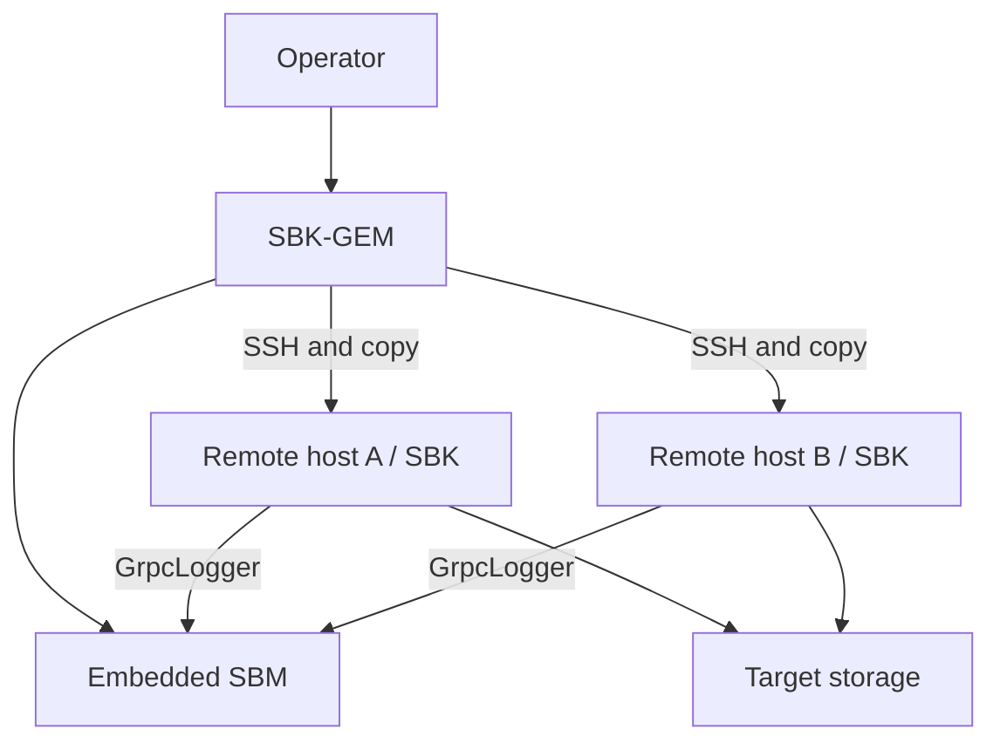

<!--
Copyright (c) KMG. All Rights Reserved.

Licensed under the Apache License, Version 2.0 (the "License");
you may not use this file except in compliance with the License.
You may obtain a copy of the License at

    http://www.apache.org/licenses/LICENSE-2.0

Unless required by applicable law or agreed to in writing, software
distributed under the License is distributed on an "AS IS" BASIS,
WITHOUT WARRANTIES OR CONDITIONS OF ANY KIND, either express or implied.
See the License for the specific language governing permissions and
limitations under the License.
-->

# SBK-GEM: Group Execution Monitor

SBK-GEM runs one SBK workload across multiple hosts. It uses Apache MINA SSHD to connect to remote machines, transfer or locate an SBK distribution, execute the same benchmark arguments on each host, and aggregate client measurements through an embedded SBM instance.

## Responsibilities



SBK-GEM owns remote launch and aggregate lifecycle. The remote SBK processes still own driver discovery, workload scheduling, and storage I/O. SBM owns aggregation.

## Prerequisites

- JDK 25 on the local GEM host and compatible Java on each remote host.
- SSH reachability and authentication for every target.
- A writable remote installation/work directory.
- Network reachability from remote SBK clients back to the GEM/SBM host, normally on port `9717`.
- Network reachability from remote hosts to the target storage system.
- Consistent SBK distribution and driver dependencies on every host.

Use dedicated benchmark hosts and least-privilege SSH credentials. Do not put passwords or private keys in committed files.

## Build

```bash
./gradlew :sbk-gem:check
./gradlew :sbk-gem:installDist
```

## Run

Display the current connection, remote-installation, SBM, and benchmark options:

```bash
./sbk-gem/build/install/sbk-gem/bin/sbk-gem -help
```

SBK-GEM accepts GEM-specific options and forwards an SBK argument set to remote processes. Because authentication and connection-file formats are security-sensitive and evolve independently of a sample environment, use generated help and the checked-in example configuration files as the authority.

Before a multi-host run:

1. Run the intended SBK command successfully on one target host.
2. Verify non-interactive SSH connectivity under the exact benchmark account.
3. Verify the remote install directory and Java runtime.
4. Verify that the remote host can reach the target backend.
5. Verify that the remote host can reach the advertised SBM host and port.
6. Start with one remote host and a short duration.
7. Scale hosts only after the aggregate connection and record counts are correct.

## Runtime sequence

1. `SbkGemMain` delegates to `SbkGem`.
2. GEM parses connection, remote-path, SBM, and forwarded SBK arguments.
3. It constructs an embedded `SbmBenchmark`.
4. `SbkGemBenchmark` establishes SSH sessions and prepares the remote distribution.
5. GEM appends `-out GrpcLogger`, the SBM callback host, and the SBM port to remote commands.
6. Remote SBK processes run their selected driver against the storage system.
7. Measurements return to embedded SBM and are reported as aggregate windows and totals.
8. GEM collects remote responses and shuts down sessions and SBM.

## Code map

| Class | Responsibility |
|---|---|
| `io.gem.main.SbkGemMain` | Executable entry point |
| `io.gem.api.impl.SbkGem` | Discovery, argument parsing, remote-command construction |
| `SbkGemBenchmark` | Remote sessions and embedded-SBM lifecycle |
| `SshSession` | One SSH connection/session abstraction |
| `SshUtils` | SSH and file-transfer helpers |
| `ConnectionConfig` | Remote connection model |
| `GemPrometheusLogger` | GEM/SBM aggregate metrics output |

## Failure domains

Diagnose distributed failures by boundary:

| Symptom | Check |
|---|---|
| Cannot connect | DNS, route, SSH port, account, key permissions, host-key policy |
| Copy/install fails | Remote permissions, disk space, path, archive integrity |
| Remote Java failure | Java 25 compatibility, `JAVA_HOME`, executable permissions |
| Driver not found | Same distribution on all hosts, both driver registration files, pathing JAR |
| No aggregate records | Remote command includes `GrpcLogger`; callback host/port reachable |
| Some clients disappear | Remote stderr, SBM connection metrics, firewall/NAT timeouts |
| Different results by host | Distribution hash, JVM flags, CPU/network topology, backend locality |

## Reproducibility record

Save the sanitized connection topology, full forwarded SBK arguments, local and remote commit/version, Java versions, driver SDK version, embedded SBM settings, host clock status, and backend configuration. Treat aggregate throughput as a sum across load generators and verify that the target—not the network or SBM host—is the intended bottleneck.

## Further reading

- [Distributed architecture](../docs/ARCHITECTURE.md#distributed-flow)
- [Detailed GEM internals](../docs/sbk-internals.md#7-sbk-gem--the-distributed-orchestrator)
- [SBM](../sbm/README.md)
- [YML wrapper](../sbk-gem-yal/README.md)
