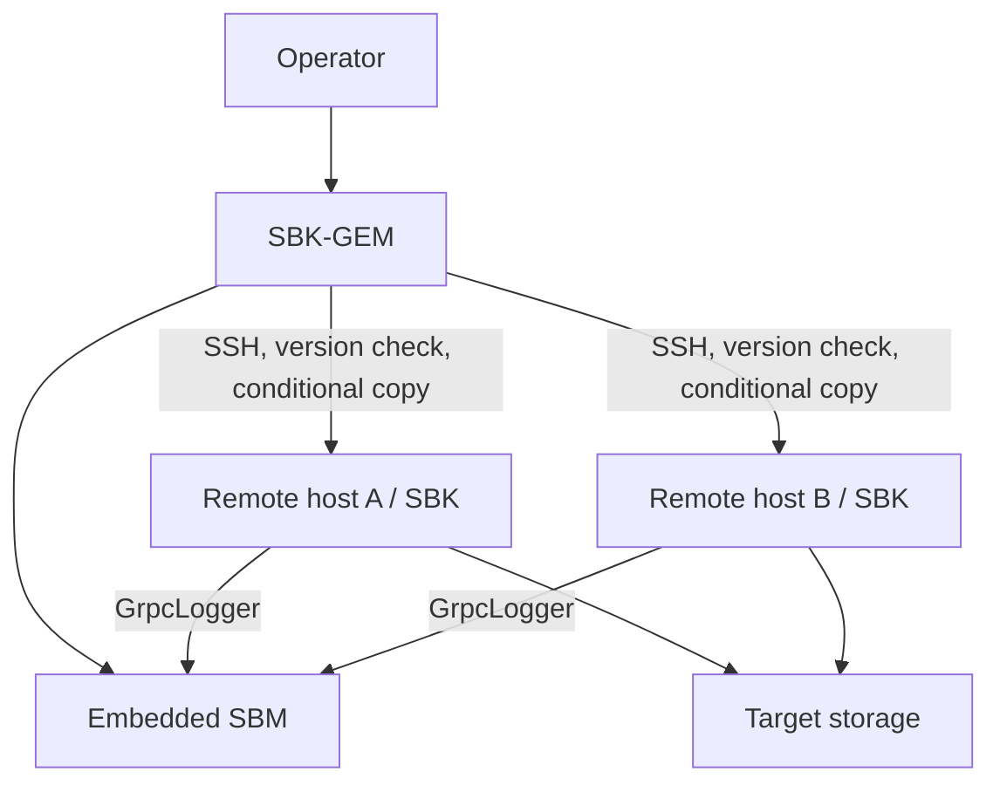

<!--
Copyright (c) KMG. All Rights Reserved.

Licensed under the Apache License, Version 2.0 (the "License");
you may not use this file except in compliance with the License.
You may obtain a copy of the License at

    http://www.apache.org/licenses/LICENSE-2.0

Unless required by applicable law or agreed to in writing, software
distributed under the License is distributed on an "AS IS" BASIS,
WITHOUT WARRANTIES OR CONDITIONS OF ANY KIND, either express or implied.
See the License for the specific language governing permissions and
limitations under the License.
-->

# SBK-GEM: Group Execution Monitor

SBK-GEM runs one SBK workload across multiple hosts. It uses Apache MINA SSHD to connect to remote machines, reconcile the expected SBK distribution on every host, execute the same benchmark arguments, and aggregate client measurements through an embedded SBM instance.

## Responsibilities



SBK-GEM owns remote launch and aggregate lifecycle. The remote SBK processes still own driver discovery, workload scheduling, and storage I/O. SBM owns aggregation.

## Prerequisites

- JDK 25 on the local GEM host. Remote hosts need either a compatible Java runtime or enough writable disk space and permission for `javacopy` provisioning.
- SSH reachability, a trusted `known_hosts` entry, and authentication for every target.
- A writable remote installation/work directory.
- Network reachability from remote SBK clients back to the GEM/SBM host, normally on port `9717`.
- Network reachability from remote hosts to the target storage system.
- Consistent SBK distribution and driver dependencies on every host.

Use dedicated benchmark hosts and least-privilege SSH credentials. Do not put passwords or private keys in committed files.

### SSH authentication and host verification

Passwordless public-key login is the recommended configuration. Run SBK-GEM as
the same local account whose SSH configuration and credentials can reach the
remote benchmark account. SBK-GEM can use keys exposed by the local SSH agent
(`SSH_AUTH_SOCK`) and identity files selected by the local OpenSSH configuration,
including the conventional files under `~/.ssh`. An agent is the preferred way
to use passphrase-protected keys because their passphrases do not have to be put
in SBK configuration.

The `-gempass` option and `SBK_GEM_SSH_PASSWD` environment variable are optional
password-authentication fallbacks. Leave both unset for passwordless login. Do
not store `gempass` in a committed YML or properties file.

Remote host identity is checked against the local user's OpenSSH
`~/.ssh/known_hosts` data by default. Use `-knownhosts <path>` to select a
dedicated trust file. Add and verify each node's host key before starting a
benchmark; an unknown or changed key is rejected. `-hostkeycheck false` is an
explicit opt-out for isolated, disposable environments and weakens protection
against server impersonation, so it should not be used for normal benchmarks.
A successful command-line `ssh` connection is a useful preflight check, but run
it as the exact operating system user that will launch SBK-GEM so it reads the
same agent, key files, SSH configuration, and `known_hosts` file.

## Build

```bash
./gradlew :sbk-gem:check
./gradlew :sbk-gem:installDist
```

## Run

Display the current connection, remote-installation, SBM, and benchmark options:

```bash
./sbk-gem/build/install/sbk-gem/bin/sbk-gem -help
```

SBK-GEM accepts GEM-specific options and forwards an SBK argument set to remote processes. Because authentication and connection-file formats are security-sensitive and evolve independently of a sample environment, use generated help and the checked-in example configuration files as the authority.

By default, SBK-GEM runs `<remote-sbk-command> -version` on every node. A node is left unchanged when that command exists, succeeds, and reports the exact expected version. The three deployment lifecycle options are independent:

- `-copy true|false` permits SBK-GEM to copy SBK when it is missing or mismatched; the default is `true`. With `false`, a missing or mismatched installation is reported as an error.
- `-delete true|false` controls whether an existing mismatched installation is removed before replacement; the default is `true`. A missing installation never needs pre-copy deletion.
- `-deleteafter true|false` controls whether the remote deployment is removed after benchmarking; the default is `false`, allowing the verified installation to be reused.

After any copy, SBK-GEM verifies the copied version. It then resolves and checks the exact absolute executable path independently on every node before starting SBM or launching a benchmark.

SBK-GEM also reconciles Java independently on every node:

- `-javaversion <major>` selects the required Java major version; the default is `25`.
- `-javacopy true|false` controls whether SBK-GEM may copy the JVM running SBK-GEM when the required remote Java is unavailable; the default is `true`.
- `-javadir <home>` optionally identifies a remote Java home containing `bin/java`. When omitted, SBK-GEM discovers Java from the remote `PATH`. If a copy is necessary without `javadir`, it installs Java in a reusable `sbk-java-<major>` directory beside the GEM working directory.

For each remote launch, GEM exports the selected node-specific `SBK_JAVA_HOME` and prepends `$SBK_JAVA_HOME/bin` to `PATH`. SBK’s generated launcher therefore uses the verified runtime. Automatic copying is rejected when the local JVM major version differs from `-javaversion`, because copying that JVM could not satisfy the request.

Before a multi-host run:

1. Run the intended SBK command successfully on one target host.
2. Verify non-interactive SSH connectivity under the exact local and remote accounts, including host-key verification.
3. Verify the remote install directory and Java runtime.
4. Verify that the remote host can reach the target backend.
5. Verify that the remote host can reach the advertised SBM host and port.
6. Start with one remote host and a short duration.
7. Scale hosts only after the aggregate connection and record counts are correct.

## Runtime sequence

1. `SbkGemMain` delegates to `SbkGem`.
2. GEM parses connection, remote-path, SBM, and forwarded SBK arguments.
3. It constructs an embedded `SbmBenchmark`.
4. `SbkGemBenchmark` establishes SSH sessions, discovers or provisions Java, and reconciles the SBK version on every node.
5. GEM appends `-out GrpcLogger`, the SBM callback host, and the SBM port to remote commands.
6. Remote SBK processes run their selected driver against the storage system.
7. Measurements return to embedded SBM and are reported as aggregate windows and totals.
8. GEM collects remote responses and shuts down sessions and SBM.

## Code map

| Class | Responsibility |
|---|---|
| `io.gem.main.SbkGemMain` | Executable entry point |
| `io.gem.api.impl.SbkGem` | Discovery, argument parsing, remote-command construction |
| `SbkGemBenchmark` | Remote sessions and embedded-SBM lifecycle |
| `SshSession` | One SSH connection/session abstraction |
| `SshUtils` | SSH and file-transfer helpers |
| `ConnectionConfig` | Remote connection model |
| `GemPrometheusLogger` | GEM/SBM aggregate metrics output |
| `GemWebLogger` | GEM adapter for the embedded SBM local live web console |

Select `-out GemWebLogger` for dependency-free aggregate graphs. The web console uses plain HTTP and listens on all
interfaces at port 9720 by default; open `http://127.0.0.1:9720` locally or
`http://<sbk-gem-host>:9720` remotely. Remote SBK processes still use `GrpcLogger`; the embedded SBM publishes the
combined cluster result to the Local Web Console. Web console
options are listed by `sbk-gem -out GemWebLogger -help` and are forwarded only to the local SBM logger. A running
idle web console is reused, but an active SBK, SBM, or SBK-GEM WebLogger owner causes SBK-GEM to exit with a clear
ownership error. After a run, graphs remain available while a browser is connected; the unused web console exits
after one minute. Local Web Console HTTP access does not use SBK-GEM's SSH connections and is not encrypted; expose it only
on a trusted benchmark network.

See the [WebLogger guide](../docs/WEB_LOGGER.md) for web console options, ownership and shutdown behavior, network
security, and complete SBK, SBM, and SBK-GEM examples.

## Failure domains

Diagnose distributed failures by boundary:

| Symptom | Check |
|---|---|
| Cannot connect | DNS, route, SSH port, account, `SSH_AUTH_SOCK`, identity-file permissions, and `known_hosts` |
| Authentication rejected | Remote `authorized_keys`, requested user, agent contents, configured identity files, or optional password |
| Host key rejected | Missing or changed entry in the SBK-GEM user's `~/.ssh/known_hosts`; verify the key out of band before updating it |
| Copy/install fails | Remote permissions, disk space, path, archive integrity |
| Remote Java failure | Java 25 compatibility, `JAVA_HOME`, executable permissions |
| Driver not found | Same distribution on all hosts, both driver registration files, pathing JAR |
| No aggregate records | Remote command includes `GrpcLogger`; callback host/port reachable |
| Some clients disappear | Remote stderr, SBM connection metrics, firewall/NAT timeouts |
| Different results by host | Distribution hash, JVM flags, CPU/network topology, backend locality |

## Reproducibility record

Save the sanitized connection topology, full forwarded SBK arguments, local and remote commit/version, Java versions, driver SDK version, embedded SBM settings, host clock status, and backend configuration. Treat aggregate throughput as a sum across load generators and verify that the target—not the network or SBM host—is the intended bottleneck.

## Further reading

- [Distributed architecture](../docs/ARCHITECTURE.md#distributed-flow)
- [Detailed GEM internals](../docs/sbk-internals.md#7-sbk-gem--the-distributed-orchestrator)
- [SBM](../sbm/README.md)
- [YML wrapper](../sbk-gem-yal/README.md)
