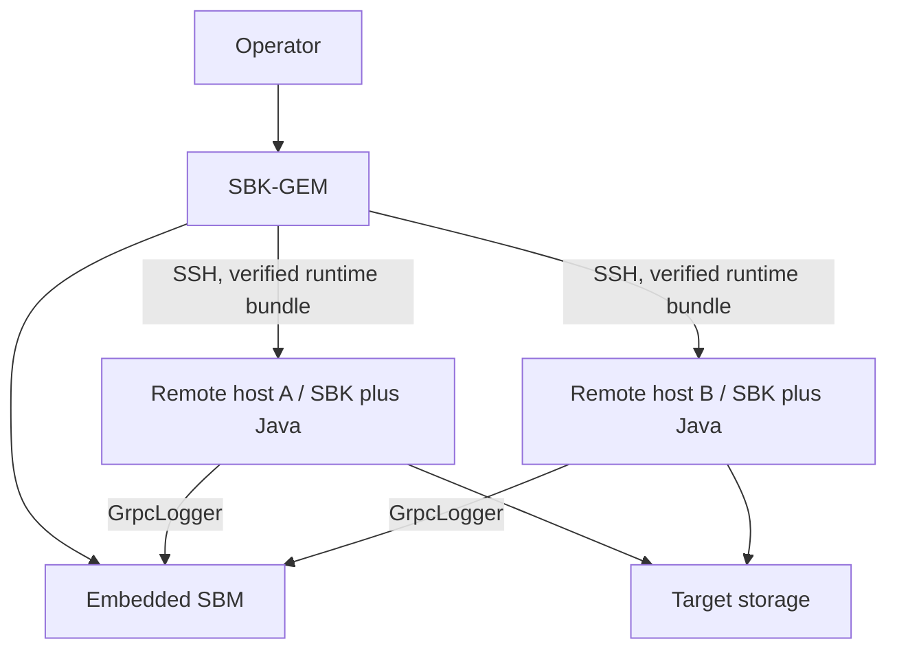

<!--
Copyright (c) KMG. All Rights Reserved.

Licensed under the Apache License, Version 2.0 (the "License");
you may not use this file except in compliance with the License.
You may obtain a copy of the License at

    http://www.apache.org/licenses/LICENSE-2.0

Unless required by applicable law or agreed to in writing, software
distributed under the License is distributed on an "AS IS" BASIS,
WITHOUT WARRANTIES OR CONDITIONS OF ANY KIND, either express or implied.
See the License for the specific language governing permissions and
limitations under the License.
-->

# SBK-GEM: Group Execution Monitor

SBK-GEM runs one SBK workload across multiple hosts. It uses Apache MINA SSHD to connect to remote machines, reconcile the expected SBK distribution on every host, execute the same benchmark arguments, and aggregate client measurements through an embedded SBM instance.

## Responsibilities



SBK-GEM owns remote launch and aggregate lifecycle. The remote SBK processes still own driver discovery, workload scheduling, and storage I/O. SBM owns aggregation.

## Prerequisites

- JDK 25 on the local GEM host. With the default `-javacopy true`, remote
  hosts do not need Java installed; the controller JDK is part of the verified
  runtime bundle. With `-javacopy false`, every remote host must already have
  the requested JDK, including both `bin/java` and `bin/javac`.
- SSH reachability, a trusted `known_hosts` entry, and authentication for every target.
- A writable remote installation/work directory.
- Network reachability from remote SBK clients back to the GEM/SBM host, normally on port `9717`.
- Network reachability from remote hosts to the target storage system.
- A homogeneous operating-system cluster: controller, containers, and all
  remote nodes must use the same supported operating system (`Linux` or
  `macOS`). CPU architecture is not part of deployment compatibility. Windows
  and mixed Linux/macOS runs are rejected.
- POSIX `tar` plus either `sha256sum` or `shasum` on every remote host.

Use dedicated benchmark hosts and least-privilege SSH credentials. Do not put passwords or private keys in committed files.

### SSH authentication and host verification

Passwordless public-key login is the recommended configuration. Run SBK-GEM as
the same local account whose SSH configuration and credentials can reach the
remote benchmark account. SBK-GEM can use keys exposed by the local SSH agent
(`SSH_AUTH_SOCK`) and identity files selected by the local OpenSSH configuration,
including the conventional files under `~/.ssh`. An agent is the preferred way
to use passphrase-protected keys because their passphrases do not have to be put
in SBK configuration.

The `-gempass` option and `SBK_GEM_SSH_PASSWD` environment variable are optional
password-authentication fallbacks. Leave both unset for passwordless login. Do
not store `gempass` in a committed YML or properties file.

Remote host identity is checked against the local user's OpenSSH
`~/.ssh/known_hosts` data by default. Use `-knownhosts <path>` to select a
dedicated trust file. Add and verify each node's host key before starting a
benchmark; an unknown or changed key is rejected. `-hostkeycheck false` is an
explicit opt-out for isolated, disposable environments and weakens protection
against server impersonation, so it should not be used for normal benchmarks.
A successful command-line `ssh` connection is a useful preflight check, but run
it as the exact operating system user that will launch SBK-GEM so it reads the
same agent, key files, SSH configuration, and `known_hosts` file.

## Build

```bash
./gradlew :sbk-gem:check
./gradlew :sbk-gem:installDist
```

## Run

Display the current connection, remote-installation, SBM, and benchmark options:

```bash
./sbk-gem/build/install/sbk-gem/bin/sbk-gem -help
```

SBK-GEM accepts GEM-specific options and forwards an SBK argument set to remote processes. Because authentication and connection-file formats are security-sensitive and evolve independently of a sample environment, use generated help and the checked-in example configuration files as the authority.

`-idletimeoutseconds N` is a shared lifecycle option with a default of 600
seconds. GEM forwards it to every remote SBK process and configures its embedded
SBM with the same value. The deadline is enabled only for fixed-record runs
(`-records` or fixed-mode `-totalrecords`) and is disabled whenever `-seconds`
is used. Each positive performance result restarts the full interval. A remote
PerL idle failure therefore terminates that SBK process and becomes a
host-tagged GEM failure; an embedded SBM idle failure also terminates GEM
immediately rather than leaving fixed-record orchestration waiting indefinitely.
The value must be strictly greater than the reporting interval used by the
remote SBK loggers and embedded SBM logger.

The final SBK-GEM lifecycle message reports successful `-seconds` or `-records`
mode completion, an explicit stop, an idle-timeout exit, or an internal remote,
SSH, cleanup, or embedded-SBM exception. When several failures occur, the first
failure remains authoritative and later failures are retained as suppressed
causes.

### Node SSH endpoints

`-gemport` remains the default SSH port for every entry in `-nodes`. A node can
override that default by using a `host:port` endpoint. This supports multiple
SSH nodes exposed through different ports on one host, including disposable
Docker fixtures:

```bash
sbk-gem -nodes 127.0.0.1:2201,127.0.0.1:2202 -gemport 22 \
  -class file -writers 1 -records 1000 -size 4096
```

Use brackets when an IPv6 address includes a port, for example
`-nodes [::1]:2201`. Hostnames and addresses without an endpoint-specific port
continue to use `-gemport`.

### Aggregate record control

Use `-records` to preserve the standard SBK behavior: the supplied value is
forwarded to every remote SBK client. Use the GEM-only `-totalrecords` option
when the value must apply to the distributed benchmark as a whole:

```bash
# Execute exactly 1,000,000 records across all configured nodes.
sbk-gem -nodes node-a,node-b -class file -writers 4 -size 4096 \
  -totalrecords 1000000

# Limit the aggregate write rate to exactly 120,000 records/second for 60 seconds.
sbk-gem -nodes node-a,node-b -class file -writers 4 -size 4096 \
  -totalrecords 120000 -seconds 60
```

Without `-seconds`, GEM divides the fixed count across nodes and assigns any
remainder to the first nodes. With `-seconds`, it divides the aggregate
records/second rate in whole per-worker units so the requested total remains
exact. The rate must therefore be divisible by the active worker count and
must provide at least one record/second to every active worker on every node.
For mixed writer/reader runs, the aggregate rate applies independently to each
direction when writer and reader counts are equal, matching SBK's shared
per-worker rate model. Timed aggregate rates reject unequal mixed worker counts.
`-totalrecords` is mutually exclusive with `-records` and `-throughput`.

### Aggregate throughput control

Use `-throughput` to apply the supplied MB/s limit independently to every
remote SBK client. Use the GEM-only `-totalthroughput` option when one MB/s
limit must apply to the distributed benchmark as a whole:

```bash
# Limit two remote clients to 200 MB/s in aggregate for 60 seconds.
sbk-gem -nodes node-a,node-b -class file -writers 4 -size 4096 \
  -totalthroughput 200 -seconds 60

# Execute exactly 1,000,001 aggregate records at 200 MB/s aggregate throughput.
sbk-gem -nodes node-a,node-b -class file -writers 4 -size 4096 \
  -totalrecords 1000001 -totalthroughput 200
```

GEM divides the aggregate throughput across the remote clients and forwards a
node-specific `-throughput` value to each one. Decimal division retains twelve
fractional digits and assigns any remainder to the first client, so the
forwarded values sum to the requested aggregate value. Each allocation must
provide at least one record/second to every active worker after SBK converts
MB/s to its per-worker record rate.

`-totalthroughput` is mutually exclusive with `-throughput`. It may be combined
with fixed `-records` or fixed `-totalrecords`. It must not be combined with
timed `-totalrecords`, because in that mode `-totalrecords` already means an
aggregate records/second limit and the two options would define competing
rates. The option is also supported by SBK-GEM-YAL as `totalthroughput`.
Mixed writer/reader runs require equal writer and reader counts because SBK
uses one shared per-worker rate for both directions.

### Immutable runtime deployment

Before connecting to storage, SBK-GEM validates the local `installDist`
layout, including the pathing JAR and every dependency named by its manifest.
It packages the complete distribution and, by default, the controller JDK into
one content-addressed `tar.gz` archive. The identity covers every file,
contained relative symbolic link, and normalized file mode, so two builds
carrying the same SBK version but different dependencies cannot be mistaken
for one another. Links escaping the SBK or JDK source tree are rejected;
directory modes are normalized to `0755` in both the identity and archive.

The archive contains a platform descriptor and per-file SHA-256 manifest.
Every remote node must pass the homogeneous platform/tool preflight. GEM then
automatically uploads only a missing content identity, verifies the archive SHA-256, extracts
to a unique staging directory, verifies every regular file, and atomically
renames the verified runtime into place. A partially copied or failed staging
directory is never used to launch SBK. Subsequent runs reuse the exact verified
content without copying it again. Local archives are cached under
`~/.sbk/cache/sbk-gem` by default; `runtimeCacheDirectory` in
`gem.properties` changes that location. A per-identity file lock serializes
cache writers across GEM processes, and a separately published SHA-256 sidecar
causes incomplete or corrupted cached archives to be rebuilt before use. With
`runtimecleanup=true`, the controller retains only the selected cached bundle;
a non-current archive being transferred by another GEM process is protected by
its cache lock and is removed after it becomes inactive.

Creating a new bundle hashes the complete SBK distribution and optional JDK,
then writes a compressed archive. During this potentially long disk-intensive
step, GEM emits an elapsed-time heartbeat every 5 seconds by default. Runtime
archive copies report the archive size, unique transfer-target count, completed
targets, and hosts still pending. Configure the shared bounded update interval
with `runtimeProgressIntervalSeconds` in `gem.properties`; cached bundles and
fast local-network copies normally complete without a heartbeat.

The deployment lifecycle is automatic: an exact verified SBK-plus-JDK identity
is reused, while missing content is uploaded, verified, and activated without a
separate copy switch. The current identity is retained after benchmarking.
Remote PID leases protect runtimes used by concurrent GEM executions; therefore
an active non-current identity may coexist temporarily and is removed after its
final lease exits. Cleanup compares immutable identities, not version numbers,
so both lower and higher inactive SBK versions are removed.

The deployment lifecycle options are:

- `-sbkdir <directory>` selects the complete local SBK installation to bundle.
  SBK-GEM always validates and executes its standard `bin/sbk` launcher; the
  launcher path is not configurable.
- `-delete true|false` permits replacement only when the exact content-addressed destination exists but fails validation; the default is `true`.
- `-runtimecleanup true|false` removes every inactive non-current remote
  SBK-GEM-managed runtime identity and controller-side cached bundle after
  verified activation and lease/transfer release, regardless of whether its
  SBK version is lower or higher; the default is
  `true`. It never deletes the current identity, a live leased identity, an
  unmanaged directory, or an external JDK selected with `-javacopy false`.

The rule applies to every deployment target in `-nodes`, including the
controller host when it is selected as a node. It does not scan or delete
arbitrary SBK/JDK installations outside the SBK-GEM-managed deployment parent;
doing so would risk deleting user-owned software.

The former `-copy`, `-deleteafter`, and `-sbkcommand` options are rejected with
migration guidance. This prevents disabling required provisioning, deleting
the newly verified runtime at benchmark shutdown, or bypassing the verified
standard launcher contract.

SBK-GEM selects Java as follows:

- `-javaversion <major>` selects the required Java major version; the default is `25`.
- `-javacopy true|false` controls bundle composition. The default `true`
  always includes and uses the complete JDK running SBK-GEM. `false` excludes
  Java and requires a matching remote JDK.
- `-javadir <home>` optionally identifies the required remote JDK when
  `-javacopy false`; otherwise GEM discovers it from `PATH`.

PATH discovery resolves Java symlinks with `realpath` when available, GNU
`readlink -f` when supported, and a POSIX shell symlink walk otherwise. This
keeps `-javacopy false` usable on both Linux and macOS.

For each remote launch, GEM exports the selected node-specific `SBK_JAVA_HOME` and prepends `$SBK_JAVA_HOME/bin` to `PATH`. SBK’s generated launcher therefore uses the verified runtime. Automatic copying is rejected when the local JVM major version differs from `-javaversion`, because copying that JVM could not satisfy the request.

Before a multi-host run:

1. Run the intended SBK command successfully on one target host.
2. Verify non-interactive SSH connectivity under the exact local and remote accounts, including host-key verification.
3. Verify the remote install directory and Java runtime.
4. Verify that the remote host can reach the target backend.
5. Verify that the remote host can reach the advertised SBM host and port.
6. Start with one remote host and a short duration.
7. Scale hosts only after the aggregate connection and record counts are correct.

## Runtime sequence

1. `SbkGemMain` delegates to `SbkGem`.
2. GEM parses connection, remote-path, SBM, and forwarded SBK arguments.
3. GEM adds the common `GrpcLogger`, SBM callback host, and SBM port arguments.
4. It distributes `-totalrecords` and `-totalthroughput` when requested, creating node-specific `-records` and `-throughput` argument lists.
5. It constructs the embedded `SbmBenchmark` and `SbkGemBenchmark`.
6. `SbkGemBenchmark` establishes SSH sessions, enforces homogeneous platform
   compatibility, and verifies or atomically deploys the exact SBK/Java runtime bundle.
7. It starts SBM and launches every remote SBK process with its node-specific arguments.
8. Measurements return to embedded SBM and are reported as aggregate windows and totals.
9. GEM collects remote responses and shuts down sessions and SBM.

## Distributed failure reporting

SBK-GEM treats remote execution and SBM client registration as one distributed
result. The final summary on the GEM/SBM host reports the expected node count,
successful and failed node counts, the maximum number of SBK clients registered
with SBM, and one terminal status for every configured host:

- `SUCCESS` -- the remote SBK process completed with exit code zero.
- `EXIT_FAILURE` -- remote SBK started but returned a non-zero exit code.
- `SSH_ERROR` -- SSH connection, authentication, command startup, or transport failed.
- `TIMEOUT` -- remote execution exceeded its configured deadline.
- `CANCELLED` -- the asynchronous remote operation was cancelled.
- `NOT_COMPLETED` -- no terminal result was available for the configured host.

If any host fails, or fewer SBK clients register with SBM than expected, GEM
labels the distributed run `FAILED` or `INCOMPLETE`, logs that its performance
results are invalid for comparison, aborts any clients waiting at the
coordinated-start barrier, and exits non-zero. One failed future cannot hide the
outcomes of the other nodes: GEM waits for and reports every configured host.
The registration barrier also has a separate deadline, so a remote process that
never reaches SBM cannot leave the other clients waiting indefinitely. Configure
`sbmRegistrationTimeoutSeconds` in `gem.properties` for slow JVM or storage-driver
startup; its default is 120 seconds. The independent `remoteTimeoutSeconds`
setting remains the timeout for individual SSH control operations.

For diagnostics, GEM retains only the most recent 256 KiB of each remote
process's stdout and stderr. Failed hosts include these bounded tails in the
SBM-host log. This preserves the relevant exception and shutdown messages
without allowing a noisy remote process to consume unbounded GEM heap.

## Code map

| Class | Responsibility |
|---|---|
| `io.gem.main.SbkGemMain` | Executable entry point |
| `io.gem.api.impl.SbkGem` | Discovery, argument parsing, remote-command construction |
| `SbkGemBenchmark` | Remote sessions and embedded-SBM lifecycle |
| `SshSession` | One SSH connection/session abstraction |
| `SshUtils` | SSH and file-transfer helpers |
| `ConnectionConfig` | Remote connection model |
| `GemPrometheusLogger` | GEM/SBM aggregate metrics output |
| `GemWebLogger` | GEM adapter for the embedded SBM local live web console |

Select `-out GemPrometheusLogger` to publish the embedded SBM aggregate at
`http://<sbk-gem-host>:9719/metrics`. Remote SBK processes continue using `GrpcLogger`; register only the coordinator
endpoint in the separately deployed [SBK Dashboard](https://github.com/kmgowda/sbk-dashboard). The endpoint uses
`component="sbm"` because the embedded SBM owns aggregation and metrics. See the
[PrometheusLogger and SBK Dashboard guide](../docs/PROMETHEUS_LOGGER.md) for dashboard setup, Compose networking,
registration, tags, retention, and troubleshooting.

Select `-out GemWebLogger` for dependency-free aggregate graphs. The web console uses plain HTTP and listens on all
IPv4 interfaces at port 9720 by default. At benchmark start and completion, SBK-GEM prints run URLs for `localhost`,
loopback, hostname, and every usable host IPv4 address. Remote SBK processes still use `GrpcLogger`; the embedded SBM publishes the
combined cluster result to the Local Web Console. Web console
options are listed by `sbk-gem -out GemWebLogger -help` and are forwarded only to the local SBM logger. A running
web console is reused even while other SBK, SBM, or SBK-GEM WebLogger benchmarks are active; every aggregate has an
independent run URL and browser selection. After a run, graphs remain available while a browser is connected; the unused web console exits
after the configured idle timeout, which defaults to one minute. Remote browser access requires suitable routing and
firewall rules and does not automatically use SBK-GEM's SSH connections. Because the service has no authentication
or TLS, use a trusted network or create a separate tunnel when needed.

See the [WebLogger guide](../docs/WEB_LOGGER.md) for web console options, concurrent-run and shutdown behavior, network
security, and complete SBK, SBM, and SBK-GEM examples.

## Failure domains

Diagnose distributed failures by boundary:

| Symptom | Check |
|---|---|
| Cannot connect | DNS, route, SSH port, account, `SSH_AUTH_SOCK`, identity-file permissions, and `known_hosts` |
| Authentication rejected | Remote `authorized_keys`, requested user, agent contents, configured identity files, or optional password |
| Host key rejected | Missing or changed entry in the SBK-GEM user's `~/.ssh/known_hosts`; verify the key out of band before updating it |
| Copy/install fails | Remote permissions, disk space, `tar`, SHA-256 tool, archive or file-manifest diagnostic |
| Remote Java failure | Homogeneous OS, Java 25 compatibility, executable `java` and `javac` |
| Driver not found | Same distribution on all hosts, both driver registration files, pathing JAR |
| No aggregate records | Remote command includes `GrpcLogger`; callback host/port reachable |
| Some clients disappear | Remote stderr, SBM connection metrics, firewall/NAT timeouts |
| Different results by host | Distribution hash, JVM flags, CPU/network topology, backend locality |

## Reproducibility record

Save the sanitized connection topology, full forwarded SBK arguments, local and remote commit/version, Java versions, driver SDK version, embedded SBM settings, host clock status, and backend configuration. Treat aggregate throughput as a sum across load generators and verify that the target—not the network or SBM host—is the intended bottleneck.

## Further reading

- [Distributed architecture](../docs/ARCHITECTURE.md#distributed-flow)
- [Detailed GEM internals](../docs/sbk-internals.md#7-sbk-gem--the-distributed-orchestrator)
- [SBM](../sbm/README.md)
- [YML wrapper](../sbk-gem-yal/README.md)
