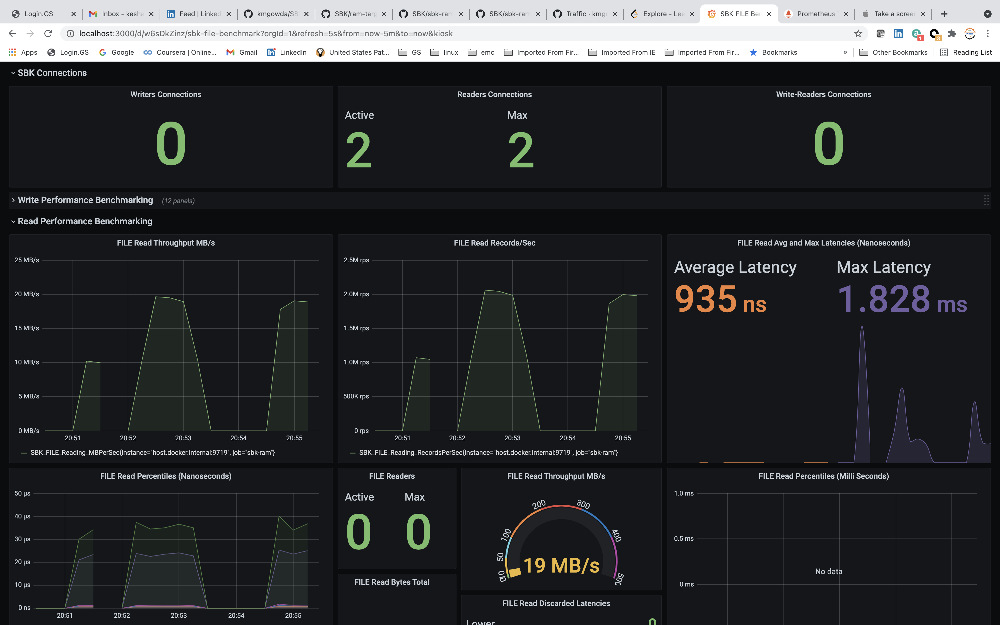

<!--
Copyright (c) KMG. All Rights Reserved.

Licensed under the Apache License, Version 2.0 (the "License");
you may not use this file except in compliance with the License.
You may obtain a copy of the License at

    http://www.apache.org/licenses/LICENSE-2.0
-->
# SBK-RAM : Results Aggregation Monitor

[](https://kmgowda.github.io/SBK/sbk-ram/javadoc/index.html)

The SBK (Storage Benchmark Kit) - RAM (Results Aggregation Monitor) combines the performance results supplied from
multiple SBK instances. The SBK-RAM is the GRPC Server. Multiple SBK instances can log the performance results to a
single SBM-RAM Server. The SBK-RAM determines the cumulative throughput and latency percentile values. Each SBK
instance reports all the latency values in bulk and SBK-RAM integrates all latency records and determines the
performance values for the whole SBK cluster (multi SBK instances). The SBK-RAM is useful if you want to stress the
storage server / Storage cluster with multiple storage clients (SBK instances) and analyse the throughput and
latency percentiles for the whole storage cluster/server. SBK-RAM logs the integrated results to standard output device/logger and to the grafana through prometheus metrics.

## Build SBK-RAM
SBK-RAM is a submodule/project of the SBK framework. If you [build SBK](./../README.md#build-sbk), it builds the SBK-RAM server too.

## Running SBK-RAM locally
The standard help output with SBK-RAM parameters as follows

```
kmg@kmgs-MBP SBK % ./sbk-ram/build/install/sbk-ram/bin/sbk-ram -help 
2021-07-08 16:58:10 INFO 
    _____   ____    _  __           _____               __  __
   / ____| |  _ \  | |/ /          |  __ \      /\     |  \/  |
  | (___   | |_) | | ' /   ______  | |__) |    /  \    | \  / |
   \___ \  |  _ <  |  <   |______| |  _  /    / /\ \   | |\/| |
   ____) | | |_) | | . \           | | \ \   / ____ \  | |  | |
  |_____/  |____/  |_|\_\          |_|  \_\ /_/    \_\ |_|  |_|

2021-07-08 16:58:10 INFO Storage Benchmark Kit - Results Aggregation Monitor
2021-07-08 16:58:10 INFO SBK-RAM Version: 0.892
2021-07-08 16:58:10 INFO Arguments List: [-help]
2021-07-08 16:58:10 INFO Java Runtime Version: 11.0.8+11

usage: sbk-ram
Storage Benchmark Kit - Results Aggregation Monitor

 -action <arg>    action [r: read, w: write, wr: write and read], default:
                  r
 -class <arg>     storage class name; run 'sbk -help' to see the list
 -context <arg>   Prometheus Metric context; default: 9719/metrics; 'no'
                  disables the metrics
 -help            Help message
 -max <arg>       Maximum number of connections; default: 1000
 -ramport <arg>   RAM port number; default: 9717
 -time <arg>      Latency Time Unit [ms:MILLISECONDS, mcs:MICROSECONDS,
                  ns:NANOSECONDS]; default: ms

Please report issues at https://github.com/kmgowda/SBK

```
An Example output of SBK-RAM with 2 SBK file system benchmarking instances are as follows:

```
kmg@kmgs-MBP SBK % ./sbk-ram/build/install/sbk-ram/bin/sbk-ram -class file -time ns
2021-07-10 20:19:35 INFO 
    _____   ____    _  __           _____               __  __
   / ____| |  _ \  | |/ /          |  __ \      /\     |  \/  |
  | (___   | |_) | | ' /   ______  | |__) |    /  \    | \  / |
   \___ \  |  _ <  |  <   |______| |  _  /    / /\ \   | |\/| |
   ____) | | |_) | | . \           | | \ \   / ____ \  | |  | |
  |_____/  |____/  |_|\_\          |_|  \_\ /_/    \_\ |_|  |_|

2021-07-10 20:19:35 INFO Storage Benchmark Kit - Results Aggregation Monitor
2021-07-10 20:19:35 INFO SBK-RAM Version: 0.90
2021-07-10 20:19:35 INFO Arguments List: [-class, file, -time, ns]
2021-07-10 20:19:35 INFO Java Runtime Version: 11.0.8+11
2021-07-10 20:19:35 INFO Time Unit: NANOSECONDS
2021-07-10 20:19:35 INFO Minimum Latency: 0 ns
2021-07-10 20:19:35 INFO Maximum Latency: 180000000000 ns
2021-07-10 20:19:35 INFO Window Latency Store: HashMap
2021-07-10 20:19:35 INFO SBK RAM Benchmark Started
2021-07-10 20:19:35 INFO SBK PrometheusLogger Started
2021-07-10 20:19:35 INFO SBK Connections PrometheusLogger Started
2021-07-10 20:19:35 INFO LatenciesRecord Benchmark Started
Sbk-Ram     0 Connections,     0 Max Connections: file Reading     0 Writers,     0 Readers,      0 Max Writers,     0 Max Readers,           0 records,       0.0 records/sec,     0.00 MB/sec,      NaN ns avg latency,       0 ns max latency;        0 invalid latencies; Discarded Latencies:       0 lower,        0 higher;      0 ns 10th,       0 ns 25th,       0 ns 50th,       0 ns 75th,       0 ns 90th,       0 ns 95th,       0 ns 99th,       0 ns 99.9th,       0 ns 99.99th.
Sbk-Ram     1 Connections,     1 Max Connections: file Reading     0 Writers,     0 Readers,      0 Max Writers,     0 Max Readers,           0 records,       0.0 records/sec,     0.00 MB/sec,      NaN ns avg latency,       0 ns max latency;        0 invalid latencies; Discarded Latencies:       0 lower,        0 higher;      0 ns 10th,       0 ns 25th,       0 ns 50th,       0 ns 75th,       0 ns 90th,       0 ns 95th,       0 ns 99th,       0 ns 99.9th,       0 ns 99.99th.
Sbk-Ram     1 Connections,     1 Max Connections: file Reading     0 Writers,     1 Readers,      0 Max Writers,     1 Max Readers,     6011063 records, 1199414.5 records/sec,    11.44 MB/sec,    758.2 ns avg latency, 2986937 ns max latency;        0 invalid latencies; Discarded Latencies:       0 lower,        0 higher;    664 ns 10th,     673 ns 25th,     685 ns 50th,     699 ns 75th,     729 ns 90th,     848 ns 95th,    1148 ns 99th,   21944 ns 99.9th,   36013 ns 99.99th.
Sbk-Ram     2 Connections,     2 Max Connections: file Reading     0 Writers,     1 Readers,      0 Max Writers,     1 Max Readers,     6459885 records, 1291277.1 records/sec,    12.31 MB/sec,    709.0 ns avg latency, 2949594 ns max latency;        0 invalid latencies; Discarded Latencies:       0 lower,        0 higher;    641 ns 10th,     652 ns 25th,     666 ns 50th,     678 ns 75th,     691 ns 90th,     704 ns 95th,     824 ns 99th,   19438 ns 99.9th,   32207 ns 99.99th.
Sbk-Ram     2 Connections,     2 Max Connections: file Reading     0 Writers,     2 Readers,      0 Max Writers,     2 Max Readers,    10813251 records, 2159725.9 records/sec,    20.60 MB/sec,    850.5 ns avg latency, 4392095 ns max latency;        0 invalid latencies; Discarded Latencies:       0 lower,        0 higher;    659 ns 10th,     703 ns 25th,     792 ns 50th,     832 ns 75th,     856 ns 90th,     897 ns 95th,    1220 ns 99th,   23439 ns 99.9th,   37165 ns 99.99th.
Sbk-Ram     2 Connections,     2 Max Connections: file Reading     0 Writers,     2 Readers,      0 Max Writers,     2 Max Readers,    10684643 records, 2135444.6 records/sec,    20.37 MB/sec,    866.4 ns avg latency, 2800391 ns max latency;        0 invalid latencies; Discarded Latencies:       0 lower,        0 higher;    761 ns 10th,     774 ns 25th,     788 ns 50th,     815 ns 75th,     850 ns 90th,     876 ns 95th,    1008 ns 99th,   23553 ns 99.9th,   36862 ns 99.99th.
Sbk-Ram     2 Connections,     2 Max Connections: file Reading     0 Writers,     2 Readers,      0 Max Writers,     2 Max Readers,    10526716 records, 2101340.8 records/sec,    20.04 MB/sec,    877.2 ns avg latency, 2052048 ns max latency;        0 invalid latencies; Discarded Latencies:       0 lower,        0 higher;    766 ns 10th,     779 ns 25th,     796 ns 50th,     821 ns 75th,     858 ns 90th,     914 ns 95th,    1093 ns 99th,   23912 ns 99.9th,   37314 ns 99.99th.
Sbk-Ram     2 Connections,     2 Max Connections: file Reading     0 Writers,     2 Readers,      0 Max Writers,     2 Max Readers,    10992015 records, 2194732.3 records/sec,    20.93 MB/sec,    840.2 ns avg latency, 1936063 ns max latency;        0 invalid latencies; Discarded Latencies:       0 lower,        0 higher;    762 ns 10th,     774 ns 25th,     785 ns 50th,     798 ns 75th,     818 ns 90th,     846 ns 95th,     958 ns 99th,   21788 ns 99.9th,   34981 ns 99.99th.
Sbk-Ram     2 Connections,     2 Max Connections: file Reading     0 Writers,     2 Readers,      0 Max Writers,     2 Max Readers,    10951472 records, 2186621.0 records/sec,    20.85 MB/sec,    843.6 ns avg latency, 1672882 ns max latency;        0 invalid latencies; Discarded Latencies:       0 lower,        0 higher;    761 ns 10th,     773 ns 25th,     784 ns 50th,     798 ns 75th,     827 ns 90th,     852 ns 95th,     960 ns 99th,   22185 ns 99.9th,   35331 ns 99.99th.
Sbk-Ram     2 Connections,     2 Max Connections: file Reading     0 Writers,     2 Readers,      0 Max Writers,     2 Max Readers,    11007407 records, 2200153.9 records/sec,    20.98 MB/sec,    839.4 ns avg latency, 1615766 ns max latency;        0 invalid latencies; Discarded Latencies:       0 lower,        0 higher;    760 ns 10th,     772 ns 25th,     783 ns 50th,     796 ns 75th,     819 ns 90th,     849 ns 95th,     952 ns 99th,   21853 ns 99.9th,   35044 ns 99.99th.
Sbk-Ram     2 Connections,     2 Max Connections: file Reading     0 Writers,     2 Readers,      0 Max Writers,     2 Max Readers,    10907952 records, 2176606.2 records/sec,    20.76 MB/sec,    846.8 ns avg latency, 1838763 ns max latency;        0 invalid latencies; Discarded Latencies:       0 lower,        0 higher;    763 ns 10th,     774 ns 25th,     786 ns 50th,     803 ns 75th,     835 ns 90th,     855 ns 95th,     969 ns 99th,   22389 ns 99.9th,   36071 ns 99.99th.
Sbk-Ram     2 Connections,     2 Max Connections: file Reading     0 Writers,     2 Readers,      0 Max Writers,     2 Max Readers,    11024964 records, 2202643.9 records/sec,    21.01 MB/sec,    837.8 ns avg latency, 1490376 ns max latency;        0 invalid latencies; Discarded Latencies:       0 lower,        0 higher;    762 ns 10th,     773 ns 25th,     783 ns 50th,     797 ns 75th,     816 ns 90th,     842 ns 95th,     952 ns 99th,   21456 ns 99.9th,   34978 ns 99.99th.
Sbk-Ram     2 Connections,     2 Max Connections: file Reading     0 Writers,     2 Readers,      0 Max Writers,     2 Max Readers,    11095800 records, 2214244.0 records/sec,    21.12 MB/sec,    833.2 ns avg latency, 1422689 ns max latency;        0 invalid latencies; Discarded Latencies:       0 lower,        0 higher;    762 ns 10th,     773 ns 25th,     784 ns 50th,     797 ns 75th,     812 ns 90th,     831 ns 95th,     925 ns 99th,   20723 ns 99.9th,   34666 ns 99.99th.
Sbk-Ram     1 Connections,     2 Max Connections: file Reading     0 Writers,     2 Readers,      0 Max Writers,     2 Max Readers,    11192308 records, 2237574.8 records/sec,    21.34 MB/sec,    821.9 ns avg latency, 1681040 ns max latency;        0 invalid latencies; Discarded Latencies:       0 lower,        0 higher;    680 ns 10th,     715 ns 25th,     779 ns 50th,     799 ns 75th,     833 ns 90th,     854 ns 95th,     970 ns 99th,   22452 ns 99.9th,   36248 ns 99.99th.
Sbk-Ram     1 Connections,     2 Max Connections: file Reading     0 Writers,     1 Readers,      0 Max Writers,     1 Max Readers,     6240414 records, 1246917.5 records/sec,    11.89 MB/sec,    729.0 ns avg latency, 1448259 ns max latency;        0 invalid latencies; Discarded Latencies:       0 lower,        0 higher;    654 ns 10th,     666 ns 25th,     678 ns 50th,     690 ns 75th,     713 ns 90th,     729 ns 95th,     829 ns 99th,   20669 ns 99.9th,   35765 ns 99.99th.
Sbk-Ram     0 Connections,     2 Max Connections: file Reading     0 Writers,     1 Readers,      0 Max Writers,     1 Max Readers,     6493852 records, 1297127.2 records/sec,    12.37 MB/sec,    698.9 ns avg latency, 1458520 ns max latency;        0 invalid latencies; Discarded Latencies:       0 lower,        0 higher;    639 ns 10th,     645 ns 25th,     655 ns 50th,     669 ns 75th,     682 ns 90th,     699 ns 95th,     821 ns 99th,   18858 ns 99.9th,   30925 ns 99.99th.
Sbk-Ram     0 Connections,     2 Max Connections: file Reading     0 Writers,     0 Readers,      0 Max Writers,     0 Max Readers,           0 records,       0.0 records/sec,     0.00 MB/sec,      NaN ns avg latency,       0 ns max latency;        0 invalid latencies; Discarded Latencies:       0 lower,        0 higher;      0 ns 10th,       0 ns 25th,       0 ns 50th,       0 ns 75th,       0 ns 90th,       0 ns 95th,       0 ns 99th,       0 ns 99.9th,       0 ns 99.99th.
Sbk-Ram     0 Connections,     2 Max Connections: file Reading     0 Writers,     0 Readers,      0 Max Writers,     0 Max Readers,           0 records,       0.0 records/sec,     0.00 MB/sec,      NaN ns avg latency,       0 ns max latency;        0 invalid latencies; Discarded Latencies:       0 lower,        0 higher;      0 ns 10th,       0 ns 25th,       0 ns 50th,       0 ns 75th,       0 ns 90th,       0 ns 95th,       0 ns 99th,       0 ns 99.9th,       0 ns 99.99th.
^C
2021-07-10 20:21:08 INFO LatenciesRecord Benchmark Shutdown
2021-07-10 20:21:08 INFO SBK PrometheusLogger Shutdown
2021-07-10 20:21:08 INFO SBK RAM Benchmark Shutdown

```

Note that the SBK-RAM indicates the number of active connections and maximum connections in a session.
while running an SBK instance make sure that you supply the RAM Host address (IP address). Optionally you supply the
port number too , the default port number is **9717**.

A sample SBK instance execution output is as follows:

```
kmg@kmgs-MBP SBK % ./driver-file/build/install/sbk-file/bin/sbk-file -readers 1 -size 10 -seconds 60 -time ns -context no -ram localhost
2021-07-10 20:19:42 INFO Reflections took 58 ms to scan 2 urls, producing 73 keys and 98 values 
2021-07-10 20:19:42 INFO 
       _____   ____    _   __
      / ____| |  _ \  | | / /
     | (___   | |_) | | |/ /
      \___ \  |  _ <  |   <
      ____) | | |_) | | |\ \
     |_____/  |____/  |_| \_\

2021-07-10 20:19:42 INFO Storage Benchmark Kit
2021-07-10 20:19:42 INFO SBK Version: 0.90
2021-07-10 20:19:42 INFO Arguments List: [-readers, 1, -size, 10, -seconds, 60, -time, ns, -context, no, -ram, localhost]
2021-07-10 20:19:42 INFO Java Runtime Version: 11.0.8+11
2021-07-10 20:19:42 INFO Storage Drivers Package: io.sbk
2021-07-10 20:19:42 INFO sbk.applicationName: sbk-file
2021-07-10 20:19:42 INFO sbk.appHome: /Users/kmg/projects/SBK/driver-file/build/install/sbk-file
2021-07-10 20:19:42 INFO sbk.className: file
2021-07-10 20:19:42 INFO '-class': 
2021-07-10 20:19:42 INFO Available Storage Drivers in package 'io.sbk': 1 [File]
2021-07-10 20:19:42 INFO Arguments to Driver 'File' : [-readers, 1, -size, 10, -seconds, 60, -time, ns, -context, no, -ram, localhost]
2021-07-10 20:19:42 INFO Time Unit: NANOSECONDS
2021-07-10 20:19:42 INFO Minimum Latency: 0 ns
2021-07-10 20:19:42 INFO Maximum Latency: 180000000000 ns
2021-07-10 20:19:42 INFO Window Latency Store: HashMap
2021-07-10 20:19:42 INFO Total Window Latency Store: HashMap
2021-07-10 20:19:42 INFO SBK Benchmark Started
2021-07-10 20:19:42 INFO SBK PrometheusLogger Started
2021-07-10 20:19:43 INFO SBK GRPC Logger Started
2021-07-10 20:19:43 INFO Synchronous File Reader initiated !
2021-07-10 20:19:43 INFO Performance Logger Started
2021-07-10 20:19:43 INFO SBK Benchmark initiated Readers
2021-07-10 20:19:43 INFO Reader 0 started , run seconds: 60
File Reading     0 Writers,     1 Readers,      0 Max Writers,     1 Max Readers,     6011063 records, 1201971.6 records/sec,    11.46 MB/sec,    758.2 ns avg latency, 2986937 ns max latency;        0 invalid latencies; Discarded Latencies:       0 lower,        0 higher;    664 ns 10th,     673 ns 25th,     685 ns 50th,     699 ns 75th,     729 ns 90th,     848 ns 95th,    1148 ns 99th,   21944 ns 99.9th,   36013 ns 99.99th.
File Reading     0 Writers,     1 Readers,      0 Max Writers,     1 Max Readers,     6459885 records, 1291718.4 records/sec,    12.32 MB/sec,    709.0 ns avg latency, 2949594 ns max latency;        0 invalid latencies; Discarded Latencies:       0 lower,        0 higher;    641 ns 10th,     652 ns 25th,     666 ns 50th,     678 ns 75th,     691 ns 90th,     704 ns 95th,     824 ns 99th,   19438 ns 99.9th,   32207 ns 99.99th.
File Reading     0 Writers,     1 Readers,      0 Max Writers,     1 Max Readers,     5775479 records, 1154864.4 records/sec,    11.01 MB/sec,    796.1 ns avg latency, 1541763 ns max latency;        0 invalid latencies; Discarded Latencies:       0 lower,        0 higher;    645 ns 10th,     670 ns 25th,     726 ns 50th,     801 ns 75th,     841 ns 90th,     855 ns 95th,     953 ns 99th,   22268 ns 99.9th,   34923 ns 99.99th.
File Reading     0 Writers,     1 Readers,      0 Max Writers,     1 Max Readers,     5280616 records, 1055912.0 records/sec,    10.07 MB/sec,    876.9 ns avg latency, 1877019 ns max latency;        0 invalid latencies; Discarded Latencies:       0 lower,        0 higher;    763 ns 10th,     777 ns 25th,     797 ns 50th,     830 ns 75th,     855 ns 90th,     875 ns 95th,    1017 ns 99th,   24065 ns 99.9th,   37981 ns 99.99th.
File Reading     0 Writers,     1 Readers,      0 Max Writers,     1 Max Readers,     5281223 records, 1056033.2 records/sec,    10.07 MB/sec,    876.2 ns avg latency, 1488260 ns max latency;        0 invalid latencies; Discarded Latencies:       0 lower,        0 higher;    764 ns 10th,     777 ns 25th,     794 ns 50th,     820 ns 75th,     860 ns 90th,     924 ns 95th,    1096 ns 99th,   23955 ns 99.9th,   37399 ns 99.99th.
File Reading     0 Writers,     1 Readers,      0 Max Writers,     1 Max Readers,     5521693 records, 1104117.6 records/sec,    10.53 MB/sec,    837.9 ns avg latency, 1604093 ns max latency;        0 invalid latencies; Discarded Latencies:       0 lower,        0 higher;    761 ns 10th,     772 ns 25th,     783 ns 50th,     797 ns 75th,     817 ns 90th,     843 ns 95th,     958 ns 99th,   21668 ns 99.9th,   34609 ns 99.99th.
File Reading     0 Writers,     1 Readers,      0 Max Writers,     1 Max Readers,     5514098 records, 1102599.0 records/sec,    10.52 MB/sec,    839.6 ns avg latency, 1672882 ns max latency;        0 invalid latencies; Discarded Latencies:       0 lower,        0 higher;    760 ns 10th,     771 ns 25th,     782 ns 50th,     795 ns 75th,     816 ns 90th,     843 ns 95th,     951 ns 99th,   22100 ns 99.9th,   35027 ns 99.99th.
File Reading     0 Writers,     1 Readers,      0 Max Writers,     1 Max Readers,     5485705 records, 1096921.4 records/sec,    10.46 MB/sec,    844.5 ns avg latency, 1615766 ns max latency;        0 invalid latencies; Discarded Latencies:       0 lower,        0 higher;    760 ns 10th,     771 ns 25th,     783 ns 50th,     800 ns 75th,     836 ns 90th,     859 ns 95th,     963 ns 99th,   22454 ns 99.9th,   35506 ns 99.99th.
File Reading     0 Writers,     1 Readers,      0 Max Writers,     1 Max Readers,     5525426 records, 1104864.1 records/sec,    10.54 MB/sec,    838.1 ns avg latency, 1838763 ns max latency;        0 invalid latencies; Discarded Latencies:       0 lower,        0 higher;    759 ns 10th,     771 ns 25th,     782 ns 50th,     796 ns 75th,     819 ns 90th,     842 ns 95th,     950 ns 99th,   21944 ns 99.9th,   35501 ns 99.99th.
File Reading     0 Writers,     1 Readers,      0 Max Writers,     1 Max Readers,     5500739 records, 1099927.7 records/sec,    10.49 MB/sec,    841.8 ns avg latency, 1343604 ns max latency;        0 invalid latencies; Discarded Latencies:       0 lower,        0 higher;    760 ns 10th,     771 ns 25th,     784 ns 50th,     800 ns 75th,     829 ns 90th,     852 ns 95th,     971 ns 99th,   22069 ns 99.9th,   35444 ns 99.99th.
File Reading     0 Writers,     1 Readers,      0 Max Writers,     1 Max Readers,     5587195 records, 1117215.4 records/sec,    10.65 MB/sec,    829.7 ns avg latency, 1422689 ns max latency;        0 invalid latencies; Discarded Latencies:       0 lower,        0 higher;    760 ns 10th,     772 ns 25th,     783 ns 50th,     795 ns 75th,     808 ns 90th,     820 ns 95th,     921 ns 99th,   20585 ns 99.9th,   34190 ns 99.99th.
File Reading     0 Writers,     1 Readers,      0 Max Writers,     1 Max Readers,     5438393 records, 1090078.8 records/sec,    10.40 MB/sec,    849.2 ns avg latency, 1288748 ns max latency;        0 invalid latencies; Discarded Latencies:       0 lower,        0 higher;    762 ns 10th,     773 ns 25th,     787 ns 50th,     806 ns 75th,     838 ns 90th,     858 ns 95th,     974 ns 99th,   22706 ns 99.9th,   35972 ns 99.99th.
2021-07-10 20:20:43 INFO Reader 0 exited
Total : File Reading     0 Writers,     0 Readers,      0 Max Writers,     1 Max Readers,    67381515 records, 1123025.2 records/sec,    10.71 MB/sec,    822.2 ns avg latency, 2986937 ns max latency;        0 invalid latencies; Discarded Latencies:       0 lower,        0 higher;    670 ns 10th,     753 ns 25th,     779 ns 50th,     798 ns 75th,     830 ns 90th,     855 ns 95th,     986 ns 99th,   22171 ns 99.9th,   35477 ns 99.99th.
2021-07-10 20:20:43 INFO Performance Logger Shutdown
2021-07-10 20:20:43 INFO SBK PrometheusLogger Shutdown
2021-07-10 20:20:43 INFO SBK GRPC Logger Shutdown
2021-07-10 20:20:44 INFO SBK Benchmark Shutdown

```

Note that option **-ram** is used to supply the SBK-RAM host ; In the above example, its localhost and default port is 9717.

### SBK-RAM Grafana Dashboards
when you run the SBK-RAM, by default it starts the http server and all the output benchmark data is directed to the default port number: **9719** and **metrics** context.
If you want to change the port number and context, you can use the command line argument **-context** to change the same.
you have to run the prometheus monitoring system (server [default port number is 9090] cum client) which pulls/fetches the benchmark data from the local/remote http server.
If you want to include additional SBK-RAM nodes/instances to fetch the performance data or from port number other than **9719**, you need to extend or update [ram-targets.json](https://github.com/kmgowda/SBK/blob/master/grafana/prometheus/ram-targets.json)
In case, if you are fetching metrics/benchmark data from remote http server , or from the context other than **metrics** then you need to change the [default prometheus server configuration](https://github.com/kmgowda/SBK/blob/master/grafana/prometheus/prometheus.yml) too.
Run the grafana server (cum a client) to fetch the benchmark data from prometheus.
For example, if you are running a local grafana server then by default it fetches the data from the prometheus server at the local port 9090.
You can access the local grafana server at localhost:3000 in your browser using **admin/admin** as default username / password.
You can import the grafana dashboards to fetch the SBK and SBK-RAM benchmark data of the existing supported storage drivers from [grafana dashboards](https://github.com/kmgowda/SBK/tree/master/grafana/dashboards).

The SBK-RAM (Server side) and SBK (client side) can use the same dashboard for a selected storage driver/device. for SBK-RAM , these grafana dashboards shows the number of active and maximum connections.
The sample output of 2 SBK instances of file system benchmark data with grafana is below

[](https://github.com/kmgowda/SBK/tree/master/sbk-ram/images/sbk-ram-file-grafana.png)

### SBK-RAM JMX Exporter and Grafana
The SBK can start the java agent to export the JVM metrics to Grafana via Prometheus. you just have build with
parameter **-PjmxExport=true** while building SBK. Refer : [build SBK with JMX](./../README.md#SBK with JMX exporter and Grafana)
All the SBK-RAM JVM metrics will be available at http://localhost:9721/metrics The network port **9721** to used to expose the metrics.


## SBK-RAM Docker Containers
The SBK-RAM Docker images are available at [SBK Docker](https://hub.docker.com/repository/docker/kmgowda/sbk-ram)

The SBK docker image pull command is
```
docker pull kmgowda/sbk-ram
```

you can straightaway run the docker image too, For example
```
docker run -p 127.0.0.1:9717:9717/tcp -p 127.0.0.1:9719:9719/tcp kmgowda/sbk-ram:latest -class file -time ns
```
* Note that the option **-p 127.0.0.1:9719:9719/tcp** redirects the 9719 port to local port to send the performance
  metric data for Prometheus.
* Another option **-p 127.0.0.1:9717:9717/tcp** redirect the port 9717 port to local port to receive the performance
  results from SBK instances.
* Avoid using the **--network host** option , because this option overrides the port redirection.


## Running SBK-RAM Docker Compose
The SBK-RAM docker compose consists of SBK-RAM docker image, Grafana and prometheus docker images.
The [grafana image](https://github.com/kmgowda/SBK/blob/master/grafana/Dockerfile) contains the [dashboards](https://github.com/kmgowda/SBK/tree/master/grafana/dashboards) which can be directly deployed for the performance analytics.

As an example, just follow the below steps to see the performance graphs

1. In the sbk-ram directory build the 'sbk-ram' service of the [docker compose](https://github.com/kmgowda/SBK/blob/master/sbk-ram/docker-compose.yml) file as follows.

 ```
 <SBK dir>% docker-compose build

 ```

2. Run the 'sbk-ram' service as follows.

 ```
 <SBK dir>% docker-compose run -p 127.0.0.1:9717:9717/tcp sbk-ram -class file -time ns

 ```
Note that , 9717 is the exposed port from sbk-ram container to receive the benchmark results from remote SBK
instances via localhost.
The option **-class** is the same as in SBK command/application. you should use the same storage class and time unit in SBK instances too.

1. login to [grafana localhost port 3000](http://localhost:3000) with username **admin** and password **sbk**
1. go to dashboard menu and pick the dashboard of the storage device on which you are running the performance benchmarking.
   in the above example, you can choose the [File system dashboard](https://github.com/kmgowda/SBK/blob/master/grafana/dashboards/sbk-file.json).
1. The SBK-RAM docker compose runs the SBK-RAM image as a docker container.
   In case, if you are running SBK as an application, and you want to see the SBK performance graphs using Grafana,
   then use [Grafana Docker compose](https://github.com/kmgowda/SBK/tree/master/grafana)
