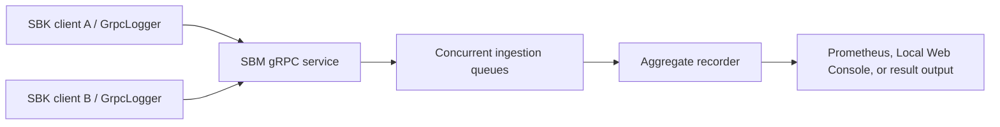

<!--
Copyright (c) KMG. All Rights Reserved.

Licensed under the Apache License, Version 2.0 (the "License");
you may not use this file except in compliance with the License.
You may obtain a copy of the License at

    http://www.apache.org/licenses/LICENSE-2.0

Unless required by applicable law or agreed to in writing, software
distributed under the License is distributed on an "AS IS" BASIS,
WITHOUT WARRANTIES OR CONDITIONS OF ANY KIND, either express or implied.
See the License for the specific language governing permissions and
limitations under the License.
-->

# SBM: Storage Benchmark Monitor

SBM is SBK's distributed measurement aggregator. SBK clients using `GrpcLogger` send SBP/gRPC latency records to SBM, which merges them into cluster-wide periodic and total statistics.

SBP 4.0 uses one ordered client-streaming RPC per SBK process and packed
primitive latency/count fields. `GrpcLogger` accumulates exact frequencies in
a primitive map, submits immutable batches through a bounded sender queue,
obeys gRPC flow control, and waits for the final stream acknowledgment during
shutdown. SBP 4.0 intentionally removes the earlier unary latency RPC and
protobuf map field, so SBK and SBM must use the same SBP major version.
SBM explicitly configures and advertises its inbound record limit
(`maxRecordSizeMB`, 16 MiB by default); SBK sends no more than the smaller
client/server limit.

SBM does not execute storage operations and does not launch remote processes. Use SBK for load generation and SBK-GEM for SSH orchestration.

## Data flow



The default gRPC port is `9717`. Container configuration also exposes the configured metrics port. Keep the gRPC service on a trusted benchmark network unless an external security layer is provided.

## Build

```bash
./gradlew :sbm:check
./gradlew :sbm:installDist
```

The launcher is generated under `sbm/build/install/sbm/bin/sbm`.

## Run

Display authoritative options:

```bash
./sbm/build/install/sbm/bin/sbm -help
```

Start with defaults:

```bash
./sbm/build/install/sbm/bin/sbm
```

When a positive `-records N` is supplied to identify a fixed-record run, SBM
exits with a failed benchmark if no SBK performance batch arrives for
`-idletimeoutseconds N`; the default is 600 seconds. Without `-records`, the
deadline is disabled. The check runs only while the ingestion queues are empty.
Every SBP batch containing completed records renews the complete deadline; an
empty periodic batch is still printable but does not represent progress. The
idle timeout must be strictly greater than the selected logger's reporting
interval.

Start the aggregate Prometheus exporter explicitly:

```bash
./sbm/build/install/sbm/bin/sbm \
  -out SbmPrometheusLogger -class file -action r
```

SBM prints ready-to-copy scrape URLs and exposes aggregate metrics at `http://<sbm-host>:9719/metrics` by default.
Register that endpoint—not each gRPC client—in the separately deployed
[SBK Dashboard](https://github.com/kmgowda/sbk-dashboard). Use `-context PORT/PATH` to change the endpoint. The
[PrometheusLogger and SBK Dashboard guide](../docs/PROMETHEUS_LOGGER.md) covers dashboard deployment, endpoint
registration, metrics tags, retention, networking, and troubleshooting.

Start the dependency-free SBK Local Web Console instead of Prometheus:

```bash
./sbm/build/install/sbm/bin/sbm -out SbmWebLogger -class file -action r
```

The Local Web Console uses plain HTTP and listens on all IPv4 interfaces at port 9720 by default. At benchmark start
and completion, SBM prints run URLs for `localhost`, loopback, hostname, and every usable host IPv4 address. It
displays aggregate SBM connection, workload, throughput, request-pressure, timeout, and latency-percentile data.
Multiple SBK, SBM, and SBK-GEM
WebLogger benchmarks can share the same port, with independent run URLs and browser selections. The console keeps
completed graphs while a browser remains connected and exits after the configured idle timeout with neither an
active publisher nor browser activity. The default idle timeout is one minute. Remote access requires suitable
routing and firewall rules; because the service has no authentication or TLS, use a trusted network or SSH tunnel.

See the [WebLogger guide](../docs/WEB_LOGGER.md) for web console options, lifecycle, browser leases, security, and a
complete distributed example.

Then point one or more installed SBK clients at it:

```bash
./build/install/sbk/bin/sbk \
  -class file -file /tmp/sbk.bin \
  -writers 1 -size 4096 -seconds 30 \
  -out GrpcLogger -sbm <sbm-host> -sbmport 9717
```

Use a hostname or address reachable from every SBK client. Firewalls, containers, and NAT must permit the callback path.

## Internal ownership

| Class | Responsibility |
|---|---|
| `io.sbm.main.SbmMain` | Executable entry point |
| `io.sbm.api.impl.Sbm` | Logger discovery, arguments, and benchmark construction |
| `SbmBenchmark` | gRPC server and aggregate-recorder lifecycle |
| `SbmGrpcService` | SBP registration, ordered stream validation, and latency-record endpoints |
| `SbmLatencyBenchmark` | Concurrent queue ingestion and window dispatch |
| `SbmTotalWindowLatencyPeriodicRecorder` | Periodic and total aggregate windows |
| `SbmPrometheusLogger` | Aggregated output and metrics |
| `SbmWebLogger` | Aggregated output and local live web console publication |

Protocol sources are under `sbk-api/src/main/proto`; generated Java/gRPC sources are build products.

## Operational checks

- Confirm every client uses compatible SBP/protobuf definitions.
- Synchronize clocks when interpreting cross-host timestamps or correlated events.
- Record client count, worker count, network topology, interval, and latency bounds.
- Watch rejected registrations, disconnected clients, invalid latencies, and discarded lower/upper values.
- Treat sequence-gap, stream-overload, and final-acknowledgment failures as invalid benchmark runs.
- Do not combine already calculated client percentiles; SBM aggregates latency records/windows before reporting percentiles.

## Containers and dashboards

The module's Jib configuration builds an `sbm` image and declares its service/metrics ports. Repository monitoring
assets are under [`grafana/`](../grafana/) and container guidance under [`dockers/`](../dockers/). For persistent
multi-endpoint visualization, deploy [SBK Dashboard](https://github.com/kmgowda/sbk-dashboard) and register the SBM
metrics endpoint on port 9719. For a lightweight in-memory view, use `SbmWebLogger` instead.

## Further reading

- [Distributed architecture](../docs/ARCHITECTURE.md#distributed-flow)
- [Detailed SBM internals](../docs/sbk-internals.md#6-sbm--the-distributed-results-aggregator)
- [SBK-GEM](../sbk-gem/README.md)
